# 生物医学数据的统计分析——概述

> 原文：<https://towardsdatascience.com/statistical-analysis-of-biomedical-data-an-overview-7fe34eac790d?source=collection_archive---------14----------------------->

## 从 p 值和回归到聚类和分类

在过去的十年中，患者数据的产生出现了巨大的增长。从记录我们心率的智能手表等可穿戴设备到用于差异表达的 RNA 测序，我们监测和观察个体患者健康的能力从未像现在这样需要大量数据。尽管这使得能够对临床数据进行广泛的统计分析以用于诊断和研究，但至少可以说，统计解释可能相当棘手。能够正确理解和利用统计工具是你的武器库的强大补充。据说英国前首相本杰明·迪斯雷利曾经说过，“有三种谎言；谎言，该死的谎言，和统计”，尽管这句话的真正出处还不清楚。

# **基础知识**

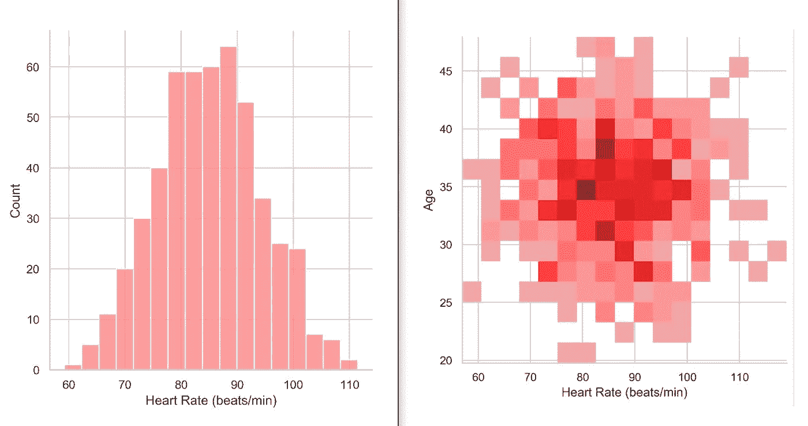

左图:单变量分布图示例。右图:多元分布图示例。作者创作的人物。

所有数据要么是**数字**要么是**分类**。数值数据要么是*连续*(可以分成无限小的单位，像药物浓度)要么是*离散*(不能分成无限小的单位，像整数)。另一方面，分类数据有三种类型:*二元*(是或否，存在或不存在)*名义*(命名，如 20 个氨基酸)，以及*序数*(命名并具有先天顺序，如疾病严重程度)。

**单变量**统计处理一个感兴趣的变量，而**多变量**统计处理多个变量。例如，如果我们观察一组病人的心率分布，它是单变量的。但是如果我们在一个轴上观察心率，在另一个轴上观察患者的年龄，那么这就是多元的。有时，多元统计仅在因变量被测量为两个或更多自变量的函数时才被提及，而不是一个自变量。

为了描述分布的**集中趋势**，统计学家使用点估计，如*均值、*或*众数*。为了描述分布的**差**，常用*标准差*或*方差*。特别是标准差是数据集在平均值附近的变化的度量。

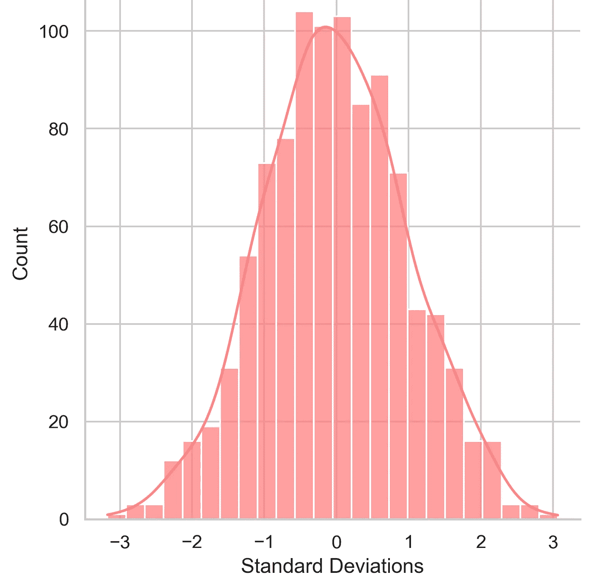

高斯“正态”分布。平均值为 0。作者创作的人物。

左边的这个分布也被称为**高斯**分布，以发现它的德国数学家卡尔·弗里德里希·高斯的名字命名。大多数临床数据遵循这个*正态*分布。因为它在自然界的许多实例中被观察到，它已经成为大多数统计方法中的一个基本假设。为什么它经常出现？[中心极限定理](https://sphweb.bumc.bu.edu/otlt/mph-modules/bs/bs704_probability/BS704_Probability12.html)。样本数量越多，样本越接近目标人群。

低标准差表示接近平均值的数据点范围较小。高标准偏差表示数据点远离平均值的范围较大。68%的值落在偏离均值一个标准差的范围内，95%落在两个标准差范围内，99%落在三个标准差范围内。这些百分比是指特定值在该范围内的概率。

# **P 值难题**

推断统计建立在描述统计的基础上，以确定两个平均值之间观察到的差异是纯粹由于随机因素还是由于潜在的假设因素(也称为**实验假设**)。这被称为单变量 t 检验。例如，为了确定吸烟者和非吸烟者的血氧饱和度是否不同，可以使用*不成对* t 检验。当在两种不同条件下观察同一组时，使用*成对* t 检验，例如比较相同参与者在运动前后的肌肉氧饱和度水平。

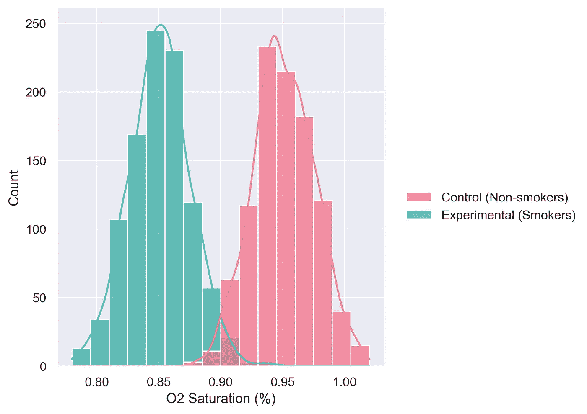

血氧饱和度。作者创作的人物。

t-test 提供了一个检验统计量，该统计量对应于两个平均值相同(由于潜在的假设因素而没有实际差异，也称为**零假设**)以及观察到的差异纯属随机的最小概率。这个概率被称为 **p 值**。还选择预定的阈值(在大多数医学研究中通常为 0.05)，使得如果 p 值小于该阈值，则 p 值太小而不显著。例如，如果 p 值是 0.04，那么这两个平均值相同的概率太小，表明这两个平均值确实不同。这就是我们说差异在统计上****显著**并拒绝零假设，从而接受实验假设的时候。**

**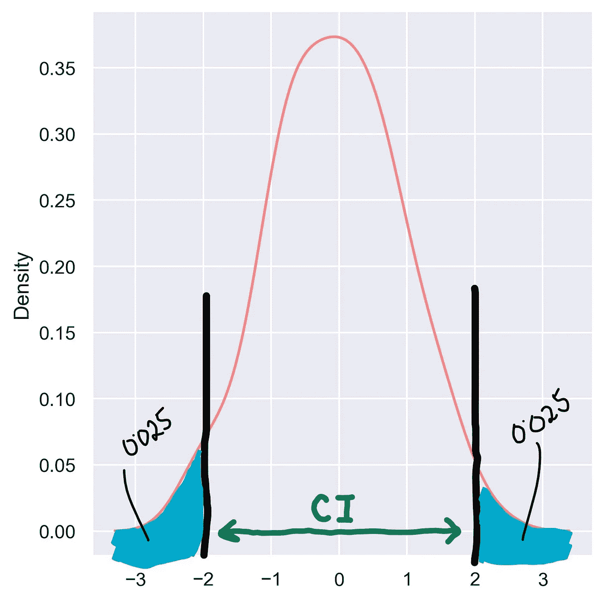**

**CI =置信区间。阿尔法= 0.025+0.025 = 0.05。注意区间是如何在距离 0(平均值)2 个标准差处结束的。回想一下，95%的数据可以在 2 个标准差内的正态曲线下找到，剩下的 5%在外面。作者创作的人物。**

**预定阈值被称为**α**值。它通常为 0.1、0.05 或 0.01，并创建一个值区间(范围)，其中必须包含两组之间的真实差异。如果这个区间包含 0，那么我们接受零假设，因为它表明真正的差异可能是 0。如果间隔不包含 0，则两组之间一定有一些差异。较高的α值表示估计的较高精度(较小的区间)，但也表示用于生成该估计的方法的置信度较低(又名。实验)。这里有一个权衡。这就是为什么 0.05 是最被广泛接受的值。因此，人们可能会想，如果一项研究的 p 值最终为 0.09，仅比α值 0.1 小 0.01，这种差异在实践中有多大意义？真的“显著”显著吗？这就是统计数据非常棘手和具有欺骗性的时候。这就是为什么无论显著性如何，报告 p 值总是最好的。**

**t 检验假设随机和独立抽样。因为 t 检验也假设高斯分布，所以我们不能将其用于其他类型的分布。然而，可以使用**曼-惠特尼 U-检验**(也称为 Wilcoxon 秩和检验)来比较两个队列的中值，并呈现可以与 alpha 值进行显著性比较的 p 值。这是一个比 t 检验更加稳健和强大的检验，但是分布必须*而不是*是正态的。**

**但是如果我们的数据点太少呢？测试差异显著性的另一种方法是**排列**测试。首先，我们计算两个群组的平均值之间的差异。然后，我们简单地混洗和混合来自两组的数据点，并找到新的平均值和它们的差异。我们重复这个过程几百次，并绘制出差值分布图，该分布图类似于泊松分布。**

**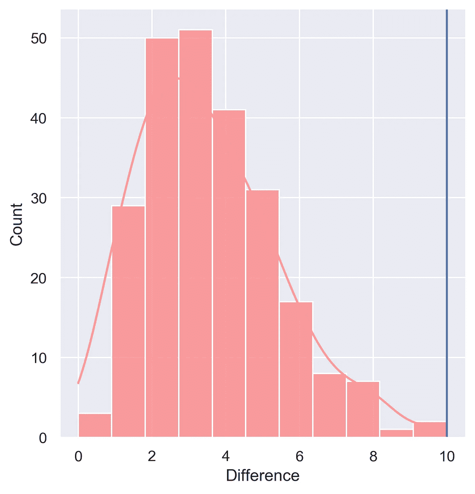**

**原始差异= 10。重复次数= 240。稀有度= 1/240 = 0.004**

**如果原始差异与随机改组组之间的差异相比足够罕见，那么这两组具有统计学意义。稀有度=(差异至少与原始差异一样大的次数/计算差异的次数)。稀有程度与α值进行比较，如果小于α值，则认为原始差异具有统计学意义。**

**到目前为止，我们已经讨论了比较两个队列的推断统计。但是，更复杂的研究可能有两个以上的队列进行比较，每个队列都是独立取样，且呈正态分布。这时 **ANOVA** (方差分析)测试就有用了。它比较组内和组间的方差。有单向、双向、三向和 n 向 ANOVA 测试，用于确定组的平均值是否受 1、2、3 或 n 个独立变量的影响。这些测试呈现遵循 f 分布的 F 值。f 分布基本上是右偏高斯分布。这个想法是比较这个分布上 F 值的 p 值。类似于 t 检验，如果 p 值小于α值，则各组的变异性显著。一旦方差分析拒绝了零假设，其他测试如 Tukey 的或 Bonferroni 的测试被用于确定哪些组在统计上是不同的。**

**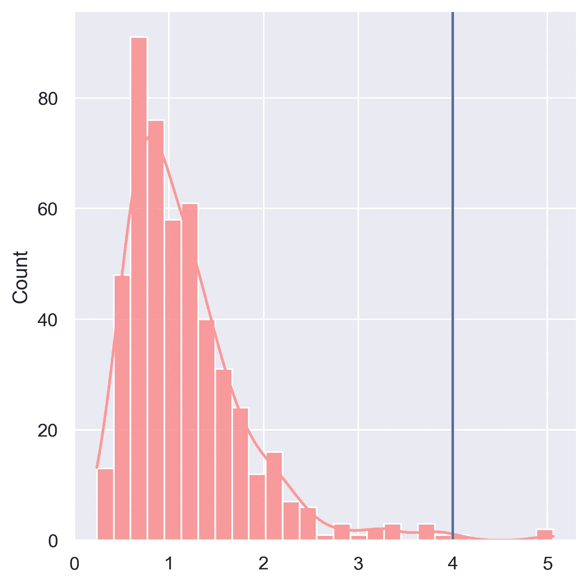**

**随机生成 f 分布。f 值= 4。作者创作的人物。**

**通常，数据集中可能会有*异常值*。这些严重扭曲了平均值。有时，正态分布可能是*偏态*或*多峰态*。其他时候，也可以观察到二项式或指数分布。序列比对研究保证只对正态分布的极端进行采样，最终结果类似于泊松分布。在这些情况下，像 t 检验这样的标准统计检验很难被证明是合理的，因为它们通常假设正态分布。**

**这是当你想改变曲线的形状，使它尽可能地类似于正常的曲线，又名。正常化。根据研究的范围和需求，可以决定完全排除异常值，或者将所有异常值限制在最大值。将 x 轴的比例更改为对数变换也使其更正常，因为它使异常值更接近平均值，使其分布更加对称。物质浓度通常在毫、微米和纳米尺度之间变化，导致多模态分布。使用合适且统一的标度可以将分布归一化为单峰。**

****回归分析的相关系数****

**另一个常见的研究目标是测量一个变量的变化在多大程度上解释了另一个变量的变化。通常，散点图用于说明这种关系。这方面有两个关键的统计:**相关系数**和**线性回归分析**。将它们互换使用是一个常见的错误，但它们确实有一些区别特征。**

**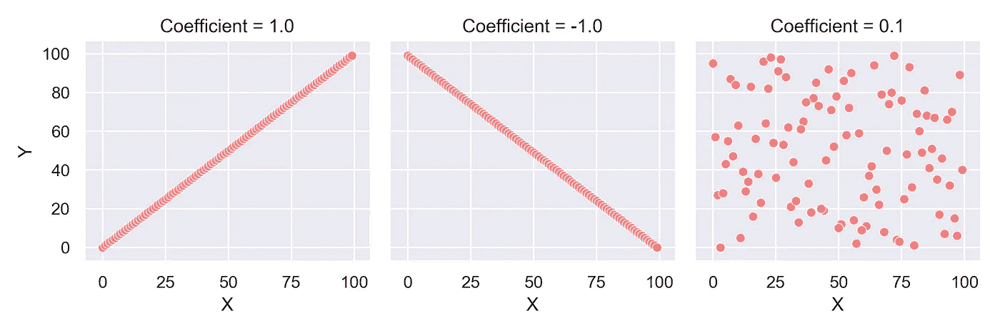**

**左图:完美的正相关。中间:完全负相关。右:无相关性。作者创作的人物。**

**相关性**系数** **(R)** 衡量关系的强度和方向。它的值范围从-1 到 1。相关性的强度由 R 值与 1 或-1 的接近程度来表示。因此，如果 R=0.9，则是非常强的正相关，即 X 的变化几乎与 y 的变化成比例。如果 R=-0.8，则 X 的变化几乎与 y 的变化成*反比*。但如果 R=0，则 X 的变化与 y 的变化不成比例。相关性对于评估预测、估计、模拟或相关性非常有用。样本太少会导致数据不可靠。它可能会被滥用，只选择极端的数据点，而忽略中间的数据点，以获得误导性的高 R 值。自然，数据点越多，我们对分析就越有信心。但是，这也可能被滥用，因为对于足够大的数据集，更容易获得具有统计显著性的 p 值，而在实践中，它可能不是“显著”显著的。**

**R 常与 **R(决定系数)**混淆。r 其实和线性回归更有关系。它是对 X(自变量)变量的集体方差如何解释 Y(因变量)变量的方差的度量，范围从 0 到 1。线性回归呈现了一个完整的方程，用于预测 X 对 y 的影响。与相关性不同，变量是不可互换的，尽管两个值都可以用代数方法确定。X 变量被认为是解释变量，而 Y 变量被认为是响应变量。x 解释了 Y 的变化，Y 对 x 的变化做出反应，而不是相反。**

**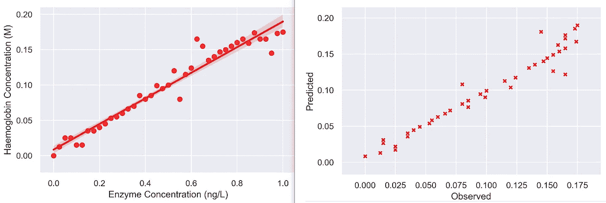**

**左图:线性回归图。右:从左图得出的预测函数的评估。导出的预测值线性回归函数:y = 0.181x + 0.008。R = 0.973。R = 0.947。作者创作的人物。**

**在上面的例子中，我们比较了改变酶浓度对血红蛋白浓度的影响。有很强的正相关性(R=0.973)，94.7%的血红蛋白浓度变化是由酶浓度解释的(R =0.947)。线性回归分析给我们的方程是:[血红蛋白]= 0.181[酶] + 0.008。使用这个方程，我们能够从任何浓度的酶预测血红蛋白浓度。在下一张图中，我们评估了该预测函数相对于观察到的血红蛋白浓度的性能。理想情况下，完美的预测函数将导致所有点位于从(0，0)到(max(x)，max(y))的对角线上。由于图中的大多数点都落在这条对角线上，因此预测函数的性能非常高，如 R 值所示。线性回归是统计建模数据的最简单形式。其他回归模型包括逻辑、多项式、贝叶斯线性回归等等。然而，重要的是要警惕模型过度适应训练数据集，这是涉及机器学习和神经网络的应用程序中的常见问题。**

# ****聚类和分类的奇特案例****

**从找出解决方案中的不同代谢物到预测医院再入院、微阵列、基因芯片和蛋白质相互作用分析，**聚类**和**分类**是生物医学研究中最常用的两种统计工具。**

**聚类是将具有一些共同特征的对象组合在一起。它有助于分类。后者不同于集群，因为共性是预先定义的。关于对象的一些先验知识被用作将它们分组在一起的基础，而在聚类中，从对象本身挖掘知识以发现共性。虽然聚类是一种无监督的机器学习方法，但分类是有监督的。**

**对于集群，我们需要:**

1.  **对象之间相似性和不相似性的度量**
2.  **根据测量值确定两个对象是否相似的阈值**
3.  **一种测量物体间“距离”的方法**
4.  **群集种子，群集从这里开始**

**为了测量相似性，我们可以使用*皮尔逊*相关系数或者*欧几里德*距离或者仅仅是差异。有两种主要的聚类方法，即 **K-means** 和**层次化**。**

**k-表示将 n 个对象聚类成 m 个聚类，有或没有重叠。首先，选择一个对象作为第一个簇的质心。然后，对于第二个对象，计算它与所有预先存在的质心的相似性(最初只是第一个对象)。如果相似性满足预定阈值，则将对象添加到具有最高相似性的质心并重新计算质心，否则使其成为质心并开始新的聚类。重复，直到所有对象都用完。**

**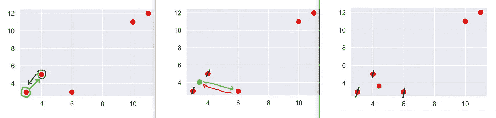**

**首先，我们比较两点之间的距离，并计算新的质心(浅绿色的点)。前两个红点在它们的距离达到预定阈值时聚集在一起。然后我们计算新的质心和 x=6 的第三个点之间的距离。当它们足够接近时，它们被聚集在一起并计算新的质心(橙色点)。类似地，角上的两个点将形成第二个聚类，因为它们离第一个聚类太远。作者创作的人物。**

**分层聚类是一种自下而上的方法，将最相似的对象组合成一个单独的聚类。结果可以用一个叫做[树状图](https://en.wikipedia.org/wiki/Dendrogram)的图来说明，它看起来像一个树形图或热图。这些对于系统发育序列分析非常有用。**

**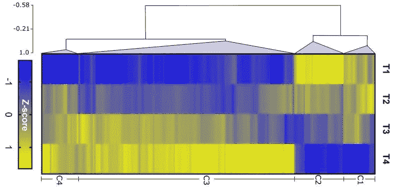**

**基因组数据分析的层次聚类的热图形成了 4 个不同的聚类(C1-C4)。奥格登等人(2020 年)。**

**大多数生物医学数据往往是*多维*，即我们一起测量许多变量，例如，所有必需氨基酸的浓度，或 mRNA 和蛋白质微阵列。分析多元数据需要以某种方式将这些维度减少到一个、两个或三个，以便它们更容易理解。它允许在相同数据集上应用经典概念，如 t 检验、p 值或方差分析。**

**一个强大的降维工具是**主成分分析(PCA)** 。本质上，它所做的是将一组变量组合在一起，这些变量之间具有高度相关性，并能最好地解释观察到的数据集中的变化。这导致数百个变量被减少到两三个关键特征，作为主要成分*。分组成分本身通常是不相关的，因为它们描述了不同变化的观察数据集的不同方面。***

***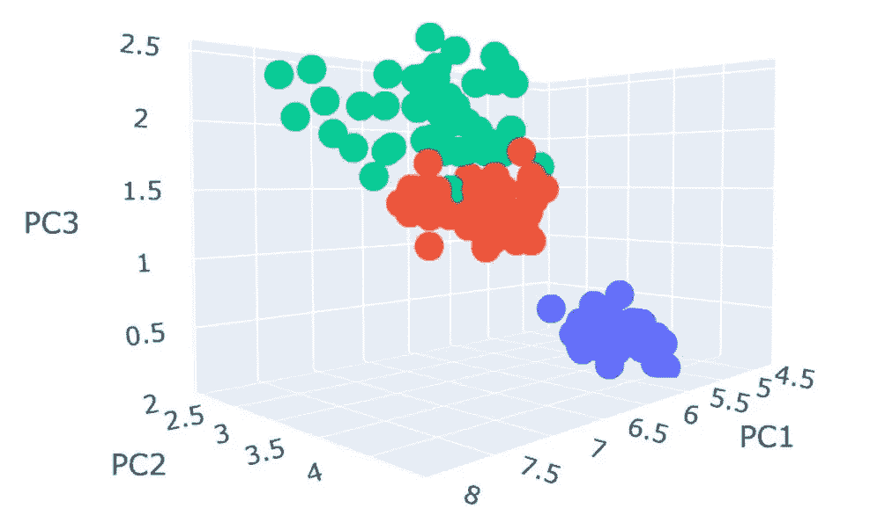***

***PCA 降维后的 3D 散点图示例，含 3 个聚类。PC =主成分(1，2，3)。作者创作的人物。***

***它还导致原始数据集被重新校准到主成分，相似变化的数据点聚集在一起。一般来说，如果主成分分析即使在很小的程度上也不能对数据集进行聚类，那么明智的做法是首先接受数据中没有多少区分因素的可能性。***

***虽然主成分分析是一个很好的降维工具，但它不应该用于分类变量的维度。与数字变量不同，它们在人工编码时不会有很大变化。这导致它们的效果被削弱，这意味着它们不能像数字那样解释观察数据集中的变化，因此主成分分析可能会产生误导。***

***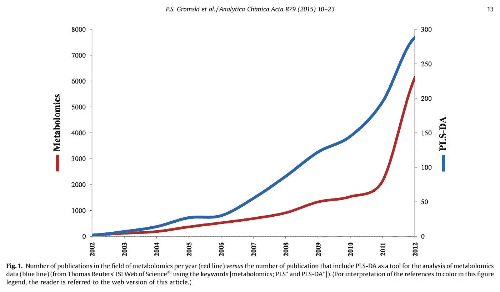***

***图取自 Gromsky 等人(2015)。***

***然而，如果我们手头有一些关于数据的先验知识，并希望基于这些知识对它们进行分类，那么可以使用第二种工具，称为**偏最小二乘判别分析(PLS-DA)** 。它需要对以前标记的数据进行训练。然后，它可以预测新获得的数据集的分类。事实上，它是现在广泛用于监督分类的机器学习算法的先驱。PLS-DA 是代谢组学中非常常用的分类技术。***

***从 PLS-DA 外推，我们还可以使用一个称为**变量重要性投影(VIP)** 的图来确定哪些变量是最有效的变量。它清楚地量化了每个变量的重要性。任何高于 1–1.5 的分数都表示一个重要变量。这些分数然后可以用于特征选择。***

******

***基因组数据分析的 VIP 图。图取自奥格登等人(2020)。***

# *****评估技术*****

***为了评估预测模型，如 PLS-DA 或任何其他预测类别和二元类的 ML 分类模型，统计学家使用**混淆矩阵**。***

***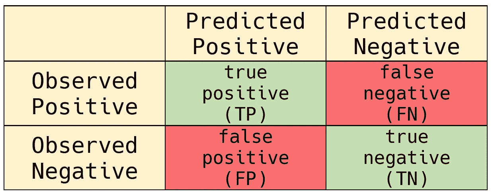***

***二元分类模型的混淆矩阵示例。作者创作的人物。***

***预测与观察类(地面真实)进行比较，然后分成四组；真阳性、真阴性、假阳性(I 型错误)和假阴性(II 型错误)。然后评估该模型，以计算灵敏度*和特异性*。***

*****灵敏度(Sn) = TP 比率= TP/(TP+FN) = *在所有观察到的阳性结果中，被正确预测为阳性的观察结果的数量******

*****特异性(Sp) = TN 比率= TN/(TN+FP) = *在所有观察到的阴性中，被正确预测为阴性的观察数量******

***这种评估也用于评估序列预测。例如，如果一个模型预测一段基因的编码区和非编码区，我们可以这样描述它们:***

***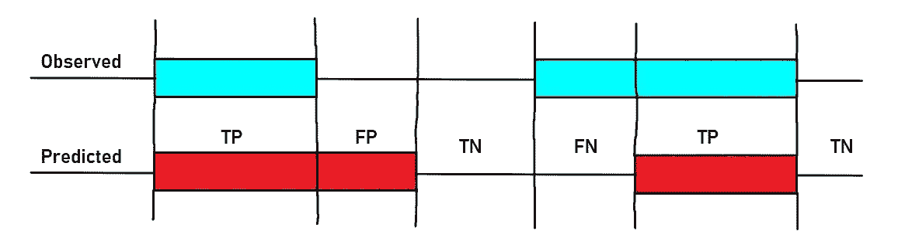***

***作者创作的人物。***

***通常一个模型需要优先考虑一个。自由主义模型(做出风险更大的预测的模型)往往更敏感，但不太具体，而保守主义模型(做出风险较小的预测的模型)往往更具体，但不太敏感。一个模型是自由的还是保守的，主要取决于它用于分类的预定义阈值。***

***如果模型预测患者有 75%的机会患有心脏病，自由模型更可能做出肯定的预测，因为其预定义的分类阈值可能低于保守模型的阈值。如果模型预测患者有 75%的机会需要外科手术，保守模型更有可能做出否定的预测，因为其预定义的分类阈值更有可能低于自由模型的阈值。用于筛选患者的模型往往更自由，因为所提出的建议比用于手术决策测试的模型具有更少的严重后果。一个模型在其敏感性和特异性方面的表现在受试者工作特征(ROC)曲线中得到很好的说明。***

***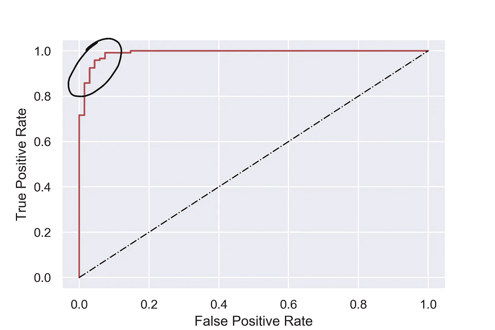***

***二元 ROC 曲线示例。作者创作的人物。***

***红线显示了随着预定义阈值的改变，真阳性率和假阳性率的不同组合。黑色圆圈是模型平衡的地方。如果我们随机猜测二进制类别，黑色对角线显示的是比率。***

***比较不同预测模型的 ROC 曲线的另一种方法是使用曲线下的**面积(AUC)** 。随机猜测应该是最差的预测值，AUC 为 0.5。完美预测者的 AUC 为 1，中等预测者的 AUC 介于两者之间。***

******

***完美的 AUC 为 1(红色)和 AUC 为 0.5(黑色)。作者创作的人物。***

***评估 PLS-DA 等分类模型性能的另一种方法是通过排列测试。与我们之前对单变量数据所做的类似，首先，我们对正确标记的数据应用 PLS-DA 模型进行训练，并确定分离系数，这基本上是基于一些主成分对数据分离程度的衡量。然后，我们打乱标签，重新运行 PLS-DA 模型，确定其分离系数，并重复几百次。分离系数应呈正态分布，如果原始系数基于某个潜在因素，则它应明显大于分布的其余部分，表明它不是一次性随机事件。***

***监督分类方法功能强大，当对象之间没有真正的联系时，通常可以将对象分组为簇。重要的是不要跳过 t 检验、回归、PCA 和非监督方法，因为这些方法不包含监督方法中存在的先验偏差。统计学是直觉的形式化。因此，在盲目遵循某种公式之前，相信自己的直觉是很重要的。***

***这是对生物医学研究中使用的日常统计的非常非数学化的概述。每一种背后的数学原理都有很大的不同；从寻找一组数据点的平均值到为描述性、预测性和区别性特征选择目的进行 PLS-DA。程序员在使用库之前必须知道它的数据结构。没有必要理解它的实现。医生在开处方前必须了解疫苗的药代动力学。不需要理解疫苗中使用的载体生物分子的特定分子机制。同样，理解数学并不重要，但它显然很有帮助。然而，重要的是理解他们潜在的假设、限制和行为。***

***如果你有兴趣了解更多关于这些带有数学解释的统计工具，那么 Josh Starmer 的这个 YouTube 播放列表是一个很好的资源。***

*****参考文献:*****

1.  ***奥格登、A. J .、威茨马、T. W .、温克勒、法里斯、y .、迈尔斯、G. L .、&阿赫卡米、A. H. (2020)。生长中短柄根系基因表达和调控元件的动态变化。科学报告，10(1)。[https://doi.org/10.1038/s41598-020-63224-z](https://doi.org/10.1038/s41598-020-63224-z)***
2.  ***Gromski，P. S .，Muhamadali，h .，Ellis，D. I .，Xu，y .，Correa，e .，Turner，M. L .，& Goodacre，R. (2015)。教程回顾:代谢组学和偏最小二乘法-判别分析-权宜婚姻或奉子成婚。化学分析学报，879，10-23。[https://doi.org/10.1016/j.aca.2015.02.012](https://doi.org/10.1016/j.aca.2015.02.012)***
3.  ***David S. Wishart，代谢组学统计学导论，代谢组学创新中心(TMIC)，[https://www.youtube.com/channel/UC4CHrL7t9brRTIomi9rDLHA](https://www.youtube.com/channel/UC4CHrL7t9brRTIomi9rDLHA)***

***</the-cornerstone-to-the-next-revolution-deepminds-alphafold-2-2768f8d38326>  </3-reasons-why-your-machine-learning-model-is-garbage-d643e6f0661>  </python-vs-r-for-data-science-cf2699dfff4b>  

> 附言:如果你想要更多关于数据科学、编程以及生物学家如何在数据革命中导航的简明扼要的文章，可以考虑关注我的博客。
> 
> 由于每分钟都有成千上万的视频被上传，所以过滤掉它们是很重要的，这样你就可以只使用高质量的数据。我亲自挑选的，我会把你感兴趣的主题的教育视频发邮件给你。报名[这里](https://docs.google.com/forms/d/e/1FAIpQLScO4RtaXjJjYDdnEFyI3l73tcj59OGdY_cRnPGV-wsAEMhVwg/viewform)。
> 
> 谢谢大家！***