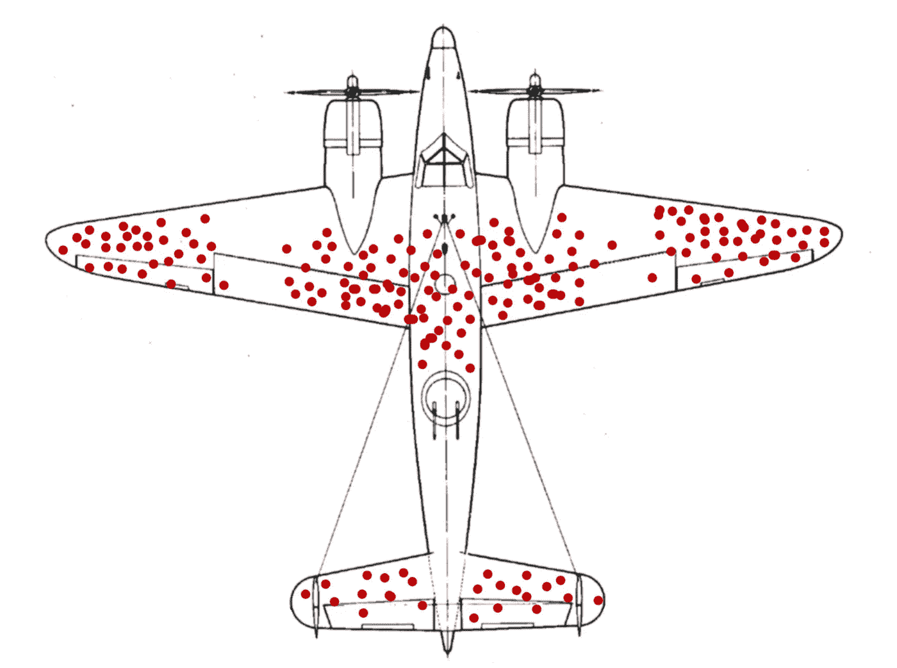
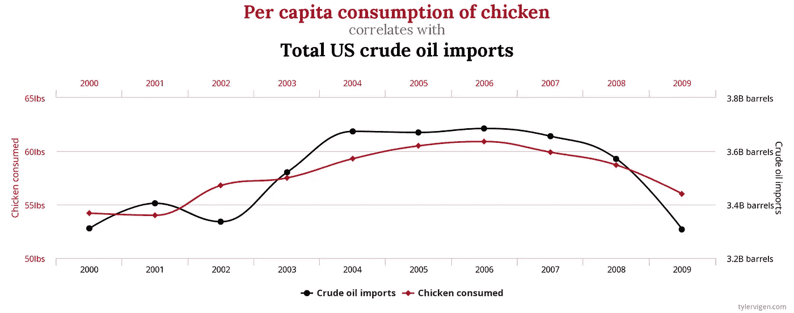

# 你可能面临的统计偏差(以及如何避免)

> 原文：<https://towardsdatascience.com/statistical-biases-you-probably-face-and-how-to-avoid-them-f6b32bfba7eb?source=collection_archive---------25----------------------->

## 现实世界中很容易被统计数据忽悠。幸运的是，有办法识别这些陷阱并克服它们。

图片来自[里欧·克罗尔](https://unsplash.com/photos/m4sGYaHYN5o)

人类有理解世界的自然倾向。我们收集信息，将点点滴滴联系起来，得出结论。因为有了数据，我们对自己的结论越来越有信心。

当我们错误地解读数据时，这种信心就会变成一种诅咒。它让我们执着于对世界的错误理解。这种现象被称为统计偏差。对于统计偏差，您收集的数据或观察结果是合法的。但是你解读这些数据的方式是误导性的。

在下面的段落中，我用简单的英语介绍了我最喜欢的统计偏差，并解释了如何避免被它们误导。

1.  [赌徒的谬论](https://andrew.cloud/statistical-biases/#gambler-s-fallacy)🎰
2.  [生存偏差](https://andrew.cloud/statistical-biases/#survivorship-bias)🔪
3.  [有影响的观察结果](https://andrew.cloud/statistical-biases/#influential-observations)🦖
4.  [数据疏通](https://andrew.cloud/statistical-biases/#data-dredging) 🗂️
5.  [辛普森悖论](https://andrew.cloud/statistical-biases/#simpson-s-paradox)🍩

# 赌徒谬误🎰

假设你正在和一个朋友掷硬币。你们两个同意赌一美元。如果硬币正面朝上，你的朋友会付给你钱。如果它落在反面，你需要付钱给你的朋友。

在几次抛硬币之后，你注意到你已经连续输了五次了。沮丧之余，你决定用剩下的钱下注。你已经连续输了五次了。下一次抛硬币一定会有所不同，对吗？

当你羞愧地走回家，口袋里一点钱也没剩下时，你意识到自己成了赌徒谬误的受害者。受赌徒谬误影响的人认为，过去的事件总是影响未来的概率。

推断出某种模式很有诱惑力，但是要小心这种模式是否真的存在。(图片由作者提供)

# 概率的独立性

像多次投掷硬币这样的情况被称为独立事件。一次投掷的结果不会影响未来任何一次投掷的结果。其他常见的独立事件包括扑克手和骰子滚动。

当你第一次抛硬币时，它正面朝上的概率是 50%。你连败之后，概率还是 50%。这可能会让你觉得应该多赢一点，以便“平衡”输赢。但事实是，未来的事件并不关心过去的事件结果如何。

(请注意，如果你继续无限地抛硬币，你可能会期望正面和反面的比率*收敛*成 50-50 的比例。然而，这是由于高样本量和*大数定律*。过去的成绩不重要。)

# 修正赌徒的谬误

我会告诉你停止赌博，但那一点也不好玩。相反，一个简单的心态转变可以帮助你克服赌徒谬误:

> 当你基于独立事件做决定时，忘记过去发生的事情。

对待每一次抛硬币，就像这是你的第一次一样。如果你处于连败或连胜之中，假装什么都没发生过。这样，过去的结果就不会误导你。

# 生存偏差🔪

在第二次世界大战期间，美国希望减少在敌人炮火中损失的轰炸机数量。因此，研究人员调查了从任务中返回的飞机上弹孔的位置。

研究人员假设飞机上受到最大损伤的部分应该有额外的装甲。似乎很合理。当飞机完成任务返回时，研究人员记录了弹孔的位置。他们的总体数据如下图所示:

幸存的飞机引擎没有受到任何损坏！我想我们根本不需要保护这些部分……(图片由[马丁·格兰德让](https://en.wikipedia.org/wiki/Survivorship_bias#/media/File:Survivorship-bias.svg)提供)

从图中可以得出结论，翼尖应该有更多的装甲。毕竟，这些部门受到的损害最大。但是退一步讲。那些没有执行完任务回来的飞机怎么了？他们在哪里被枪杀的？

如果我们批判性地思考我们的数据集，很明显，一架飞机只有在没有被击落的情况下才成为数据点。数据没有显示任何飞机的引擎或驾驶舱有弹孔。是因为子弹神奇地避开了这些区域吗？也许那些飞机再也没有回家。

如果我们考虑到被成功击落的飞机，幸存飞机上的弹孔实际上表明了飞机上不需要保护的部分。我们的样本不能代表所有的飞机。

当数据点的某些属性可能阻止它成为数据集的一部分时，就会出现生存偏差。我们错误地关注“幸存”数据点的属性。这就是为什么我们在飞机的机翼上看到弹孔，而发动机中弹的飞机永远无法回家。这也是为什么似乎所有的对冲基金都赚了很多钱，而大学辍学生往往成为亿万富翁。不知道的人不在统计范围内。

# 存活偏差

你可以通过问自己一个简单的问题来发现生存偏差:

> 如果我的结论是错的，我能注意到吗？

如果你对这个问题的回答是否定的，那么你可能会经历生存偏差。如果一个彩票中奖者和你分享他的策略，想想如果策略不好会发生什么。对于每一个成功者来说，可能有数百万失败者做着完全相同的事情。

在抽象的层面上，注意你的观察是否会影响到你得到的数据。如果你想了解彩票，抽样调查每一个买彩票的人，不仅仅是中奖者。每个彩票中奖者都购买了一张彩票，但并不是所有的购票者都中奖了。

# 有影响的观察🦖

一般来说，大多数玩俄罗斯轮盘赌的人都能活下来并赚钱。然而，尽管平均回报率如此之高，我还是建议不要玩俄罗斯轮盘赌。

我们倾向于从综合指标(如平均值)中进行归纳。问题是总量并不能说明数据的全部。如果我们只知道俄罗斯轮盘赌的平均结果，这似乎是一个合理的游戏。然而，看到人们可以从游戏中死去是一个有影响力的观察。随着我们了解得越多，平均值就失去了价值，我们的结论也改变了。

观察数据集的分布填补了聚合度量的盲点。例如，平均值对于初创公司的估值并不重要。大多数初创公司一文不值，而另一些却价值数十亿美元。平均值什么也没告诉我们。如果我们观察书籍的受欢迎程度，我们会发现少数书籍占据了所有书籍销售的大部分。同理，平均也没多大帮助。除非数据的分布是简单的，否则平均数只能给我们有限的世界观。

Anscombe 的四重奏:每个数据集共享相同的均值、方差、相关性和线性回归。除了数据本身，一切都是一样的。(图片由[舒尔茨](https://en.wikipedia.org/wiki/Linear_regression#/media/File:Anscombe's_quartet_3.svg)提供)

# 检查有影响的观察

围绕有影响力的观察的故事的寓意是，你总是需要一个故事的两面。这就是为什么统计学家倾向于计算和可视化数据。都是为了了解数据而达到目的的手段。

> 小心真空中的计算。寻求收集更多的背景信息并理解你的数据。

我的意思不是说平均数和总数会误导人。相反，把它们想象成一个充满盲点的世界中的一块拼图。

[Datasaurus 十二个](https://damassets.autodesk.net/content/dam/autodesk/www/autodesk-reasearch/Publications/pdf/same-stats-different-graphs.pdf):每个数据集共享相同的平均值、方差和相关性。最重要的是，它们都有好玩的造型！(图片由[欧特克](https://www.autodesk.com/research/publications/same-stats-different-graphs)提供)

# 数据挖掘🗂️

数据挖掘包括寻找数据中具有统计意义的模式。(一些读者可能也知道这个术语叫做 *p-hacking* 。)pattern 是不是假阳性并不重要；目标是强迫出一种“洞察力”因此，那些实践数据挖掘的人可能会滥用以下战术:

*   详尽地测量数据集中变量的随机组合
*   丢弃和重新采集数据样本
*   有选择地报告具有统计意义的结果

简而言之，数据挖掘是一种纯粹出于偶然呈现具有统计学意义的东西的行为。

你可能想知道数据挖掘是否只在模糊的情况下有效。可惜没有。[如果一个数据集包含足够多的变量，那么*不会*出现任何假阳性模式的概率很低。](https://tylervigen.com/spurious-correlations)

从什么时候开始吃鸡肉让我们进口原油了？(图片由[泰勒·维根](https://www.tylervigen.com/spurious-correlations)提供)

假设一家大型含糖零食公司资助研究，证明含糖零食是健康的。他们收集的数据表明这些零食(显然)是不健康的。作为回应，研究人员摆弄着这些数据，希望发现任何与此相反的模式。当发表这项研究时，他们只提供了“证明”零食是健康的证据。这就是现实世界中数据挖掘的方式。有些人对得出某个结论有既得利益，即使这意味着抓住救命稻草。

# 探测数据疏通

为了确定数据挖掘是否发生，质疑研究者的方法。

*   数据收集前是否确定了测量值？
*   结果可重复吗？
*   结论有意义吗？

对这些问题中的任何一个回答“否”都可能意味着数据挖掘。如果研究人员在数据收集前没有计划好他们的测量，他们可能会寻找假阳性。如果结果不可重复，结论可能只是巧合。如果结论没有意义，也可能表明某种形式的篡改。

# 辛普森悖论🍩

1973 年，加州大学伯克利分校因性别歧视被起诉。似乎它的研究生院录取女性的比例较低。该研究生项目接受了 8442 名申请人中的 44%。同时，它只接受了 4321 名女性申请者中的 35%。多么性别歧视！

一项对入学数据的研究试图理解为什么会发生歧视。它将入学人数按院系分类，并重新评估数据。下面是按人口最多的六个省分列的图表。

总的来说，85 个部门中的大部分似乎还算公平。然而，研究确定 6 个部门对男性有偏见。同时，其他 4 个部门对女性有偏见。在统计院系时，整个学校更偏向于男性。多么性别歧视！

我们从论文中得出的结论是，具体的部门很重要。女性倾向于申请录取率较低、竞争更激烈的院系。相比之下，男性倾向于申请竞争不那么激烈的部门。

辛普森悖论:当一个群体分成几个组时，这个群体中的趋势就会逆转。(图片由[舒尔茨](https://en.wikipedia.org/wiki/Simpson%27s_paradox#/media/File:Simpson's_paradox_continuous.svg)提供)

整个招生混乱是辛普森悖论的经典例子。在一个群体中有一个明显的趋势，但是这个群体被分成不同的群体，这个趋势要么消失，要么逆转。

如果你直觉地思考这个问题，有几个因素导致了这个悖论。首先，不同群体的人口规模往往是不同的。这可能会影响平均值。此外，我们可能会错过真正决定我们结果的混淆变量。重要的变量被倾斜的样本量淹没了。

# 解决辛普森悖论

对辛普森悖论的反应是一个两步的过程。您需要采取以下措施:

1.  检测辛普森悖论可能存在的情况
2.  确定辛普森悖论的哪种解释是正确的

如果你注意到看起来像概括的不寻常的模式，辛普森悖论可能存在。寻找可以解释这种模式的隐藏变量。如果考虑这个变量真的很重要，这就是辛普森悖论的一个例子。

下一步是确定哪个趋势符合现实。请注意，将一个群体分成几个组并不总是正确的。在这种情况下，你必须运用批判性思维。在大学录取方面，院系影响录取率是有道理的。

假设你观察了申请人的头发颜色，发现了一个新趋势。你应该怀疑头发颜色是一个真正的混淆变量。发色影响录取率说不通。(追求头发颜色和录取之间的相关性实际上是数据挖掘！)

# 结束语

冒着被我更倾向于数学的朋友告诫的风险，我想分享我的“街头智慧”版本的统计学核心原理:

1.  数字很难。
2.  人们会被统计数据愚弄。
3.  你不想成为一个笨蛋。

统计偏差囊括了所有三个原则。说到底，对现实有一个清晰的认识是很重要的。为此，你必须知道如何正确解释你观察到的东西。保持清醒的头脑，你就很难被愚弄。玩得开心！

*感谢阅读！如果您喜欢阅读或有任何反馈，请考虑发消息并在* [*Twitter*](https://twitter.com/liuandrewk) *上关注我。*