# 统计机器学习:从零开始的梯度提升和 AdaBoost

> 原文：<https://towardsdatascience.com/statistical-machine-learning-gradient-boosting-adaboost-from-scratch-8c4b5a9db9ed?source=collection_archive---------19----------------------->

## 全计算模拟助推程序的数学推导

奥斯卡·诺德在 [Unsplash](https://unsplash.com?utm_source=medium&utm_medium=referral) 上的照片

# 1:简介

Boosting 是一系列用于离散和连续随机变量目标的集成机器学习技术。助推模型采用非参数加性模型的形式，并且最典型地被指定为加性成分是“弱学习者”。从经验风险分解的角度来看，可以很容易地表明，任何任意统计估计量的均方误差(MSE)是所述抽样估计量的偏差和抽样方差的平方和…

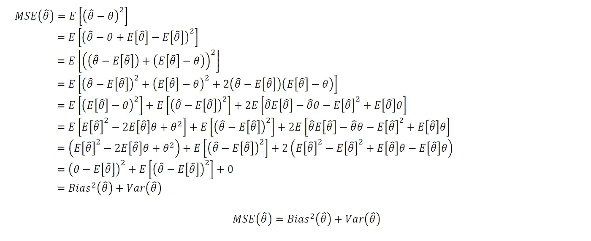

作者图片

…“弱学习者”是具有高平方偏差但低抽样方差的统计估计量。从计算的角度来看，弱学习者具有模型拟合容易的优势。弱学习器的例子包括只限于几层深度的单个决策和回归树，甚至可能是一层(称为“决策/回归树桩”)。

提升的动机是恢复弱学习器的附加集合，它们一起可以指定任意复杂的模型。在本文中，我们将详细说明梯度增强和 AdaBoost 的理论框架和完整的数学推导。我们还将从头开始提供这些方法的完整计算模拟，而不使用增强计算包。

这篇文章的目录如下:

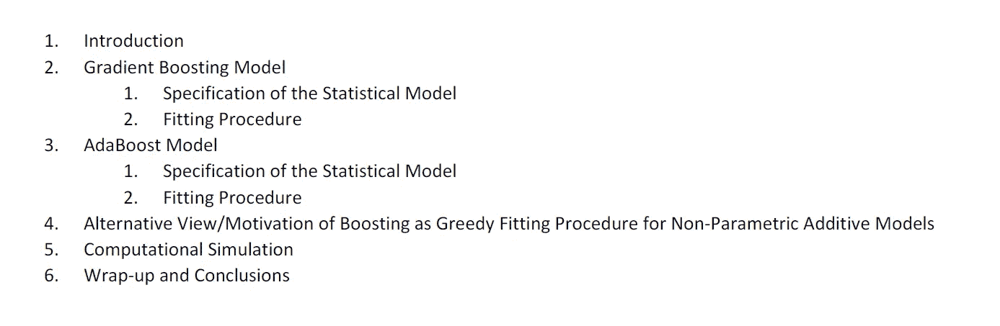

作者图片

# **2:梯度推进模型**

利用梯度推进，模型估计过程可以被视为在提议弱学习者的空间上在函数空间中执行梯度下降(因此得名“梯度推进”)。让我们进入数学规范和拟合程序:

## 2.1:统计模型的规格

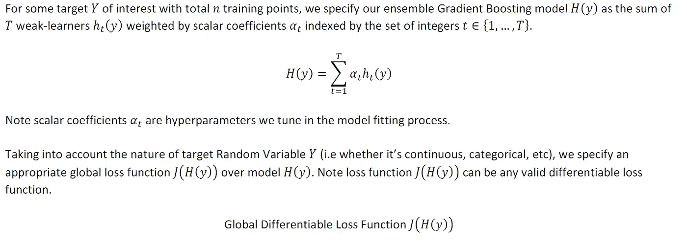

作者图片

## 2.2:安装程序

为了理解梯度增强模型的拟合过程，首先回忆一下泰勒展开是有帮助的。

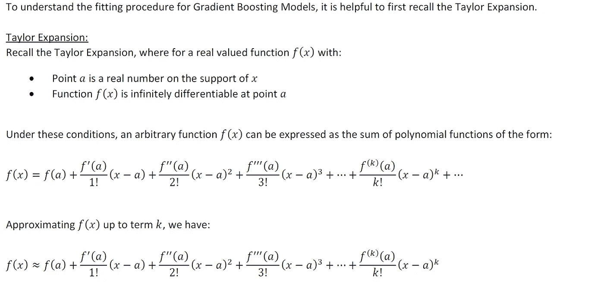

作者图片

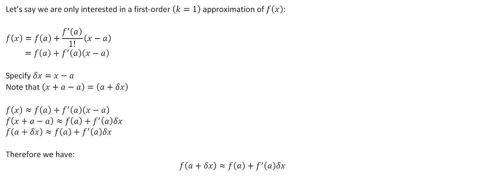

作者图片

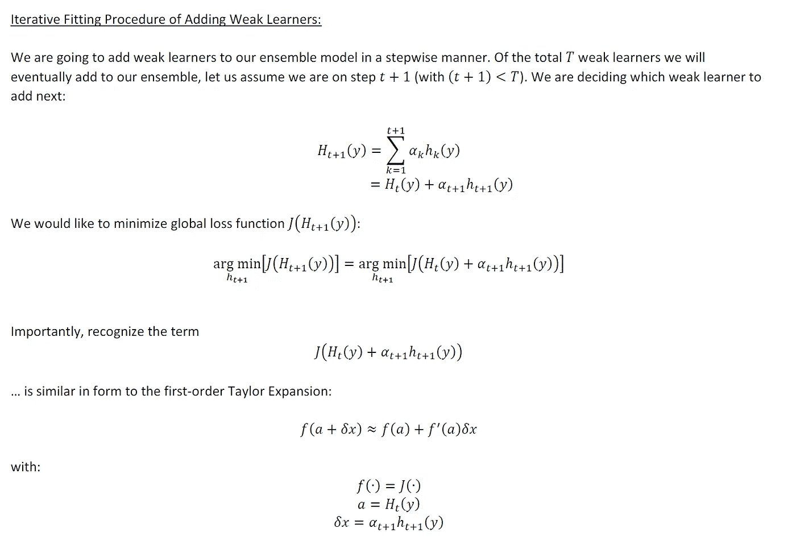

作者图片

作者图片

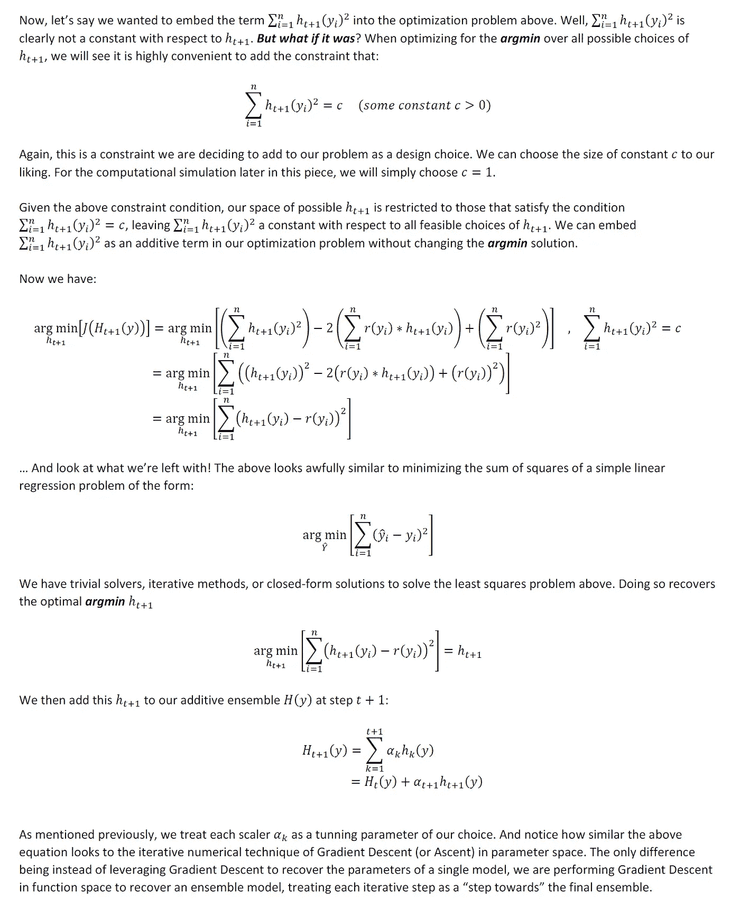

作者图片

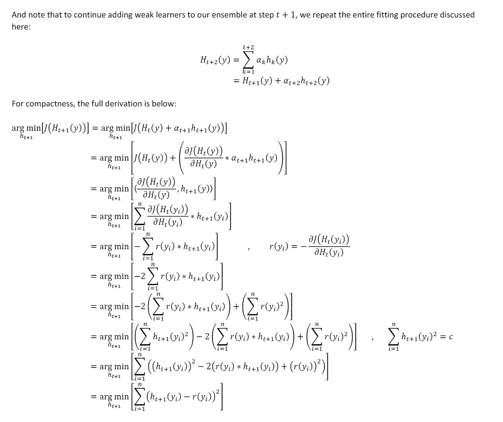

作者图片

# 3: AdaBoost 模型

接下来让我们讨论 AdaBoost，它实际上是更一般的梯度增强模型的一个特例

## 3.1:统计模型的规格

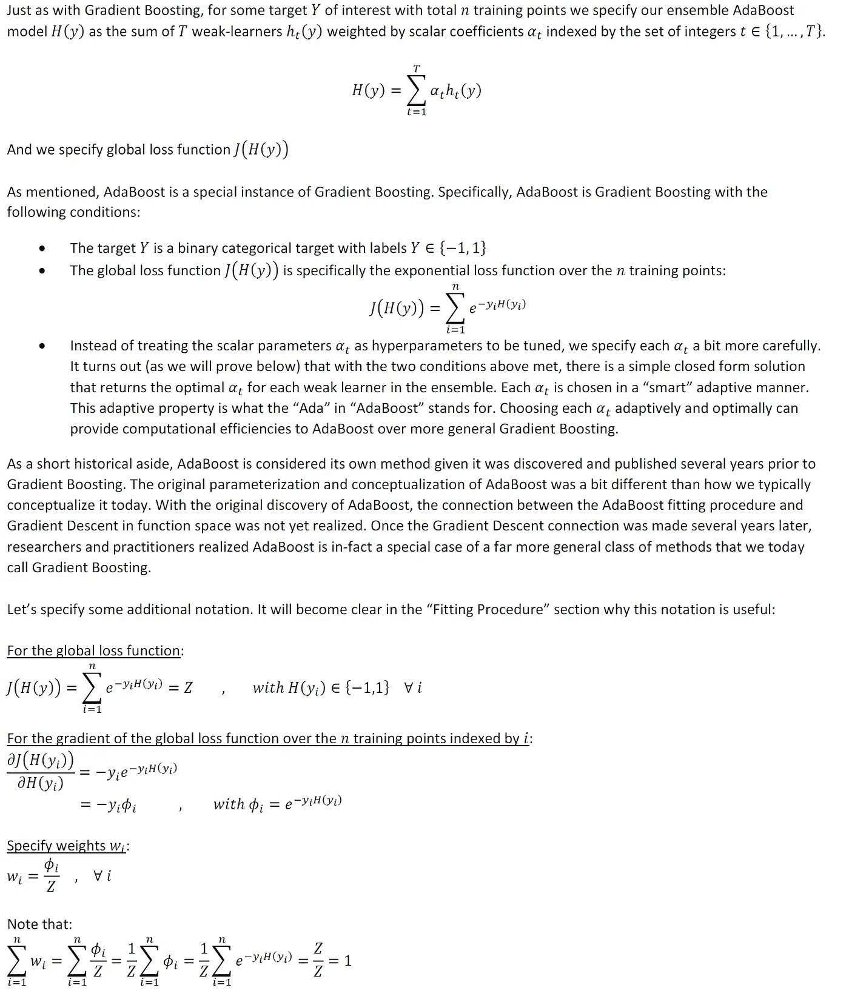

作者图片

## 3.2:安装程序

根据*第 3.1 节*中概述的信息和符号，让我们深入了解 AdaBoost 的安装程序

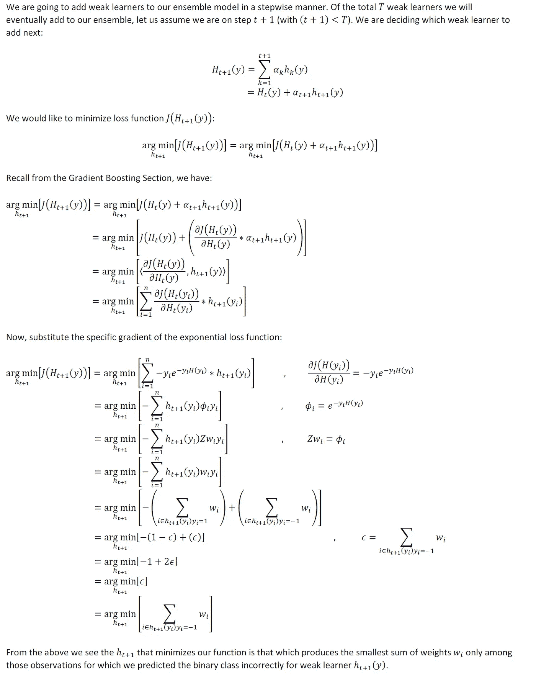

作者图片

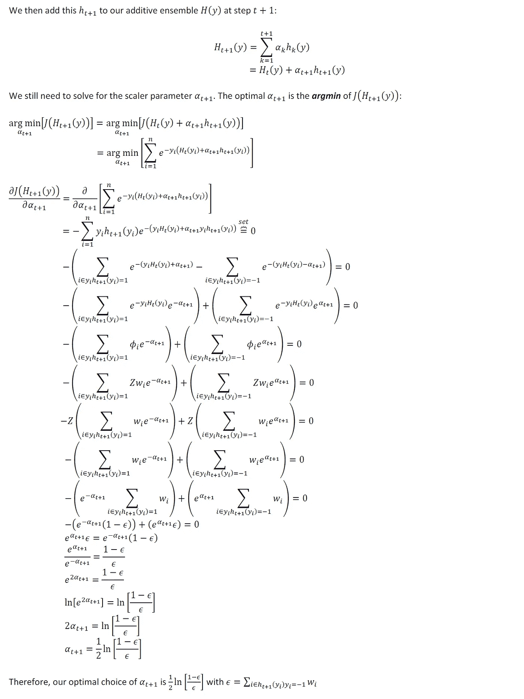

作者图片

# 4:对于非参数可加模型，提升作为贪婪拟合过程的另一种观点/动机

从非参数加性模型的角度来看，有一个略微不同的观点。这是一个在数理统计和统计学习社区中被很好理解的观点，但是我很少在机器学习社区的计算机科学分支中看到这个观点。我认为这是一个值得理解的视角，并且提供了一个更健壮的关于 Boosting 作为一系列过程的观点。

有一类统计模型称为非参数可加模型。这类估计量非常庞大，而且非常灵活。从某种意义上说，这类模型太灵活了。作为一名利用该类统计模型的分析师，有如此多的超参数和设计选项可供选择，指定一个“正确的”模型可能会让人不知所措。

对于一个给定的预测问题，有一些潜在的非参数加性模型，可以说在全局意义上“工作得最好”。这种“最佳”模式我们将称为“真正的 NPA 模式”。给定我们的样本数据，我们将尽最大努力指定和恢复这个“真正的 NPA 模型”。但是，如何以一种有条理的、切实可行的方式着手这样做呢？我们需要搜索的参数空间是巨大的！

先打个比方吧。想象一下，我们有一个机器学习问题，我们正在利用线性回归来解决它。我们有 100 个特性可供选择，我们知道有一些真正的特性组合可以提供“最佳子集选择”线性回归模型。但是，我们将不得不测试 2 ⁰⁰不同的模型，以恢复“最好的一个”，这是一个数百万亿的搜索空间。我们可以利用向前选择等贪婪算法，而不是试图在整个空间中搜索，在向前选择中，我们将选择一个变量，并每次将一个变量添加到最终模型中，根据贪婪的短视启发式方法做出选择。通过这种方法，我们只需要测试几千个模型，而不是数百万亿个。我们知道这种向前选择的过程不可能恢复“最佳子集选择”问题的*精确*解；但它将恢复一个可能非常适合我们目的的模型。

上面的前向选择场景非常类似于利用 Boosting 作为机器学习上下文中非参数可加模型的拟合过程。我们希望恢复对“真实 NPA 模型”的估计，但是搜索空间的大小令人难以承受。在这种意义上，Boosting 可以被视为一系列贪婪算法过程，用于估计“真实 NPA 模型”问题的解决方案，类似于使用前向选择来估计最佳子集选择问题。

# 5:计算模拟

下面是一个完整的工作示例(从头开始构建),在连续目标上拟合梯度增强模型，在二元分类目标上拟合 AdaBoost 模型。

首先，让我们加载我们需要的库:

接下来，使用一个特意复杂的模型规范来模拟数据集的函数:

让我们恢复一个具有连续结果目标 Y 的模拟数据集，并拟合一个梯度推进模型。注意，我们将打印每个弱学习者添加到模型中的全局损失函数的经验实现。当经验损失< 1.

Let’s now recover a simulated dataset with a binary categorical outcome target Y, and fit an AdaBoost Model. Note, we will print the empirical realization of the Global Loss function with each weak learner added to the model. We will consider the model to have converged when all n=1000 training points are correctly classified by the ensemble model.

For the complete code/notebook for the above computational simulation, please see the following [**github 链接**](https://github.com/atrothman/Gradient-Boosting-AdaBoost-Simulation) 时，我们将认为模型已经收敛。

# 6:总结和结论

希望以上有见地。正如我在以前的一些文章中提到的，我认为没有足够的人花时间去做这些类型的练习。对我来说，这种基于理论的洞察力让我在实践中更容易使用方法。我个人的目标是鼓励该领域的其他人采取类似的方法。以后我会继续写类似的作品。请 [**订阅并关注我在 Medium**](https://anr248.medium.com/) 和 LinkedIn**上的更新！**