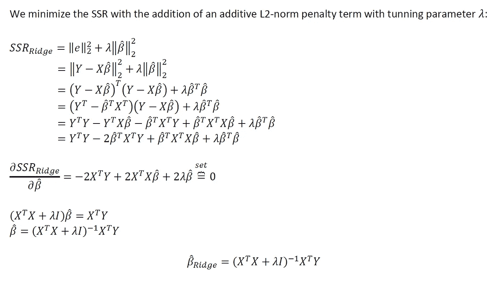
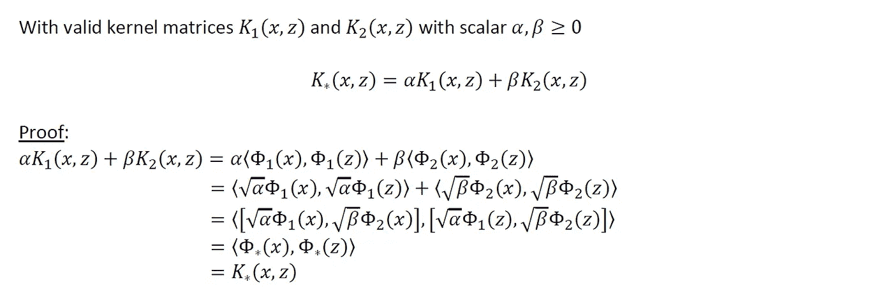

# 统计机器学习:内核化广义线性模型(GLMs)和内核化线性回归

> 原文：<https://towardsdatascience.com/statistical-machine-learning-kernelized-generalized-linear-models-glms-kernelized-linear-876e72a17678?source=collection_archive---------12----------------------->

## [思想和理论](https://towardsdatascience.com/tagged/thoughts-and-theory)

## 线性平滑器的内核化特征空间的数学推导，以及完整的计算模拟

照片由[詹姆斯·哈里逊](https://unsplash.com/@jstrippa?utm_source=medium&utm_medium=referral)在 [Unsplash](https://unsplash.com?utm_source=medium&utm_medium=referral) 上拍摄

# 1:简介

对于线性平滑器和基于线性预测器的采样估计器，Mercer 核是在高维特征空间中拟合线性决策边界的非常方便的工具。事实上，这样的特征空间甚至可以是无限维的(正如我们将要展示的)。从机器学习的角度来看，Mercer 内核可以被视为对设计矩阵中的一组“基础”变量执行一种“半自动”特征工程。我们可以在不显式计算 *X* 的情况下，在特征矩阵 *X* 中拟合出高维特征空间对应的线性决策边界。

从教学背景来看，在机器学习社区引入与支持向量机(SVM)配对的 Mercer 内核是历史上常见的。我们在这里不打算这样做(参见*第 3.1 节*解释原因)，而是在更友好的基于线性预测器的抽样估计器的环境中引入核:特别是普通最小二乘(OLS)线性回归和规范广义线性模型(GLMs)。

这篇文章的目录如下:

作者图片

说到这里，让我们开始吧。

# 2:激发内核化特征空间和“内核技巧”

让我们假设一个我们想要拟合的普通最小二乘(OLS)线性回归模型。我们有一个包含 *n* 个观察值的数据集，其中:

作者图片

使用我们的模型:

作者图片

尽管我们很快认识到设计矩阵 *D* 中的 *v* 变量过于有限，不足以创建一个稳健的预测模型。我们决定对设计矩阵 *D* 中的 *v* 变量手动执行特征工程。

这个特征工程步骤在特征矩阵 *X* 中产生 *p* 个特征，其中 *p* 远大于 *v* 。 *X* 中的这些 *p* 工程特征可能包括 *D* 中的原始 *v* 变量的乘法交互和/或非线性变换。我们现在可以利用我们的特征矩阵 *X* 来拟合一个健壮的模型。我们以 *X* 中的 *p* 特征为自变量，拟合出预测 *Y* 的 OLS 回归模型。得到的 OLS 拟合将是对应于特征矩阵 *X* 中丰富的 *p* 特征的高维特征空间中的线性判定边界。

这些步骤也是:

作者图片

我们现在要重复同样的练习，但是增加了一个中间步骤。从我们的特征矩阵 *X* 中，我们构造了“核矩阵” *Kₓ* ，它仅仅是 *X* 与其自身转置的点积。注意 *Kₓ* 的尺寸为 *n x n* 。然后，我们采用我们的线性模型，将其完全重新参数化为 *Kₓ* 的函数，而不是 *X* 的函数。然而，我们的拟合模型恢复了与以前相同的线性决策边界。

这些步骤现在又是:

作者图片

我们现在已经拟合了同一个模型两次，一次没有，一次有了内核矩阵 *Kₓ* 的额外步骤。这一额外步骤的动机很快就会变得明显。

我们将最后一次重复这个练习，并做最后的修改。从 1)设计矩阵 *D* ，到 2)特征矩阵 *X* ，再到 3)内核矩阵 *Kₓ* ，如果我提供一个“神奇的”数学方程，允许直接根据原始设计矩阵 *D* 计算 *Kₓ* ，会怎么样？有了这个等式，人们可以跳过构建特征矩阵 *X* 的第二步。然而，我们仍然以同样的模型拟合结束；与 *X* 中的 *p* 特征对应的高维 *p* 特征空间中的同一线性判定边界。尽管我们不需要明确地计算特征矩阵 *X* ，也不需要在计算机上的任何地方存储 *X* 来拟合这个模型。我们完全跳过了这一步，而是直接根据原始设计矩阵 *D* 计算参照 *X* 的 *Kₓ* 。

作者图片

这通常被称为“内核技巧”。上述过程允许我们在高维特征空间中拟合线性决策边界，而无需将所述高维空间中的所有特征显式计算到显式特征矩阵 *X* 中。甚至在我们感兴趣的高维特征空间是无限维的情况下也是如此！有大量关于 Mercers 定理和再生核 Hilbert 空间(RKHS)的文献在数学上支持上述说法，但这超出了本文的范围。相反，我将基于简单的线性代数和内积提供一个直观的解释来支持这个观点:

假设我们有一个特征矩阵 *X* 和 *n* 个观察值以及 *p* 个特征(即大小*n*X*p*)*p =*∞。这对应于一个特征矩阵 *X* 我们从来没有希望在任何真实世界的计算机上显式计算或存储，因为这个 *X* 有无限多的列。但是注意，即使有了 *p =* ∞，核矩阵 *Kₓ* 根据定义是 *X* 与其自身转置的点积。这个点积的内部维度塌缩(即(*n*x*p*)*(*p*x*n*)=*n*x*n*)，我们剩下大小为 *n* x *n* 的核矩阵 *Kₓ* ，它是有限大小的。假设内核化过程允许我们跳过显式计算和存储 *X* ，我们仍然可以用 *p =* ∞来拟合我们的模型。

# 3:将 GLMs 和线性回归重新参数化为核矩阵的函数

## 3.1:暂不考虑支持向量机(SVM)

在本节的后面，我们将推导出拟合带核线性回归和广义线性模型(GLMs)所需的抽样估计量。不过在继续之前，我想先提一下支持向量机(SVMs ),以及为什么我有意不在本文中讨论这类统计估计量。注意，我将在以后的文章中讨论内核化的支持向量机。

关于我离开支持向量机的动机，在机器学习社区中，线性平滑器和基于线性预测器的采样估计器的 Mercer 核通常与支持向量机有关。即使从教学的角度来看，绝大多数学生对内核化特征空间的第一次介绍都是关于支持向量机的。我个人认为这种教学方法并不理想，原因有三:

*   由于凸优化空间中的历史原因，支持向量机的参数通常通过最大化其对偶拉格朗日形式(与直接最小化其原始形式相反，这是最有可能做到的)来进行经验估计。正因为如此，内核化的支持向量机通常也通过它们的对偶拉格朗日形式来拟合。对于入门的学生来说，凸函数的背景材料，确定原始函数，推导对偶拉格朗日函数，理解为什么需要强对偶，证明支持向量机具有强对偶，这些都是对自身的一种挑战。我认为，在介绍凸优化材料的同时介绍 Mercer 内核对于普通学生来说是势不可挡的，并且与其说是教育，不如说是迷惑。在我看来，更好的做法是首先介绍具有更熟悉用例的内核，然后在 Mercer 内核、线性支持向量机和凸优化材料都被分别介绍和消化之后，再回到内核化支持向量机。
*   正如“线性”支持向量机一样，核化支持向量机的经验参数估计没有封闭形式的解析解。求解这些参数估计值需要迭代数值拟合过程(梯度下降、次梯度下降、坐标下降、牛顿-拉夫森等)。将迭代拟合过程扔进混合物中是另一层复杂性，它分散了对 Mercer 内核本身的基础知识的学习。或者，就像普通的最小二乘(OLS)线性回归一样，核化线性回归的经验参数估计**有**的闭式解；不需要迭代拟合过程！鉴于这一特性，我完全支持将内核化线性回归的教学作为 Mercer 内核的介绍。有了内核化的 OLS，我们可以在纸上查看封闭形式的解决方案，并可以充分欣赏 Mercer 核及其解决的参数估计问题，而不会被迭代拟合过程分散注意力。
*   最后，但最重要的是，我一直看到机器学习社区中的年轻从业者对将 Mercer 核应用于几乎任何线性平滑器或基于线性预测器的采样估计器感到困惑，而不仅仅是 SVM。普通学生被教导将 Mercer 核与支持向量机如此紧密地联系在一起，以至于他们冒着错误地将核视为支持向量机本身的特殊固有属性的风险(他们肯定不是)。人们会提到“嗯，支持向量机是通用逼近器！”。这种说法不正确。支持向量机本身是**而不是**通用逼近器；相反，它们只是线性平滑器和基于线性预测器的估计器家族中的许多抽样估计器之一。与线性回归或广义线性模型(GLMs)相比，支持向量机在这方面没有什么本质上的特殊之处。相反，任何明智选择 Mercer 核的基于线性预测的估计器都是通用的近似器，而不仅仅是支持向量机。例如，通过适当的核选择，有核逻辑回归是一个通用的近似器。首先在支持向量机之外引入 Mercer 内核对于打破这种通常被误解的联系很有帮助。

## 3.2: OLS 回归和岭回归复习

接下来让我们继续复习 OLS 回归和岭回归的封闭解。

从 OLS 回归开始:

作者图片

现在让我们稍微修改一下我们的 OLS 估计量，以恢复岭回归的封闭形式解:

作者图片

## 3.3:内核化的 OLS(有里奇罚分)

我们现在已经准备好导出具有核化特征空间的岭惩罚 OLS 线性回归的封闭形式的抽样估计量。让我们再次指定我们的线性模型:

作者图片

作者图片

## 3.4: GLM 复习

为了激励内核化的 GLMs，让我们做一个简短的 GLM 复习。

请注意，有关 GLMs 的深入介绍和动机，请参阅我的三篇系列文章:

*   [GLMs 第一部分:严格的数学公式](/generalized-linear-models-a-rigorous-mathematical-formulation-58ac2ec7d9ea)
*   [GLMs 第二部分:牛顿-拉夫森，费希尔评分，&迭代加权最小二乘法(IRLS)——严格概述](/glms-part-ii-newton-raphson-fisher-scoring-iteratively-reweighted-least-squares-irls-a-1a1e2911047)
*   [GLMs 第三部分:作为递归广义线性模型的深度神经网络](/glms-part-iii-deep-neural-networks-as-recursive-generalized-linear-models-ccb02817c9b5)

作者图片

作者图片

作者图片

我们可以稍微修改上面的推导，以适应损失函数中的附加脊罚:

作者图片

## 3.5:内核化的 GLM(有里奇罚分)

随着我们的 GLM 复习，我们现在继续内核化的 GLMs。我们的内核化 GLMs 的方法与我们在第 3.3 节中用内核化 OLS 实现的参数化技巧非常相似:

作者图片

# 4:构造有效的核矩阵

概括一下:

*   在*第 2 节*中，我们提供了在高维特征空间中拟合线性决策边界的动机，而无需经验计算特征矩阵 *X* ，并展示了如何通过“核技巧”实现这一点
*   在第 3 节的*中，我们展示了如何将 OLS 和 GLM 回归模型重新参数化为其内核矩阵 *Kₓ* 的函数，而不是其特征矩阵 *X**

问题仍然是，我们如何直接根据设计矩阵 *D* 计算关于有效特征矩阵 *X* 的核矩阵 *Kₓ* (如*第 2 节*中提到的)？这正是第四章要解决的问题。

由于只能访问设计矩阵 *D* ，我们总是可以很容易地计算出一个内核矩阵，我们知道它 1)是一个有效的内核矩阵，2)不需要访问一些高维特征工程特征矩阵 *X* ？答案是参照设计矩阵 *D* 本身的内核矩阵！这相当于根本不执行任何特征工程:

作者图片

本节接下来是一组数学“运算”,用于从已知的其他有效核矩阵生成有效核矩阵。直观地说，我们的方法可以是参照设计矩阵 *D (* 我们根据定义知道它必须是一个有效的核矩阵)获得我们的核矩阵的几个副本，并开始使用下面的一些数学运算将这个矩阵的副本组合在一起。结果将是有效的核矩阵 *Kₓ* ，其对应于存在的一些有效的(并且可能复杂的)特征矩阵 *X* 。然而，我们已经恢复了它的内核矩阵 *Kₓ* ，而不必显式地计算特征矩阵 *X* 本身。

## 4.1:内核的标量倍数

作者图片

## 4.2:向内核添加一个正常数

作者图片

## 4.3:核的元素式和

作者图片

## 4.4:内核的元素乘积

作者图片

## 4.5:核的多项式函数

作者图片

## 4.6:核的径向基函数

作者图片

注意，上面的径向基函数核是参考具有无限数量特征的特征矩阵 *X* (即 *p =* ∞)。利用这种类型的核是拟合对应于无限维特征空间的线性决策边界的一个例子(在*第 2 章*中提到)。

# 5.计算模拟

python 中提供了针对内核化线性回归和内核化逻辑回归的计算模拟。请注意，在这两种情况下:

*   我们从只有三个变量( *v* =3)的设计矩阵 *D* 开始。
*   我们利用具有正常数 *c* =3 的 2 次简单多项式核(参见*第 4.5 节*)。
*   在这个特殊的玩具例子中，特征矩阵 *X* 对于手工特征工程师来说是故意简单的。因此，我们将首先执行手动特征工程并直接使用特征矩阵 *X* 来拟合我们的模型，然后使用内核化方法来拟合我们的模型。我们将展示这两种方法导致相同的线性决策边界拟合。
*   在这个玩具示例中，已知特征矩阵 *X* 不包含任何彼此线性重新参数化的特征(我是这样设计的)，我们不会在模型中包含脊正则化。请注意，在实际中，对于具有更复杂内核的现实世界问题，为了稳定起见，非常鼓励使用岭正则化。

使用具有正常数 *c* =3 的 2 次多项式核，我们得到:

作者图片

如果我们对设计矩阵 *D* 执行手动特征工程，以恢复对应于上述内核矩阵 *Kₓ* 的特征矩阵 *X* ，我们有:

作者图片

现在进行计算机模拟。让我们从加载我们需要的库开始:

接下来，sigmoid 激活函数和手动恢复特征矩阵的函数 *X* :

现在，让我们模拟 OLS 和逻辑回归的数据集:

最后，使用 1)特征矩阵 *X* 直接拟合和预测 OLS 和逻辑回归模型的函数，以及 2)设计矩阵 *D* 的内核化:

我们现在准备执行我们的分析。

首先，让我们直接利用特征矩阵 X 来拟合和产生我们的 OLS 线性回归模型的输出预测:

…现在我们执行相同的分析，但是对设计矩阵 D 进行了内核化:

请注意两种分析的输出预测图是如何相同的

接下来，让我们直接利用特征矩阵 X 来拟合和生成逻辑回归模型的预测:

…最后，我们执行相同的分析，但对设计矩阵 D 进行了内核化:

同样，请注意上述内核化分析的预测结果如何与直接利用特征矩阵 *X* 的逻辑回归模型的预测输出相同。

以上计算模拟的完整代码/笔记本，请看下面的 [**github 链接**](https://github.com/atrothman/Kernelized-GLMs-) 。

# 6:总结和结论

希望以上有见地。正如我在以前的一些文章中提到的，我认为没有足够的人花时间去做这些类型的练习。对我来说，这种基于理论的洞察力让我在实践中更容易使用方法。我个人的目标是鼓励该领域的其他人采取类似的方法。以后我会继续写类似的作品。请 [**订阅并关注我在 Medium**](https://anr248.medium.com/) 和 LinkedIn**上的更新！**