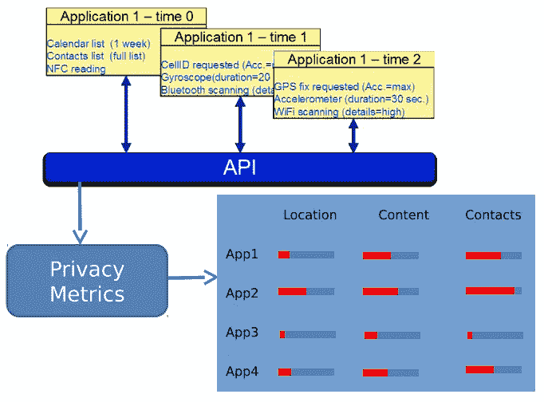
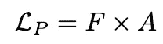
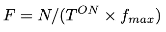
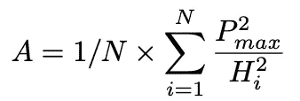
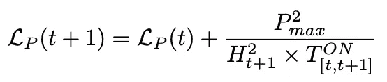
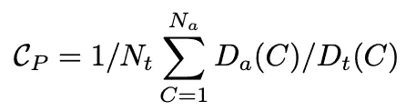
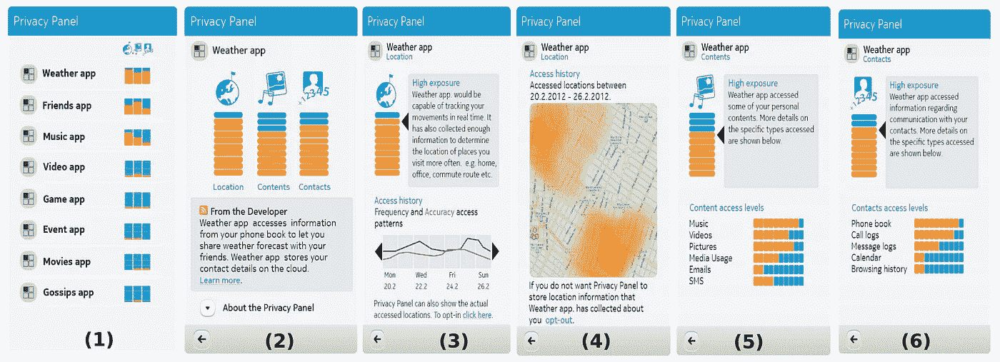
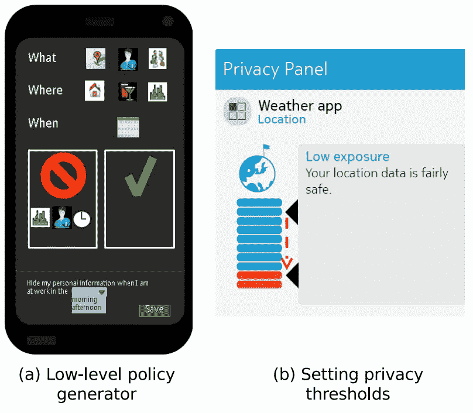

# 你的手机应用程序对隐私有多敏感？

> 原文：<https://towardsdatascience.com/statistical-metrics-to-quantify-the-privacy-level-of-your-mobile-app-6bbc31848219?source=collection_archive---------21----------------------->

## 基于位置、联系人和内容量化移动应用隐私风险的统计指标

德马尔亚·比斯瓦斯、伊马德·阿德、吉安·保罗·佩鲁奇

**摘要**。*应用程序越来越受欢迎源于它们能够为用户提供高度定制的服务。另一方面，为了提供这样的服务，应用程序需要访问用户非常敏感的私人信息。这导致恶意应用程序在后台收集个人用户信息，并以各种方式利用这些信息。研究表明，目前的应用程序审查过程主要限于安装时间验证机制，无法检测和防止此类攻击。我们认为，这里缺少的基本方面是一个全面和可用的移动隐私解决方案，它不仅保护用户的位置信息，还保护其他同样敏感的用户数据，如用户的联系人和文档。对于不理解或不关心底层技术细节的普通用户来说，这是一个可用的解决方案。为了弥合这一差距，我们提出了隐私指标，根据隐私影响量化低级应用访问，并将其转换为高级用户可理解的评级。我们还提供隐私面板应用程序的设计和架构，该应用程序以图形用户友好的格式表示计算出的评级，并允许用户基于这些评级定义策略。*

该论文的**出版的**版本可以在下面的 IEEE 可用性、可靠性和安全性国际会议记录( [ARES](https://ieeexplore.ieee.org/document/6657243) ) ( [pdf](https://www.researchgate.net/publication/256308258_Privacy_Panel_Usable_and_Quantifiable_Mobile_Privacy) )中获得

# 一.导言

应用程序(智能手机的应用程序)是当今智能手机的生命线。从苹果的 AppStore、谷歌的 Android Marketplace、诺基亚的 Ovi Store、Windows Marketplace Hub 等网站上的数千款应用程序可以明显看出它们的受欢迎程度。应用程序如此受欢迎和有用的原因是因为它们为我们生活的不同方面提供高度定制的服务，从推荐感兴趣的基于位置的服务到监测我们的健康。缺点是，为了做到这一点，应用程序需要访问关于用户的非常实时和上下文相关的信息。这些信息是由许多输入设备(摄像机、麦克风等)提供的。)和传感器(GPS、加速度计等。)嵌入移动设备中，然后提供给应用程序。显然，这些信息非常敏感，如果落入他人之手，将会带来严重的隐私问题。

为了避免这种滥用，大多数移动平台，如 iOS、Android，都提供了一种基于“需求”的访问控制模型，在这种模型中，只有在用户明确授权后，应用程序才能访问设备资源。在高层次上，该模型的工作方式如下:

*   应用程序在其基于 XML 的清单文件中声明它们需要访问以提供功能的资源列表。
*   在安装过程中，会读取清单文件，并以用户友好的格式向用户显示所需资源的访问列表。
*   只有当用户“接受”时，才允许安装该应用程序。安装后，移动操作系统会提供所需的访问控制，以确保应用程序只能访问清单文件中声明的资源。

虽然这是一种威慑，但研究[1]、[2]、[3]、[4]表明这种模型本身是不够的。许多应用程序，包括一些最流行的应用程序，都被发现在运行时滥用了安装时访问权限。

> 例如，虽然天气应用程序需要合法访问用户的位置，但如上所述的安装时验证无法阻止应用程序每隔几秒钟检索用户的位置并将其提供给外部服务器。

这方面的最新成果包括细粒度运行时访问控制模型[5]、表达性移动隐私策略[6]、[7]、智能匿名技术(尤其是在保护用户位置方面)[8]等。虽然它们很有帮助，并解决了部分问题，但缺少的基本方面是一个全面且可用的移动隐私解决方案。

*   所谓全面，我们指的是这样一种解决方案，它不仅保护用户的位置数据(正如大多数文献目前关注的那样)，还保护其他同样敏感的用户数据类型，如用户的联系人和内容(图片、音乐等)。).
*   所谓可用，我们指的是“普通”用户可以使用和理解的解决方案。如果用户不明白什么是加速度计，或者从加速度计中可以很容易地推断出什么样的个人信息，那么定义复杂的政策来限制应用程序访问设备的加速度计是没有帮助的。

因此，我们的目标是提供可用的隐私控制，既提供隐私相关信息，又允许用户在用户可理解的级别设置策略。为此，我们建议隐私专家组(PP)做出以下主要贡献:

*   识别和提取移动设备上要保护的用户数据类别:位置、联系人和内容。
*   隐私指标，根据隐私影响量化低级应用访问，并将其转化为用户可理解的评级(第 II-B 节)。
*   用户友好的应用程序设计，代表隐私评级，并允许根据它们定义策略(第二至第三节)。

# 二。隐私面板

## A.体系结构

图 1:隐私面板应用架构(图片由作者提供)

图 1 所示的 PP 架构包括以下四个阶段:

1.  拦截移动设备上安装的应用程序访问的数据。
2.  量化他们的隐私影响。
3.  以用户友好的格式显示评级。
4.  为用户提供有效的访问控制机制。

设备上的应用的行为对应于它如何与设备资源交互，例如

*   访问传感器以读取它们的数据值。现在常见的智能手机包括以下许多传感器:GPS，加速度计，环境光，指南针，磁力计，方位，接近度，旋转。
*   访问网络、文件系统、联系人。
*   截取触摸屏上的动作。
*   打开摄像机和麦克风。
*   拦截设备上更传统的操作，如打电话、发送短信等。

app 通常通过调用移动平台依赖中间件框架(如 Qt、Android SDK 等)的(开发者友好的)API 来执行上述动作。鉴于此，第一个 PP 阶段包括监控这些 API 调用，截取并记录它们的细节。

> 值得注意的是，在现实生活中，移动应用程序将有多个接口连接到底层传感器，例如在浏览器中运行的 HTML5 应用程序，或具有本机代码/JNI 的 Android 应用程序。因此，PP 应用程序需要确保覆盖所有可能的入口/出口点，以便拦截所有访问。

## B.隐私指标

在本节中，我们将介绍三种用户数据类别的隐私指标:位置、联系人和内容。这些指标让我们能够量化访问特定用户数据的应用程序对隐私的影响。值得注意的是，提出的隐私指标绝不是万无一失的。这是第一次尝试从总体上量化移动应用对隐私的影响。然而，我们相信这仍然是正确的道路。

> 我们把它比作网络上广泛使用的密码强度检查器。基于试探法，它们是对密码强度的实用且普遍适用的估计，不一定与密码分析结果匹配。他们成功地得到了普通用户的信任，这些用户现在正额外努力设置“强”密码。同样，我们的 PP 旨在为普通用户提供他们对手机上运行的应用程序的隐私暴露的粗略估计，而不一定提供严格的安全保证。

***位置*** :位置数据用非常简单的术语来说就是对应于用户所在位置的(经度，纬度)地理坐标。我们的目标是量化应用程序访问的用户位置数据对隐私的影响。量化的目的是捕捉应用程序收集了多少位置数据，它有多精确，以及从用户的角度来看它有多敏感。“多少”的纯线性测量可以通过记录用户位置数据何时(多频繁)被相关应用访问来计算。关于位置数据的精度，在此重要的是要记住，用户位置信息可以通过不同的定位方法获得，例如基于卫星的(GPS)、基于非卫星的(WiFi、蜂窝塔)等。具有不同的能量和精度权衡。因此，我们计算在应用活动期间考虑的 *N* 个样本的位置隐私度量 *L_P* ，作为*频率*和*精度*因子的函数如下:

其中 *F* 为频率因子， *A* 为精度因子，定义如下:

其中 *T^ON* 是应用活动时的周期总和， *f_max* 是位置传感器支持的最大采样频率(=默认为 1/秒)。精确系数 *A* 的公式为:

其中 *P_max* 为传感器提供的最大精度(即 2.2m)。 *H_i* 为第 *i_th* 个样品的水平精度。当应用程序请求具有高、低、任意精度的位置样本时，它被计算为平均返回精度。要考虑的默认值分别为 2.2m、30m 和 15m。

设 *L_P(t)* 表示直到时间 *t* 计算的隐私度量。然后，度量的增量版本只需要考虑可变参数:

其中 *H_t+1* 表示在时间 *t + 1* 读取的位置数据的水平精度，*t^on_[t,t+1】*表示 app 在时间 *t* 和 *t + 1* 之间的运行时间。

> 值得一提的是，应用程序请求的数据类型和它实际收到的数据之间可能存在差异。前者暗示了应用程序的“好奇程度”(恶意)，例如一个总是以最高精度请求用户位置的应用程序。

然而，由于各种技术和系统问题，由于 GPS 不可用(室内)、电池保存等，最终返回给它的位置数据可能具有比所请求的更低的精度。一个 app 获取的位置数据方面的实际隐私泄露，显然取决于后一个方面。下面我们简要讨论影响应用程序获取的位置数据的实际隐私影响的几个方面。这些方面中的一些已经在先前呈现的位置隐私度量 *L_P* 中被考虑。考虑以下所有方面的综合位置度量超出了本工作的范围。

***联系人*** :我们认为联系人主要是用户在移动设备上的通讯录。地址簿中的每个条目都有唯一的标识符(如 URI、姓名、出生日期)和相关字段，如地址、电子邮件、电话号码等。，也称为“细节”。应用程序的联系人隐私评级 CP 直观地基于两个因素:

*   应用程序访问的唯一联系人的数量，以及
*   访问的每个联系人的详细信息的数量。

更准确地说，

其中 *N_t* 为联系人总数， *N_a* 为应用访问的联系人数量， *D_a(C)* 为被访问的联系人 *C* 的明细数量， *D_t(C)* 为他的明细总数。

> 此处访问的联系人的唯一性非常重要，因为两次访问相同的联系人详细信息不会给攻击者提供任何附加信息。

该模型为扩展基于用户与所访问的联系人(例如，配偶、密友、办公室同事等)的关系分配的权重的度量留出了空间。类似地，也可以基于所访问的联系人详细信息字段(例如，地址、电子邮件、电话号码等)的敏感度来分配权重。联系人隐私等级 *C_P* 可以按如下方式递增计算。对于联系人条目 *C* 的每个新截取:

1.  检查 *C* 是否唯一，即根据其 *ID* 是否被首次访问。如果是，继续；否则退出。
2.  确定通讯录中联系人的数量 *n* 。
3.  *C_P = 1/2 × (C_P + 1/n)*

对于联系人 *C* 的联系人详细信息字段 *D* 的每个新截取:

1.  根据对的唯一性( *C* 的 *ID* ， *D* )检查字段 *D* 是否被首次访问。如果是，继续；否则退出。
2.  确定地址簿中 *C* 的详细字段 *m* 的数量。
3.  *C_P = 1/2 × (C_P + 1/m)*

***内容*** :我们认为内容是以下文件类型之一:音频(音乐)、视频、图片(图像)和文档。

> 除了捕获应用程序访问了“多少”文件和“什么类型”的文件，我们还考虑了文件的属性和标签，以量化该文件对用户的隐私敏感性，例如，用户生成的内容被认为比非用户生成的内容更敏感。同样，从隐私影响的角度来看，包含地理标记信息的内容比未标记的内容评级更高。

考虑到以上方面，我们在下面给出了计算内容隐私度量 *D_P* 的增量算法。我们考虑三个可配置的比例因子 *y* 、 *p* 、 *t* ，定义如下:

*   *y* :文件类型因子
*   *p* :属性因子
*   *t* :标签因子

假设上述所有比例因子的默认值为 0.5。

对于 app 访问的每个文件 *f* ， *D_P* 更新如下:

1.  检查 *f* 是否属于用户:只考虑驻留在用户文档目录中的文件。这是对应用程序文件访问的折扣，以检索应用程序拥有的媒体，如图标。这里假设设备上存在一个“文档”文件夹，默认情况下，所有用户生成的文件都存储在该文件夹中。如果是，继续；否则退出。
2.  根据文件的修改时间戳，检查 *f* 是否是唯一的，即第一次被访问。这里，我们将具有不同修改时间戳的文件视为“唯一的”文件访问。这是基于这样的观察:修改过的文件有可能向攻击者提供额外的信息。如果唯一，继续；否则退出。
3.  计算比例因子 s:最初让 s = 1。如果文件类型是“图像”或“视频”，那么 *s = s×y* 。文件类型由文件扩展名决定。如果 *f* 不是用户所有，那么 *s = s × p* 。文件的创建者/所有者属性用于确定这一方面。如果 *f* 没有地理标记，那么 *s = s × t* 。检查文件的 EXIF 标签以确定它是否被地理标记。
4.  根据文件类型，扫描相应的用户目录“音乐(音频)”、“视频”、“图片”、“文档”目录，以计算该目录中文件的数量。
5.  最后更新 *D_P = 1/2 (D_P + s/n)* 。

## C.UI/UX

在本节中，我们将描述隐私面板用户界面流程。截图如图 2 所示。屏幕(1)是开始屏幕，在调用 PP 时向用户显示。它列出了安装在移动设备上的应用程序及其相应的隐私等级。隐私等级相对于三个类别显示:位置、联系人和内容。点击(轻触)其中一个应用程序行，进入相应应用程序的详细隐私报告屏幕(2)。我们以天气应用程序为例进行说明。除了隐私相关信息，屏幕(2)有两个文本字段:“来自开发者”和“关于隐私面板”。后者是不言自明的，给出了关于应用软件、底层逻辑、安装版本等的高级信息。“来自开发者”提供了一个 RSS feed 类型的滚动消息框。消息可能来自应用程序开发人员，向用户解释为什么需要关于数据类别的特定访问级别(导致更高的隐私侵犯评级)。

图 2:隐私面板用户界面(作者图片)

点击其中一个类别图标(位置、联系人、内容)会显示与该类别相对应的隐私详细信息。让我们首先考虑位置类别—屏幕(3)。该屏幕显示了根据应用程序到目前为止在设备上的位置访问计算的位置隐私评级。评级被抽象为三个级别，较高的隐私评级对应于较高的入侵级别，即具有低隐私评级的应用程序更安全，即入侵性更低。

屏幕(3)的下半部分显示了基于应用程序在过去一周访问的用户位置数据的频率和准确性访问模式。用户可以前后滚动来查看前几周各自的模式。每日频率模式是基于当天用户位置数据被请求的次数来计算的。可以以不同的精确度请求用户的位置，这对用户的隐私和设备电池有不同的影响。应用程序要求的每日平均定位精度水平绘制在屏幕(3)中。

关于应用程序位置隐私的最后一个方面是显示应用程序访问用户位置数据的实际位置。这有助于用户了解应用程序更活跃的位置，例如，恶意应用程序是否针对特定的敏感用户位置(如家庭、办公室等)执行选择性分析。为了显示这些信息，PP 应用程序还需要访问用户位置数据(以记录应用程序访问的实际位置)，因此只有在用户明确“选择加入”后才能启用该功能。启用后，以热图屏幕(4)的形式向用户显示该信息。

在位置行上，点击屏幕(2)中的内容或联系人图标，分别进入屏幕(5)或(6)。屏幕(5)和(6)显示与内容和联系人类别相关的应用访问信息。内容隐私评级是根据应用程序对手机上物理文件、媒体和消息的访问来计算的。联系人评级是根据应用程序对地址簿条目的访问以及与联系人通信相关的元数据来计算的，例如，给哪个联系人打电话/发电子邮件的时间和频率。

一旦用户意识到自己的个人数据是如何被应用程序收集的，以及这些数据对隐私的影响，他很自然会想要制定政策来规范未来的应用程序行为。请注意，设置策略并不一定等同于阻止应用程序执行某些操作。保护措施可以是当应用执行某个动作或者达到某个预定义的隐私等级阈值时的简单通知消息。

图 3:隐私控制界面(作者图片)

图 3(a)给出了 PP 用户界面以生成控制应用对设备资源级别的访问的低级隐私策略。该界面主要面向了解设备资源/内部结构的高级技术用户。遵循这项工作的总体理念，为“普通”用户提供用户友好的隐私控制，我们允许这些用户通过为每个数据类别指定阈值隐私评级来监管应用程序。参考之前讨论的图 2 的屏幕(3 ),图 3(b)示出了天气应用的允许位置访问的用户设置为“低”。实施此类政策显然需要遵循“持续更新”执行模式，根据应用程序执行的每次拦截访问，重新计算相关隐私类别评级。

# 三。结论

在这项工作中，我们考虑了从隐私影响方面量化移动用户数据的应用访问的问题。我们提出了三个用户数据类别的隐私指标，即位置、联系人和内容。这些指标允许将与这些类别相关的应用访问映射到高级隐私评级。然后，我们概述了我们提出的 PP 的设计和架构，它既向用户显示隐私相关信息，又允许他们根据计算的评级来指定策略。最后，我们给出了性能结果，显示了我们的概念实现的可行性。

我们认为，所提出的方法为实现让普通用户更容易使用和访问移动隐私保护的长期目标奠定了基础。

# 参考

1.  W.Enck，P. Gilbert，B.-G. Chun，L. P. Cox，J. Jung，P. McDaniel 和 A. Sheth，“TaintDroid:智能手机实时隐私监控的信息流跟踪系统”，2010 年，OSDI。
2.  A.禅三钗，“iPhone 缺陷允许应用程序访问您的联系人。”
3.  J.-L. Boyles，A. Smith 和 M. Madden，“移动设备上的隐私和数据管理”
4.  页（page 的缩写）I .项目，“调查:移动用户警惕应用程序侵犯隐私。”
5.  Y.周，张，江，V. Freeh，“驯服窃取信息的智能手机应用程序(Android)，”于 2011 年。
6.  D.比斯瓦斯，“智能手机隐私政策改变管理”，2012 年 MUCS([链接](https://ieeexplore.ieee.org/document/6197606))
7.  D.比斯瓦斯、内费多夫和涅米，“分布式和最小使用控制”，《面向服务的计算和应用》，第 6 卷，第 4 期，2012 年([链接](https://link.springer.com/article/10.1007%2Fs11761-012-0112-4))