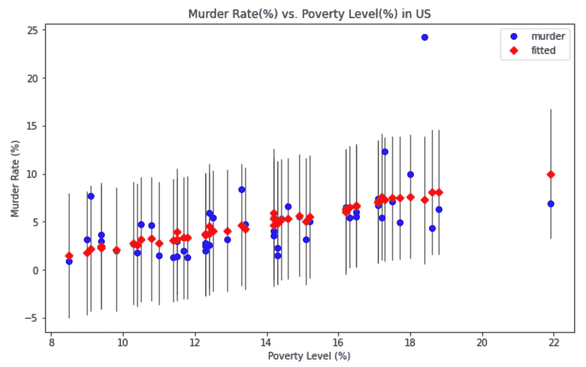
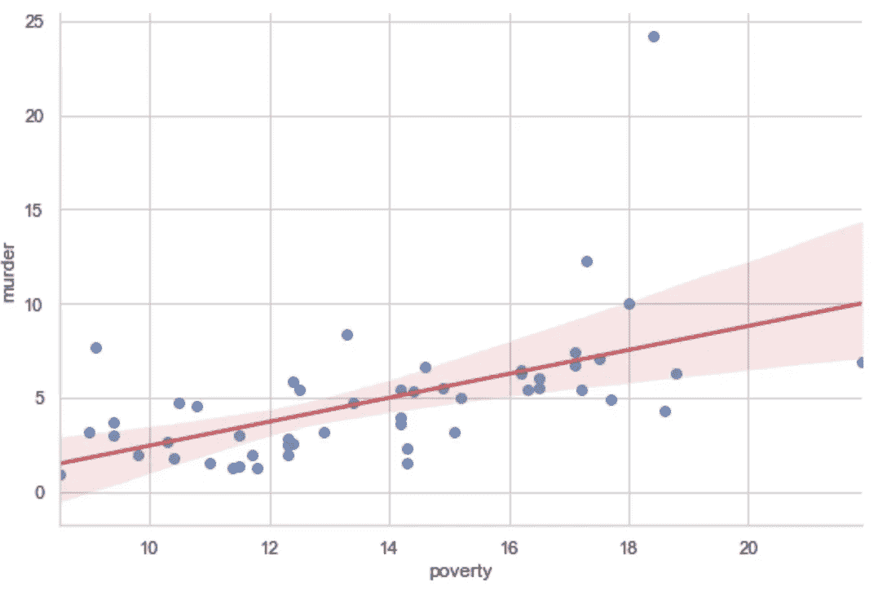

# 用 Python 进行统计建模:三个必须知道的“S 模块”

> 原文：<https://towardsdatascience.com/statistical-modelling-with-python-the-three-must-know-s-modules-79fa393e5640?source=collection_archive---------13----------------------->



图一。使用**图形**子模块的 **regressionplots.plot_fit** 子模块绘制的美国谋杀率(%)与贫困水平(%)的曲线图。作者出于教育目的创作的图形。

# 我简介

Python 是现存的最重要和最有效的多任务软件之一，它为用户提供了许多库和模块来执行不同的任务。在数据科学的背景下，统计建模是数据科学家日常工作的重要组成部分，Python 拥有不同的库和模块，可以执行高效的统计计算和可视化。

在本文中，我将讨论最重要的 Python 库/模块，当您需要执行统计建模和计算时，您必须了解这些库/模块并时刻准备着。我下面讨论的库，在我看来是最好的，我称它们为" **S-modules** "，因为它们都以字母" S "开始，以反映它们的统计性质。在本文中，我假设读者了解 Python 及其最重要的库。

# 1.统计模型

如果 Python 中有一个统计库/模块是一个人必须知道的，那么这个模块就是 [Statsmodel](https://www.statsmodels.org/stable/index.html) s，当我需要执行统计计算时，它可能是我最喜欢的 Python 模块。这个库/模块基于 SciPy Python 库，它是一个完整的模块，允许用户执行许多统计分析操作。

通常使用以下 Python 语法调用该 Python 模块:

```
[In] **import** statsmodels.api **as** sm
```

您可以注意到，这个模块具有 api 扩展，与其他 Python 库和模块略有不同。在许多情况下，Statsmodels 具有与其他 Python 模块不同的命名法和语法。例如，如果想要出于统计目的分析数据，Statsmodels 使用 **endog** 和 **exog** 术语来表示 *x* 和 *y* 变量。endog 是*内源性*一词的缩写，本质上的意思是由系统内的因素引起的。另一方面，exog 是单词 *exogeneous* 的缩写，本质上的意思是由系统外的因素引起的。因此，在处理 Statsmodels 模块文档时，应该记住这个术语。

在统计建模中，用户可以用 Statsmodels 做什么？正如我上面已经提到的，有了这个模块，用户几乎可以在这个领域做任何事情。在多元线性回归的情况下， [OLS](https://www.statsmodels.org/stable/examples/notebooks/generated/ols.html) 子模块允许用户使用普通最小二乘法(OLS)进行多元线性回归。如果用户想要执行加权最小二乘法(WLS)，那么可以使用 [WLS](https://www.statsmodels.org/stable/examples/notebooks/generated/wls.html) 子模块。如果用户想要执行，可以使用广义最小二乘()子模块。此外，在回归的背景下，Statsmodels 可以执行 ANOVA 测试、具有离散因变量的回归 *y、*线性混合效应模型等。

对于纯粹的统计计算和分析，Statsmodel 有一个名为[**stats**](https://www.statsmodels.org/stable/stats.html)**的子模块，允许用户执行多个统计测试。通常使用以下 Python 语法调用该子模块:**

```
[In] **from** statsmodels **import** stats
```

**通过 **stats** 子模块，用户可以根据遇到的具体问题进行大量的统计测试。仅举几个例子，通过 stats 子模块，您可以执行不同的卡方拟合优度测试、Anderson-Darling 测试、Ramsey 重置测试、常态综合测试等。**

**像 Statsmodels 这样的完整统计模块不能没有图形子模块。实际上，该模块还包括用于统计结果绘图和可视化的 [**图形**](https://www.statsmodels.org/stable/graphics.html) 子模块。在这一点上，我给出一个具体的例子来说明如何使用 Statsmodels 来可视化统计结果是非常有用的。**

**Statsmodels 还有一个名为**数据集**的子模块，用户可以选择默认的预加载数据集进行统计建模。在本文中，我选择了 *statescrime dataset* 作为示例，该数据集包括许多与美国犯罪相关的参数。我运行以下 Python 代码来显示 statecrime 数据集的几个条目，如下图 2 所示:**

```
[In]: **import** statsmodels.api **as** sm[In]: **import** matplotlib.pyplot **as** plt[In]: data = sm.datasets.statecrime.load_pandas().data[In]: data.head(10)[Out]: 
```

****

**图二。statecrime 熊猫数据集的前十行。**

**现在，假设我想使用图 2 中的数据集对贫困率与谋杀率和 hs_grad 进行多元线性回归，并绘制仅 T2 贫困率与谋杀率的结果。为了实现这一点，我使用带有以下 Python 代码的 **graphics.plot_fit** 子模块:**

```
[In]: y = data['murder'] # Select the murder rate column from the data dataset as the exonog variable.[In]: X = data[['poverty', 'hs_grad']].copy() # Create the design matrix by using the poverty rate and hs_grad columns of data dataset.[In]: X['constant'] = 1 # Add a constant term of to the design matrix as the intercept.[In]: model = sm.OLS(y, X) # Perform ordinary OLS on the data[In]: results = model.fit()[In]: fig, ax = plt.subplots(figsize = (10, 6))
fig = plot_fit(results, 0, ax=ax, vlines = True)
ax.set_ylabel("Murder Rate (%)")
ax.set_xlabel("Poverty Level (%)")
ax.set_title("Murder Rate vs. Poverty Level in US")[Out]: plt.show()
```

**如果您运行上面的代码，您将得到本文顶部所示的图 1。垂直线代表拟合数据对真实数据(谋杀数据)的线性回归的残差。如您所见，[**graphics . regression plots . plot _ fit**](https://www.statsmodels.org/stable/graphics.html)**子模块使用两个预测值执行多元线性回归(在本文考虑的情况下),并且只绘制一个预测值的结果。该示例显示了 Statsmodels 模块为用户提供的许多选项。还有许多其他的我在这里没有讨论。****

# ****2.统计数据****

****[SciPy](https://docs.scipy.org/doc/scipy/index.html) 是用于科学计算的 Python 库。这个库有许多模块和子模块，这使它成为科学计算的最佳库之一。SciPy 有一个名为[**stats**](https://docs.scipy.org/doc/scipy/reference/stats.html)**的模块，负责统计建模和计算。该模块是 **Statsmodels** 模块的前身，后者是前者的扩展。这两个模块互为补充，在许多情况下，它们也有重叠的功能，但调用语法不一定相同。******

****[**stats**](https://docs.scipy.org/doc/scipy/reference/stats.html)**模块允许用户执行不同的统计计算，如汇总统计、频率统计、计算相关函数、计算单变量和多变量概率分布(连续和离散)、蒙特卡罗模拟、生成随机变量等。******

******甚至在这一节中，为了说明 SciPy 的性能，我给出了一个具体的例子。这里我用的是和我之前[文章](/five-regression-python-modules-that-every-data-scientist-must-know-a4e03a886853)中一样的数据，其中 x 数组是不同国家的人均 GDP，y 数组是生活满意度值。对于这些数组，我使用以下 Python 代码，使用 **stats** 模块来计算*皮尔逊相关系数(r)* 及其 p 值:******

```
**[In]: **import** numpy **as** np[In]: **from** scipy **import** stats[In]: x = np.array([ 56755.72171242,  44178.04737774,  40991.80813814,   8814.00098681, 43585.51198178,  13574.17183072,   6175.8760297 ,  17829.69832237, 53254.85637009,  17522.23018625,  42784.69836164,  36638.18492916, 41086.72967373,  18167.77372717,  12706.89121489,  52564.42917946, 61995.42280258,  35776.79516181,  30230.22630213,  34524.46986093, 13774.60527391,  14258.22933451, 101376.49657434,   9616.64500569, 45175.23189338,  38615.99518491,  74355.51585756,  12578.49547344, 19242.3664711 ,  16310.988409  ,  20881.76692993,   5734.63362915, 25732.01836475,  51545.48360953,  82081.59716162,  11006.2497364 , 44974.83187718,  56839.38177423])[In]: y = np.array([7.3, 7.1, 6.9, 6.4, 7.4, 6.5, 6.3, 6.7, 7.6, 5.7, 7.6, 6.5, 7.0, 5.4, 5.6, 7.5, 7.0, 7.2, 6.0, 5.9, 5.9, 5.9, 6.9, 6.5, 7.4, 7.3, 7.6, 6.1, 5.4, 6.2, 5.9, 4.7, 6.3, 7.3, 7.5, 5.5, 6.8, 6.9])[In]: (r, p_value) = stats.pearsonr(x, y)[Out]: (0.7202871953226558, 3.426556470064707e-07)**
```

****从上面的 Python 代码中可以看到，皮尔逊相关系数与我之前的[文章](/five-regression-python-modules-that-every-data-scientist-must-know-a4e03a886853)中计算的相吻合。在假设 x 来自正态分布的情况下，使用 **pearsonr** 子模块计算的*双边* p 值有效，在本例中，这一条件不一定适用于 x。****

****人们可以更详细地计算临界 *z* 或 *t* 值。例如，在线性回归的情况下，计算线性回归系数的临界 *z* 或 *t* 值，即截距和斜率。假设有人有兴趣计算 95%置信水平下的临界值。在这种情况下，需要运行以下 Python 代码:****

```
**[In]: n=38                            # Number of degrees of freedom[In]: alpha=0.05                      # Significance level[In]: t_critical = stats.t.ppf(1-alpha/2, n-2) # ppf is the inverse function of cdf[In]: print("Model t_critical: ", t_critical)[Out]: Model t_critical:  2.0280940009804502 # Critical value of T statistic at alpha=0.05**
```

****您可以看到，为了计算临界 t 值，我使用了 **stats** 子模块 **t.ppf()。**该函数是累积分布函数的反函数，它计算以百分比值表示的不同置信水平值的 *t* 值。你可以在我的 [GitHub 页面](https://github.com/DamianEjlli/Data-Science-Project-GDP-and-life-satisfaction)上看到，在对 x 和 y 数组进行线性回归的情况下，t-score 值为 *t_s = 6.23* ，大于 *t_critical = 2.02* ，从而拒绝了 *x* 和 *y* 不相关的零假设。****

# ****3.海生的****

****Seaborn 是另一个优秀的统计数据可视化 Python 库。这个 Python 库大部分是建立在 **Matplotlib** 库的基础上的，它也包含了许多熊猫库的功能。Seaborn 专门用于可视化统计数据和图表。它可以很容易地用 PyPi 命令 **pip install seaborn** 或者通过命令 **conda install seaborn 用 Anaconda 发行版安装。**一般来说，seaborn 需要不同的库依赖，比如 NumPy、SciPy、Matplotlib 和 Pandas。如果您的 Python 发行版中没有这些库，那么它们将与 seaborn 一起安装。****

****使用 seaborn，您可以:****

1.  ****可视化统计关系****
2.  ****可视化数据分布****
3.  ****可视化回归模型****
4.  ****绘制分类数据****
5.  ****控制图形美感****
6.  ****构建多地块网格****
7.  ****选择调色板****

****Seaborn 有许多选项来绘制和可视化统计结果。作为示例，考虑第 2 节图 2 中的熊猫数据集。假设我想寻找贫困率和谋杀率之间任何可能的线性关系。为了看到这一点，我运行下面的 Python 代码，并在下面的图 3 中显示结果:****

```
**[In]: **import** seaborn **as** sns[In]: sns.set(style = "whitegrid")[In]: fig = sns.lmplot(x="poverty", y="murder", data=data)[Out]:**
```

********

****图 3。使用 **seaborn** 库的 **sns.lmplot** 子模块绘制美国谋杀率(%)与贫困率(%)的曲线图。作者出于教育目的创建的图像。****

****如您所见，通过 seaborn，您可以使用该库提供给用户的许多不同选项，并创建出色的最终结果。显然，在这里我没有展示 seaborn 的许多其他功能，我邀请读者去体验它们。****

# ****结论****

****在本文中，我讨论了 Python 中三个最重要的统计模块。如果你想进行统计建模和计算，这些是你应该一直带在身边的模块。它们中的每一个都有几乎独一无二的特征，并且在大多数情况下，它们也是互补的。Statsmoldels 应该是统计建模的第一模块，seaborn 应该是第二模块，因为它允许您创建统计建模的图形，而不需要用户进行任何计算或编写额外的 Python 代码来进行这些计算。****

# ****如果你喜欢我的文章，请与你可能对这个话题感兴趣的朋友分享，并在你的研究中引用/参考我的文章。不要忘记订阅将来会发布的其他相关主题。****