# 数据科学访谈中的统计时刻

> 原文：<https://towardsdatascience.com/statistical-moments-in-data-science-interviews-bfecd207843d?source=collection_archive---------6----------------------->

## 数据科学家的数学复习

## 数据科学家的基本数学从零开始解释

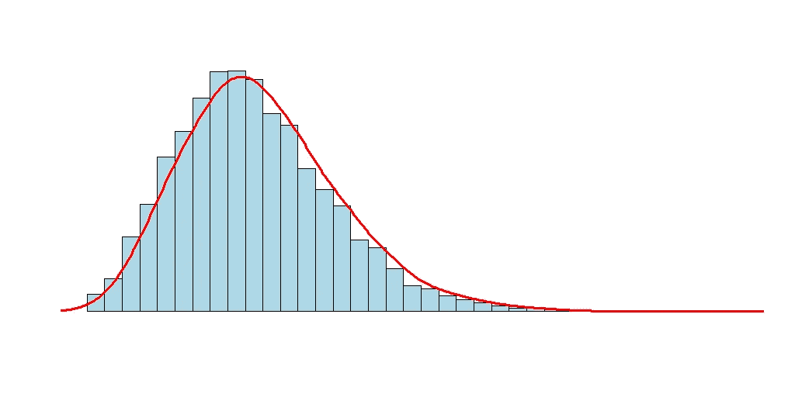

矩是用来描述分布的一组统计参数。计算很简单，因此经常被用作对数据的第一次定量分析。对数据的良好理解应该是训练任何高级 ML 模型之前的第一步。它可以最大限度地减少选择方法和解释结果所需的时间。

在物理学中，*矩*指的是质量，并告知我们物理量是如何定位或排列的。在数学中，*矩*指的是类似的东西——概率分布——一个解释实验不同可能结果的概率的函数。为了能够比较不同的数据集，我们可以使用前四个统计矩来描述它们:
1。期望值
2。差异
3。偏斜度
4。峭度

我们一起来过一遍细节吧！

文章分为两部分:
一、数学复习
二。数据科学访谈中与主题相关的问题

# 一.数学复习

# 1.期望值

第一个矩-期望值，也称为期望、数学期望、平均值或平均值，是变量可以取的所有值的总和乘以该值出现的概率。可以直观地理解为**算术平均值**:

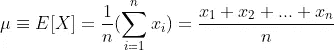

当所有结果都有相同的发生概率时，这是正确的(例如，掷骰子——从 1 到 6 的所有数字都有相同的机会被掷出)。包含每个事件概率的更一般的等式是:

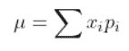

对于掷骰子，当每个值出现的概率为 1/6 时，期望值为:

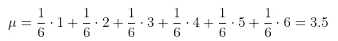

或者:

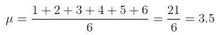

对于概率相等的事件，期望值与算术平均值相同。这是最受欢迎的集中趋势的**量度之一，通常被称为*平均值*。其他常见的措施有:**

*   **中间值** —中间值
*   **模式—** 最可能的值。

例如，取 7 个值的集合:2、4、4、5、8、12、14，我们得到:

*   **意思是:**

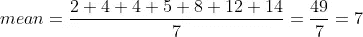

*   **中值-** 这是“中间”值，正好在数据集的中间。在我们的例子中，这是 5，因为它分隔了数据的大部分和小部分:我们有 3 个小于 5 的值和 3 个大于 5 的值。对于具有偶数个值的数据集(例如，向我们的数据集添加 15 个值)，我们取中间的两个值，并计算它们的平均值:

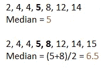

*   **模式** -一组数据中出现频率最高的值。对于我们上面的例子，模式是 4，因为它出现了两次。

# 2.差异

第二个中心矩是**方差。**方差解释了一组值如何围绕它们的期望值分布。对于 *n* 个同样可能的值，方差为:

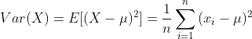

其中 *μ* 为平均值。所以方差很大程度上取决于期望值。

对于上面的样本数据序列，方差为:

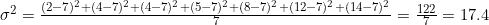

其中 *n* 是 7，因为我们的数据集中有 7 个元素，并且 *μ* 是 7，如上所述。

当值的分布较低且均值相同时，方差也较低，例如:

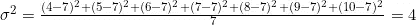

**标准偏差**

标准偏差是方差的平方根，由于其单位与 X 的单位相同，因此通常被使用:

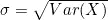

方差和标准差告诉我们数据围绕平均值分布的强度，如下图所示:

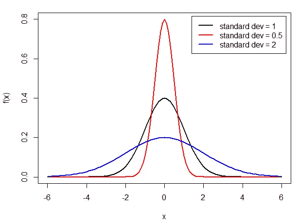

方差/标准差越大(如蓝线)，平均值的分布越广。如果方差较低，累积的值越接近平均值(红线)，峰值越高。
下图总结了前两个时刻的诠释:

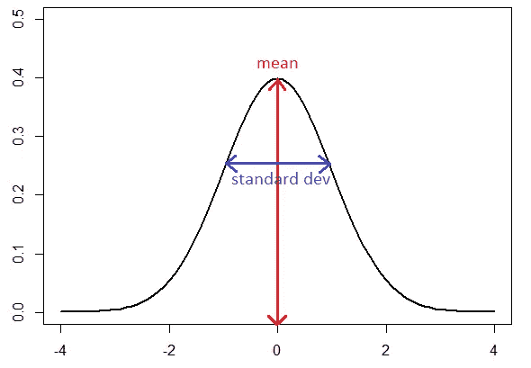

图片由作者提供。

如果您想了解更多关于发行版以及如何解释它们的信息，请查看以下内容:

 [## 分位数是理解概率分布的关键

### 概率密度函数(PDF)与累积概率分布(CDF)。满足分位数并使用…

towardsdatascience.com](/quantiles-key-to-probability-distributions-ce1786d479a9) 

# 3.歪斜

偏斜度是第三个统计矩，用于度量数据关于其均值的不对称性。计算偏斜度的公式为:

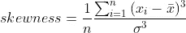

根据偏度，我们可以区分三种类型的分布:

*   **对称分布**:如上例。两个尾部都是对称的，偏斜度等于零。
*   **正偏斜(**右偏斜，右尾，向右偏斜 **)** : 右尾(数值较大)较长。这告诉我们“异常值”的值高于平均值。
*   **负斜** **(** 左斜，左尾，向左斜 **)** :左尾(数值小)较长。这让我们知道了值低于平均值的“异常值”。

一般来说，偏斜度会以下列方式影响均值、中值和众数的关系:

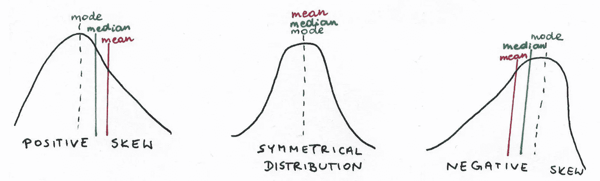

*   对于对称分布:均值=中位数=众数
*   对于正偏态分布:众数
*   对于负偏态分布:均值

但这并不适用于所有可能的分布。例如，如果一条尾巴很长，但另一条很重，这可能行不通。调查数据的最佳方法是计算所有三个估计量，并根据结果得出结论，而不是一般规则。

# 4.峭度

第四个统计矩是峰度。它关注分布的尾部，并解释分布是平坦的还是具有高峰。峰度告诉我们，我们的分布在极值上是否比正态分布更丰富。

对于用于计算峰度的公式没有严格的共识，不同的程序/软件包使用三种主要的公式。一个好习惯是，在对数据下结论之前，先检查你的软件使用的是哪一种。包含负 3 修正项的公式指的是*过剩峰度。*所以，超额峰度等于峰度减 3。

一般来说，我们可以区分三种类型的分布:

*   **中等峰度**——峰度为 3 或过度峰度为 0。这组包括正态分布和一些特定的二项分布。
*   **尖峰值** —峰度大于 3，或过度峰度大于 0。这是一种尾部较宽、峰值较窄的分布。
*   **扁峰度—** 峰度小于 3 或为负值为过度峰度。与正态分布相比，这是一个尾部非常细的分布。

对于那些视觉记忆更好的人来说，看看我的草图:

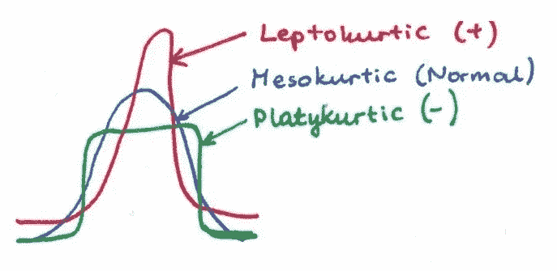

我们经历了前四个统计时刻。现在是我们检查面试问题的时候了。

# 二。数据科学访谈中的问题

**1。什么是正态分布的峰度？**

这是个棘手的问题！正如《数学复习》中提到的，对于用于计算峰度的公式没有严格的共识，通常满足三个公式。最重要的区别，尤其是对于大样本而言，方程的选择并不那么重要，是了解您的公式是否包含-3 的校正项。如果是这样，该公式将计算超额峰度。**这意味着正态分布可能有峰度为 3 或过度峰度为 0。**但要小心，因为*过度峰度*有时也会缩短为更简单的*峰度*。

一些语言允许你在计算中选择公式的类型(例如 R)或者定义你想要使用的正态峰度的定义(Python)。了解你计算的内容将允许你将结果与正态分布进行比较并得出结论。

**2。你什么时候会考虑用中位数代替均值？**

样本均值是对未知总体均值的一种众所周知的常用估计。然而，它容易受到异常值的影响，尤其是当样本量很小时。所以，如果数据集很小，有偏差，并且有异常值，那么检查中位数是值得的。

**3。你想投资你的钱，并有两种可用的回报分布:正的和负的偏斜。你会选择哪一个，为什么？**

这里没有好与坏的答案，只要你能给出你选择的理由。这取决于你的风险偏好。

就个人而言，在均值和方差保持不变的情况下，我会投资正偏斜。一般来说，获得高回报的机会越大，亏损的可能性就越大。所以，在选择之间:

1.  85%的机会赢得至少 1000 美元，1%的机会输掉 99000 美元或更多
2.  1%的机会赢得至少 99000 美元，85%的机会输掉 1000 美元或更多

我选择第一种选择——相对于彩票大奖的希望来说，赢的可能性更小，但可能性更大。但是选择取决于你！

## 4.在你看来，一个国家的平均工资能提供多少信息？

我认为它应该总是与中位数一起报告。这样，我们可以更多地了解社会中的工资分配。举个例子，如果有一小群人的薪水超级巨大，但是其余的人赚的很少，那么在比较中位数和均值的时候就可见一斑了。从这两个估计量中，我们可以理解体面的工资是可以被视为正常的，还是被视为异常值。当然，薪水也应该与一个特定国家的生活成本进行比较，以便更好地了解生活质量。

# **感谢阅读！**

我们一起经历了前四个统计时刻:期望值、方差、偏度和峰度。我希望这对你来说是一次激动人心的旅行。

**记住，学习(数学)技能最有效的方法是实践**。所以，不要等到你觉得“准备好了”，就拿起笔和纸或者你最喜欢的软件，自己试几个例子。我为你祈祷。

您可能还喜欢:

 [## 分位数是理解概率分布的关键

### 概率密度函数(PDF)与累积概率分布(CDF)。满足分位数并使用…

towardsdatascience.com](/quantiles-key-to-probability-distributions-ce1786d479a9)  [## 数据科学访谈中的矩阵

### 数据科学家的基本数学从零开始解释

kujaga.medium.com](https://kujaga.medium.com/math-refresher-for-data-scientist-part-1-matrices-88620a92d046) 

我很乐意在下面的评论区听到你的想法和问题，直接通过我的 [LinkedIn](https://www.linkedin.com/in/agnieszka-kujawska/) 个人资料或*akujawska@yahoo.com 联系我。*回头见！