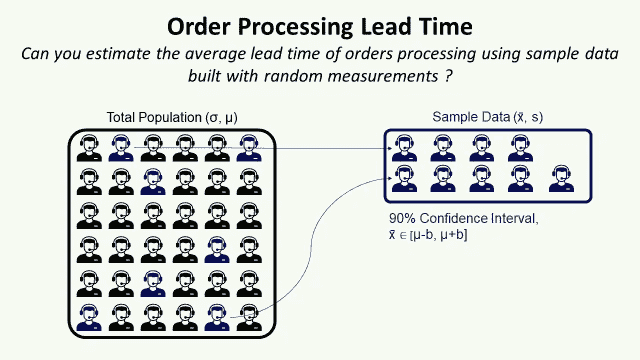
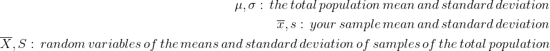
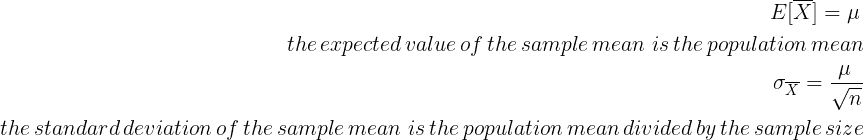
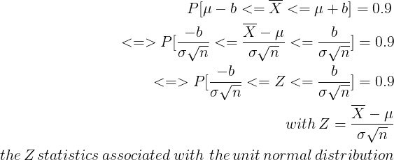
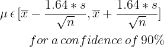
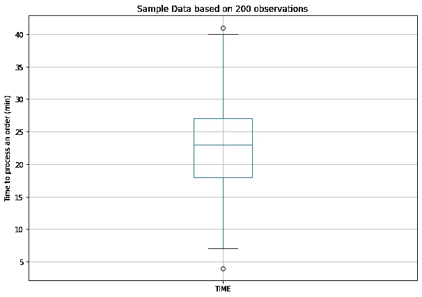

# 使用 Python 进行过程改进的统计采样

> 原文：<https://towardsdatascience.com/statistical-sampling-for-process-improvement-using-python-9decc7b8288d?source=collection_archive---------24----------------------->

## 使用样本数据来估计电梯零件供应商的客户服务中处理客户订单的平均提前期。



统计抽样以估计平均订单处理提前期—(图片由作者提供)

作为供应链管理的一个重要组成部分，**客户服务**是你的公司让你的客户感受到你正在销售的产品和业务的地方。

一个重要的绩效指标是从收到客户订单到将其发送到仓库进行准备的平均交付时间。

在本文中，我们将介绍一种使用**统计抽样**的方法，以**使用**200 个观察值的样本**来估计总平均提前期**。

💌新文章直接免费放入您的收件箱:[时事通讯](https://www.samirsaci.com/#/portal/signup)

```
**SUMMARY**
**I. Scenario
Problem Statement** You are the **Customer Service Manager of an elevator parts supplier** that produce and deliver engine parts for elevators.
**Question** Can you estimate the average processing time with a confidence interval of 90% using your sample data?
**II. Statistical Sampling** 1\. Notations 
2\. Application of the Central Limit Theorem3\. Confidence Interval4\. Final estimation **III. Conclusion**
```

# 一.情景

## 问题陈述

你是电梯零件供应商的**客户服务经理，该供应商生产并交付电梯的发动机零件。**

您的团队负责订单处理:

*   客户通过电话或电子邮件发送订单，要求交货时间
    *(例如:客户订购 5 台 SKU X，希望当天 10:00 交货)*
*   您的团队确认订单，并将其分配到最近的仓库进行准备和装运。
*   订单由快递公司准备并从仓库发货。

你最近收到了许多客户的投诉，因为交货晚了。据仓库经理说，主要是由于客服在订单处理过程中的延误。

在 3 个月的时间里，您测量了随机选择的操作员的订单处理时间，并收集了 200 个观察结果。

## 问题

> *您能否使用您的样本数据，以 90%的置信区间估计平均处理时间？*

[](http://samirsaci.com) [## 萨米尔·萨奇

### 数据科学博客，专注于仓储，运输，数据可视化和机器人流程自动化…

samirsaci.com](http://samirsaci.com) 

# 二。统计抽样

由于我们无法测量所有操作员对每个订单的平均处理时间，我们希望使用这些样本记录来估计总体平均处理时间。

## **1。符号**

为了简化理解，让我们介绍一些符号:



符号—(作者提供的图片)

## 2.中心极限定理的应用

在之前的一篇文章([链接](/central-limit-theorem-for-process-improvement-with-python-483126e33b07))中，我们一直在使用中心极限定理(CLT)来估计随机变量 P(X≥k)的概率，假设 X 遵循正态分布。

CLT 还告诉我们:



方程式—(图片由作者提供)

## 3.置信区间

我们的目标是知道总体均值范围[ -b，+b]，置信度为 90%。



方程式—(图片由作者提供)

通过构造单位正态分布，我们知道对于 P(-z≤Z≤z) = 0.9，我们得到 z = 1.64

最后，我们可以得到我们的估计范围或总体均值



方程式—(图片由作者提供)

## 4.最终估计

```
count    200
mean      22.705
std        6.81
min        4.0
25%       18.0
50%       23.0
75%       27.0
max       41.0
```



方程式—(图片由作者提供)

我们有，

```
n = 200
x̄ = 22.705 (min)
s = 6.81 (min)The confidence interval is [21.96, 23.54]
```

## 超出

如果您对持续改进的统计数据感兴趣，可以看看这个系列的文章，它们涵盖了使用 Python 实现的精益六适马概念

[](https://www.samirsaci.com/lean-six-sigma-with-python-kruskal-wallis-test/) [## 使用 Python - Kruskal Wallis 测试精益六适马

### 物流持续改进如何用 Python 替换 Minitab 来执行 Kruskal Wallis 测试评估…

www.samirsaci.com](https://www.samirsaci.com/lean-six-sigma-with-python-kruskal-wallis-test/) [](https://www.samirsaci.com/lean-six-sigma-with-python-logistic-regression/) [## 基于 Python - Logistic 回归的精益六适马

### 物流持续改进用 Python 替换 Minitab 来执行逻辑回归以估计最小…

www.samirsaci.com](https://www.samirsaci.com/lean-six-sigma-with-python-logistic-regression/) [](https://www.samirsaci.com/lean-six-sigma-with-python-chi-squared-test/) [## 使用 Python - Chi-Squared 测试的精益六适马

### 物流持续改进执行卡方检验，解释影响您的…

www.samirsaci.com](https://www.samirsaci.com/lean-six-sigma-with-python-chi-squared-test/) 

# 三。结论

*关注我，了解更多与供应链数据科学相关的见解。*

对于 90%的置信水平和适度的实验努力，我们对订单处理的平均交付时间有一个非常好的估计。

这种方法可以用在过程性能测量成本高、费时费力的情况下。

但是，您需要在实验协议中投入精力，以确保您的样本数据是基于随机选择的操作符构建的。

# 关于我

让我们在 [Linkedin](https://www.linkedin.com/in/samir-saci/) 和 [Twitter](https://twitter.com/Samir_Saci_) 上连线，我是一名供应链工程师，正在使用数据分析来改善物流运作和降低成本。

如果你对数据分析和供应链感兴趣，可以看看我的网站

[](https://samirsaci.com) [## Samir Saci |数据科学与生产力

### 专注于数据科学、个人生产力、自动化、运筹学和可持续发展的技术博客

samirsaci.com](https://samirsaci.com) 

# 参考

[1]用 Python 实现过程改进的中心极限定理，Samir Saci， [Link](/central-limit-theorem-for-process-improvement-with-python-483126e33b07)