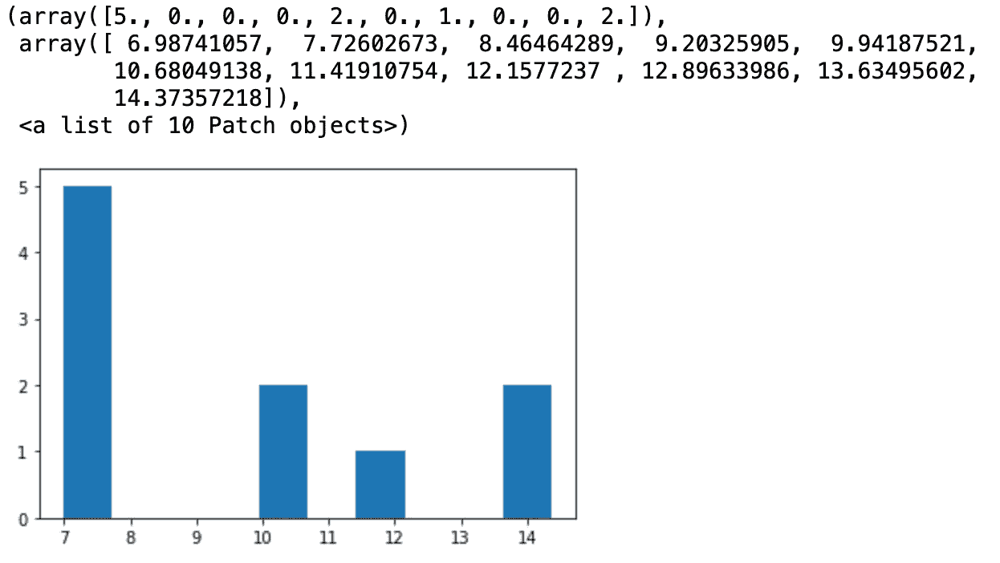

# FAANG 在 2021 年问这 4 个 Python 模拟

> 原文：<https://towardsdatascience.com/statistical-simulation-in-python-part-2-91f71f474f77?source=collection_archive---------21----------------------->

## 破解数据科学面试

## 数据科学和数据工程面试的必读材料，第 2 部分


eberhard grossgasteiger 在 [Unsplash](https://unsplash.com/?utm_source=unsplash&utm_medium=referral&utm_content=creditCopyText) 上的照片

**2021 年 1 月 10 日更新**

# 介绍

统计模拟是数据科学/工程面试中测试最重的题目！如果我们看一下 Glassdoor 上发布的 DS 面试问题，统计模拟是所有大型科技公司都希望其申请人擅长的关键技能。

访谈场景可能会被要求对 A/B 实验进行功效分析，或者构建二项式分布来模拟编程语言 R 或 Python 中的用户行为。

这些问题并不难，但需要对基本统计学有深刻的理解，并有流利的编程技巧。如果没有经过深思熟虑的练习，这些问题可能会让你犯错。这篇文章介绍了数据科学访谈中最常测试的 4 种统计分布，以及 Python 中的实时代码解决方案。

在之前的帖子中，我已经介绍了统计思维和 R 代码的基础知识。如果你错过了，这里是入口:

</statistical-simulation-in-r-part-1-d9cb4dc393c9>  

免责声明:我假设我的读者朋友理解统计学基础知识(例如，什么是二项分布)，并且熟悉 Python 编程环境(例如，如何编写简单的 for 循环)。下面是由朱撰写的关于[常见统计分布](/seven-must-know-statistical-distributions-and-their-simulations-for-data-science-681c5ac41e32)的简要回顾。

# 问题 1:均匀分布

> 用 R 或者 Python，请回答以下问题。
> 
> 对于一个数列，(a1，a2，a3，a4，…，an)，**请写一个随机返回每个元素 ai 的函数，概率为 ai/∑ai** 。 *(* ***)条件 1*** *)*
> 
> 例如，对于一个序列(1，2，3，4)，函数以 1/10 的概率返回元素 1，以 4/10 的概率返回元素 4。 ***(条件二)***
> 
> 您可以使用任何库，但不能使用 random.choice()。 ***(条件 3)***

## 走过我的思考过程

这是我在一家旅游公司问的一个真实的面试问题。

我们来分解一下。

问题要求函数返回与其权重成比例的元素， **ai/∑ai。**可以分两步完成:

```
*# Step 1: Calculate the probability for each element* ***ai*** *with respect to the total sum* ***∑ai****.**# Step 2: Simulate the process and return the element (it is more complicated than it sounds).*
```

对于第一步，我们做如下事情:

```
import numpy as npdef weight_func(sequence):# step 1
    prob = []
    total_sum = sum(sequence)

    for i in range(len(sequence)): 
        prob.append(sequence[i]/total_sum)

**# step 2: the following is pseudo-code
    return the element according to its probability**
```

这里有一个问题:我们不能使用内置方法， *random.choice()* ( **条件 3** )。假设，如果我们被允许进口 Numpy 包，这将是一个容易得多的问题。

或者，我们必须开发一些东西来执行与随机选择相同的功能。

那时候，我对现场一无所知。我的面试官友好地给出了他的第一个提示:你可以使用一个范围从 0 到 1 的均匀分布，将生成的值(名为***)****与每个位置 I 的累积概率和(名为 ***cum_prob[i]*** )进行比较，如果***cum _ prob[I]***>a，那么从序列中返回相应的值。*

*这个想法听起来很棒，让我们看看 Python 代码是什么样子的。*

## *解决办法*

*人们犯了一个常见的错误，试图使用控制流(if-else 语句)来过滤场景。这对于小样本是可行的，但是如果序列中有成千上万的数字，这就不切实际了。我们没有使用 1000 多个“if，elif，else”语句来告诉 Python 如何处理这些数字，对吗？*

*几个月后回头看这个问题，最有挑战性的部分是想出用累积概率和来模拟过程的思路。在详细的一步一步的解释之后，现在更可行了。*

# *问题 2:二项分布*

> *在线购物网站(例如，亚马逊、阿里巴巴等。)希望测试将出现在网站顶部的两个版本的横幅。工程团队将访问版本 A 的概率指定为 0.6，将访问版本 B 的概率指定为 0.4。*
> 
> *在 10000 次访问后，有 6050 名访问者接触到版本 A，3950 人接触到版本 b。*
> 
> *随机化过程正确时有 6050 例的概率是多少？*
> 
> *换句话说，版本 A 的概率确实是 0.6。*

## *走过我的思考过程*

*这是假设检验问题的一部分。我们来分解一下。*

*有 A 和 B 两个版本，实验把治疗分配给 10000 人。因此，这是采用二项分布的完美设置。*

*但是收到 A 版的概率略高于 b 版，最后的答案应该会返回 10000 次试验中超过 6050 人收到 A 版的概率。*

*这些信息提醒我们将二项分布与条件 for 循环结合起来，如下所示。*

## *解决办法*

```
*0.1498*
```

*结果接近 15%，具有实用价值。这是一个假设检验问题。由于观察到 6000 名或以上访客的概率为 15%，我们无法拒绝零假设，并得出 10000 名访客中 6000 名和 6050 名访客之间没有统计差异的结论。换句话说，版本 A 的概率是 0.6。*

*我们已经学习了假设检验以及如何拒绝或未能拒绝零假设，但这样的问题让我对统计模拟三思。*

**

*新年快乐裘德·贝克在 [Unsplash](https://unsplash.com/?utm_source=unsplash&utm_medium=referral&utm_content=creditCopyText) 上的照片*

# *问题 3:泊松分布*

> *我的中型博客每天有 500 次访问，访问次数遵循泊松分布。1000 次之外，每天 510 次以上的访问比例是多少？写一个函数来模拟这个过程。*

## *走过我的思考过程*

*这是一个相当简单的问题。因为这个问题问的是一个事件在特定时间内发生了多少次，所以我们可以遵循泊松过程。*

```
**# step 1: create a poisson distribution**# step 2: use an if clause to count the number**
```

## *解决办法*

```
*0.318*
```

*31.8%的模拟结果有 510 次以上的访问。*

*这篇文章发表后，媒体博客的数量飙升到另一个水平。*

# *问题 4:正态分布*

> *编写一个函数，从正态分布中生成 X 个样本，并绘制直方图。*

## *走过我的思考过程*

*这是谷歌问的问题。这是一个相对简单的编码问题，有两个步骤:*

```
**# step 1: generate a normal distribution**# step 2: take X samples and plot the sampling distribution**
```

*开始了。*

## *解决办法*

*我们用 100 个数字生成一个正态分布，设 X 等于 10。*

```
*array([ 7.27305691,  6.98741057, 14.37357218, 14.17422672,  7.57495374, 10.39904815,  7.27305691,  7.41182935, 10.565957, 12.0081078 ]) # X_samples*
```

**

**我的* [*Github*](https://github.com/LeihuaYe/Statistical_Simulation) *上有完整的 Python 代码。**

# *外卖食品*

*   *作为第一步，在进入编码部分之前，我们需要理解这个问题。求职者犯的一个最大的错误是没有问清楚问题就直接进入编程部分。他们在卡住后不得不多次重新访问该问题。*
*   *这篇文章只关注最重要的模拟类型，不讨论其他类型。底层逻辑是相同的:将问题分解成不同的步骤，并用 Python/R 编写每一步的代码。*

**Medium 最近进化出了自己的* [*作家合伙人计划*](https://blog.medium.com/evolving-the-partner-program-2613708f9f3c) *，支持像我这样的普通作家。如果你还不是订户，通过下面的链接注册，我会收到一部分会员费。**

*<https://leihua-ye.medium.com/membership> * 

# *我的数据科学面试序列*

*</4-tricky-sql-questions-for-data-scientists-in-2021-88ff6e456c77>  </5-python-coding-questions-asked-at-faang-59e6cf5ba2a0>  </binary-search-in-python-the-programming-algorithm-8b8fa039eaa>  

# 喜欢读这本书吗？

> 请在 [LinkedIn](https://www.linkedin.com/in/leihuaye/) 和 [Youtube](https://www.youtube.com/channel/UCBBu2nqs6iZPyNSgMjXUGPg) 上找到我。
> 
> 还有，看看我其他关于人工智能和机器学习的帖子。*