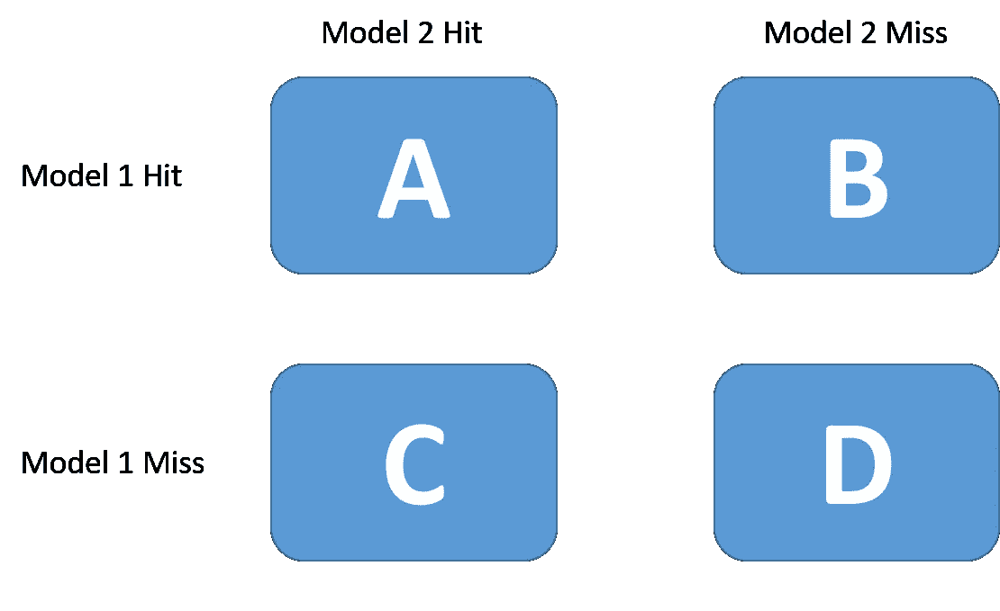

# 用于比较分类算法的统计测试

> 原文：<https://towardsdatascience.com/statistical-tests-for-comparing-classification-algorithms-ac1804e79bb7?source=collection_archive---------6----------------------->

## 回顾开创性的论文和实施，为您的数据找到最佳选择


照片由[алексарцибашев](https://unsplash.com/@lxrcbsv?utm_source=medium&utm_medium=referral)在 [Unsplash](https://unsplash.com?utm_source=medium&utm_medium=referral)

对大多数数据科学家来说，比较预测方法以确定哪种方法应该用于手头的任务是一项日常活动。通常，人们会有一个分类模型池，并使用交叉验证来验证它们，以确定哪一个是最好的。

然而，另一个目标不是比较分类器，而是学习算法本身。这个想法是:给定这个任务(数据)，哪种学习算法(KNN，SVM，随机森林等)将在大小为 D 的数据集上生成更准确的分类器？

正如我们将看到的，这里介绍的每种方法都有一些优点和缺点。然而，使用两个比例测试的第一直觉会导致一些非常糟糕的结果。

为了更多地了解我们如何比较这些算法，并提高我们的统计知识，今天我将解释和实现来自用于比较监督分类学习算法的[近似统计测试](https://direct.mit.edu/neco/article-abstract/10/7/1895/6224/Approximate-Statistical-Tests-for-Comparing) [1]的方法，这是一篇关于该领域的开创性论文。

在接下来的部分中，我将描述每个测试，讨论它的优点和缺点，实现它们，然后将结果与可用的实现进行比较。

这篇文章的笔记本可以在 [Kaggle](https://www.kaggle.com/tiagotoledojr/statistical-tests-for-comparing-classfiers) 和我的 [Github](https://github.com/TNanukem/paper_implementations/blob/main/Approximate%20Statistical%20Tests%20for%20Comparing%20Supervised%20Classification%20Learning%20Algorithms.ipynb) 上找到。

# 初始代码设置

对于本文中的代码，我们将使用两种分类算法:KNN 和随机森林来预测葡萄酒数据集[2]上的葡萄酒质量，该数据集来自 UCI 机器学习库，可在 sklearn 包中免费获得。为此，我们将导入一些必需的库，并将实例化算法:

```
# Importing the required libs
import numpy as np
import pandas as pd

from tqdm import tqdm
from scipy.stats import norm, chi2
from scipy.stats import t as t_dist
from sklearn.datasets import load_wine
from sklearn.metrics import accuracy_score
from sklearn.ensemble import RandomForestClassifier
from sklearn.neighbors import KNeighborsClassifier
from sklearn.model_selection import train_test_split, KFold

*# Libs implementations*
from mlxtend.evaluate import mcnemar
from mlxtend.evaluate import mcnemar_table
from mlxtend.evaluate import paired_ttest_5x2cv
from mlxtend.evaluate import proportion_difference
from mlxtend.evaluate import paired_ttest_kfold_cv
from mlxtend.evaluate import paired_ttest_resampled# Getting the wine data from sklearn
X, y = load_wine(return_X_y = True)# Instantiating the classification algorithms
rf = RandomForestClassifier(random_state=42)
knn = KNeighborsClassifier(n_neighbors=1)*#* For holdout cases
X_train, X_test, y_train, y_test = train_test_split(X, y, test_size=0.20, random_state=42)
```

# 两比例检验

比较两个比例是一个非常古老的问题，统计学有一个经典的假设检验来解决这个问题:给定两个人口的两个比例，零假设是两个比例之差的均值等于零。

我们可以用下面的统计数据来计算:


两比例检验统计量

看起来很简单，对吧？我们只是得到我们算法的命中比例(准确率)并进行比较。然而，这个测试有一个重要的假设:样本的独立性。

可以很快猜到，这里的样本不是独立的，因为两种算法的测试集和训练集是相同的。所以这个假设是错误的。

这种方法还有另外两个问题:

*   它没有考虑测试集的方差。如果我们改变它，我们可能会有非常不同的结果
*   它不考虑整个数据集，而是考虑被选择用于训练的一个较小的数据集

要使用该测试，可以使用以下代码:

```
# First we fit the classification algorithms
rf.fit(X_train, y_train)
knn.fit(X_train, y_train)# Generate the predictions
rf_y = rf.predict(X_test)
knn_y = knn.predict(X_test)# Calculate the accuracy
acc1 = accuracy_score(y_test, rf_y)
acc2 = accuracy_score(y_test, knn_y)# Run the test
print("Proportions Z-Test")
z, p = proportion_difference(acc1, acc2, n_1=len(y_test))
print(f"z statistic: **{**z**}**, p-value: **{**p**}\n**")
```

在这里，我们只是在拒不接受的测试集上拟合算法，并对结果精度进行测试。

# 重采样配对 t 检验

为了说明测试集的方差，可以使用重采样的配对 t 检验。在这个测试中，我们将设置一些试验(例如 30 次),并使用维持测试集在每次试验中测量每个算法的准确性。

然后，如果我们假设 p_i = pA_i - pB_i，对于每个试验 *i* 是正态分布的，我们可以应用配对学生的 t-检验:


配对 t 检验统计量

因为在每一次试验中，我们都要改变我们的测试集，它的方差被考虑在内，改进了前一次试验中的一个问题。然而，我们手中仍有一些问题:

*   p_i 的正态分布不成立，因为这些比例不是独立的，因为它们是在同一测试集上计算的
*   每次试验的训练集和测试集之间都有重叠，所以 p_i 不是独立的
*   它要求我们的算法被拟合多次，如果拟合时间太长，这可能是禁止的

对于这个实现，我们将定义创建一个函数，它将接收 p_is 作为参数:

```
def paired_t_test(p):
    p_hat = np.mean(p)
    n = len(p)
    den = np.sqrt(sum([(diff - p_hat)**2 for diff **in** p]) / (n - 1))
    t = (p_hat * (n**(1/2))) / den

    p_value = t_dist.sf(t, n-1)*2

    return t, p_value
```

在这个函数中，我们只是根据等式从测试中创建 t 统计量。然后，我们使用 scipy 中学生的 t 分布来找出测试的 p 值，然后返回统计数据和 p 值。

运行重采样 t-test 的代码如下:

```
n_tests = 30

p_ = []
rng = np.random.RandomState(42)
for i **in** range(n_tests):
    randint = rng.randint(low=0, high=32767)
    X_train, X_test, y_train, y_test = train_test_split(X, y, test_size=0.20, random_state=randint)
    rf.fit(X_train, y_train)
    knn.fit(X_train, y_train)

    acc1 = accuracy_score(y_test, rf.predict(X_test))
    acc2 = accuracy_score(y_test, knn.predict(X_test))
    p_.append(acc1 - acc2)

print("Paired t-test Resampled")
t, p = paired_t_test(p_)
print(f"t statistic: **{**t**}**, p-value: **{**p**}\n**")
```

这里，我们将迭代次数定义为 30 次，对于每一次迭代，我们分割数据，拟合分类器，然后计算精确度之间的差异。我们将这个值保存在一个列表中，然后用这个列表调用上面定义的函数。

Mlxtend 库已经实现了这个测试，因此也可以使用:

```
print("Paired t-test Resampled")
t, p = paired_ttest_resampled(estimator1=rf, estimator2=knn, X=X,y=y, random_seed=42, num_rounds=30, test_size=0.2)
print(f"t statistic: **{**t**}**, p-value: **{**p**}\n**")
```

请注意，我们必须传递该函数的整个训练集，因为它将在自身内部创建拆分。您可以验证给定相同种子的结果是否相同。

# 交叉验证配对 t 检验

这个方法的结构与上面的方法相同。然而，我们将使用 *K* 折叠进行交叉验证，而不是在每次试验中使用坚持测试集。

这将消除重叠测试集的问题，因为现在每个样本都将针对不同的数据进行测试。

然而，我们仍然有重叠的训练数据问题。在 10 重交叉验证中，每轮训练与其他轮训练共享 80%的训练数据。

此外，我们仍然有一个时间问题，因为我们必须适应我们的分类器几次。然而，通常少于重采样配对 t 检验，因为通常运行 10 倍或 5 倍交叉验证，这比我们以前做的 30 次检验要小得多。

对于这个测试，我们将使用我们在之前的测试中定义的相同函数，因为它无论如何都将是一个 t 测试，我们只需要改变我们在循环的每次迭代中划分数据的方式(当然，还有循环的迭代次数)。使用 sklearn 库中的 KFold，我们可以:

```
p_ = []

kf = KFold(n_splits=10, shuffle=True, random_state=42)
for train_index, test_index **in** kf.split(X):
    X_train, X_test, y_train, y_test = X[train_index], X[test_index], y[train_index], y[test_index]
    rf.fit(X_train, y_train)
    knn.fit(X_train, y_train)

    acc1 = accuracy_score(y_test, rf.predict(X_test))
    acc2 = accuracy_score(y_test, knn.predict(X_test))
    p_.append(acc1 - acc2)

print("Cross Validated Paired t-test")
t, p = paired_t_test(p_)
print(f"t statistic: **{**t**}**, p-value: **{**p**}\n**")
```

Mlxtend 也有针对此测试的实现:

```
t, p = paired_ttest_kfold_cv(estimator1=rf, estimator2=knn, X=X, y=y, random_seed=42, shuffle=True, cv=10)
print(f"t statistic: **{**t**}**, p-value: **{**p**}\n**"
```

# 麦克内马试验

这种测试的优点是，我们的每种算法只需要一次拟合。我们使用一个维持集来拟合它们，然后创建一个列联表:



麦克纳玛的应急表。由作者开发。

然后，我们陈述两种算法应具有相同错误率的零假设，并用以下统计量进行卡方检验:


麦克内马检验统计量

在 paper benchmarks 测试中，与其他测试相比，该测试在错误率方面排名第二，仅次于我们将在下面看到的 5x2 交叉验证测试。正因为如此，作者说，如果你负担不起交叉验证，就应该使用这种方法。

然而，这仍然存在问题:

*   该测试没有考虑训练集的变化，因为我们只适合一次
*   因为我们只适合一次，所以我们不考虑内部算法的变化
*   我们使用比原来更小的一套。但是，请注意，这里的每个测试都会受到影响

为了实现测试，我们将创建一个专用函数:

```
def mcnemar_test(y_true, y_1, y_2):
    b = sum(np.logical_and((knn_y != y_test),(rf_y == y_test)))
    c = sum(np.logical_and((knn_y == y_test),(rf_y != y_test)))

    c_ = (np.abs(b - c) - 1)**2 / (b + c)

    p_value = chi2.sf(c_, 1)
    return c_, p_value
```

在这里，我们只是计算列联表中的值，看看模型在哪里有正确或不正确的答案。然后，我们查看卡方分布，找出我们计算的统计数据的 p 值。

由于这使用了维持集，因此以下步骤很简单:

```
print("McNemar's test")
chi2_, p = mcnemar_test(y_test, rf_y, knn_y)
print(f"chi² statistic: **{**chi2_**}**, p-value: **{**p**}\n**")
```

此外，还可以使用 Mlxtend 库中的实现:

```
print("McNemar's test")
table = mcnemar_table(y_target=y_test, y_model1=rf_y, y_model2=knn_y)
chi2_, p = mcnemar(ary=table, corrected=True)
print(f"chi² statistic: **{**chi2_**}**, p-value: **{**p**}\n**")
```

# 5x2 交叉验证测试

根据作者的基准测试，这个测试被认为是这 5 个测试中最好的一个。

这个想法是运行 2 重交叉验证 5 次，产生 10 个不同的估计。然后，我们定义以下比例:


5x2 交叉验证测试参数

最后是统计数据:


5x2 交叉验证测试统计

这里最大的缺点是我们必须多次调整算法。

该论文对该方法有更全面的描述和推导，所以我建议阅读它以获得全面的理解。

最后，为了实现它，我们将创建一个函数:

```
def five_two_statistic(p1, p2):
    p1 = np.array(p1)
    p2 = np.array(p2)
    p_hat = (p1 + p2) / 2
    s = (p1 - p_hat)**2 + (p2 - p_hat)**2
    t = p1[0] / np.sqrt(1/5\. * sum(s))

    p_value = t_dist.sf(t, 5)*2

    return t, p_value
```

请注意，我们只是创建所需的值来计算统计数据，然后像往常一样，查看分布来查找 p 值。

然后，我们继续运行双重交叉验证五次:

```
p_1 = []
p_2 = []

rng = np.random.RandomState(42)
for i **in** range(5):
    randint = rng.randint(low=0, high=32767)
    X_train, X_test, y_train, y_test = train_test_split(X, y, test_size=0.50, random_state=randint)

    rf.fit(X_train, y_train)
    knn.fit(X_train, y_train)
    acc1 = accuracy_score(y_test, rf.predict(X_test))
    acc2 = accuracy_score(y_test, knn.predict(X_test))
    p_1.append(acc1 - acc2)

    rf.fit(X_test, y_test)
    knn.fit(X_test, y_test)
    acc1 = accuracy_score(y_train, rf.predict(X_train))
    acc2 = accuracy_score(y_train, knn.predict(X_train))
    p_2.append(acc1 - acc2)# Running the test
print("5x2 CV Paired t-test")     
t, p = five_two_statistic(p_1, p_2)
print(f"t statistic: **{**t**}**, p-value: **{**p**}\n**")
```

我们还有 Mlxtend 实现:

```
print("5x2 CV Paired t-test")
t, p = paired_ttest_5x2cv(estimator1=rf, estimator2=knn, X=X, y=y, random_seed=42)
print(f"t statistic: **{**t**}**, p-value: **{**p**}\n**")
```

我们在两个实现上都得到了与预期相同的结果。

# 结论

重要的是要注意，在这种情况下没有银弹。这里提出的每个测试都有一些优点和缺点，它们都是近似值。但是，请注意，在任何情况下都不应该使用两个比例检验。

给定所需的时间预算，可以应用所有这些测试并比较它们的结果，以尝试对是否应该使用一类算法或另一类算法做出更好的评估。

另一方面，如果感兴趣的算法可以计算它们的粉碎系数(如 SVM、MLP 或决策树)，这些测试可以与统计学习理论的结果一起使用，以确定应该使用哪种算法。但这是一个单独的帖子的讨论。

我强烈建议阅读这篇论文，看看这些基准是如何构建的，它很容易阅读，而且信息量很大。

[1] Thomas G. Dietterich，比较监督分类学习算法的近似统计检验(1998)，*神经计算*1998；10 (7): 1895–1923

[2]利奇曼(2013 年)。https://archive.ics.uci.edu/ml UCI 机器学习库。加州欧文:加州大学信息与计算机科学学院。