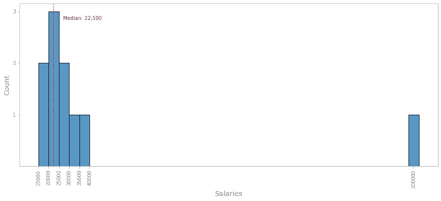
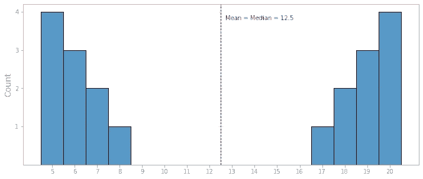
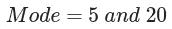

# 统计学#01:平均值、中位数和众数

> 原文：<https://towardsdatascience.com/statistics-01-mean-median-and-mode-d6d8597ed9f1?source=collection_archive---------18----------------------->

## 理解集中趋势的三个最常见的度量

艾萨克·史密斯在 [Unsplash](https://unsplash.com/) 上拍摄的照片

当人们需要得到某事物的“平均值”时，我们通常将所有的数字/项目相加，然后除以有多少个数字/项目。这是对**平均值**的一个简单定义，但是还有其他类型的“平均值”或集中趋势的度量，每一种都有其用途，取决于你想要实现什么。

在本文中，我们将讨论三种最常见的“平均值”，即**表示**、**中值**和**众数**，以及如何使用它们。

# 平均

平均值，也由希腊字母“μ”表示，可能是最常用的集中趋势的量度。前面说过，要计算一组数的均值，需要把它们加在一起，然后除以有多少个数。

假设我们有下面的列表，包含 5 个数字，我们需要找到这些数字的平均值:

我们可以简单地计算:

我们发现平均值是 **14** 。请注意，平均值不必是列表中包含的值之一。

概括地说，我们可以说:

在上面的等式中，n 代表对象的数量或列表的长度，xₙ代表列表中的第 n 个数字。

写这个方程的另一种方法是使用数学求和符号，用 x 代替 x₁+x₂+x₃+…+xₙ:

考虑到值的频率，还有另一种方法来表示平均值。注意，在我们的五个数字 **(5，10，15，15，25)** 的列表中，数字 **15** 出现了两次。

在像我们这样的小列表中，这可能不会产生很大的影响，但当我们处理数百个循环出现的数字时，就值得考虑每个数字的频率。我们只需要将每个数字乘以它的频率，将结果相加，然后将结果除以频率之和。为了举例说明，让我们来看看下面的等式。

为了简单起见，我们可以将均值方程改写为:

其中,∑fx 是数值乘以频率之和，而∑f 是频率之和。

# 中位数

中位数是序列中间的值。这可能是最直接的描述了。但是让我们仔细看看，看看什么时候考虑中位数可能是个好主意。

假设一个房间里有 10 名刚毕业的大学生，我们正在调查刚找到第一份工作的毕业生的平均工资。下面的列表以升序显示了这些人的工资。

如果我们测量这些值的平均值，我们将得到 **$40，500** 作为毕业生的平均工资，正如我们在下面的直方图中看到的。

图一。显示异常值的直方图(图片由作者提供)

但请注意，它并不代表准确的现实，因为 40，500 美元比所有工资都高得多，只有一个例外。为什么会这样？好吧，一个幸运的人一年挣**20 万**美元，并且正在扭曲我们的评估。

看上面的直方图，很明显大部分值都集中在 20000 到 30000 左右，大致如此。但是，有一个值与其他值不兼容。与房间里其他人的工资相比，20 万美元的工资是极端的，可以被称为**异数**。

离群值的一个问题是它扰乱了平均值。直方图中的红色虚线代表房间中的平均工资，40，500 美元，这个值高于我们列表中 10 个工资中的 9 个。异常值正在推高平均值。

在这种情况下，中位数可能会给我们一个更好的数据画面。请记住，中位数是一个序列中间的值。这里，因为我们有偶数个值，所以中值将是两个中间数的平均值。我们去看看。

请注意，中值不必是列表中包含的值之一，就像平均值一样。但是，如果我们有一组奇数值(假设我们去掉了异常值，剩下 9 个值)，中值将是 20，000，这个数字正好在中间。只要记住数字必须按升序排列。

让我们画同样的直方图，但这次，红色虚线代表 10 份薪水的中位数。

图二。显示异常值的直方图(图片由作者提供)

请注意，在这种情况下，中位数比平均数更准确地描述了平均工资。

# 方式

模式可以简单地描述为在数据集中出现最频繁的值。让我们看看如何识别模式，以及它与均值和中值有何不同。

考虑下面的分布，包含 20 个数字。

让我们画一个直方图，来形象化数据集。

图三。显示两组数据的直方图(图片由作者提供)

请注意，我们有一个值大约为 5 和 8 的聚类，还有一个值大约为 17 和 20 的聚类。然而，平均值和中值都是 12.5，与这些值相差甚远。

与均值和中值不同，**的模式**是集合中包含的值之一。在上面的例子中，我们有两种模式， **5 和 20** ，因为它们是数据集中最常见的值。我们可以说我们的数据是双峰的。

## 异常值和偏差数据

最后，让我们简要地看一下一些图表，这些图表说明了异常值会对我们的数据集产生什么影响。

我们已经看到，异常值是数据样本中极端的、异常的观察结果，它们会扭曲数据。当这种情况发生时，我们通常会说我们的数据是**偏斜的**。它可以向右或向左倾斜，这取决于异常值是特别高还是特别低。

请看看下面的图表。

图 4。右偏分布(图片由作者提供)

这是一种右偏分布，当我们出现异常高值时，就会发生这种情况，使平均值向右扭曲。当数据向右倾斜时，平均值将大于中位数。上面的薪水调查是右偏数据的一个例子。

图五。左偏分布(图片由作者提供)

上面的图表代表了一个左偏分布。当我们出现异常低值时，就会发生这种情况，使平均值向左扭曲。当数据向左倾斜时，平均值将低于中位数。

图六。对称分布(图片由作者提供)

最后这张图表显示了一个对称分布。当数据对称时，没有异常值将平均值向左或向右拉。这是均值、中值和众数具有相同值的情况。

# 结论

当然，关于这些主题还可以说得更多，但我希望这篇文章可以帮助您理解均值、中值和众数之间的主要区别，以及异常值和偏差数据的概念。

总而言之，让我们回顾一下我们在这里看到的内容:

## 平均

*   把所有的数字加起来，然后除以有多少个数字。

## 中位数

*   在升序排列的集合中，它是位于中间的值。
*   如果集合中有偶数个值，将中间的两个值相加，然后除以 2。

## 方式

*   列表中最频繁出现的值。
*   一个数据集可以有几种模式。

## 参考

1.  *Griffiths，d,《头部优先统计学:一个有益大脑的指南》。奥莱利，2008 年。*
2.  【https://www.itl.nist.gov/div898/handbook/】**/sema tech 统计方法电子手册，* [*，2012 年。*](https://www.itl.nist.gov/div898/handbook/)*