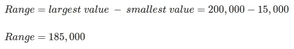
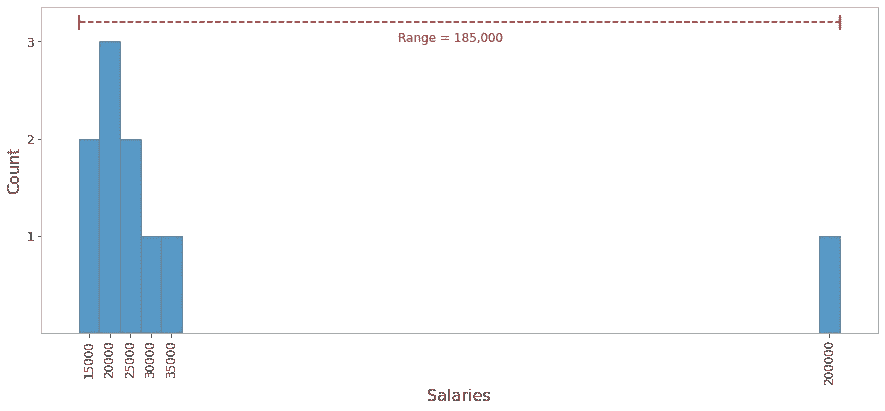
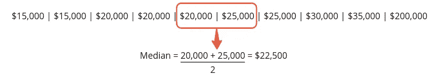
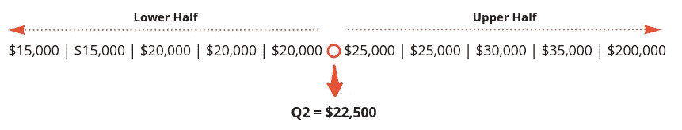
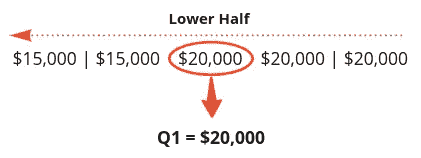
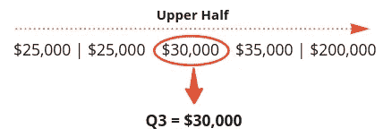
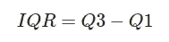
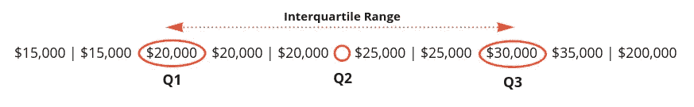
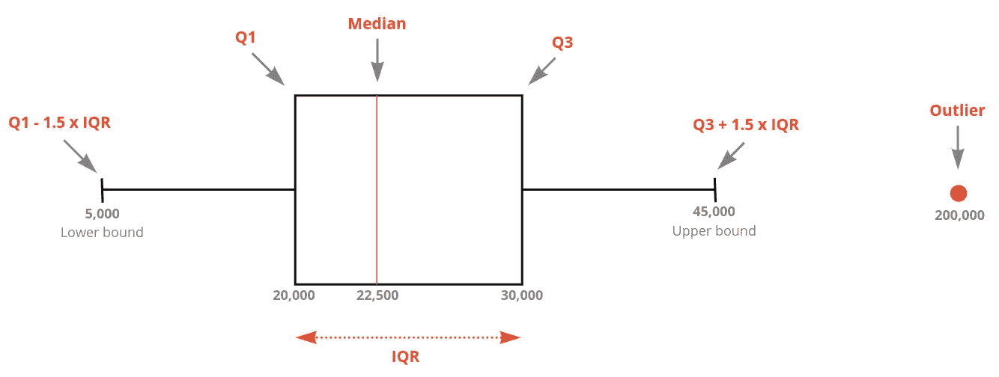
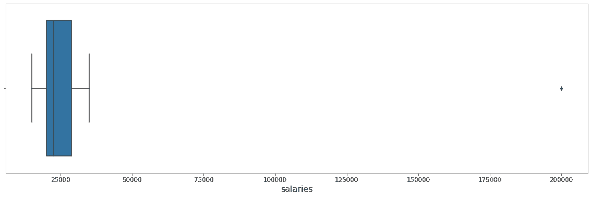

# 统计#02 —测量和可视化数据的传播

> 原文：<https://towardsdatascience.com/statistics-02-measuring-and-visualizing-the-spread-of-data-2fc31d928830?source=collection_archive---------22----------------------->

## 范围、四分位数的概念，以及如何使用 Python 构建盒状图

亨特·哈里特在 [Unsplash](https://unsplash.com/) 上的照片

# 目录

1.  [**范围**](#f3af)
2.  [**四分位数**](#2ae0)
    - [如何确定四分位数](#b7b7)-
    -[四分位数间距](#9dd5)
3.  [**箱型地块**](#0ecc)
    - [解剖箱型地块](#9c23)
    - [用 Python 搭建箱型地块](#2444)
4.  [**结论**](#ebce)

在本系列的第[篇文章](/statistics-01-mean-median-and-mode-d6d8597ed9f1)中，我们研究了最常见的集中趋势、平均值、中值和众数，以及异常值的概念。

然而，这些值可能无法为我们提供分析数据集所需的所有信息。在本文中，我们将开始讨论如何测量和可视化分布中的数据离散度。

# 范围

第一种，也可能是最简单的，测量数据分布的方法是**范围**。它可以通过取集合中的最大值并减去最小值来确定。

让我们考虑上一篇文章中引用的同一个例子。在这种情况下，我们假设我们调查了 10 名应届毕业生的工资，得到了以下数据:

下面是我们如何确定这个集合的范围:

下面的直方图将帮助我们直观地了解值在集合中的分布情况。

图一。显示范围的直方图(图片由作者提供)

请注意，尽管大多数值集中在 **15，000 和 35，000** 附近，但该范围被异常值拉长了。这是因为范围对异常值非常敏感**。**

**如果我们忽略异常值，我们的范围会急剧减少到 **20，000** ，可能会给我们一个更好的数据画面，但是故意忽略数据集中的值不是好的做法。那么我们能做什么呢？**

**我们可以从谈论百分位数的概念开始。考虑到数据是按升序排列的，百分位数将数据集分割成百分之一。举例来说，50ᵗʰ百分位就是中位数**，因为 50%的数据都低于这个标准，而另外 50%则更高。****

****在统计学中，常见的是将数据分成**四分位数**，这代表了数据的四分之一，或者说 25 个百分点。****

# ****四分位数****

****由于四分位数代表四分之一的数据，我们可以将数据集分成 4 个四分位数。****

****第一个四分位数，也称为 **Q1** ，是 25%数据的标志。第二个四分位数， **Q2** ，是中间点，也就是中位数。第三个四分位数， **Q3** 有 75%的数据在它下面。****

## ****如何识别四分位数****

****确定 Q1、Q2 和第三季度非常简单，因为你只需要知道如何找到中位数——记住，有几种方法可以计算四分位数。在这里，我将向您展示其中一个简单且广泛使用的方法。****

****简而言之，下面是如何找到**中位数**(数据集必须是有序的):****

*   ****如果观察的数目是奇数，它就是正中间的那个数。****
*   ****如果观察数是偶数，则是中间两个数的平均值。****

****现在，要找到**四分位数**,您应该执行以下操作:****

1.  ****找到中间值( **Q2** )，将数据切成两半；****

********

****(图片由作者提供)****

********

****(图片由作者提供)****

****2. **Q1** 是数据下半部分的中位数；****

********

****(图片由作者提供)****

****3. **Q3** 是数据上半部分的中位数。****

********

****(图片由作者提供)****

## ****四分位间距****

****另一个需要记住的重要概念是四分位距( **IQR** )。它表示 Q1 和第三季度之间的数据。****

****************

****(图片由作者提供)****

****如您所见，四分位数范围忽略了低于 Q1 和高于 Q3 的值，仅使用数据的中间 50%。这意味着 IQR 对异常值的敏感度远远低于我们在之前的交易中看到的范围。****

# ****箱线图****

****箱线图是一种图表类型，非常适合用来表示集合中的范围和数据离散度。箱形图显示了 Q1、Q2 和 Q3，以及下限和上限，超出这些范围就是异常值。****

## ****箱形图的剖析****

****让我们来看看一个盒子情节的要素。(请注意，该图没有针对我们的数据集进行缩放，它只是一个帮助我们可视化所有元素的示例)****

********

****(图片由作者提供)****

****图表中间的方框显示了中间 50%的数据。它的左边是 Q1，右边是 Q3，里面的红线显示的是中间值。方框的长度代表四分位数范围(IQR)。****

****在盒子外面，两条线在每一边延伸。这些线条经常被称为“须状物”。左须向下扩展到下限(通常计算为 Q1 1.5×IQR)，右须向上扩展到上限(Q3 + 1.5 × IQR)。位于下限和上限之外的所有点都被认为是异常值。****

## ****用 Python 构建盒状图****

****现在，作为一个额外的主题，让我们看看如何使用 Python 构建一个方框图。****

****有几种不同的工具可以用来构建图形和图表。在这里，我使用了 [**matplotlib**](https://matplotlib.org/) ，一个用于可视化的 Python 库。请找到下面的情节和我使用的代码。****

********

****图二。箱线图(图片由作者提供)****

****注意盒子是如何被挤压到左边的。这是因为我们有一个极值，200，000，在图中用一个小的菱形标记表示。顺便提一下，值得一提的是 **matplotlib** 对四分位数的评估与我们稍有不同，但结果是相似的。****

# ****结论****

****无论您只是在寻找一些统计主题的简单解释，还是正在学习如何用 Python 绘制图表，我希望本文能对您有所帮助。未来的文章将深入可变性的度量，描述方差和标准差。如果你对统计学中的其他主题感兴趣，可以查看本系列的第一篇文章，内容包括[均值、中位数和众数](/statistics-01-mean-median-and-mode-d6d8597ed9f1)。****

****总而言之，让我们回顾一下这篇文章中涉及的内容。****

## ****范围****

*   ****测量数据分布的简单方法。****
*   ****它是一个集合中最大值和最小值之差。****
*   ****不太可靠，因为它对异常值非常敏感。****

## ****四分位数****

*   ****将数据分成四份。****
*   ****Q1 代表了一个 25%的数据低于该值的点。Q2 是中间值，Q3 表示 75%点。****
*   ****四分位数范围(IQR)代表 Q1 和第三季度之间的数据。与范围相比，它对异常值远没有那么敏感。****

## ****箱线图****

*   ****一种非常适合显示数据分布的图表。****
*   ****它显示 Q1、Q2 和第三季度，以及下限和上限，以及异常值。****
*   ****Matplotlib 是一个很棒的工具，可以用 Python 构建盒状图。****

****完整代码请参考[笔记本](https://github.com/rmpbastos/data_science/blob/master/_0011_Statistics_02_Measuring_and_Visualizing_the_Spread_of_Data.ipynb)。****

## ****参考****

*****[1]格里菲思，D. Head First 统计学:一个对大脑友好的指南。奥莱利，2008 年。*****

*****【2】https://www.itl.nist.gov/div898/handbook/**[*NIST/sema tech 统计方法电子手册，2012 年。*](https://www.itl.nist.gov/div898/handbook/)*****