# 统计#03 —标准差和方差

> 原文：<https://towardsdatascience.com/statistics-03-standard-deviation-and-variance-9724f33b58df?source=collection_archive---------14----------------------->

## 用 Python 中的几个代码测量数据可变性


托尔加·乌尔坎在 [Unsplash](https://unsplash.com) 上拍摄的照片

# 目录

1.  [**方差**](#a568)
2.  [**标准差**](#016d)
3.  [**结论**](#e279)

在本文中，我们将进一步了解如何度量数据可变性。在接下来的课程中，您将学习**标准差**和**方差**的基础知识。这项工作是本系列的[上一篇文章](/statistics-02-measuring-and-visualizing-the-spread-of-data-2fc31d928830)的一个序列，在那里我们学习了如何测量和可视化数据的传播。

如果你没有看过上一篇文章，不要着急！简而言之，我们检查了数据分散，介绍了范围、四分位数的概念，以及箱线图如何帮助我们可视化数据在数据集中的分布。

根据你的目标，举例来说，有范围、平均值或中位数就足够了。但有时，您可能需要更进一步，分析数据的可变性，即值如何围绕集合的平均值波动。为此，今天我们将学习**方差**和**标准差**的概念。

# 差异

用一句话来说，方差是平均值的平方差的平均值。

为了理解它的意思，让我们先来看一下在以前的文章中使用的相同的数据集，其中我们有一个 10 种工资的列表，如下所示:

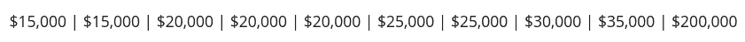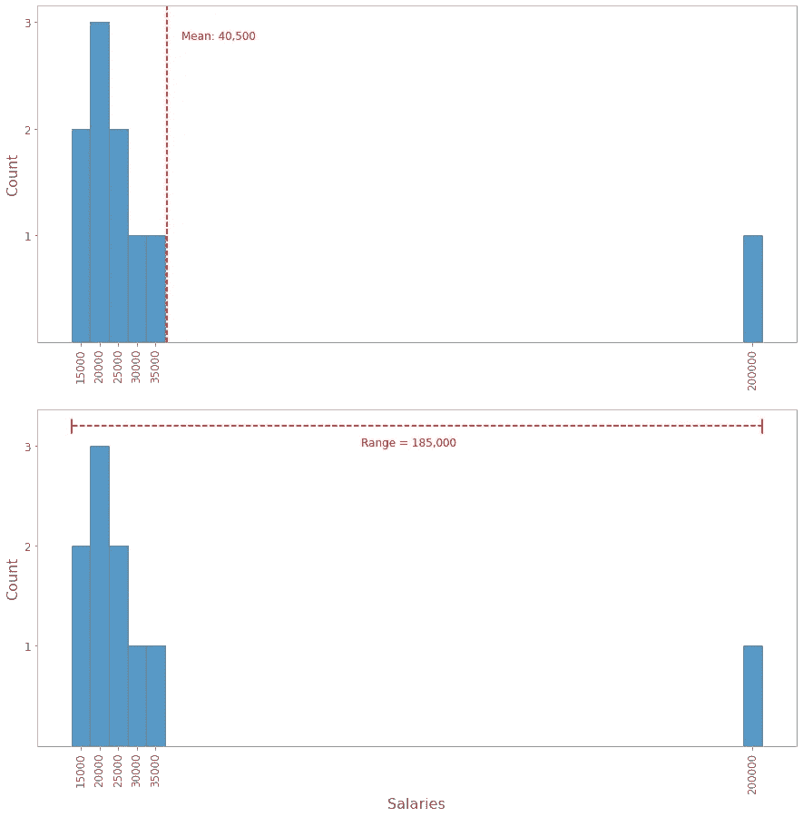

图一。显示平均值和范围的直方图(图片由作者提供)

请注意，大多数值都集中在 15，000 和 35，000 左右，但是有一个 200，000 的极值(异常值)将平均值推高到 40，500，并将范围扩大到 185，000。

现在，回到前面介绍的概念，让我们计算方差。我们将把每个点与平均值之差的平方相加，然后除以集合中值的数量。

记住均值(μ)是 40500。在 **Python** 中，使用名为 **Pandas** 的库，我们可以简单地编写以下代码来获得平均值:

```
DataFrame.mean()
```

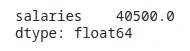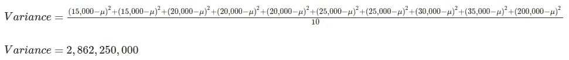

方差通常表示为希腊小写字母*适马*的平方(σ)。求方差的一种方法是使用下面的等式:

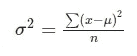

其中 *x* 代表集合中的每一项，μ是平均值， *n* 是集合中的项数。

还有一种更快的方法来找到方差。请检查下面的等式。

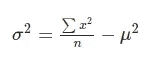

在 Python 中，我们可以使用这一行简单的代码来获得方差。

```
DataFrame.var(ddof=0)
```

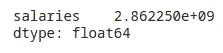

Obs:注意，我使用了参数 *ddof* ，并将其设置为零。别为此费心了。 *ddof* 代表“自由度增量”,我将它设置为零，因为 Python Pandas 给出了由 **n 归一化的方差——ddof**,默认情况下 ddof 定义为 *1* 。

好，现在我们有了方差的值，但是你可能已经注意到它非常大！这是因为方差是用平方值来衡量的。

你应该问问你自己，你能从如此庞大的数字中获得什么样的洞察力！虽然方差被广泛使用，但当我们测量均值附近数据的可变性时，还有另一个更直观的统计概念。那就是**标准差**。

# 标准偏差

在确定方差之后，找到标准差是非常简单的。是方差的**平方根。**

记得方差的符号是σ吗？标准差用σ表示。

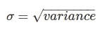

在我们的数据集中，标准偏差将是:

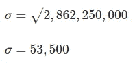

在 Python 中，我们可以这样计算:

```
DataFrame.std(ddof=0)
```

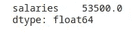

请注意， *53，500* 感觉与我们列表中的值更相关，但这意味着什么呢？

这意味着我们榜单中的平均薪资水平与平均值相差 53500 美元。

数值越接近平均值，标准偏差越小。在我们的例子中，标准差的值被拉长了，因为我们有一个异常值。

现在，为了看看标准差是如何变化的，让我们剔除异常值。我们的薪水清单现在仍然有 9 个值:

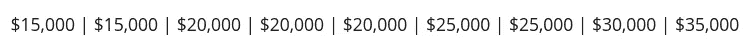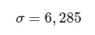

如果没有异常值，标准差的值会急剧下降。考虑到这一组新的值，平均而言，工资将偏离平均值 6，285 美元，在本例中为 22，777 美元。

# 结论

我希望这篇快速的文章可以帮助你理解**方差**和**标准差**的概念。这是介绍统计概念系列的第三篇文章。有兴趣的可以找之前的文章，关于数据离散的，[这里](/statistics-02-measuring-and-visualizing-the-spread-of-data-2fc31d928830)。

让我们回顾一下今天在这里看到的内容。

在统计学中，**方差**和**标准差**帮助我们测量数据的可变性，即值如何围绕平均值波动。

## 差异


*   它是平均值的平方差的平均值。

## 标准偏差


*   它是方差的平方根。
*   通常，比方差更直观。

完整代码请参考[笔记本](https://bit.ly/3BPymwS)。

## 参考

*[1] Griffiths，D. Head First Statistics:一个对大脑友好的指南。奥莱利，2008 年。*