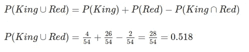

# 统计学#04 —概率介绍

> 原文：<https://towardsdatascience.com/statistics-04-introduction-to-probability-45fcd11c97bf?source=collection_archive---------32----------------------->

## 基本概念，如并集、交集和条件概率，以及维恩图和概率树的可视化

西蒙·伯杰在 [Unsplash](https://unsplash.com/) 上的照片

# 目录

1.  [什么是概率 ](#f4b1)
2.  [**如何计算和显示概率**](#1716)
3.  [**用维恩图可视化概率**](#523b)
4.  [**交集和并集**](#ff07)
5.  [**条件概率**](#73d7)
6.  [**用概率树可视化概率**](#d0b4)
7.  [**结论**](#61b6)

今天，我们将谈论概率。如果你正在开始你的统计学研究，或者如果你只是想回忆一些基本概念，这个系列是为你准备的！

# 概率是什么？

一句话，概率就是某件事发生的可能性有多大。

例如，当你早上离家前查看天气预报应用程序时，应用程序显示今天将是一个阳光明媚的日子，下雨的可能性只有 5%，你可能不会带雨伞或雨衣，因为不太可能下雨。这并不是不可能的，因为天气预报并不总是准确的，即使它显示 0%的降雨机会，也可能会下雨。它们是通过收集大量关于温度、湿度、风等数据做出的预测，以确定大气条件在未来可能如何演变。

因此，概率可以帮助人们和公司根据收集的数据和过去的经验，考虑预测的结果，做出明智的决定。

# 如何计算和显示概率

首先，我们来看一个可以进行概率性思考的最简单的例子:抛硬币。

当你掷硬币时，只有两种可能的结果(**事件** ): *正面*或*反面*。对于一枚标准硬币，这两个事件发生的可能性相等，即我们有 50%的机会得到正面，50%的机会得到反面。

在本例中，这两个可能的事件可以表示为:

*   *P(正面)* —硬币落在正面的概率
*   *P(尾部)* —硬币落在尾部的概率

例如，如果我们想要找到 *P(人头)*，我们需要将*人头*出现的方式数除以结果总数，如下所示:

概率可以表示为分数、小数或百分比，只要所有概率的总和等于 1 或 100%。在这种情况下，我们可以说 ***P(头)*** = **1/2** 或 **0.5** 或 **50%** 。

概括地说，考虑下面的等式:

在哪里

*   *P(A)* 是事件 *A* 发生的概率；
*   *n(A)* 是 *A* 可能发生的方式数；
*   *n(S)* 为结果总数。

结果总数也被称为**样本空间**，这里用字母 **S** 表示。

在每本统计书中都能找到的另一个常用符号是互补事件**(A**′**)**。

**P(A**′)是事件 **A** 不发生的概率，可以表示为:

在我们的例子中，*正面朝着* **而不是**的概率也是 50%。

# 用维恩图可视化概率

可视化概率的一个简单方法是使用[文氏图](https://en.wikipedia.org/wiki/Venn_diagram)。文氏图可以帮助我们可视化的概率每一个事件，以及他们的交集和样本空间。

作者图片

请注意，上面的文氏图直观地为我们提供了关于概率的有价值的信息。它显示了两个圆圈，代表抛硬币后正面或反面的概率。观察两个圆是分开的，因为这两个事件没有交集，也就是一个硬币不能正面和反面都朝上落地。

这意味着这两个事件(正面和反面)是**互斥的**。

请注意，我们的图中也表示了样本空间。这里，头尾覆盖了整个样本空间内的所有事件，除此之外没有其他可能的事件，用*零*表示。意思是头和尾都是**集合穷举**事件。

既然我们讨论了互斥事件，现在让我们展示一个事件**和**相交的图表。

假设我们从一副牌中随机抽取一张牌。挑到的牌是红套 k 的概率有多大？让我们考虑一副包含 54 张牌的牌，分为 4 种花色——**黑桃**和**梅花** **(黑色)**、**红心**和**方块** **(红色)**。每种花色包含从 2 到 10 的牌，一张 j，一张 q，一张 k 和一张 a。此外，我们还有两个未着色的小丑。

那么，我们如何画一个维恩图来帮助我们形象化得到一张红套 k(红心或方块)的概率呢？

作者图片

这个例子比硬币的例子要复杂一点。54 张牌中有 4 张是国王，54 张牌中有 26 张是红套。然而，这些事件可以同时发生，我们有 2 种可能性来选择一张既是国王又是红色花色的牌，代表大约 4%的可能性。

请注意，这一次我们有一个圆圈外的值(0.481)。它表示所选的牌既不是国王也不是红色套装的概率。

# 交集和并集

为了理解交集和并集的概念，让我们继续看最后一个例子。我们已经知道 *P(国王)*和 *P(红色)*，如下图:

我们可以把这张牌是国王**和**红色(国王和红色的交集)的概率写成如下:

有了这些信息，我们可以确定另一个值。这张牌成为国王**或**红色的概率(A 和 B 的结合):

# 条件概率

这是事情开始变得更有趣的地方！当我们将一个条件应用于某个概率时，我们试图确定一个事件 *A* 发生的概率，**假定**另一个事件 *B* 已经发生。

一个条件概率可以表示为 **P(A|B)** ，我们可以使用下面的等式找到它:

更进一步，我们现在有了另一种方法来寻找两个事件之间的交集:

或者

由于 *P(A∩B) = P(B∩A)* 。

# 用概率树可视化概率

当我们处理条件概率时，用文氏图来形象化它们会变得很棘手。这时候概率树就派上用场了。概率树的基本结构如下:

作者图片

现在，让我们考虑一下我们之前做的卡片组练习，但这次我们做了一点改变。假设我们已经知道我们拿着一张红牌。这张牌是王的概率有多大？概率树如何帮助我们形象化它？

首先，让我们应用条件概率的等式。请注意，我们正试图测量 *P(King)* **，假设**牌来自红色套装。

现在让我们检查概率树:

作者图片

注意概率树是如何帮助我们理解我们正在处理的概率的。请记住，这是一个非常简单的例子，为了更好地理解，这些值被四舍五入了。根据您试图预测的事件，树表示可能有几个不同的附加分支。

# 结论

我希望这篇文章能帮助你快速掌握概率，如何计算它们，以及如何利用维恩图和概率树来可视化你正在处理的概率。

这并不是概率论的详尽材料。如果你想更深入地研究这个主题，更进一步的是学习其他关键理论，比如全概率定律和 T2 贝叶斯定理。

总结一下，我们来复习一下今天看到的内容。

## 计算概率

*   事件 **A** 发生的概率是 **A** 可能发生的方式数除以可能结果的总数。
*   互斥事件不能同时发生(像头和尾)。
*   事件**和**的补充是事件没有发生。 **A** 不发生的概率用 P(A’)表示。

## 交集

*   事件**A**和 B 发生的概率是 **A** 和**B**的交集
*   用 *P(A∩B)* 来表示。
*   如果 A 和 B 是互斥事件， *P(A∩B)=0。*

## 联盟

*   事件**A**或 B 发生的概率是 **A** 和**B**结合的概率
*   用 *P(A∪B)* 表示。

## 条件概率

*   这是事件 **A** 发生的概率，假设事件 **B** 已经发生。
*   用 *P(A|B)* 来表示。

## 可视化概率

*   维恩图是可视化概率的好方法。它可以显示样本空间中所有事件的概率，以及它们的并集和交集。
*   概率树对于可视化复杂的概率更有用，例如，当条件适用时。

## 参考

*【1】格里菲思 D. Head First 统计学:一个对大脑友好的指南。奥莱利，2008 年。*