# 统计学 101:二项式分布

> 原文：<https://towardsdatascience.com/statistics-101-the-binomial-distribution-a2822c6e37e5?source=collection_archive---------23----------------------->

## 解释了二项式分布以及如何在 R 中找到它的概率

埃里克·麦克林在 [Unsplash](https://unsplash.com?utm_source=medium&utm_medium=referral) 上的照片

由一系列相同且独立的试验组成的试验，产生两种结果中的一种，称为二项式试验。遵循二项式分布的事件示例有

*   抛硬币时的头数 *n* 次
*   掷骰子时的六个数 *n* 次
*   在大样本人群中喜欢巧克力口味冰淇淋的人群比例

二项分布是最常见的统计分布之一。在这篇文章中，我将解释它的统计理论，并展示如何在 r 中找到二项式概率。

# 属性和定义

二项式实验具有以下特性:

*   由固定数量的*、*、**相同的**和**独立的**试验组成
*   每次试验都有两种结果，成功或失败
*   每次试验成功的概率等于某个值 *p* ，失败的概率等于 *q = 1 — p*
*   感兴趣的随机变量是 *Y* ，观察到的成功次数为 *n* 次试验

二项式分布的定义是:

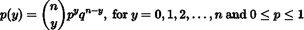

其中 *y* 为观察到的成功次数， *n* 为试验次数， *p* 为成功概率， *q* 为失败概率(1- *p* )。

假设我们将一枚公平的硬币抛两次，然后数它有多少次正面朝上。可能的结果是 0、1 或 2 次。通过将这些值代入公式，我们可以计算出恰好得到 0、1 和 2 个头的概率。(如果硬币是公平的，正面的概率是 0.5。)

抛硬币两次(n = 2)时，没有正面(y = 0)的概率是:

抛两次硬币(n = 2)得到 1 个正面(y= 1)的概率是:

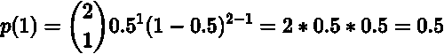

掷硬币 2 次(n = 2)时，得到 2 个正面(y = 2)的概率是:

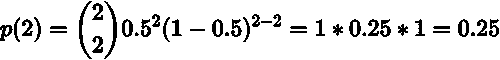

# 可视化二项式概率

我们可以将概率绘制成柱状图。分布的形状看起来类似于正态分布，但是很难用如此少的观测值来确定。

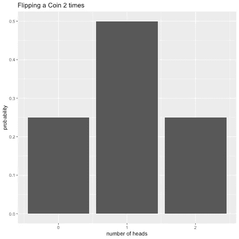

作者图片

如果我们把抛硬币的次数增加到 10 次，我们可以看到一个更明显的形状。当 *p* 为 0.5 时，概率近似正态分布。然后 *p* 小于 0.5，分布向左居中，当 *p* 大于 0.5 时，分布向右居中。

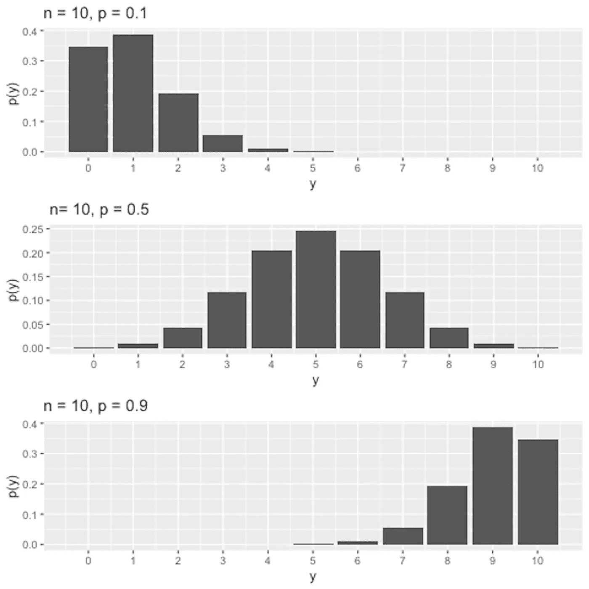

作者图片

# 二项分布的期望值和方差

如果变量遵循二项式分布，我们可以计算参数如下:

*   期望值， *E(Y) = np*
*   方差， *Var(Y) = np(1-p)*
*   标准差，*SD = sqrt(Var)= sqrt(NP(1-p))*

如特定可能结果的二项式概率直方图所示，我们实验中的观察值将围绕期望值:在 10 次试验中，概率为 0.1 时大约 1 次成功，在 10 次试验中，概率为 0.5 时大约 5 次成功，在 10 次试验中，概率为 0.9 时大约 9 次成功。这在直觉上也是有意义的，如果成功的概率只有 0.1，我们预期观察到的成功很少。如果概率是 0.5，我们期望在大约一半的试验中观察到成功。而如果成功的概率高达 0.9，我们期望观察到很多成功。

# R 中的二项分布

r 有内置的统计分布，所以很容易计算特定的概率，分位数和从统计分布生成随机数。让我们来看看不同的函数，看看它们产生了什么。

**dbinom:求概率 P(X = x)**

dbinom 函数返回特定随机变量( *x)* 、试验次数(*大小)、*和每次试验成功概率( *prob)的二项式分布的*概率密度函数(pdf)* 的值。*概率密度函数计算特定次数成功的概率。

例:我们将一枚硬币抛 10 次，有多少概率恰好 3 次正面朝上？

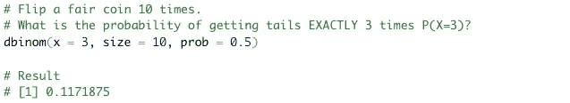

作者图片

例:我们掷一枚公平的硬币 10 次，每种可能结果的概率是多少？(这些是上面直方图中绘制的概率。)

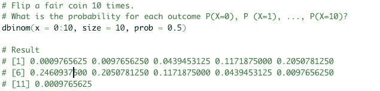

作者图片

**pbinom:求概率 P(X ≤ x)**

pbinom 函数返回某个随机变量( *q)* 、试验次数(*大小)*和每次试验成功概率(*概率)*的二项式分布的*累积密度函数(cdf)* 的值。累积密度函数给出了二项式分布中给定值( *q)* 左侧(或右侧)的面积。

*举例:我们将一枚公平硬币抛 10 次，得到至少 3 个头 P(X≤3)的概率是多少？*

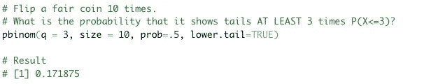

作者图片

*举例:我们将一枚公平硬币抛 10 次，得到 3 个或 3 个以上人头 P(X≥3)的概率是多少？*

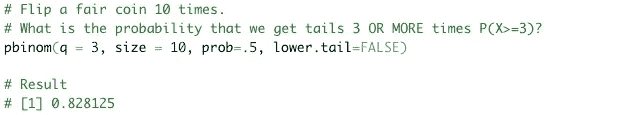

作者图片

**qbinom:求分位数**

qbinom 求二项式分布的第 p 个分位数。

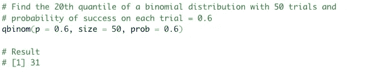

作者图片

**rbinom:从二项式分布中生成随机数**

rbinom 函数生成长度( *n)* 、试验次数(*大小)*和成功概率(*概率)*的二项分布随机变量的向量。

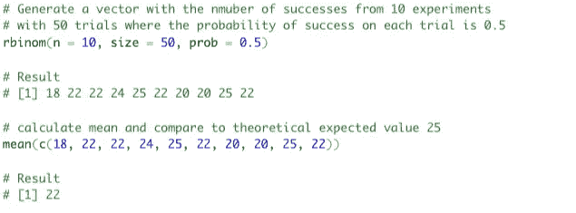

作者图片

# 何时使用二项式分布，何时用其他分布近似

## 正态分布

如上所述， *p* 为 0.5 时的二项式分布是对称的，大致呈正态分布。对于少量的 *n* 来说，该分布已经采用了标准形式。当分布偏斜时(当 *p* 大于或小于 0.5 时)， *n* 必须大得多才能接近正态分布。作为指导原则，如果 np(1-p) > 5，则可以用正态分布来近似二项分布。

## 泊松分布

如果 *n* 很大并且 *p* 接近于 0，你可以用泊松分布来近似，因为二项式概率函数实际上收敛于泊松分布。这里的一个粗略准则是，当 *n* 大， *p* 小并且泊松参数 lambda (lambda = np)小于 7 时，泊松概率可以近似于二项式概率。

## 超几何分布

最后，我们应该考虑抽样投票人口或客户偏好的例子，因为这是应用二项式分布的常见情况。假设一大群人中有 30%的人偏爱素食。随机选择 10 个人作为样本，观察喜欢素食的人数。对于第一个被抽样的人，他们喜欢素食的概率是 0.3。现在要评估的关键是下一个被选中的人偏好素食的条件概率。请记住，二项式试验的一个特性是，每次试验的成功概率是相同的。如果人群很大，样本量相对较小，那么在以后的试验中成功的条件概率将大致保持不变。但是如果人口是一个 20 人的班级，那么相对于人口规模，我们的样本规模是非常大的。这意味着在以后的试验中选择一个偏爱素食的人的条件概率会因样本中早先选择的人的偏爱而大大改变。这将不再是一个二项式实验。当样本量相对于总体量较大时，应使用超几何概率分布。

如果你喜欢阅读这样的故事，并想支持我成为一名作家，考虑注册成为一名媒体会员。每月 5 美元，你可以无限制地阅读媒体上的故事。如果你注册使用我的链接，我会赚一小笔佣金。

 [## 通过我的推荐链接加入 Medium-Andrea gustaf sen

### 作为一个媒体会员，你的会员费的一部分会给你阅读的作家，你可以完全接触到每一个故事…

medium.com](https://medium.com/@andreagustafsen/membership)