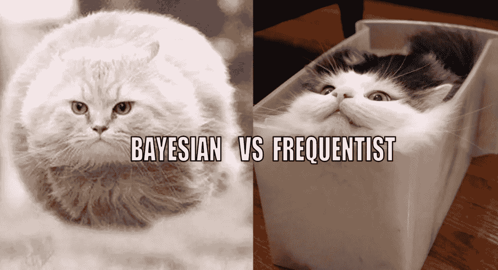

# 统计学:你是贝叶斯主义者还是频率主义者？

> 原文：<https://towardsdatascience.com/statistics-are-you-bayesian-or-frequentist-4943f953f21b?source=collection_archive---------1----------------------->

## 诊断统计一致性的最快方法

如果我告诉你，我可以通过一次抛硬币向你展示贝叶斯统计和频率统计之间的区别，会怎么样？

在我们继续之前，演示在[视频形式](https://www.youtube.com/watch?v=GEFxFVESQXc&list=RDCMUCbOX--VOebPe-MMRkatFRxw&start_radio=1&rv=GEFxFVESQXc&t=3)中效果最好，所以在你看过之前不要看下面的摘要和剧透。如果有些术语不熟悉，我会链接友好的解释来帮助你。

为什么这些猫的照片？在左边，都是关于透视的。右边，都是不动的量。但最重要的是，我需要一些东西来保护你的眼睛免受下面剧透的影响，直到你看过[的视频](https://www.youtube.com/watch?v=GEFxFVESQXc&list=RDCMUCbOX--VOebPe-MMRkatFRxw&start_radio=1&rv=GEFxFVESQXc&t=3)。

# 摘要

在视频中，有一个瞬间我问你，**“我手里的硬币正面朝上的概率是多少？”**硬币已经落地了，我在看着，只是你还看不到。你在那一刻给出的答案是一个强烈的暗示，表明你是倾向于贝叶斯思维还是频率主义思维。
**常客:** *“没有概率。我可能不知道答案，但这并不能改变一个事实，如果硬币正面朝上，概率是 100%，如果硬币反面朝上，概率是 0%。”*
**贝叶斯:** *“对我来说，概率是 50%！对你来说，它是你的一切。”*

只有坚持认为[参数](http://bit.ly/quaesita_vocab)不是[随机变量](http://bit.ly/quaesita_distributions) (Frequentist)才有意义谈论你的方法提供 ***正确*** 答案的能力。一旦你让参数成为随机变量(贝叶斯)，就不再有任何对错的概念。只有你个人的观点。

**频数:**[参数](http://bit.ly/quaesita_vocab) **是** **而不是**一个[随机变量](http://bit.ly/quaesita_distributions)。
**贝叶斯:**[参数](http://bit.ly/quaesita_vocab) **是**的一个[随机变量](http://bit.ly/quaesita_distributions)。

一个字，巨大的差异。让我们仔细看看。

# 频繁主义者对贝叶斯

## 哪些词告诉你你在和谁打交道？

有哪些行话告诉你，你已经踏入了他们的领地？
**频数主义者:**置信区间，p 值，功效，显著性
**贝叶斯:**可信区间，先验，后验

## 他们的目标是什么？

他们用统计数据来改变他们对什么的看法？
**Frequentist:** 要采取的行动(默认行动，见[本解释](http://bit.ly/quaesita_damnedlies) )
**Bayesian:** 意见要有(先验信念)

## 主要区别是什么？

**频数:**[参数](http://bit.ly/quaesita_vocab)是一个固定量(关于它没有概率)
**贝叶斯**:[参数](http://bit.ly/quaesita_vocab)是一个[随机变量](http://bit.ly/quaesita_distributions)(没有正确答案)

## 对你有什么好处？

加入他们的思维方式，你有什么收获？
**【frequent ist:**谈论你的方法的质量和“得到正确的答案”是有意义的
**贝叶斯:**直观的定义，例如可信区间是你希望的置信区间(但不是！)

## 你放弃了什么？

如果你选择了他们那边，你会失去什么？
**频繁主义者:**核心概念更难理解(例如 [p 值](http://bit.ly/quaesita_pesky)和置信区间有反直觉的、冗长的定义)，懒惰的思考者经常把它们搞得一团糟。
**贝叶斯:**你失去了谈论任何“正确答案”和“方法质量”概念的能力——没有统计显著性或[拒绝空值](http://bit.ly/quaesita_statistics)这样的东西。从你的角度来看，只有“更有可能”和“不太可能”。

> 如果没有固定的正确答案，就没有错误的答案。

# 那么，哪个更好呢？

问题错了！选择哪一个取决于你想如何做决策。例如，如果您没有[默认操作](http://bit.ly/quaesita_damnedlies)，请使用贝叶斯方法。没有默认的行动，频率主义者的方法不如贝叶斯方法实用，除非你有特殊的哲学理由在你的计算中调用真理的概念。

(注意:最后三个字很重要。我们不是在谈论一般意义上的真理概念，而是在推动这些统计方法的数学中如何处理它。这两个阵营之间的区别归结为您是否将感兴趣的参数视为固定常数。)

## 好吧…那么哪个更客观呢？

都不是！它们都是基于假设的，所以从根本上说是主观的。参见[这篇关于假设的文章。](http://bit.ly/quaesita_saddest)

关键的区别在于，一旦决策背景已经形成，它们如何协助决策。

## 等等，样本量呢？贝叶斯不是小数据的必经之路吗？

如果你一直和那些 ***“如果有大量数据，则是频率主义者；如果没有数据，则是贝叶斯主义者”*** 的人混在一起，你可能会被说服，你应该让样本大小来决定选择哪个阵营。唉，如果你戳破他们建议背后的理由，就会变得不可靠。

是的，常客们确实拒绝 babby 数据集。如果你的手指比例子多，他们几乎肯定会告诉你不要麻烦。(了解更多[这里](http://bit.ly/quaesita_yesbutton)。)

是的，这是真的，如果你采取贝叶斯方法，你可以进行少到一个(！)数据点。数学检查过了。当然可以。你能做到的。

…但是*应该*你吗？

允许处理少量数据可能是一个缺陷，而不是一个特性。有些情况下，你肯定不想这么做。(统计不是炼金术。我们不是凭空造金。不管你向哪个学派宣誓效忠，在一个数据点上有相同数量的数据。)

> 允许处理少量数据可能是一个缺陷，而不是一个特性。

“需要更少数据”的方法是做出更大的[假设](http://bit.ly/quaesita_saddest)(这适用于两种哲学)……所以，当你的主要成分不是数据，而是你编造的一些废话时，一定要花点时间思考你的结论的营养内容。如果你在处理微小的数据时过于认真，专业的贝叶斯主义者和常客一样会忘记他们的差异，以至于以你为代价捧腹大笑。

## 凯西，你会害死我们的。你是贝叶斯主义者还是频率主义者？

都是！我根据我如何制定决策来选择。这取决于情况是要求在行动之间做出选择还是形成基于证据的观点。

# 我应该选一边吗？

我建议不要只参加一个阵营(除非你已经花了几年时间思考统计哲学，并且你愿意死在这座山上)。

老实说，宣称自己是这样或那样的有点傻，除非你已经非常深入地思考过它们。我有幸在杜克大学完成了我的研究生工作(这对于贝叶斯统计大约相当于梵蒂冈对于天主教)，我注意到关于贝叶斯统计优越性的最大声的不是教授们…而是那些新学生们，他们松了一口气，不用再去记忆怪异的频率主义者置信区间的定义了(贝叶斯可信区间要容易得多)。教授们明白“更好”取决于你为什么要努力去做。他们花大量时间用贝叶斯方法思考，因为这符合他们感兴趣的决策方法。所以，我的建议是？不要选边站。将它们视为适合两种不同决策和推理风格的两种不同方法，然后让自己选择使用哪一种适合自己所处的心态/环境。

# 了解更多信息

*   8 分钟统计简介:【http://bit.ly/quaesita_statistics 
*   统计思维课程播放列表:【http://bit.ly/statthinking 
*   关于 p 值的争议:[http://bit.ly/quaesita_needles](http://bit.ly/quaesita_needles)

# 放弃

[视频演示](https://www.youtube.com/watch?v=GEFxFVESQXc&list=RDCMUCbOX--VOebPe-MMRkatFRxw&index=1)的目的是让学生直面他们对固定变量和随机变量的感受，并给他们一个线索，解释为什么 frequentist 统计学的新手在曲解 [p 值](http://bit.ly/quaesita_puppy)和置信区间时会遇到这么多麻烦。它没有教导贝叶斯统计在实践中是如何进行的(以及什么是[分布](http://bit.ly/quaesita_distributions)结束了)，所以当我在课堂上这样做时，我立即从这个转移到先验的概念。(如果你想让我优先为你写这篇文章，转发是最快到达我内心的方式。)

# 感谢阅读！

一如既往，您的所作所为决定了您的社区将会听到谁的声音。请[在社交媒体上分享](https://twitter.com/quaesita/status/1400943698859335683)好的、有用的文章，这样它就能超越垃圾。无为是杀死一篇文章的最好方法。(哦，你知道 Medium 允许你点击赞按钮 50 次来获得起立鼓掌吗？)

想尝试一个为初学者和专家设计的有趣的应用人工智能课程吗？我做了一个给你看。

在这里欣赏整个课程播放列表:[bit.ly/machinefriend](http://bit.ly/machinefriend)

# 与凯西·科兹尔科夫联系

让我们做朋友吧！你可以在 [Twitter](https://twitter.com/quaesita) 、 [YouTube](https://www.youtube.com/channel/UCbOX--VOebPe-MMRkatFRxw) 、 [Substack](http://decision.substack.com) 和 [LinkedIn](https://www.linkedin.com/in/kozyrkov/) 上找到我。有兴趣让我在你的活动上发言吗？用[这个表格](http://bit.ly/makecassietalk)联系。

# 不着边际的幽默

毕竟，这个小小的戏剧娱乐可能会让你的一天变得愉快。