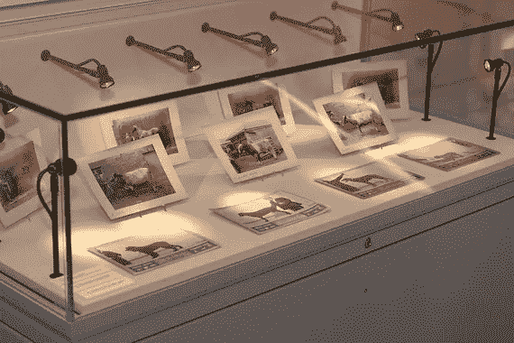
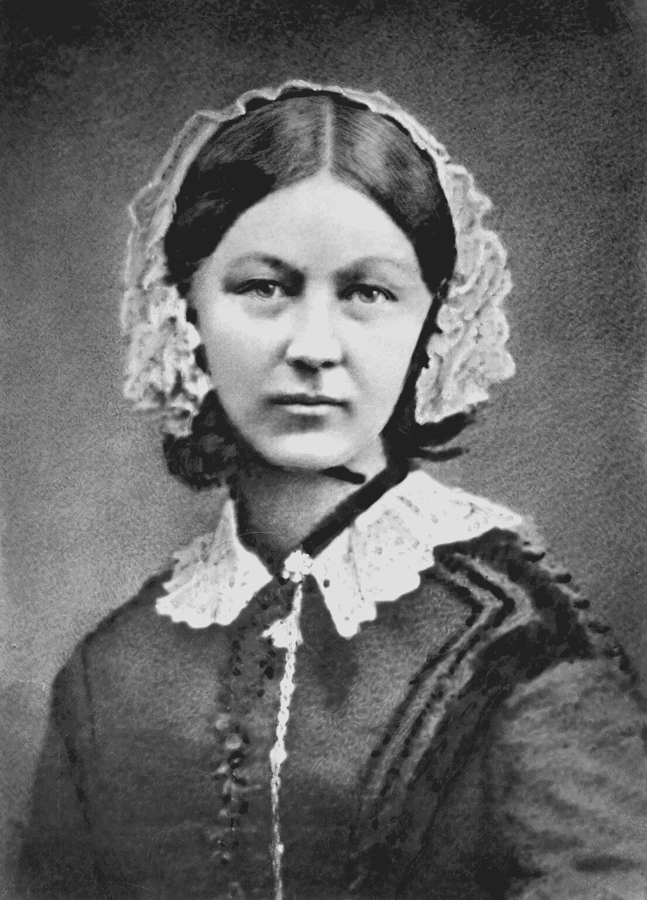

# 统计学，优生学，还有我

> 原文：<https://towardsdatascience.com/statistics-eugenics-and-me-29eaf43efac7?source=collection_archive---------18----------------------->

## 对我未能承认我的领域起源的个人反思

本周是大屠杀纪念日，也是我在伦敦大学学院(UCL)统计系五年学习的结束。几十年来，这里一直是最杰出的优生学家的家。

直到本周，我在高尔顿讲堂和皮尔逊大楼研究卡尔·皮尔逊和罗纳德·费雪的作品，这并没有困扰我。但它应该已经完成了。

我的大部分家人都在大屠杀中被杀害，这是一个旨在根除所谓“劣等种族”的政权的一部分。然而，我仍然认为皮尔逊、费希尔和高尔顿(以及其他人)是统计学之父，他们的贡献应该得到认可和尊重。我曾天真地认为他们是那个时代的产物，他们的研究是遗传学背后的统计学的自然发展。事实并非如此。

注意:这是我写的一篇个人文章，目的是让我自己的天真负起责任。然而，这是针对其他统计学家和数据科学家的，因为我肯定不是唯一一个没有考虑我们领域真正起源的人。

2021 年 1 月 27 日——大屠杀纪念日——由[大卫·托马塞蒂](https://unsplash.com/@dtomaseti?utm_source=medium&utm_medium=referral)在 [Unsplash](https://unsplash.com?utm_source=medium&utm_medium=referral) 上拍摄

# 弗朗西斯·高尔顿爵士

弗朗西斯·高尔顿，“行为与教育统计领域的奠基人”:

*   率先使用问卷调查
*   发现了均值回归
*   重新发现了相关性和回归性，并发现了如何在人类学、心理学等领域应用它们
*   定义了标准差的概念

高尔顿被认为对统计学的发展至关重要，以至于许多人会故意忽略他在 1883 年建立的优生学领域。

## 他那个时代的产物？

在回顾关于高尔顿生平的四本书时，克劳萨(2007)用这个论点来批评其中一本书:

> 这本书也受到布鲁克斯倾向于将高尔顿生活的方方面面与他的优生学观点联系起来的限制。布鲁克斯没有把高尔顿的观点放在他生活的时代背景下……尽管高尔顿对他在非洲遇到的土著居民的观点很可能被视为受维多利亚时代标准的启发，布鲁克斯用 21 世纪的视角看待他们，并找到了高尔顿不宽容的证据。

多年来,“时代的产物”这一论点经常被用来为偏见辩护。从这个角度来看:高尔顿受到了他堂兄的著作《物种起源》的启发。达尔文可以被称为他那个时代的产物，因为他用“野蛮人”这样的词来描述某些人群。然而，达尔文公开反对种族主义，没有促进或帮助高尔顿的任何优生学工作。如果对高尔顿的“优生学”中固有的种族主义有任何疑问，下面是他创造这个术语的理由:

> 我们非常想要一个简短的词来表达改善股票的科学，它……认识到所有的影响，无论这种影响在多大程度上倾向于给予更适合的种族或血统更好的机会来迅速战胜不太适合的种族或血统。

如果对高尔顿的观点仍有疑问，他还写道:

> 有一种情绪，在很大程度上很不合理，反对一个劣等种族的逐渐灭绝。⁴

如果在我上大学的第一天，坐在高尔顿演讲厅，我被告知高尔顿认为种族灭绝“在很大程度上是不合理的”，我可能会对他的名字和照片感到不舒服。我的研究从根本上依赖于高尔顿的工作，我感激高尔顿。这并不意味着我需要在三年里每天听到并说出他的名字。

高尔顿展览在 UCL 举行，以提高他们对优生学贡献的认识。信用:UCL 形象店。⁵

# 卡尔·皮尔逊

卡尔·皮尔逊是高尔顿的得意门生，并取得了许多显著的成就:

*   发展的假设检验
*   开发了 p 值的使用
*   定义了卡方检验
*   介绍了矩量法

## 反犹太主义者

在《我的奋斗》出版的那一年，皮尔逊写了一篇关于犹太人的文章:

> “[他们]将发展成一个寄生种族……平均来看*，就男女两性而言，这些外来犹太人在生理和心理上都不如本地人。”⁶*

*当希特勒被任命为总理时，皮尔逊指出:*

> *即使在今天，有太多的一般印象来自有限的或经常被错误解释的经验，太多的不充分证明和太轻易接受的理论，任何国家匆忙进行无限制的优生学立法。⁷*

*这似乎是合理的，直到紧接着他的警告:*

> *然而，这一声明决不能被当作无限期中止所有优生学教学和一切形式的关于性问题的集体行动的借口。⁷*

*我在皮尔森大楼的一个小教室里，以一个演讲结束了我的本科课程，这个演讲从根本上依赖于皮尔森的工作。皮尔逊是 UCL 大学优生系的第一任系主任，他对我的生活和工作的贡献是我不能也不会忽视的。他的贡献对统计学和许多其他领域至关重要。但我又一次怀疑，如果我被告知更多关于这个以其命名的人的背景，我是否会感到同样舒适地走过皮尔逊大厦。*

**

*UCL 的皮尔逊大厦(左)，1985 年。⁸ *信用:UCL 形象店。**

# *罗纳德·费雪爵士*

*费希尔在统计学方面的工作建立并促进了许多重要的统计推断方法。他的贡献包括:*

*   *将 p = 0.05 确定为显著 p 值的正常阈值*
*   *促进最大似然估计*
*   *开发方差分析(ANOVA)*
*   *数据集(这似乎是一个难以置信的小贡献，但我用它 daily)⁹*

*像皮尔逊和高尔顿一样，费希尔备受尊敬。当被问及谁是“自达尔文以来最伟大的生物学家”时，理查德·道金斯提名了费舍尔·⁰(鉴于道金斯自己公开的观点，这并不奇怪)。费希尔的一个学生博德莫尔写了一本关于费希尔生平的简短但热情洋溢的传记，并把费希尔描述为“可爱”和“善良”。都没有提到优生学。*

*关于纳粹优生学家奥特马尔·弗赖赫尔·冯·弗舒尔，费希尔写道:*

> *尽管他们的偏见，我也毫不怀疑，党真诚地希望有利于德国的种族股票，特别是通过消除明显的缺陷，如那些精神上有缺陷的，我不怀疑冯 Verschuer 给了，我应该做的，他的支持这样一个运动。*

*直到在 UCL 的第三年，我才第一次听说费希尔的名字，他再次被誉为伟大的统计学家。不用说，没有讨论种族灭绝。*

## *建筑和陈述*

*在最近的一篇文章中，讨论了以人命名的建筑:*

> *理解他们和他们的想法的正确方法是通过博物馆中适当的语境化展示，而不是通过一个隐藏的比揭示的更多的不加评论的纪念馆。*

*对人的笼统陈述也是如此。我假设当道金斯把费希尔描述为“自达尔文以来最伟大的生物学家”时，这仅仅是基于纯粹的产出和对该领域的贡献。然而“最伟大”这个词，就像一座以费希尔命名的建筑一样，包含了对这个人本身的判断。它隐含地假设这个人是“伟大的”,我们自动地假设(尽管这不是定义的一部分)“伟大”意味着“好”。笼统的陈述，就像未加注释的备忘录一样，隐藏的比揭示的更多。*

# *统计学和优生学之父*

*给建筑物和演讲厅命名很容易。这是很久以前就应该迈出的一步，但我并不是在批评 UCL。值得称赞的是，他们花了数年时间收集信息，开展调查，听取每个人的反馈和意见。*

*从事统计学或数据科学工作就是在优生学的阴影下工作。五年来，我甚至没有意识到我处于这种阴影之下，我深感羞愧。但我不能责怪自己。我使用了提供给我的方程式，研究了我被告知的方法，我没有考虑属于这些方法的名字。我相信我很可能和其他数学家和统计学家一样占多数。这是不对的。我认为所有的统计学课程至少应该包括一堂关于统计学及其“祖先”的完整历史的课。*

## *从失败中获得成功*

*即使建筑物被重新命名，我仍然会(每天)使用‘皮尔逊卡方检验’和‘费雪信息’。他们的名字永远留在了我的脑海里，现在他们的信仰也是。虽然我会尊重这些人对统计学的贡献，甚至受到他们的启发，但我现在可以谈论他们，而不会赞美他们的性格或无意中纵容他们的信仰。我将利用过去的方法来促进未来积极的、好的和合乎道德的选择。学习别人失败的地方将帮助一代又一代的统计学家学习如何成功。*

## *我们时代的产品*

*不幸的是，我只能以警告结束这一切。虽然优生学不太可能(尽管并非不可能)在现代政治中重新出现，但统计数字和数据现在比以往任何时候都更容易被操纵。*

*从返回错误结果的机器学习的天真误用，到原始数据的恶意操纵，这个领域正在接受考验。从政府到个人，从俄罗斯到帕洛阿尔托，从反面具者到反魔鬼；数据和统计舞弊的全部后果仍然未知。*

*袖手旁观会让我们成为“他们时代的产物”。这还不够好。数据科学需要更多的监管。医生有希波克拉底誓言，为什么我们没有南丁格尔誓言:“不操纵数据和结果。促进统计的道德使用。只训练你理解的模型。不要宣传优生学”。*

**

*弗洛伦斯·南丁格尔，统计学之母，好人。⁴信用:[https://en . Wikipedia . org/wiki/file:Florence _ nightingale _(h _ hering _ npg _ x 82368)。jpg](https://en.wikipedia.org/wiki/File:Florence_Nightingale_(H_Hering_NPG_x82368).jpg)*

# *参考*

*克劳萨贝。弗朗西斯·高尔顿的生活和工作:行为统计学之父的四本新书述评。教育与行为统计杂志。2007;32(4):440–444.doi:10.3102/1076998607307449
[https://medium . com/science-and-philosophy/Charles-Darwin-on-racism-slavery-and-eugenics-CB 6416 b 8277 c](https://medium.com/science-and-philosophy/charles-darwin-on-racism-slavery-and-eugenics-cb6416b8277c)
Galton。 [*探究人类的官能及其发展*](https://archive.org/details/inquiriesintohu00galtgoog) 。麦克米伦。1883.第 [24 页](https://archive.org/details/inquiriesintohu00galtgoog/page/n42)。
以色列的⁴charny；阿达连，鲁本·保罗；史蒂文·雅各布斯；埃里克·马库森；马克·谢尔曼(1999 年)。 [*灭族百科:A-H*](https://books.google.com/books?id=8Q30HcvCVuIC&pg=PA218) 。ABC-CLIO。第 218 页。[ISBN](https://en.wikipedia.org/wiki/ISBN_(identifier))[978–0–87436–928–1](https://en.wikipedia.org/wiki/Special:BookSources/978-0-87436-928-1)。https://imagestore.ucl.ac.uk/imagestore/start/images?
⁵[view = preview&fuid = UCL % 20 library/library % 20 events/Galton % 20 exhibit % 20 opening/Galton _ exhb _ 0025 . TIF](https://imagestore.ucl.ac.uk/imagestore/start/images?view=preview&fuid=UCL%20Library/Library%20Events/Galton%20Exhibition%20Opening/Galton_Exhb_0025.tif)
⁶pearson、卡尔；莫尔，玛格丽特(1925)。"通过对俄罗斯和波兰犹太儿童的调查来说明外国人移民到英国的问题"。*优生学年鉴*。**一**(二):125–126。[doi](https://en.wikipedia.org/wiki/Doi_(identifier)):[10.1111/j . 1469–1809.1925 . TB 02037 . x](https://doi.org/10.1111%2Fj.1469-1809.1925.tb02037.x)。
卡尔·⁷pearson(1933)。[“淡水河谷！”](https://doi.org/10.1111%2Fj.1469-1809.1933.tb02102.x)。*优生学年鉴*。 **5** (4): 416。[doi](https://en.wikipedia.org/wiki/Doi_(identifier)):[10.1111/j . 1469–1809.1933 . TB 02102 . x](https://doi.org/10.1111%2Fj.1469-1809.1933.tb02102.x)。
⁸[https://bartlett 100 . com/article/bartlett-buildings-the-Pearson-building . html](https://bartlett100.com/article/bartlett-buildings-the-pearson-building.html)
⁹[https://www.garrickadenbuie.com/blog/lets-move-on-from-iris](https://www.garrickadenbuie.com/blog/lets-move-on-from-iris/)
⁰[https://www . edge . org/conversation/who-is-the-the-great-time 生物学家](https://www.edge.org/conversation/who-is-the-greatest-biologist-of-all-time)
沃尔特·博德默(Walter Bodmer)，RA Fisher，统计学家兼遗传学家非凡:个人观点，*国际流行病学杂志【T51 希拉·费斯·维斯。Isis 2010 101:4，722–758
[https://www . newstatesman . com/international/science-tech/2020/07/ra-fisher-and-science-恨意](https://www.newstatesman.com/international/science-tech/2020/07/ra-fisher-and-science-hatred)
⁴[https://en . Wikipedia . org/wiki/Florence _ nightingale #/media/file:Florence _ nightingale _(h _ hering _ npg _ x 82368)。jpg](https://en.wikipedia.org/wiki/Florence_Nightingale#/media/File:Florence_Nightingale_(H_Hering_NPG_x82368).jpg) 。**