# Python 中的统计数据-共线性和多重共线性

> 原文：<https://towardsdatascience.com/statistics-in-python-collinearity-and-multicollinearity-4cc4dcd82b3f?source=collection_archive---------1----------------------->

## 了解如何发现数据集中的多重共线性


由 [Valentino Funghi](https://unsplash.com/@iampatrickpilz?utm_source=medium&utm_medium=referral) 在 [Unsplash](https://unsplash.com?utm_source=medium&utm_medium=referral) 上拍摄的照片

在我的上一篇文章中，您了解了数据集中数据之间的关系，无论是在同一列中(*方差*)，还是在列之间(*协方差*和*相关性*)。

[](/statistics-in-python-understanding-variance-covariance-and-correlation-4729b528db01) [## Python 中的统计学-了解方差、协方差和相关性

### 理解你的数据之间的关系，知道皮尔逊相关系数和…

towardsdatascience.com](/statistics-in-python-understanding-variance-covariance-and-correlation-4729b528db01) 

当您开始机器学习之旅时，您通常会遇到的另外两个术语是:

*   **共线性**
*   **多重共线性**

在本文中，我想解释共线性和多重共线性的概念，以及在准备数据时理解它们并采取适当措施的重要性。

# 相关性与共线性和多重共线性

如果您还记得， *correlation* 测量数据集中两列之间的强度和方向。相关性通常用于查找特征和目标之间的关系:

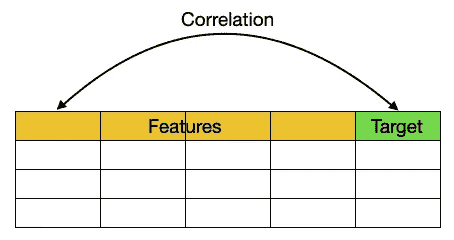

作者图片

例如，如果其中一个特征与目标有很高的相关性，它会告诉您这个特定的特征对目标有很大的影响，因此在训练模型时应该包括在内。

*另一方面，共线性*是两个特征线性相关的情况(高*相关性*，它们被用作目标的*预测值*。

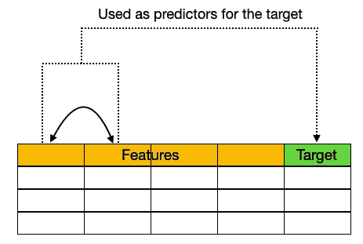

作者图片

*多重共线性*是共线性的一种特殊情况，其中一个要素与两个或多个要素呈现线性关系。

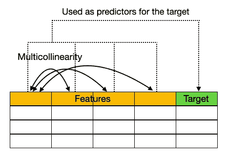

作者图片

# 共线性和多重共线性问题

回想一下多元线性回归的公式:

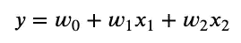

作者图片

线性回归的一个重要假设是，每个预测值( **x** ₁、 **x** ₂等)与结果 **y** 之间应该存在线性关系。但是，如果预测值之间存在相关性(例如， **x** ₁和 **x** ₂高度相关)，您将无法在保持另一个常量的情况下确定其中一个的影响，因为两个预测值会一起变化。最终的结果是系数( **w** ₁和 **w** ₂)现在变得不那么精确，因此更难解释。

# 修复多重共线性

训练机器学习模型时，在数据预处理阶段筛选出数据集中显示多重共线性的要素非常重要。你可以用一种叫做**VIF**——**方差膨胀因子**的方法来实现。

**VIF** 允许你确定各个自变量之间相关性的强度。*它是通过取一个变量并将其与其他变量进行回归*来计算的。

> VIF 计算出一个系数的**方差**被**夸大了**多少，因为它与其他预测因子存在线性相关性。因此得名。

VIF 是这样工作的:

*   假设您有一个特征列表— **x** ₁、 **x** ₂、 **x** ₃和 **x** ₄.
*   你首先取第一个特征， **x** ₁，并对其他特征进行回归:

```
x₁ ~ x₂ + x₃ + x₄
```

> 实际上，你是在执行上面的多元回归。多元回归通常解释多个自变量或预测变量与一个因变量或标准变量之间的关系。

*   在上面的多元回归中，您提取了 **R** 值(在 0 和 1 之间)。如果 **R** 是*大*，这意味着 **x₁** 可以从三个特征中预测出来，因此与三个特征——**x**₂、 **x** ₃、 **x** ₄.高度相关如果 **R** 是*小*，这意味着 **x₁** 无法从特征中预测，因此*与三个特征 **x** ₂、 **x** ₃、**x**₄.*不相关
*   基于为 **x₁** 计算的 **R** 值，现在可以使用以下公式计算其 **VIF** :

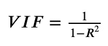

作者图片

*   大的 **R** 值(接近 1)会导致分母变小(1 减去一个接近 1 的值会得到一个接近 0 的数)。这将导致一个大的 VIF。大 VIF 表示此要素与其他要素存在多重共线性。
*   反之，一个小的 **R** 值(接近 0)会导致分母变大(1 减去一个接近 0 的值会得到一个接近 1 的数)。这将导致一个小 VIF。小 VIF 表示此要素与其他要素的多重共线性较低。

> (1- **R** )又称**公差**。

*   对其他要素重复上述过程，并计算每个要素的 VIF:

```
x₂ ~ x₁ + x₃ + x₄   # regress x₂ against the rest of the features
x₃ ~ x₁ + x₂ + x₄   # regress x₃ against the rest of the features
x₄ ~ x₁ + x₂ + x₃   # regress x₄ against the rest of the features
```

> 虽然相关矩阵和散点图可用于查找多重共线性，但它们仅显示独立变量之间的二元关系。另一方面，VIF 显示了一个变量与一组其他变量的相关性。

# 使用 Python 实现 VIF

既然你已经知道了 VIF 是如何计算的，你可以使用 Python 来实现它，在 **sklearn** 的一点帮助下:

```
import pandas as pd
from sklearn.linear_model import LinearRegressiondef **calculate_vif**(df, features):    
    vif, tolerance = {}, {} # all the features that you want to examine
    for feature in features:
        # extract all the other features you will regress against
        X = [f for f in features if f != feature]        
        X, y = df[X], df[feature] # extract r-squared from the fit
        r2 = LinearRegression().fit(X, y).score(X, y)                

        # calculate tolerance
        tolerance[feature] = 1 - r2 # calculate VIF
        vif[feature] = 1/(tolerance[feature]) # return VIF DataFrame
    return pd.DataFrame({'VIF': vif, 'Tolerance': tolerance})
```

# 让我们试一试

为了了解 VIF 的实际情况，让我们使用一个名为 **bloodpressure.csv** 的样本数据集，其内容如下:

```
Pt,BP,Age,Weight,BSA,Dur,Pulse,Stress,
1,105,47,85.4,1.75,5.1,63,33,
2,115,49,94.2,2.1,3.8,70,14,
3,116,49,95.3,1.98,8.2,72,10,
4,117,50,94.7,2.01,5.8,73,99,
5,112,51,89.4,1.89,7,72,95,
6,121,48,99.5,2.25,9.3,71,10,
7,121,49,99.8,2.25,2.5,69,42,
8,110,47,90.9,1.9,6.2,66,8,
9,110,49,89.2,1.83,7.1,69,62,
10,114,48,92.7,2.07,5.6,64,35,
11,114,47,94.4,2.07,5.3,74,90,
12,115,49,94.1,1.98,5.6,71,21,
13,114,50,91.6,2.05,10.2,68,47,
14,106,45,87.1,1.92,5.6,67,80,
15,125,52,101.3,2.19,10,76,98,
16,114,46,94.5,1.98,7.4,69,95,
17,106,46,87,1.87,3.6,62,18,
18,113,46,94.5,1.9,4.3,70,12,
19,110,48,90.5,1.88,9,71,99,
20,122,56,95.7,2.09,7,75,99,
```

数据集由以下字段组成:

*   血压(**血压**)，单位为毫米汞柱
*   **年龄**，以年为单位
*   **重量**，单位为千克
*   体表面积( **BSA** )，单位为 m
*   高血压持续时间( **Dur** )，年
*   基础脉搏(**脉搏**)，单位为每分钟心跳数
*   应力指数(**应力**)

首先，将数据集加载到 Pandas 数据框架中，并删除多余的列:

```
df = pd.read_csv('bloodpressure.csv')
df = df.drop(['Pt','Unnamed: 8'],axis = 1)
df
```

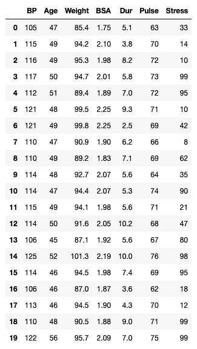

作者图片

# 可视化列之间的关系

在进行任何清理之前，使用 pair plot(使用 **Seaborn** 模块)来可视化各个列之间的关系是很有用的:

```
import seaborn as sns
sns.pairplot(df)
```

我发现一些列似乎存在很强的相关性:

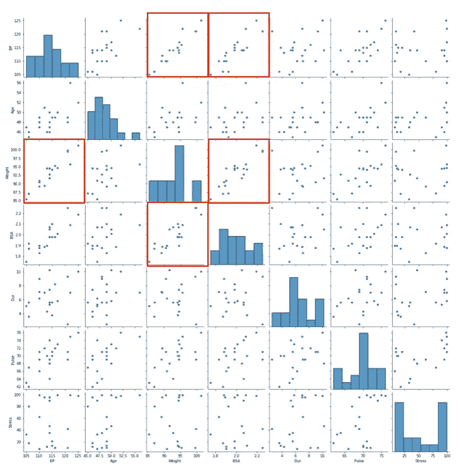

作者图片

# 计算相关性

接下来，使用 **corr()** 函数计算列之间的相关性:

```
df.corr()
```

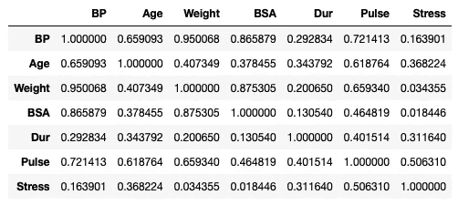

作者图片

假设您试图建立一个预测**血压**的模型，您可以看到与**血压**相关的主要特征是**年龄**、**体重**、 **BSA** 和**脉搏**:

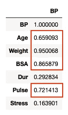

作者图片

# 计算 VIF

现在，您已经确定了要用于定型模型的列，您需要查看哪些列具有多重共线性。因此，让我们使用我们之前编写的 **calculate_vif()** 函数:

```
calculate_vif(df=df, features=['Age','Weight','BSA','Pulse'])
```

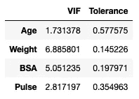

作者图片

# 解读 VIF 价值观

VIF 的有效值范围从 1 到无穷大。解释 VIF 价值观的经验法则是:

*   1-要素不相关
*   1
*   VIF> 5 —特征高度相关
*   VIF>10 —特征之间的高度相关性，值得关注

从上一节计算 VIF 的结果中，可以看到**重量**和 **BSA** 的 VIF 值大于 5。这意味着**体重**和 **BSA** 高度相关。这并不奇怪，因为较重的人有较大的体表面积。

因此，接下来要做的事情是尝试删除一个高度相关的特征，看看 VIF 的结果是否会改善。让我们试着去掉**的重量**，因为它的 VIF 更高:

```
calculate_vif(df=df, features=['Age','BSA','Pulse'])
```

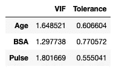

作者图片

现在让我们去掉 **BSA** ，看看其他特性的 VIF:

```
calculate_vif(df=df, features=['Age','Weight','Pulse'])
```

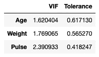

作者图片

正如您所观察到的，与移除 **BSA** 相比，移除**重量**会导致所有其他特性的 VIF 降低。那么你应该去掉**的重量**吗？嗯，理想情况下，是的。但出于实际原因，移除 **BSA** 并保留**重量**会更有意义。这是因为稍后当模型被训练并用于预测时，获得患者的体重比他/她的体表面积更容易。

# 再举一个例子

让我们再看一个例子。这次您将使用 **sklearn** 附带的乳腺癌数据集:

```
from sklearn import datasets
bc = datasets.load_breast_cancer()df = pd.DataFrame(bc.data, columns=bc.feature_names)
df
```


作者图片

这个数据集有 30 列，所以我们只关注前 8 列:

```
sns.pairplot(df.iloc[:,:8])
```

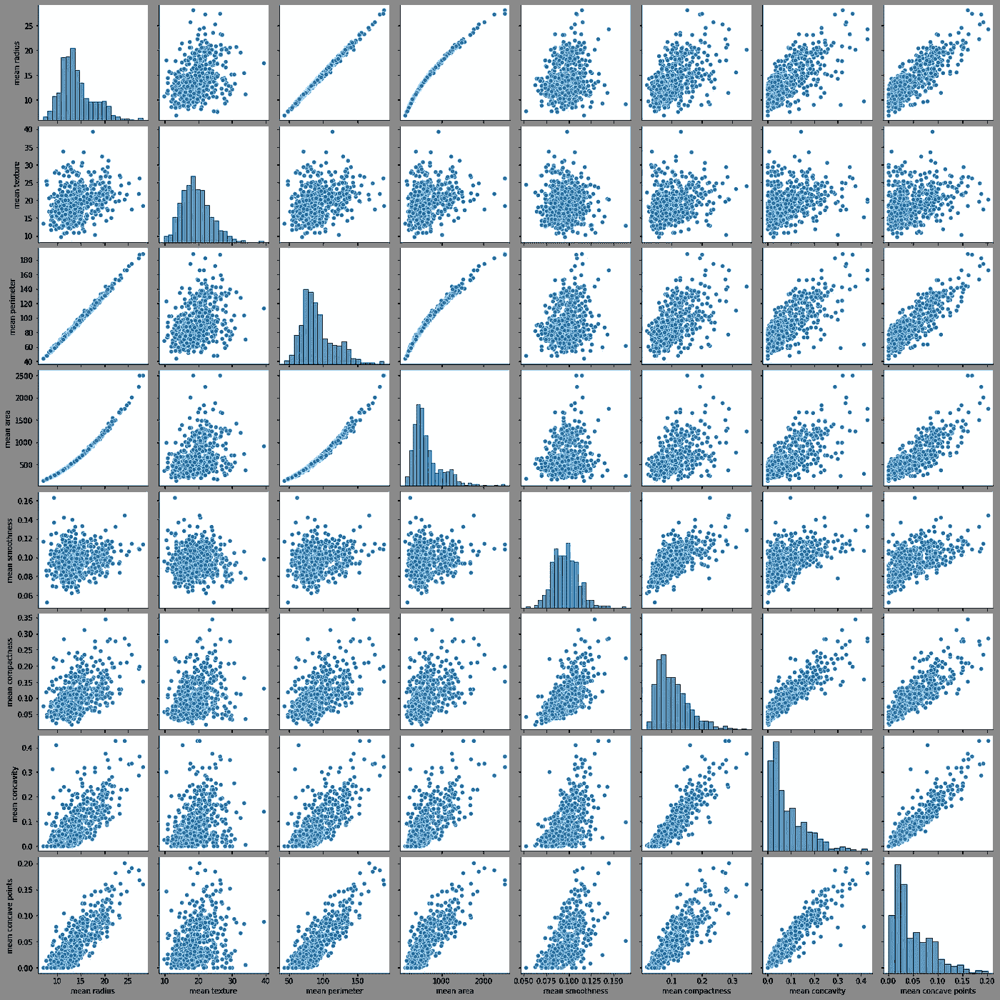

作者图片

您可以立即观察到一些特征高度相关。你能认出他们吗？

让我们计算前 8 列的 VIF:

```
calculate_vif(df=df, features=df.columns[:8])
```

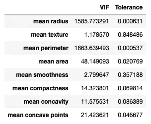

作者图片

您可以看到以下要素具有较大的 VIF 值:

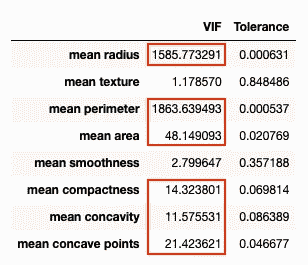

作者图片

让我们试着一个一个地移除这些特征，并观察它们的新 VIF 值。首先，移除**平均周长**:

```
calculate_vif(df=df, features=['mean radius', 
                               'mean texture', 
                               'mean area', 
                               'mean smoothness', 
                               'mean compactness', 
                               'mean concavity',
                               'mean concave points'])
```

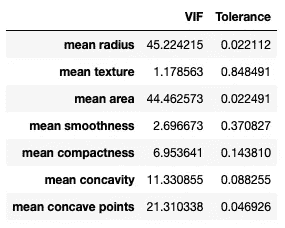

作者图片

VIFs 立即全面下降。现在让我们移除**平均面积**:

```
calculate_vif(df=df, features=['mean radius', 
                               'mean texture',
                           **# 'mean area',** 
                               'mean smoothness', 
                               'mean compactness', 
                               'mean concavity',
                               'mean concave points'])
```

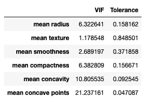

作者图片

现在让我们去掉**意思是凹点**，其中 VIF 最高:

```
calculate_vif(df=df, features=['mean radius', 
                               'mean texture',
                           **# 'mean area',** 
                               'mean smoothness', 
                               'mean compactness', 
                               'mean concavity',
 **# 'mean concave points'**
                              ])
```

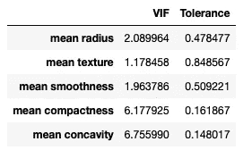

作者图片

最后，让我们去掉**平均凹度**:

```
calculate_vif(df=df, features=['mean radius', 
                               'mean texture',
                           **# 'mean area',** 
                               'mean smoothness', 
                               'mean compactness', 
                             **# 'mean concavity',**
 **# 'mean concave points'**
                              ])
```

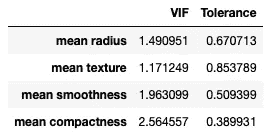

作者图片

现在所有的 VIF 值都低于 5。

# 摘要

在本文中，您了解了相关性、共线性和多重共线性之间的区别。特别是，您了解了当一个要素与两个或多个要素呈现线性关系时会发生多重共线性。要检测多重共线性，一种方法是计算**方差膨胀因子** ( **VIF** )。应将 VIF 大于 5 的任何要素从训练数据集中移除。

> 值得注意的是，VIF 只对连续变量有效，对分类变量无效。

[](https://weimenglee.medium.com/membership) [## 加入媒介与我的介绍链接-李伟孟

### 作为一个媒体会员，你的会员费的一部分会给你阅读的作家，你可以完全接触到每一个故事…

weimenglee.medium.com](https://weimenglee.medium.com/membership)