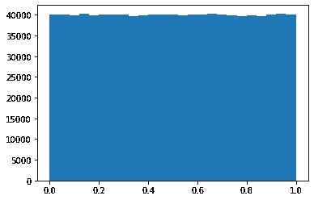
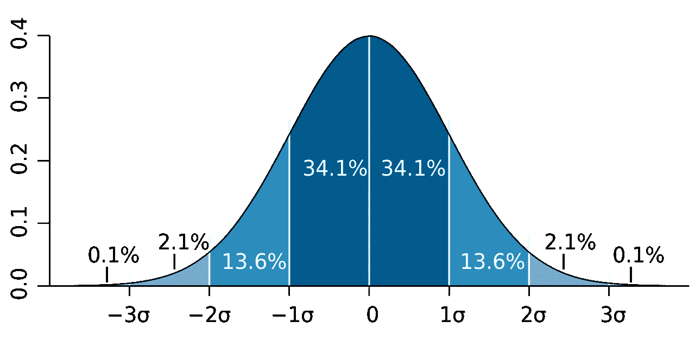
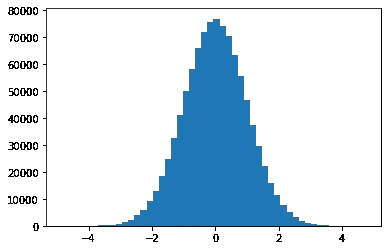
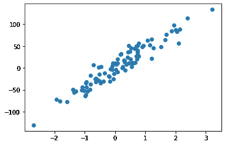
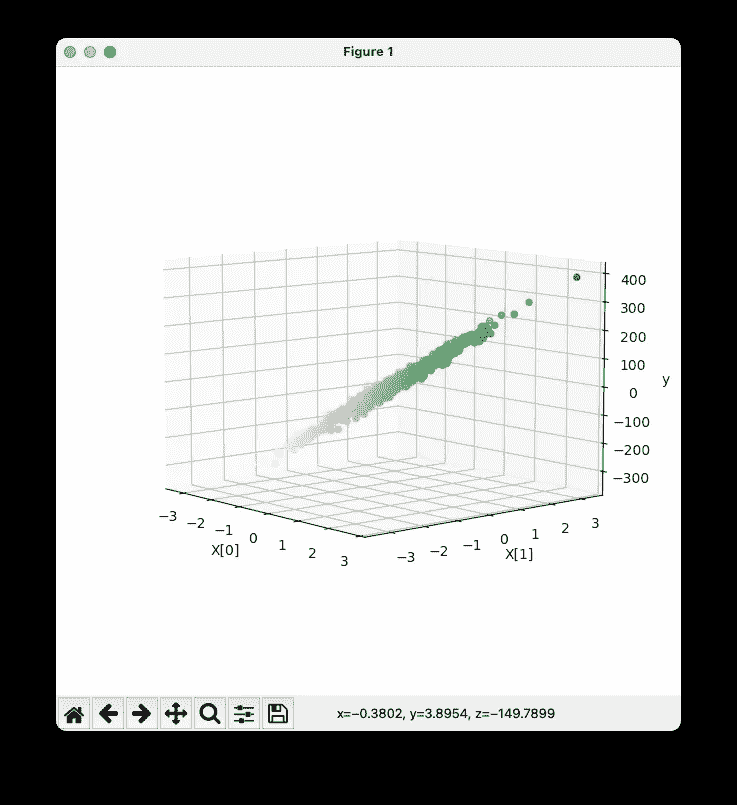
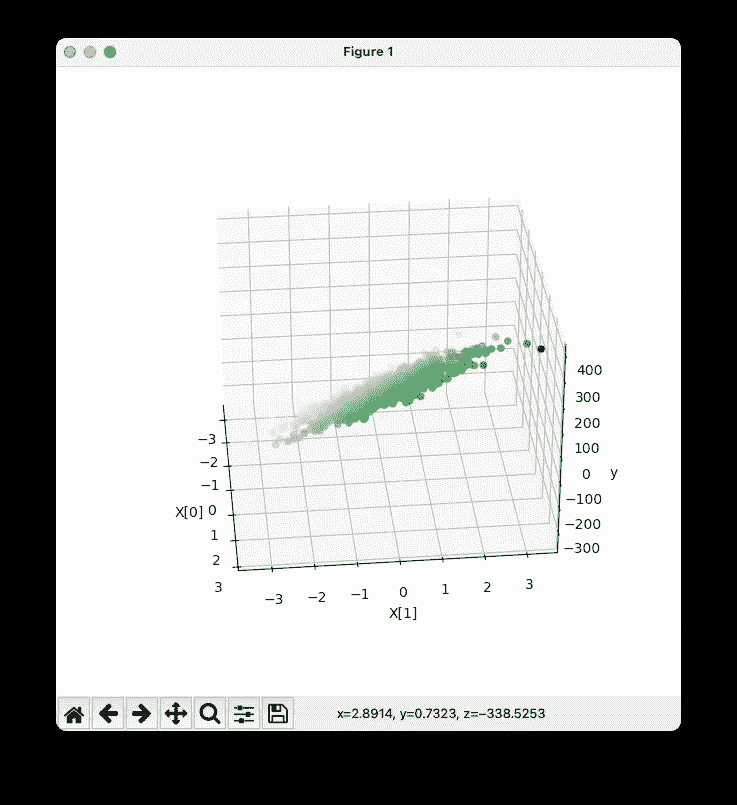
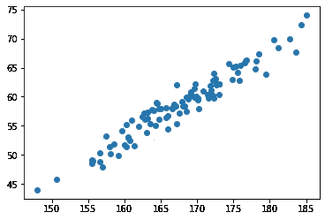
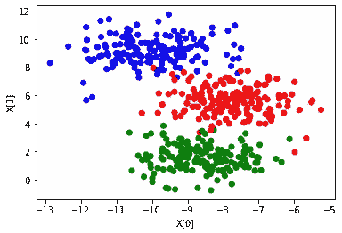
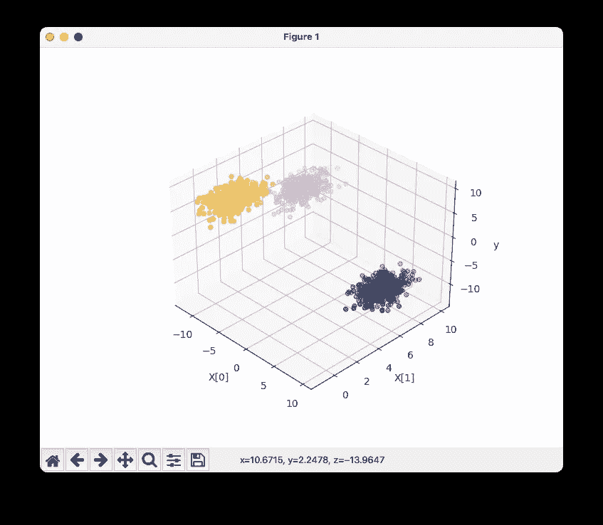
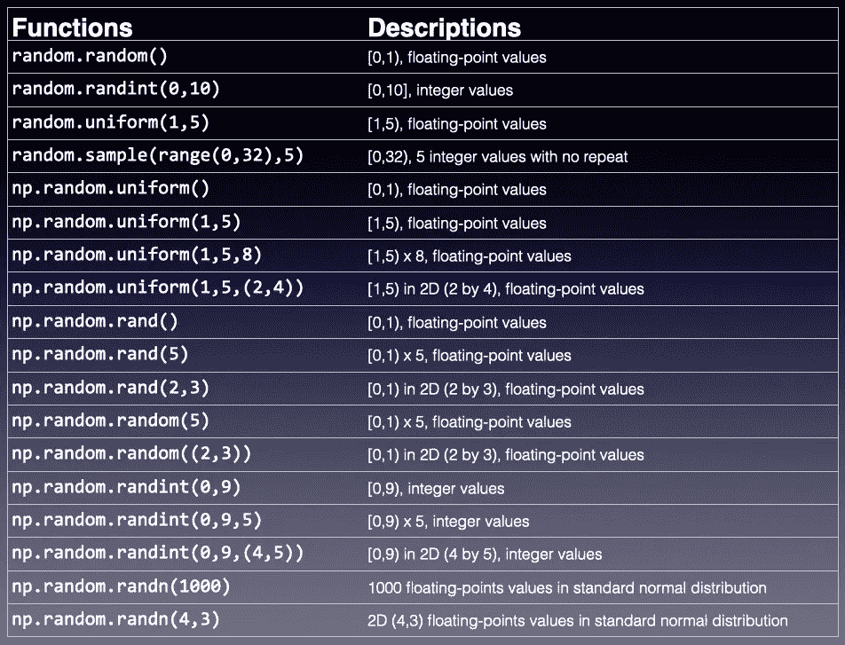

# Python 中的统计—在 Python、NumPy 和 sklearn 中生成随机数

> 原文：<https://towardsdatascience.com/statistics-in-python-generating-random-numbers-in-python-numpy-and-sklearn-60e16b2210ae?source=collection_archive---------12----------------------->

## 要在 Python 中生成随机数，您只需知道


纳赛尔·塔米米在 [Unsplash](https://unsplash.com?utm_source=medium&utm_medium=referral) 上的照片

生成随机数是编写应用程序时需要执行的常见任务之一。随机数有许多用途——从密码学到机器学习，随机数在使我们的应用程序正确工作方面发挥着极其重要的作用。

作为一名 Python 程序员，当涉及到生成随机值时，您有太多的选择，因为有太多的方法可以做到这一点。然而，这种灵活性是有代价的——通常不太清楚何时使用什么。这正是我在这篇文章中想要解决的问题。

在本文结束时，您将会对使用什么函数来生成您想要的随机数有一个更加清晰的了解。

# 用 Python 生成随机数

要在 Python 中生成随机数，可以使用 **random** 模块:

```
import random
```

要生成浮点随机数，请调用 **random()** 函数:

```
**random.random**()   # e.g. 0.49543508709194095
```

**random()** 函数在*半开区间*—**【0，1】**产生一个浮点数。这意味着生成的数字将从 0 到 1(其中不包括 1)。

如果您想生成一个从 0 到 10(包括 0 和 10)的整数值，请使用 **randint()** 函数:

```
**random.randint**(0,10)  # [0,10] - 0 to 10 (inclusive) e.g. 6
```

如果您想要一个特定范围内的随机浮点数(例如 1 到 5(不含))，使用 **uniform()** 函数:

```
**random.uniform**(1,5)  # [1,5) e.g. 4.756596651114043
```

要生成特定范围内的随机整数值列表(如 0 到 32(不含))*而不重复*值，使用 **sample()** 函数:

```
**random.sample**(range(0, 32), 5)    # result is a list of 5 values 
                                  # from [0,32) with no repeats
# [12, 15, 26, 10, 7]
```

> 对于像幸运抽奖这样需要从一个值列表中挑选一些获胜者的情况，函数 **sample()** 非常有用。

如果想要一个半开区间内随机浮点值的*列表*，可以通过 list comprehension 使用 **random()** 函数:

```
**[random.random() for _ in range(5)]** # [0, 1)
# [0.26800994395551214,
#  0.3322334781304659,
#  0.5058884832347348,
#  0.2552912262686192,
#  0.33885158106897195]
```

同样，如果您需要特定范围内的随机浮点值列表，您可以这样做:

```
**[random.uniform(1,5) for _ in range(5)]  **  # [1, 5)
# [1.4556516495709206,
#  1.94075804553687,
#  4.775979596495107,
#  4.118159382173641,
#  3.860434558608088]
```

最后，如果你需要生成一个随机整数列表，使用这个:

```
**[random.randint(0,10) for _ in range(5)]** # [0,10]
# [3, 9, 8, 7, 10]
```

# 使用 NumPy 生成随机数

如果您正在使用 NumPy 模块，您也可以使用它来生成随机数。random 模块包含几个函数，允许你生成随机数。

**uniform()** 函数在*半开*区间内生成一个浮点数:

```
import numpy as np**np.random.uniform()**         # [0,1) e.g. 0.6603742810407641
```

您也可以指定范围:

```
**np.random.uniform(1,5)**      # [1,5) e.g. 2.1809140016758803
```

以及要生成的随机值的数量:

```
**np.random.uniform(1,5,8)** #[1,5) x 8
# array([3.15101237, 3.52431302, 2.43564056, 4.22373224, 
#        1.82549706, 4.30782957, 2.1383488 , 3.71130947])
```

您也可以指定想要的结果形状:

```
**np.random.uniform(1,5,(2,4))** # [1,5) - result is a 2D array of 
                              # 2 rows and 4 columns
# array([[4.85777402, 2.41464442, 3.47972032, 3.61706258],
#        [1.39591689, 2.41386733, 3.34813041, 3.13411887]])
```

如果只是想在半开区间生成数字，还有一个函数可以用——**rand()**:

```
**np.random.rand()**      # [0,1) e.g. 0.11705786929477491
```

**rand()** 函数可以轻松生成各种维度的半开区间值:

```
**np.random.rand(5)** # [0,1) x 5
# array([0.52310231, 0.87305847, 0.03870784, 0.69239079, 0.47626848])**np.random.rand(2,3)** # [0,1) in 2D
# array([[0.16926449, 0.06317189, 0.03222409],
#        [0.24243086, 0.11270682, 0.40499002]])
```

> **rand()** 函数接受额外的参数作为返回结果的形状，而 **uniform()** 函数接受三个参数——低、高和大小。

另一个类似于 **rand()** 函数的函数是 **random()** 。它也在半开区间产生数字。这两者之间的关键区别在于， **random()** 函数接受一个参数来表示要生成的数字的维数。

```
**np.random.random(5)** 
# array([0.90351056, 0.96734226, 0.06753921, 
#        0.31758607, 0.69686297])**np.random.random((2,3))** # passed the dimension you want 
                         # as a tuple
# array([[0.04207297, 0.92656545, 0.93526291],
#        [0.8104269 , 0.18834308, 0.58731822]])
```

> **random()** 和 **uniform()** 的区别在于 **random()** 函数接受一个参数。所以如果要生成多维数组结果，就需要把形状包装成元组。

如果你需要一个随机的整数值，使用 **randint()** 函数:

```
**np.random.randint(0,9)**        # [0,9) e.g. 7
```

您也可以生成多维的整数值列表:

```
**np.random.randint(0,9,5)** # [0,9) x 5
# array([3, 7, 3, 2, 8])**np.random.randint(0,9,(4,5))** # [0,9) in 2D array
# array([[5, 2, 4, 8, 0],
#        [5, 2, 3, 7, 2],
#        [6, 1, 2, 4, 7],
#        [2, 3, 5, 8, 4]])
```

# 指定数字的分布

到目前为止，我们生成的所有数字都是均匀分布的。

> **均匀分布**是一种连续的概率分布，与同样可能发生的事件有关。

这意味着，如果您试图生成大量的值，那么生成任何值的机会应该是均等的。您可以通过尝试使用 **random()** 函数生成一百万个值，然后将数字范围划分为 25 个区间，并计算每个区间中每个值的出现次数来看到这一点:

```
import matplotlib.pyplot as plt
_ = plt.hist(np.random.random(1_000_000), bins = 25)
```

上面的语句显示了一个直方图，显示了一百万个数字的分布情况:



如果你想生成一个*正态分布*的数字列表，你可以使用 **randn()** 函数:

```
**np.random.randn(4,3)**
# array([[-0.58617287,  0.99765344,  1.00439116],
#        [-0.45170132, -0.01265149,  0.75739522],
#        [ 0.70970036, -0.1740791 ,  1.14584093],
#        [ 1.2637344 ,  0.77962903, -0.97546801]])
```

> **正态分布**，又称高斯分布，是一种关于均值对称的概率分布，大部分数据都聚集在均值附近。在图表上，正态分布显示为钟形曲线。

**randn()** 函数返回来自*标准正态分布*的样本值。在上面的代码片段中， **randn()** 函数返回 2D 数组中的结果。

> **标准正态分布**是均值为零、标准差为 1 的正态分布。对于标准正态分布，68.27%的观察值位于均值的 1 个标准差以内；95.45%位于平均值的两个标准差之内；99.73%位于平均值的 3 个标准偏差内。



来源:[https://en . Wikipedia . org/wiki/Normal _ distribution #/media/File:Standard _ deviation _ diagram . SVG](https://en.wikipedia.org/wiki/Normal_distribution#/media/File:Standard_deviation_diagram.svg)

以下示例生成正态分布的一百万个数字，然后用于绘制一个直方图，将这些数字分成 50 个区间:

```
_ = plt.hist(**np.random.randn(1_000_000)**, bins=50)
```

您应该会看到如下所示的内容:



# 播种你的随机数生成器

关于随机数的讽刺之处在于它们并不是真正随机的。相反，Python 中的随机数生成器使用当前时间来生成随机数，因为每次运行代码来生成随机数时，时间都会改变，所以您会认为这些数字是真正随机的。但这不是我们大多数人关心的问题。相反，出于再现性的原因，我们经常希望确保生成的随机数是相同的，这样我们就可以在分析中始终得到相同的结果。

如果您用 Python 生成随机数，请使用 **seed()** 函数，传递一个整数值:

```
**random.seed(1)              # pass in an integer value as the seed**
random.sample(range(0, 32), 5)
# [8, 4, 16, 7, 31]
```

上面的代码片段将总是生成相同的随机数列表。

如果使用 NumPy，使用 **random.seed()** 函数:

```
**np.random.seed(2)**           **# pass in an integer value as the seed**
np.random.uniform(0, 10, 5)
# [4.35994902 0.25926232 5.49662478 4.35322393 4.20367802]
```

NumPy 还附带了 **RandomState** 类，您可以使用随机种子创建它的一个实例，然后使用它来生成不同类型的随机值:

```
r = **np.random.RandomState(1)   # pass in an integer value as the 
                               # seed**print(r.uniform(0, 10, 5))     # [0,10)
# [4.17022005e+00 7.20324493e+00 1.14374817e-03 3.02332573e+00
#  1.46755891e+00]print(r.rand(2,3))             # [0,1)
# [[0.09233859 0.18626021 0.34556073]
#  [0.39676747 0.53881673 0.41919451]]
```

# 使用 sklearn 生成随机数

除了生成均匀分布或正态分布的随机数之外，有时还需要生成线性分布或围绕特定质心聚集的数。例如，您可能想要使用一组点来尝试线性回归，或者想要尝试一些用于无监督学习的聚类算法。

## 生成线性分布的随机数

您可以利用**sk learn . datasets**模块中的 **make_regression()** 函数生成一组线性分布的点:

```
from sklearn.datasets import **make_regression**
import numpy as npx, y = **make_regression**(n_samples=100, n_features=1, noise=12.3)
```

**n_samples** 参数指定要生成多少个数字， **n_features** 指定要生成的列数， **noise** 表示应用于数字的标准偏差(它们分散了多少)。上面的代码片段将产生如下所示的输出:

```
**print(x)**
# [[ 1.20630427]
#  [-1.02041981]
#   ...
#  [-0.95098556]
#  [ 0.09247152]]**print(y)**
# [  66.34055577  -52.39063718   51.46433162  -12.56089116  
#    10.62491393    8.00035735    4.80360232  -28.99765946   
#    ...
#    12.75554229    9.75147261    2.67890648  -32.4981596    
#   -30.16046261   -4.56704054  -43.56250488   -9.30790306]
```

理解这些数字的更好方法是绘制一个散点图:

```
import matplotlib.pyplot as plt
_ = plt.scatter(x, y)
```



如果将噪波修改为更大的值:

```
x, y = make_regression(n_samples=100, n_features=1, **noise=19**)
_ = plt.scatter(x, y)
```

您将看到这些值现在更加分散:


如果把 **n_features** 改成 2 呢？在这种情况下， **X** 将是一个 2D 阵列:

```
**X**, y = make_regression(n_samples=1000, **n_features=2**, noise=3)
**print(X)**
# [[-0.10171443  1.59563406]
#  [ 0.39154137 -0.21477808]
#  [ 0.00732151  0.24783439]
#  ...
#  [-0.62820116  0.16688806]
#  [-0.35656323 -1.1761519 ]
#  [ 0.04589981  0.59696238]]
```

可视化生成的随机数集合的一个好方法是使用 **scatter3D()** 函数绘制一个 3D 散点图:

```
from sklearn.datasets import make_regression
import numpy as np
import matplotlib.pyplot as pltX, y = make_regression(n_samples=1000, n_features=2, noise=3)fig = plt.figure(figsize=(13,13))
ax = plt.axes(projection='3d')**ax.scatter3D(X[:,0], X[:,1], y, c=y, cmap='Greens')**
ax.set_xlabel('X[0]')
ax.set_ylabel('X[1]')
ax.set_zlabel('y')
plt.show()
```

> Y 您应该将上面的代码片段保存在一个名为 **random_regression.py** 的文件中，并在命令提示符下运行它。然后，您将能够通过旋转它来可视化绘图。

以下是从不同角度看的情节:



## 对生成的随机数进行插值

由 **make_regression()** 生成的值可能不在您想要的范围内。例如，如果您想要生成一组点来显示一组人的身高和体重之间的关系。在这种情况下，您希望身高在 148cm 到 185cm 之间，体重在 44kg 到 74kg 之间。以下代码片段使用 NumPy 中的 **interp()** 函数缩放 **x** 和 **y** 值:

```
x, y = make_regression(n_samples=100, n_features=1, noise=2.6)# scale x (e.g. height in cm) to 148..185 range
x = np.interp(x, (x.min(), x.max()), (148, 185))# scale y (e.g. weight in kg) to 44..74 range
y = np.interp(y, (y.min(), y.max()), (44, 74))plt.scatter(x, y)
```

散点图证实了执行的插值:



## 生成围绕质心聚集的随机数

很多时候，当你进行无监督学习时，你需要生成围绕几个质心的随机点。为此，您可以使用 **sklearn.datasets** 模块中的 **make_blobs()** 函数:

```
from sklearn.datasets import make_blobsX, y = make_blobs(n_samples = 500, 
                  centers = 3,
                  n_features = 2)
```

上面的代码片段返回 500 对随机数(包含在 X 中), y 包含每个点所在的类:

```
print(X)
# [[ -9.86754851   9.27779819]
#  [-11.50057906   8.88609894]
#  ...
#  [ -5.96056302  -3.21866963]
#  [-10.38173377   8.82254368]]print(y)
# [2 2 0 1 2 2 0 1 2 1 1 1 0 2 
#  1 1 2 1 1 1 2 2 0 1 1 1 1 1 
#  ...
#  2 0 0 0 2 0 1 0 2 2 1 2 1 2
#  2 1 2 2 1 1 1 0 0 0 2 1 2 1]
```

像往常一样，视觉化总是让事情变得更加清晰:

```
rgb = np.array(['r', 'g', 'b'])# plot the blobs using a scatter plot and use color coding
_ = plt.scatter(X[:, 0], X[:, 1], color=rgb[y])
plt.xlabel('X[0]')
plt.ylabel('X[1]')
```



3D 点怎么样？当然，只需将 **n_features** 设置为 3，并使用 **scatter3D()** 函数绘图:

```
from sklearn.datasets import make_blobs
import numpy as np
import matplotlib.pyplot as pltX, y = make_blobs(n_samples = 1500, 
                  centers = 3,
 **n_features = 3**)fig = plt.figure(figsize=(13,13))
ax = plt.axes(projection='3d')
ax.scatter3D(**X[:,0], X[:,1], X[:,2]**, c = y, cmap = 'tab20b')
ax.set_xlabel('X[0]')
ax.set_ylabel('X[1]')
ax.set_zlabel('y')plt.show()
```

> Y 你应该将上面的代码片段保存在一个名为 **random_blobs.py** 的文件中，并在命令提示符下运行它。然后，您将能够通过旋转它来可视化绘图。



为了再现性，将**随机状态**参数设置为一个值:

```
X, y = make_blobs(n_samples = 1500, 
                  centers = 3,
                  n_features = 3,
 **random_state = 0**)
```

# 摘要

唷，看起来在 Python 中有很多不同的方法来生成随机数。最好的记忆方法是用它来参考下面这篇文章中我们讨论过的函数的总结。



我错过了什么重要的功能吗？请在评论中告诉我！