# Python 中的统计学-了解方差、协方差和相关性

> 原文：<https://towardsdatascience.com/statistics-in-python-understanding-variance-covariance-and-correlation-4729b528db01?source=collection_archive---------4----------------------->

## 理解数据之间的关系，知道皮尔逊相关系数和斯皮尔曼等级相关系数之间的区别


[𝓴𝓘𝓡𝓚 𝕝𝔸𝕀](https://unsplash.com/@kirklai?utm_source=medium&utm_medium=referral) 在 [Unsplash](https://unsplash.com?utm_source=medium&utm_medium=referral) 上拍照

数据科学家必须了解的一个主题是数据集中存在的关系。在开始机器学习过程之前，准备好数据以便只有数据集的相关部分用于训练是至关重要的。要了解数据集中的关系，您需要了解以下概念:

*   差异
*   协方差
*   相互关系

和往常一样，我的目的是让你容易消化这些话题。我们开始吧！

# 创建样本数据集

为了理解数据集中的关系，让我们创建一个简单的关系并加载到 Pandas 数据框架中:

```
import pandas as pd
import numpy as npdf = pd.DataFrame({
    'a':[1,3,4,6,8],
    'b':[2,3,5,6,8],
    'c':[6,5,4,3,2],
    'd':[5,4,3,4,6]
})
df
```

数据帧包含五行和四列:

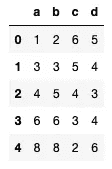

# 差异

方差是数据集中的值围绕其平均值的分布。它告诉你数据集中的每个数字离它的平均值有多远。方差( **s** )的公式定义如下:

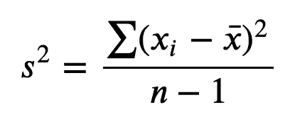

作者图片

> F 或**样本方差**，分母为 **n-1** 。对于**人口方差**，分母为 **n** 。

**方差** ( **s** )的平方根就是**标准差** ( **s** )。方差的计算方法是，取数据集中每个数字与平均值的差，对所有差求和，最后除以数据集中值的个数。

> 较大的方差表明数据集中的数字远离平均值，并且彼此远离。另一方面，较小的方差表明这些数字接近平均值并且彼此接近。方差为 0 表示数据集中的所有数字都相同。最后，方差的有效值总是正数(0 或更大)。

通常，能够可视化数据集中数字的分布是很有用的，这样您可以更好地理解方差的概念。

使用 Seaborn，您可以绘制一个带状图和一个盒状图来显示列 **a** 到 **d** 中的数字分布:

```
import seaborn as snsg = sns.stripplot(data = df.melt(), 
                  x = 'variable', 
                  y = 'value', 
                  color = 'red')sns.boxplot(data = df.melt(),
            x = 'variable', 
            y = 'value', 
            color = 'yellow')
```

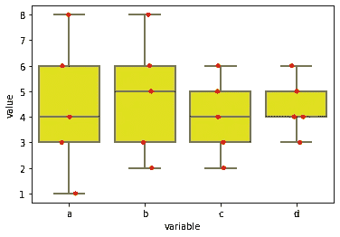

作者图片

如您所见，列 **a** 中的值比其他列分散得多，同样，列 **b** 中的值比 **b** 和 **c** 中的值分散得多，依此类推。与其余列相比， **d** 中的值是最接近的分组。因此，你会期望 a**的方差最大，d**的方差最小。****

## 使用 NumPy 计算方差

使用 NumPy，很容易计算一系列数字的方差。下面是根据前面看到的公式计算列 **a** 的方差的语句:

```
(np.square(df['a'] - df['a'].mean())).sum() / (df.shape[0] - 1)
# 7.3
```

然而，NumPy 也有 **var()** 函数来计算一个数组的方差。您可以直接将数据帧传递给 **var()** 函数来计算数据帧中一系列列的方差:

```
**np.var(df[['a','b','c','d']], ddof=1)**
# a    7.3
# b    5.7
# c    2.5
# d    1.3
# dtype: float64
```

> **ddof** 代表 **Delta 自由度**。该值用于方差计算的分母( **n — ddof** )，其中 n 代表元素的数量。默认情况下，ddof 为零(总体方差)。当的**DD 设置为 **1** 时，您正在计算样本方差。**

正如所料，您可以看到列 **a** 的方差最大，列 **d** 的方差最小。

# 协方差

既然您已经看到了每一列的差异，现在是时候看看列之间是如何相互关联的了。**方差**测量数据在其均值内的分布，**协方差**测量*两个*随机变量之间的关系。

> 在统计学中，**协方差**是两个随机变量之间方向关系的度量。

让我们绘制一个散点图，看看数据框架中的列是如何相互关联的。我们将首先从 **a** 和 **b** 列开始:

```
import matplotlib.pyplot as plt
plt.scatter(df['a'], df['b'])
plt.xlabel('a')
plt.ylabel('b')
```

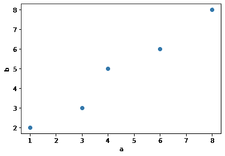

作者图片

正如你所看到的，在 **a** 和 **b** 之间似乎有一种趋势——随着 **a** 增加， **b** 也增加。

> 在统计学中，已知 **a** 和 **b** 有一个**正**协方差。正协方差表示两个随机变量倾向于同时向上或向下移动。

列 **b** 和 **c** 怎么样？让我们看看:

```
plt.scatter(df['b'], df['c'])
plt.xlabel('b')
plt.ylabel('c')
```

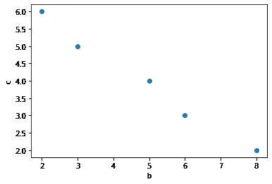

作者图片

这一次，趋势似乎向相反的方向发展——随着 **b** 增加， **c** 减少。

> 在统计学中， **b** 和 **c** 已知具有负**协方差。负协方差表示两个变量倾向于彼此远离，当一个向上移动时，另一个向下移动，反之亦然。**

最后，让我们检查列 **c** 和 **d** :

```
plt.scatter(df['c'], df['d'])
plt.xlabel('c')
plt.ylabel('d')
```

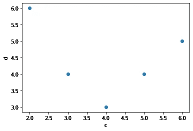

作者图片

**c** 和 **d** 之间似乎不存在直接的线性关系。

> 在统计学中， **c** 和 **d** 已知有**零**协方差(或接近零)。当两个随机变量独立时，协方差将为零。**然而，反过来就不一定了——协方差为零并不意味着两个随机变量是独立的(在协方差为零的两个随机变量之间仍然存在非线性关系)。在上面的例子中，你可以看到存在某种非线性的 v 形关系。**

数学上，**协方差**的公式定义如下:

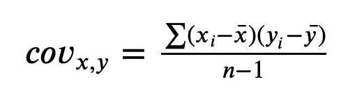

作者图片

计算两个随机变量之间的协方差的方法是，取每个随机变量的值与其平均值之间的差值的乘积，对所有乘积求和，最后除以数据集中值的数量。

像往常一样，让我们使用 NumPy 手动计算 **a** 和 **b** 之间的协方差:

```
#---covariance for a and b---
((df['a'] -  df['a'].mean()) * (df['b'] -  df['b'].mean())).sum() / (df.shape[0] - 1)
# 6.35
```

像方差一样，NumPy 有 **cov()** 函数来直接计算两个随机变量的协方差:

```
np.cov(df['a'],df['b'])
# array([[7.3 , 6.35],
#        [6.35, 5.7 ]])
```

**cov()** 函数的输出是一个包含以下值的 2D 数组:

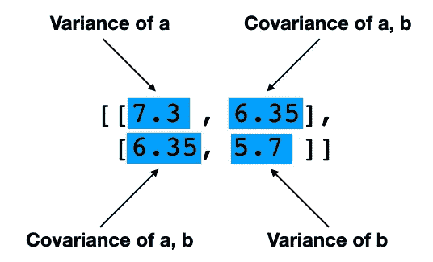

作者图片

在这种情况下，a 和 b 的协方差是 6.35(正协方差)。

以下是 **b** 和 **c** 的协方差(-3.75，负协方差):

```
np.cov(df['b'], df['c'])
# array([[ 5.7 , -3.75],
#        [-3.75,  2.5 ]])
```

以及 **c** 和 **d** 的协方差(-0.5，负协方差):

```
np.cov(df['c'], df['d'])
# array([[ 2.5, -0.5],
#        [-0.5,  1.3]])
```

> 虽然协方差测量 2 个随机变量之间的方向关系，但它不显示 2 个随机变量之间关系的**强度**。其值不受约束，可以从-无穷大到+无穷大。

此外，协方差取决于值的比例。例如，如果您将列 **a** 和 **b** 中的每个值加倍，您将获得不同的协方差:

```
np.cov(df['a']*2, df['b']*2)
# array([[29.2, **25.4**],
#        [**25.4**, 22.8]])
```

测量两个随机变量强度的一个更好的方法是*相关性*，我们将在接下来讨论。

# Cor 关系

两个随机变量之间的相关性测量它们之间存在的线性关系的*强度*和*方向*。有两种方法来衡量相关性:

*   **皮尔逊相关系数** —捕捉两个连续变量之间的*线性*关联的强度和方向
*   **Spearman 等级相关系数**—确定两个有序(分类)或连续变量之间存在的*单调*关系的强度和方向。

## **皮尔逊相关系数**

皮尔逊相关系数的公式为:


作者图片

**皮尔逊相关系数**定义为 x 和 y 的协方差除以每个随机变量的标准差的乘积。

将公式中的**协方差**和标准偏差 **x** 和 **y** 代入，得到:

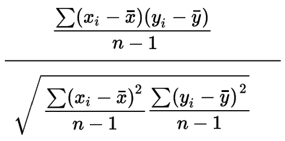

作者图片

简化后，公式现在看起来像这样:

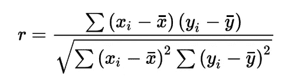

作者图片

Pandas 有一个函数 **corr()** 计算数据帧中各列的相关性:

```
df[['a','b']].corr()
```

结果是:

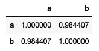

作者图片

对角线值为 1 表示每列与其自身的相关性。显然， **a** 与 **a** 本身的相关性为 1，对于列 **b** 也是如此。 **0.984407** 的值是 **a** 和 **b** 的皮尔逊相关系数。

**b** 和 **c** 的皮尔逊相关系数为 **-0.993399** :

```
df[['b','c']].corr()
```

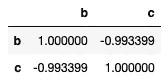

作者图片

**c** 和 **d** 的皮尔逊相关系数为 **-0.27735** :

```
df[['c','d']].corr()
```

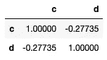

作者图片

像协方差一样，皮尔逊相关系数的符号表示关系的方向。然而，皮尔逊相关系数的值被限制在-1 和 1 之间。根据该值，您可以推导出以下相关度:

*   **完美** —接近 1 的值
*   **高度数** —介于 0.5 和 1 之间的数值
*   **中度** —介于 0.3 和 0.49 之间的值
*   **低度** —低于 0.29 的值
*   **无相关性** —数值接近 0

从上面的结果可以看出， **a，b** ，和 **b，c** 的相关度很高，而 **c，d** 的相关度很低。

> **了解数据集中各列之间的相关性是为机器学习准备数据过程中的一个重要部分。您希望使用与数据集标签相关性最高的列来定型您的模型。**

与协方差不同，相关性不受值的比例影响。作为实验，将列 **a** 和 **b** 相乘，您会发现它们的相关性:

```
df['2a'] = df['a']*2     # multiply the values in a by 2
df['2b'] = df['b']*2     # multiply the values in b by 2
df[['2a','2b']].corr()   # the result is the same as
                         # df[['a','b']].corr()
```

结果与 **a** 和 **b** 相同:

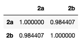

作者图片

## **斯皮尔曼等级相关系数**

如果你的数据不是线性分布，你应该用 **Spearman 的秩相关系数**而不是 **Pearson 相关系数。****斯皮尔曼秩相关系数**是为*单调*的分布设计的。

> 在代数中，**一次函数**是一个梯度从不改变符号的函数。换句话说，它是一个要么总是增加，要么总是减少的函数。接下来的前两个数字是单调的，而第三个不是(因为梯度从左到右改变几次符号)。

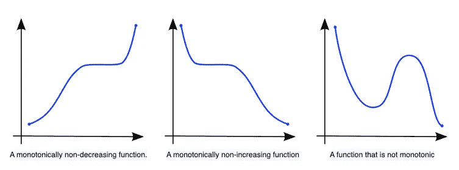

来源:[https://en.wikipedia.org/wiki/Monotonic_function](https://en.wikipedia.org/wiki/Monotonic_function)

斯皮尔曼等级相关系数的公式为:

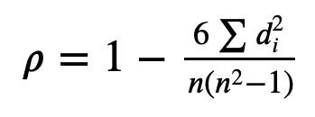

作者图片

其中 **d** 是两个随机变量之间的等级差。举个例子就清楚了。

对于本例，我将有另一个数据帧:

```
df = pd.DataFrame({
    'math'   :[78,89,75,67,60,58,71],
    'science':[91,92,90,80,60,56,84]
})
df
```

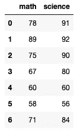

首先将数据可视化是有用的:

```
plt.scatter(df['math'], df['science'])
plt.xlabel('math')
plt.ylabel('science')
```

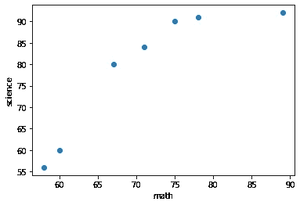

作者图片

这看起来像是单调分布。下一步是在 Pandas 中使用 **rank()** 函数对分数进行排序:

```
df['math_rank'] = df['math'].rank(ascending=False)
df['science_rank'] = df['science'].rank(ascending=False)
df
```

现在，您有两个额外的列包含每个科目的排名:

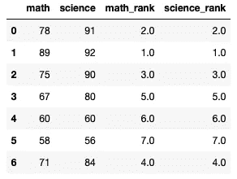

作者图片

让我们再创建两个新列来存储等级与其平方值之间的差异:

```
df['diff'] = df['math_rank'] - df['science_rank']
df['diff_sq'] = np.square(df['diff'])
df
```

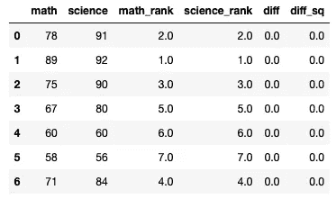

作者图片

现在，您可以使用之前定义的公式计算**斯皮尔曼等级相关系数**:

```
n = df.shape[0]
p = 1 - ((6 * df['diff_sq'].sum()) / (n * (n**2 - 1)))
p   # 1.0
```

你会得到完美的 1.0 分！当然，为了省去手工计算**斯皮尔曼秩相关系数**的所有工作，您可以使用 **corr()** 函数，并为**方法**参数指定“*斯皮尔曼*”:

```
df[['math','science']].corr(method='spearman') 
```

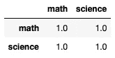

作者图片

如果我们用皮尔逊相关系数来计算相关性会怎么样？

```
df[['math','science']].corr(method='pearson')
```

您会得到以下内容:

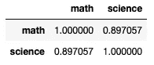

作者图片

> 请注意，我上面列出的 Spearman 等级相关系数公式是针对不同等级的情况(意味着数学或科学分数没有关系)。在等级相同的情况下，公式稍微复杂一点。为了简单起见，我将不进入并列等级的公式。函数 **corr()** 将自动处理并列的等级。

## 你应该使用哪种方法？皮尔逊或斯皮尔曼的

那么应该用哪种方法呢？请记住以下几点:

*   皮尔逊相关描述了 ***线性*** 关系，而斯皮尔曼相关描述了 ***单调*** 关系
*   散点图将有助于可视化数据，如果分布是线性的，请使用皮尔逊相关。如果是单调的，使用 Spearman 相关。
*   您还可以同时应用这两种方法，并检查哪种方法执行得好。例如，如果结果显示 spearman 等级相关系数大于 Pearson 系数，则意味着您的数据具有单调关系，而不是线性关系(就像上面的示例)。

# **总结**

我希望你现在对方差、协方差和相关性的概念有了更清晰的认识。特别是相关性让你知道你的随机变量之间关系的强度和方向，你可以利用**皮尔逊相关系数**(对于线性关系)或**斯皮尔曼等级相关系数**(对于单调关系)方法。

[](https://weimenglee.medium.com/membership) [## 加入媒介与我的介绍链接-李伟孟

### 作为一个媒体会员，你的会员费的一部分会给你阅读的作家，你可以完全接触到每一个故事…

weimenglee.medium.com](https://weimenglee.medium.com/membership)