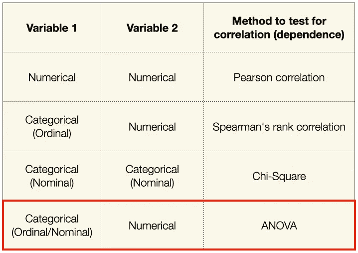
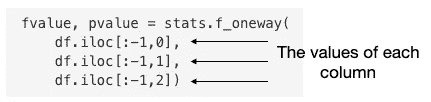

# Python 中的统计数据-使用方差分析进行要素选择

> 原文：<https://towardsdatascience.com/statistics-in-python-using-anova-for-feature-selection-b4dc876ef4f0?source=collection_archive---------4----------------------->

## 了解如何使用 ANOVA 比较分类变量和数值变量


Gabriel Gurrola 在 [Unsplash](https://unsplash.com?utm_source=medium&utm_medium=referral) 上拍摄的照片

在我的上一篇文章中，我谈到了使用卡方统计从数据集中选择用于机器学习的特征。当自变量和因变量都是*分类*变量时，使用卡方检验。但是，如果你的自变量是*分类*，因变量是*数值*呢？在这种情况下，您必须使用另一种称为 ANOVA 的统计测试— **方差分析。**

因此，在本文中，我们的讨论将围绕方差分析以及如何在机器学习中使用它进行特征选择。和我之前所有的文章一样，我将用一个具体的例子来解释这个概念。

在我们开始之前，总结一下我们到目前为止讨论过的不同的特性选择方法是很有用的:



作者图片

如果你需要复习一下**皮尔森相关性**、**斯皮尔曼等级相关性**和**卡方**，我建议你现在就去查阅它们(见下面的链接)，一旦你完成了就回来看这篇文章。本文中讨论的一些概念类似于卡方检验，所以我建议您查看一下。

</statistics-in-python-using-chi-square-for-feature-selection-d44f467ca745>  </statistics-in-python-collinearity-and-multicollinearity-4cc4dcd82b3f>  </statistics-in-python-understanding-variance-covariance-and-correlation-4729b528db01>  

# 什么是方差分析？

ANOVA 用于测试两个变量，其中:

*   一个是*分类*变量
*   另一个是*数值*变量

当分类变量有*至少 3 组*(即三个不同的唯一值)时，使用 ANOVA。

> 如果你只想比较两组，就用 t 检验。我将在另一篇文章中介绍 t-test。

方差分析让你知道你的数值变量是否根据分类变量的水平而变化。

> **ANOVA 使用 f 检验对平均值的相等性进行统计检验**。F-tests 以它的测试统计量 F 命名，F 是为了纪念**罗纳德·费雪爵士**而命名的。

这里有一些例子，可以让你更容易理解什么时候可以使用方差分析。

*   您有一个数据集，其中包含一组人的社交媒体使用情况和睡眠时间信息:


作者图片

你想知道社交媒体的使用量(分类变量)是否对睡眠时间(数字变量)有直接影响。

*   您有一个数据集，其中包含三种不同品牌的药物以及药物生效的天数:


作者图片

你想找出一个特定的品牌和它的有效性之间是否有直接的关系。

> ANOVA 检查关于数字响应的分类特征组之间是否有相等的方差。

如果各组之间的方差相等，这意味着该特征对反应没有影响，因此它(分类变量)不能被考虑用于模型训练。

# 用手演奏阿凡纳

理解方差分析的最好方法是用一个例子。在下面的例子中，我使用了一个虚构的数据集，记录了一组人在喝某种饮料时的反应时间。

## 样本数据集

我有一个名为 **drinks.csv** 的样本数据集，包含以下内容:

```
team,drink_type,reaction_time
1,water,14
2,water,25
3,water,23
4,water,27
5,water,28
6,water,21
7,water,26
8,water,30
9,water,31
10,water,34
1,coke,25 
2,coke,26
3,coke,27
4,coke,29
5,coke,25
6,coke,23
7,coke,22
8,coke,27
9,coke,29
10,coke,21
1,coffee,8
2,coffee,20
3,coffee,26
4,coffee,36
5,coffee,39
6,coffee,23
7,coffee,25
8,coffee,28
9,coffee,27
10,coffee,25
```

总共有 10 个小组——每个小组由 3 人组成。团队中的每个人都有三种不同的饮料——水、可乐和咖啡。喝完饮料后，他们被要求进行一些活动，并记录他们的反应时间。这个实验的目的是确定饮料是否对人的反应时间有任何影响。

让我们首先将数据集加载到熊猫数据框架中:

```
import pandas as pd
df = pd.read_csv('drinks.csv')
```

记录*观察尺寸*，我们稍后会用到:

```
observation_size = df.shape[0]   # number of observations
```


作者图片

# 可视化数据集

使用箱线图直观显示数据的分布非常有用:

```
_ = df.boxplot('reaction_time', by='drink_type')
```


作者图片

你可以看到这三种饮料的平均反应时间差不多。

# 旋转数据框

为了便于计算方差分析，我们需要旋转数据框:

```
df = df.pivot(columns='drink_type', index='team')
display(df)
```


作者图片

列代表三种不同类型的饮料，行代表 10 个队。我们还将利用这个机会记录每组中的*个项目，以及稍后将使用的*组*个项目:*

```
n = df.shape[0]   # 10; number of items in each group
k = df.shape[1]   # 3; number of groups
```


作者图片

# 定义假设

您现在定义您的*零假设*和*替代假设*，就像卡方检验一样。它们是:

*   **H₀** (零假设)——组间均值无差异。
*   **H₁** (替代假设)——至少有一组显著不同于因变量的总体均值。

# 步骤 1 —计算所有组的平均值

我们现在准备开始方差分析的计算。首先，让我们找出每组的平均值:

```
df.loc['Group Means'] = df.mean()
df
```


作者图片

从这里，你现在可以计算出**总的意思是**:

```
overall_mean = df.iloc[-1].mean()
overall_mean    # 25.666666666666668
```


作者图片

# 第二步——计算平方和

现在我们已经计算出了*的总体平均值*，我们可以继续计算如下:

*   所有观察值的平方和— **SS_total**
*   范围内的平方和—**SS _ 范围内**
*   之间的平方和— **SS_between**

## 所有观察值的平方和— **SS_total**

所有观察值的*平方和的计算方法是从*总平均值*中减去每个观察值，然后将所有差值的平方和相加:*


作者图片


作者图片

通过编程， **SS_total** 计算如下:

```
SS_total = (((df.iloc[:-1] - overall_mean)**2).sum()).sum()
SS_total   # 1002.6666666666667
```

## 范围内的平方和— SS_within

在中的*平方和是他们组平均值周围分数的方差之和:*


作者图片

通过编程， **SS_within** 计算如下:

```
SS_within = (((df.iloc[:-1] - df.iloc[-1])**2).sum()).sum() 
SS_within    # 1001.4
```

## 之间的平方和— SS_between

接下来，我们根据总体平均值计算组平均值的平方和:


作者图片


作者图片

通过编程， **SS_between** 计算如下:

```
SS_between = (n * (df.iloc[-1] - overall_mean)**2).sum()
SS_between    # 1.266666666666667
```

您可以验证:

**SS _ total**=**SS _ between**+**SS _ within**

# 创建方差分析表

计算完所有值后，您现在可以完成 ANOVA 表。回想一下，您有以下变量:


作者图片

您可以如下计算各种*自由度*:

```
df_total = observation_size - 1        # 29
df_within = observation_size - k       # 27
df_between = k - 1                     # 2
```

根据上述内容，计算各种*均方*值:

```
mean_sq_between = SS_between / (k - 1)      # 0.6333333333333335
mean_sq_within = \
    SS_within / (observation_size - k)      # 37.08888888888889
```

最后，您可以计算 **F 值**，它是两个方差的比值:

```
F = mean_sq_between / mean_sq_within        # 0.017076093469143204
```

> 回想一下，我之前提到过 ANOVA 使用 f 检验来统计检验均值的相等性。

一旦获得 F 值，你现在必须参考 *f 分布表*(例如参见[http://www.socr.ucla.edu/Applets.dir/F_Table.html](http://www.socr.ucla.edu/Applets.dir/F_Table.html))来获得 **f 临界值**。f 分布表是根据 **α** 值(通常为 0.05)组织的。因此，您需要首先根据 **α=** 0.05 定位表格:


来源:[http://www.socr.ucla.edu/Applets.dir/F_Table.html](http://www.socr.ucla.edu/Applets.dir/F_Table.html)

接下来，观察 f 分布表的列基于 **df1** ，而行基于 **df2** 。你可以从我们之前创建的变量中得到你的 **df1** 和 **df2** :

```
df1 = df_between    # 2
df2 = df_within     # 27
```

使用 **df1** 和 **df2** 的值，您现在可以通过定位 **df1** 列和 **df2** 行来定位**f-临界值**:


来自 http://www.socr.ucla.edu/Applets.dir/F_Table.html 的表格；作者注释

从上图可以看出**f-临界值**为 **3.3541** 。使用该值，您现在可以使用 **F 分布曲线**决定是接受还是拒绝零假设:


作者图片

由于 **f 值** (0.0171，这是我们可以计算的)小于 f 分布表中的 f 临界值，我们接受零假设— **这意味着不同组中没有方差—所有均值都相同**。

> 对于机器学习来说，这个特征——*饮料 _ 类型*，应该 ***而不是*** 被包括在训练中，因为不同类型的饮料似乎对反应时间没有影响。
> 
> 只有当您拒绝零假设时，您才应该包括一个用于训练的特征，因为这意味着饮料类型中的值对反应时间有影响。

# 使用统计模块计算 f 分数

在上一节中，我们手动计算了数据集的 f 值。实际上，有一种更简单的方法—使用 **stats** 模块的 **f_oneway()** 函数来计算 f 值和 p 值:

```
import scipy.stats as stats

fvalue, pvalue = stats.f_oneway(
    df.iloc[:-1,0],
    df.iloc[:-1,1],
    df.iloc[:-1,2])print(fvalue, pvalue)      # 0.0170760934691432 0.9830794846682348
```

**f_oneway()** 函数将组作为输入，并返回方差分析 F 和 p 值:


作者图片

上图中 **f 值**为 **0.0170760934691432** (与我们手动计算的相同) **p 值**为 **0.9830794846682348** 。

注意到 **f_oneway()** 函数接受可变数量的参数:



作者图片

如果有很多组，那么逐个传递所有组的值会非常繁琐。所以，有一个更简单的方法:

```
fvalue, pvalue = stats.f_oneway(
    ***df.iloc[:-1,0:3].T.values** )
```

我将把上面的内容作为一个练习，让你理解它是如何工作的。

# 使用 statsmodels 模块计算 f 分数

另一种计算 f 值的方法是使用 **statsmodel** 模块。您首先使用 **ols()** 函数构建模型，然后在模型的实例上调用 **fit()** 函数。最后，在拟合的模型上调用 **anova_lm()** 函数，并指定要对其执行的 anova 测试的类型:

> 这里有 3 种要执行的方差分析测试，但是它们的讨论超出了本文的范围。

```
import pandas as pd
import statsmodels.api as sm
from statsmodels.formula.api import olsdf = pd.read_csv('drinks.csv')model = ols('reaction_time ~ drink_type', data=df).fit()
sm.stats.anova_lm(model, typ=2)
```

上面的代码片段产生以下结果，这与我们之前计算的 f 值( **0.017076** )相同:


作者图片

**anova_lm()** 函数也返回 p 值( **0.983079** )。您可以利用以下规则来确定分类变量是否对数值变量有任何影响:

*   如果 p < 0.05, this means that the categorical variable has significant influence on the numerical variable
*   if p > 0.05，这意味着分类变量对数值变量没有显著影响

由于 p 值现在是 0.983079 (>0.05)，这意味着**饮料类型**对**反应时间**没有显著影响。

# 摘要

在这篇文章中，我解释了方差分析如何帮助确定一个分类变量是否对一个数字变量有影响。到目前为止，我们讨论的方差分析测试被称为**单向方差分析**测试。方差分析有几个变体:

*   **单向 ANOVA** —用于检查一个数值变量如何响应*一个*独立分类变量的水平
*   **双向 ANOVA**—用于检查一个数值变量如何响应两个独立分类变量的水平
*   **多向 ANOVA** —用于检查一个数字变量如何响应*多个*独立分类变量的水平

使用**双向 ANOVA** 或**多向 ANOVA** ，您可以调查两个(或更多)独立分类变量对一个相关数值变量的综合影响。

希望这篇文章对你有用。敬请期待下一篇文章！

<https://weimenglee.medium.com/membership> 