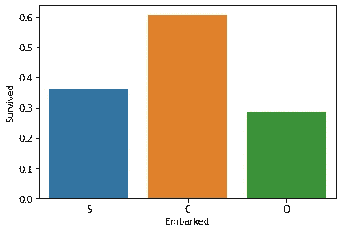
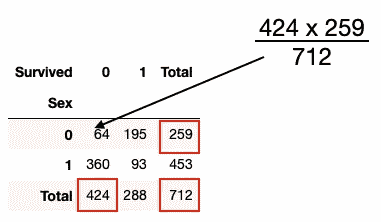

# Python 中的统计数据-使用卡方进行要素选择

> 原文：<https://towardsdatascience.com/statistics-in-python-using-chi-square-for-feature-selection-d44f467ca745?source=collection_archive---------1----------------------->


萨姆·穆卡达姆在 [Unsplash](https://unsplash.com?utm_source=medium&utm_medium=referral) 上拍摄的照片

在我之前的两篇文章中，我谈到了如何测量数据集中各列之间的相关性，以及如何检测它们之间的多重共线性:

</statistics-in-python-understanding-variance-covariance-and-correlation-4729b528db01>  </statistics-in-python-collinearity-and-multicollinearity-4cc4dcd82b3f>  

然而，当你试图比较的变量是*连续的*时，这些技术是有用的。如果你的变量是*分类的*，你如何比较它们？在本文中，我将向您解释如何测试数据集中的两个分类列，以确定它们是否相互依赖(即相关)。我们将使用一个称为**卡方**的统计检验(通常写成 ***χ* 2** )。

在我们开始讨论卡方之前，这里有一个可用于测试各种变量的测试方法的快速总结:


# 使用卡方统计确定两个分类变量是否相关

**卡方( *χ* 2)统计**是一种检查 ***两个分类名义变量*** 之间关系的方法。

> **名义**变量包含没有内在排序的值。名义变量的例子有性别、种族、眼睛颜色、肤色等。**序数**变量，另一方面，包含有排序的值。顺序变量的例子有年级、教育水平、经济状况等。

卡方检验背后的关键思想是将数据中的观察值与期望值进行比较，看它们是否相关。特别是，这是检查两个分类名义变量是否相关的有用方法。这在机器学习中尤其重要，在机器学习中，您只希望将与目标相关的特征用于训练。

卡方检验有两种类型:

*   **卡方拟合优度检验** —检验一个变量是否可能来自给定的分布。
*   **独立性卡方检验** —检验两个变量是否相关。

> 查看[https://www . jmp . com/en _ us/statistics-knowledge-portal/chi-square-test . html](https://www.jmp.com/en_us/statistics-knowledge-portal/chi-square-test.html)以获得关于上述两个卡方测试的更详细讨论。

当比较两个分类变量是否相关时，您将使用独立的**卡方检验。**

# 执行卡方检验的步骤

要使用卡方检验，您需要执行以下步骤:

1.  定义你的*零假设*和*替代假设*。它们是:

*   **H₀** ( *零假设* ) —被比较的两个分类变量相互独立**。**
*   ****H₁** ( *替代假设* ) —被比较的两个分类变量**相互依赖**。**

**2.决定 **α** 值。这是你愿意承担的得出错误结论的风险。举例来说，假设在测试独立性时，您将 **α** =0.05。这意味着你承担了 5%的风险，得出两个变量是独立的结论，而实际上它们并不独立。**

**3.使用两个分类变量计算**卡方** **得分**，并使用它计算 **p 值**。一个 ***低*** p 值意味着你的两个分类变量之间存在一个 ***高*** 相关性(它们相互依赖)。p 值通过卡方评分计算得出。p 值将告诉您测试结果是否有意义。**

> **在卡方分析中，p 值是获得与当前实验中一样大或更大的卡方的概率，但数据仍然支持假设。它是仅仅由于偶然因素而偏离预期的可能性。一般来说，0.05 或更大的 p 值被认为是临界的，任何更小的值都意味着偏差是显著的，被测试的假设必须被拒绝。**
> 
> **来源:[https://passel2.unl.edu/view/lesson/9beaa382bf7e/8](https://passel2.unl.edu/view/lesson/9beaa382bf7e/8)**

**要计算 p 值，您需要两条信息:**

*   ****自由度—** 类别数减 1**
*   ****卡方评分**。**

**如果获得的 p 值为:**

*   **< 0.05 (the **α** 你选择的值)你拒绝 **H₀** ( *零假设*)，接受 **H₁** ( *备择假设*)。这意味着两个分类变量是依赖于*的*。**
*   **> 0.05 你接受 **H₀** ( *零假设*)，拒绝 **H₁** ( *替代假设*)。这意味着这两个分类变量是独立的。**

> **在机器学习的特征选择的情况下，您可能希望与目标进行比较的特征具有较低的**p 值(小于 0.05)，因为这意味着该特征依赖于(相关于)目标。****

**有了计算出来的卡方得分，您还可以使用它来参考**卡方表**来查看您的得分是在拒绝区域还是在接受区域。**

**上面的所有步骤听起来都有点模糊，真正理解卡方如何工作的最好方法是看一个例子。在下一节中，我将使用 Titanic 数据集，并对一些特征进行卡方检验，看看它们是否与目标相关。**

# ****在 Titanic 数据集上使用卡方检验****

**理解一个新话题的好方法是通过一个例子来理解概念。为此，我将使用经典的泰坦尼克号数据集([https://www.kaggle.com/tedllh/titanic-train](https://www.kaggle.com/tedllh/titanic-train))。**

**Titanic 数据集通常用于机器学习，以演示如何建立机器学习模型，并使用它进行预测。具体来说，数据集包含几个特征(**p 类**、**性别**、**年龄**、**上船**等)和一个目标(**幸存**)。数据集中的几个要素是分类变量:**

*   ****p class**-乘客所处的客舱等级**
*   ****性别**-乘客的性别**
*   ****登船**——登船港**
*   ****幸存**——如果乘客幸免于难**

**因为本文探讨了分类特性和目标之间的关系，所以我们只对包含分类值的那些列感兴趣。**

## **加载数据集**

**现在您已经获得了数据集，让我们将它加载到 Pandas 数据框架中:**

```
import pandas as pd
import numpy as npdf = pd.read_csv('titanic_train.csv')
df.sample(5)
```

****

**作者图片**

## **数据清理和特征工程**

**有些列并不真正有用，因此我们将删除它们。此外，还有一些丢失的值，所以让我们删除所有那些值为空的行:**

```
df.drop(columns=['PassengerId','Name', 'Ticket','Fare','Cabin'], 
        inplace=True)
df.dropna(inplace=True)
df
```

****

**作者图片**

**我们还将在 **Parch** (父母或子女)和 **Sibsp** (兄弟姐妹或配偶)列的基础上，单独添加一个名为**的列**。我们想探究的是独自一人是否会影响乘客的存活率。所以如果 **Parch** 和 **Sibsp** 都为 0，则只有**为 1，否则为 0:****

```
df['Alone'] = (df['Parch'] + df['SibSp']).apply(
                  lambda x: 1 if x == 0 else 0)
df
```

****

**作者图片**

## **可视化特征和目标之间的相关性**

**现在，数据已经清理完毕，让我们试着想象一下乘客的性别与他们在事故中的生还率之间的关系:**

```
import seaborn as sns
sns.barplot(x='Sex', y='Survived', data=df, ci=None) 
```

> **性别栏包含名义数据(即排名不重要)。**

****

**作者图片**

**从上图可以看出，所有女乘客中，70%以上生还；在所有的男人中，大约 20%活了下来。似乎在**性别**和**幸存**特征之间存在着非常强的联系。为了证实这一点，我们稍后将使用卡方检验来证实这一点。**

****Pclass** 和**幸存**怎么样？他们有关系吗？**

```
sns.barplot(x='Pclass', y='Survived', data=df, ci=None)
```

****

**作者图片**

**或许不出所料，这表明乘客所处的**等级**越高，乘客的存活率越高。**

**下一个有趣的特征是，出发地点是否决定了谁能幸存，谁不能:**

```
sns.barplot(x='Embarked', y='Survived', data=df, ci=None)
```

****

**作者图片**

**从图表上看，似乎更多从瑟堡出发的人幸存了下来。**

> **C =瑟堡；Q =皇后镇；S =南安普敦**

**你还想知道独自旅行是否会让一个人更有生存能力:**

```
ax = sns.barplot(x='Alone', y='Survived', data=df, ci=None)    
ax.set_xticklabels(['Not Alone','Alone'])
```

****

**作者图片**

**你可以看到，如果一个人与他们的家人在一起，他/她将有更高的生存机会。**

## **可视化每个特征之间的相关性**

**既然我们已经可视化了分类特征与目标之间的关系(**幸存**)，我们现在想要可视化每个特征之间的关系。在此之前，您需要将 **Sex** 和**abowed**列中的标签值转换为数值。为此，您可以使用 **sklearn** 中的 **LabelEncoder** 类:**

```
import numpy as np
import pandas as pd
import matplotlib.pyplot as plt
import seaborn as snsfrom sklearn import preprocessing
le = preprocessing.LabelEncoder()
le.fit(df['Sex'])
df['Sex'] = le.transform(df['Sex'])
sex_labels = dict(zip(le.classes_, le.transform(le.classes_)))
print(sex_labels)le.fit(df['Embarked'])
df['Embarked'] = le.transform(df['Embarked'])
embarked_labels = dict(zip(le.classes_, 
                      le.transform(le.classes_)))
print(embarked_labels)
```

**上面的代码片段对**性别**和**着手**列进行了标签编码。输出显示了每一列的值的映射，这在以后执行预测时非常有用:**

```
{'female': 0, 'male': 1}
{'C': 0, 'Q': 1, 'S': 2}
```

**以下陈述显示了**着手**和**性别**之间的关系:**

```
ax = sns.barplot(x='Embarked', y='Sex', data=df, ci=None)
ax.set_xticklabels(embarked_labels.keys())
```

****

**作者图片**

**似乎从南安普敦( **S** )登船的男性比从皇后镇( **Q** )和瑟堡( **C** )登船的男性多。**

****上船**和**单独**怎么样？**

```
ax = sns.barplot(x='Embarked', y='Alone', data=df, ci=None)
ax.set_xticklabels(embarked_labels.keys())
```

****

**作者图片**

**似乎很大一部分从皇后镇出发的人都是独自一人。**

**最后，让我们看看**性**和**独处**之间的关系:**

```
ax = sns.barplot(x='Sex', y='Alone', data=df, ci=None)
ax.set_xticklabels(sex_labels.keys())
```

****

**作者图片**

**如你所见，独自旅行的男性多于女性。**

## **定义假设**

**你现在定义你的*零假设*和*替代假设*。如前所述，它们是:**

*   ****H₀** ( *零假设* ) —待比较的两个分类变量**相互独立**。**
*   ****H₁** ( *替代假设*)——被比较的两个分类变量**相互依赖**。**

**您根据以下 p 值条件得出结论:**

*   **p< 0.05 — this means the two categorical variables are **关联 。****
*   **p > 0.05 —这意味着两个分类变量是 ***而不是*** ***相关*** 。**

## **手动计算χ2**

**让我们手动浏览计算χ2 值的步骤。第一步是创建一个*列联表*。以**性别**和**幸存**列为例，首先创建一个列联表:**

****

**作者图片**

**上面的列联表显示了两个分类列的频率分布——**性别**和**幸存**。**

****自由度**接下来被计算为 ***(行数-1) *(列数-1)*** 。在本例中，自由度为(2–1)*(2–1)=**1**。**

**创建列联表后，汇总所有行和列，如下所示:**

****

**作者图片**

**以上是你的*观测值*。**

**接下来，您将计算*期望值*。以下是它们的计算方法:**

*   **将观察值中的每个值替换为其列的总和与其行的总和的乘积除以总和。**

**下图显示了如何计算第一个值:**

****

**作者图片**

**下图显示了如何计算第二个值:**

****

**作者图片**

**以下是*预期*值的结果:**

****

**作者图片**

**然后，使用公式 ***χ* 2** 计算每个单元格的**卡方值**:**

****

**作者图片**

**将此公式应用于*观察值*和*预期值*，您得到卡方值:**

****

**作者图片**

****卡方值**是卡方值的总和:**

****

**作者图片**

**您可以使用以下网站来验证这些数字是否正确:**

*   ****卡方计算器**——【https://www.mathsisfun.com/data/chi-square-calculator.html】T4**

**上述步骤的 Python 实现包含在下面的 **chi2_by_hand()** 函数中:**

```
def **chi2_by_hand**(df, col1, col2):    
    #---create the contingency table---
    df_cont = pd.crosstab(index = df[col1], columns = df[col2])
    display(df_cont) #---calculate degree of freedom---
    degree_f = (df_cont.shape[0]-1) * (df_cont.shape[1]-1) #---sum up the totals for row and columns---
    df_cont.loc[:,'Total']= df_cont.sum(axis=1)
    df_cont.loc['Total']= df_cont.sum()
    print('---Observed (O)---')
    display(df_cont) #---create the expected value dataframe---
    df_exp = df_cont.copy()    
    df_exp.iloc[:,:] = np.multiply.outer(
        df_cont.sum(1).values,df_cont.sum().values) / 
        df_cont.sum().sum()            
    print('---Expected (E)---')
    display(df_exp)

    # calculate chi-square values
    df_chi2 = ((df_cont - df_exp)**2) / df_exp    
    df_chi2.loc[:,'Total']= df_chi2.sum(axis=1)
    df_chi2.loc['Total']= df_chi2.sum()

    print('---Chi-Square---')
    display(df_chi2) #---get chi-square score---   
    chi_square_score = df_chi2.iloc[:-1,:-1].sum().sum()

    return chi_square_score, degree_f
```

****chi2_by_hand()** 函数接受三个参数——包含所有列的 dataframe，后面是两个字符串，包含要比较的两个列的名称。它返回一个元组——卡方得分加上自由度。**

**现在让我们使用 Titanic 数据集测试上面的函数。首先，让我们比较一下**性别**和**幸存的**列:**

```
chi_score, degree_f = **chi2_by_hand(df,'Sex','Survived')**
print(f'Chi2_score: {chi_score}, Degrees of freedom: {degree_f}')
```

**您将看到以下结果:**

```
Chi2_score: 205.1364846934008, Degrees of freedom: 1
```

**使用卡方得分，您现在可以使用**卡方分布曲线**决定是接受还是拒绝零假设:**

****

**作者图片**

**x 轴代表 *χ* 2 分数。临界卡方区域**右侧的区域**被称为**剔除区域**。它左边的区域称为**接受区域**。如果您获得的卡方得分落在可接受区域内，则零假设被接受；否则另一个假设被接受。**

**那么如何获得**临界卡方区域**？为此，您必须检查**卡方表**:**

****

**表来自[https://people . SMP . uq . edu . au/YoniNazarathy/stat _ models _ B _ course _ spring _ 07/distributions/chisqtab . pdf](https://people.smp.uq.edu.au/YoniNazarathy/stat_models_B_course_spring_07/distributions/chisqtab.pdf)；作者注释**

> **你可以在 https://www.mathsisfun.com/data/chi-square-table.html 的[查看**卡方表**](https://www.mathsisfun.com/data/chi-square-table.html)**

**这就是卡方表的使用方法。当您的 **α** 设置为 0.05，并且 **1** 自由度时，临界卡方区域为 **3.84** (参考上图)。将该值放入卡方分布曲线，您可以得出以下结论:**

****

**作者图片**

*   **由于计算的卡方值( **205** )大于 **3.84** ，因此它落在*拒绝区域*，因此零假设被拒绝，而**替代假设被接受**。**
*   **回想一下我们的替代假设: **H₁** ( *替代假设* ) —被比较的两个分类变量**相互依赖**。**

> **这意味着**列中的**和**列中的**列是相互依赖的。**

**作为练习，您可以在其他功能上使用 **chi2_by_hand()** 功能。**

## **计算 p 值**

**上一节展示了如何通过检查卡方得分并将其与卡方分布曲线进行比较来接受或拒绝零假设。**

**接受或拒绝零假设的另一种方法是使用 *p 值*。请记住，可以使用卡方得分和自由度计算 p 值。**

> **为简单起见，我们将不详细讨论如何手工计算 p 值。**

**在 Python 中，可以使用 **stats** 模块的 **sf()** 函数计算 p 值:**

```
def chi2_by_hand(df, col1, col2):    
    #---create the contingency table---
    df_cont = pd.crosstab(index = df[col1], columns = df[col2])
    display(df_cont) ... chi_square_score = df_chi2.iloc[:-1,:-1].sum().sum()

    **#---calculate the p-value---
    from scipy import stats
    p = stats.distributions.chi2.sf(chi_square_score, degree_f)** return chi_square_score, degree_f**, p**
```

**您现在可以调用 **chi2_by_hand()** 函数并获得 chi_square 分数、自由度和 p 值:**

```
chi_score, degree_f**, p** = chi2_by_hand(df,'Sex','Survived')
print(f'Chi2_score: {chi_score}, Degrees of freedom: {degree_f}**,** **p-value: {p}**')
```

**上述代码会产生以下 p 值:**

```
Chi2_score: 205.1364846934008, Degrees of freedom: 1, **p-value: 1.581266384342472e-46**
```

**快速回顾一下，您接受或拒绝假设，并根据以下 p 值条件形成您的结论:**

*   **p< 0.05 — this means the two categorical variables are **关联 。****
*   **p > 0.05 —这意味着两个分类变量是 ***而不是*** ***相关*** 。**

**并且由于**p<0.05**——这意味着两个分类变量是 ***相关*** 。**

## **尝试其他功能**

**让我们尝试包含名义值的分类列:**

```
chi_score, degree_f, p = chi2_by_hand(df,'**Embarked**','**Survived**')
print(f'Chi2_score: {chi_score}, Degrees of freedom: {degree_f}, p-value: {p}')# Chi2_score: 27.918691003688615, Degrees of freedom: 2, 
# p-value: **8.660306799267924e-07** chi_score, degree_f, p = chi2_by_hand(df,'**Alone**','**Survived**')
print(f'Chi2_score: {chi_score}, Degrees of freedom: {degree_f}, p-value: {p}')# Chi2_score: 28.406341862069905, Degrees of freedom: 1, 
# p-value: **9.834262807301776e-08**
```

**由于**着手**和**单独**的 p 值都是< 0.05，您可以得出结论，即**着手**和**单独**特征都与**幸存**目标相关，并且应该包括在您的模型中用于训练。**

# **摘要**

**在本文中，我简要介绍了卡方统计测试的工作原理，以及如何将它应用于 Titanic 数据集。这里需要注意的是:**

1.  **当**皮尔逊系数**和**斯皮尔曼等级系数**测量两个变量之间关联的*强度*时，**卡方检验**测量两个变量之间关联的*显著性*。它告诉你的是，你在样本中发现的关系是否有可能存在于总体中，或者由于抽样误差而偶然出现的可能性有多大。**
2.  **卡方检验对你的列联表中的小频率很敏感。一般来说，如果列联表中的某个单元格的频率等于或小于 5，那么卡方检验将导致结论错误。此外，如果样本量小于 50，则不应使用卡方检验。**

**我希望您现在对卡方如何工作以及如何将其用于机器学习中的特征选择有了更好的理解。我的下一篇文章再见！**

**<https://weimenglee.medium.com/membership> **