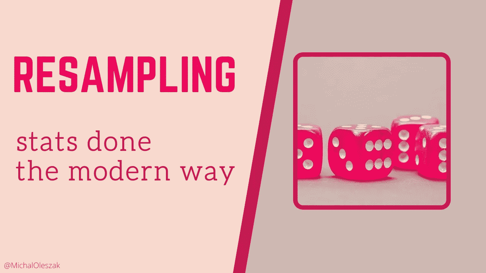
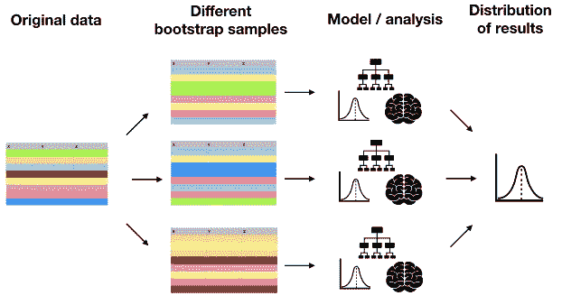
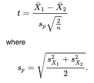
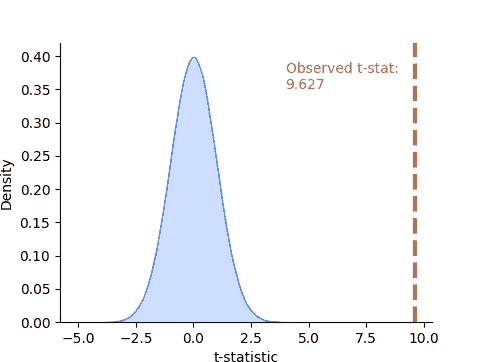
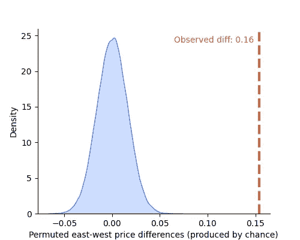
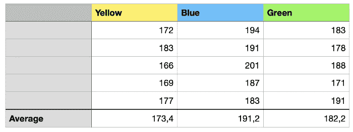
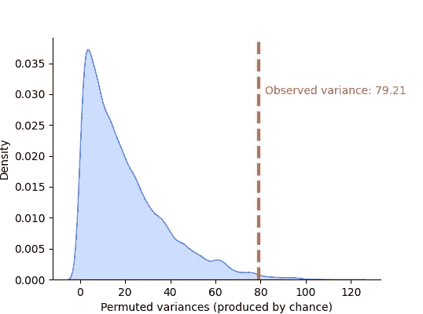
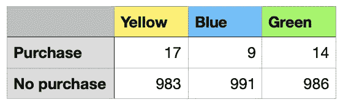

# 统计死了，统计万岁！

> 原文：<https://towardsdatascience.com/statistics-is-dead-long-live-statistics-df6c71262187?source=collection_archive---------13----------------------->

## 认识一下重采样，这是一种通用的现代统计方法



估计[置信区间](/confidence-intervals-vs-prediction-intervals-7b296ae58745)和[假设检验](/the-hypothesis-testers-guide-75f7db2e4d0d)是两种常见的统计任务。他们周围有一种神秘的气氛，因为他们依赖于伴随着复杂和特定案例假设的数学。虽然这仍然是许多人做统计的方式，但我认为这不是最好的方式。现代计算能力使我们能够利用更容易理解且没有假设和近似的重采样方法。

在过去，当计算能力只是我们今天拥有的一小部分时，统计学家别无选择，只能求助于数学函数，如 t 分布来逼近[抽样分布](/central-limit-theorem-70b12a0a68d8)。从评估回归系数的显著性，到计算置信区间，再到 A/B 测试，t 统计数据随处可见。然而，这些天来，我们可以放弃这种重假设的方法，转而支持重采样方法。

**重采样**归结为从数据中重复采样值，以评估从这些数据计算的统计数据中的随机可变性。它有两种主要口味:

*   **自举**，用于评估估计或预测的可靠性。它可以用来计算置信区间或预测区间([不要混淆这两者！](/confidence-intervals-vs-prediction-intervals-7b296ae58745))，以提高机器学习模型的准确性(如 bagging，或 bootstrap aggregating，随机森林和许多 [boosting 模型](/boost-your-grasp-on-boosting-acf239694b1)的基础)，或[估计输入缺失数据的不确定性](/uncertainty-from-imputation-8dbb34a19612)。
*   **置换**，用于[假设检验](/the-hypothesis-testers-guide-75f7db2e4d0d)。

让我们来看看它们中的每一个，以及如何使用它们以一种没有数学和假设、标准化、容易出错的方式来解决常见问题。


# 拔靴带

> **Bootstrapping** 简单来说就是用替换从原始数据中抽取许多样本。这些被称为引导样本，因为我们是用替换来绘制的，所以同一个数据点可能在一个引导样本中出现多次。这样做的目的是模拟从一个假设的总体中获得许多样本，这样我们就可以观察到抽样的不确定性。然后，我们对每个独立的 bootstrap 样本执行所需的计算，并将结果合并到反映其可变性的某些感兴趣的统计分布中。
> (引自[我的关于自举置信区间的文章](/confidence-intervals-vs-prediction-intervals-7b296ae58745))



改编自作者在 DataCamp 讲授的 R 课程中的[用插补处理缺失数据。](http://datacamp.com/courses/handling-missing-data-with-imputations-in-r)

bootstrap 是一种统一的标准化方法。无论你想要实现什么，你总是遵循相同的步骤:用替换抽取许多样本，计算每个样本上你关心的任何东西，将所有样本的结果组合成一个分布，并使用这个分布来了解你的估计的可变性。让我们看一些例子。

> Bootstrap 从数据中抽取替换样本来测量采样不确定性。它有无数的用例。

## 示例 1:在 A/B 测试中引导置信区间

南加州的房子比该州北部的更宽敞吗？让我们根据[加州住房数据](https://scikit-learn.org/stable/datasets/real_world.html#california-housing-dataset)进行一次 A/B 测试！

要做到这一点，我们可以按纬度中位数分割数据，比较南方的平均房价(222k 美元)和北方的平均房价(191k 美元)，得出 31k 美元的差额。请注意，数据集和价格都是 1997 年的——希望它们是今天的价格，不是吗？

这种差异显著吗？或者，如果我们收集了另一部分数据，我们会得到一个不同的数字，甚至可能是负数？置信区间就是答案。95%置信区间告诉我们，如果我们收集了许多其他关于加州房屋的数据集，并对每个数据集进行了这样的 A/B 测试，在 95%的情况下，南方和北方价格之间的真正平均差异(如果我们有加州所有房屋的数据，我们就会知道)将被区间覆盖。

以下是如何通过引导计算我们的 A/B 测试的 95% CI:

```
Mean diff: 0.30806777712026046
95% CI: [0.28223704 0.33397099]
```

我们可以 95%确定 28k-33k 区间包含了真正的差异，所以是的，南方的房子很可能更贵。多亏了 bootstrap，我们可以在不假设价格服从正态分布的情况下这么说(事实显然并非如此)。这是由于[中心极限定理](/central-limit-theorem-70b12a0a68d8)的魔力——bootstrap 样本是随机的，因此是独立的，因此它们的均值差异是正态分布的。

## 示例 2:均值的自举标准误差

让我们继续研究加州的住房数据，看看 1997 年该州的平均房龄是多少，以及它的[标准误差是多少。](/central-limit-theorem-70b12a0a68d8)我们可以计算出数据中的平均房龄为 28.6 年，但是这个样本估计值对于加州房屋的总体准确度如何呢？让我们自举看看！

```
Average mean: 28.6383311627907
Standard error: 0.08733193966359917
```

平均房龄的 bootstrap 估计与我们在数据中观察到的情况相对应，我们也得到了 0.08 年的 bootstrap 标准差，接近一个月。这表明我们对平均年龄的估计相当准确！

## 示例 3:引导预测间隔

在我的上一篇文章中，我已经写了信心和预测区间的区别。这篇文章包括在回归模型环境中引导两者的代码——不要犹豫，绕道去看看吧！

[](/confidence-intervals-vs-prediction-intervals-7b296ae58745) [## 置信区间与预测区间

### 混淆这两者可能代价高昂。了解它们的不同之处以及何时使用它们！

towardsdatascience.com](/confidence-intervals-vs-prediction-intervals-7b296ae58745) 

## 示例 4:引导和缺失数据

在处理不完整的数据时，通常的做法是使用某种插补方法来填补缺失值，然后对这种填补的数据集进行分析或训练模型。这是一种可怕的做法！

这种方法完全忽略了一个事实，即估算值只是带有一些不确定性的估计值，而这种不确定性会转移到基于估算数据的任何模型或分析中。换句话说，我们报告的任何模型预测或统计估计都应该伴随一些可变性测量，包括插补的不确定性。我在这里写了[(一个 R 例子)](/uncertainty-from-imputation-8dbb34a19612)和[(处理缺失数据的一般说明)](/handling-missing-data-5be11eddbdd)。

再一次，bootstrap 来帮忙了！我们需要从不完整的数据集中提取 bootstrap 样本，单独估算它们中的每一个，分别对它们中的每一个训练一个模型，然后将来自所有这些模型的预测组合成一个分布。然后，我们可以根据该分布计算区间或标准差，以量化部分来自插补的预测中的不确定性。

## 自举:警告的话

自举似乎像魔术一样管用。它让我们逼近任何我们想要的量，甚至是那些经典统计学不知道公式的量，并告诉我们其估计的不确定性，所有这些都是无假设的。

但是不要忘记，bootstrap 不会创建更多的数据，也不会补偿一个小样本。只有当我们拥有的数据代表了感兴趣的人群时，它才起作用。如果是这样的话，那么 bootstrapping 告诉我们，如果我们收集了更多的数据，情况会怎样。


# 排列测试

除了自举，第二种重采样方法是置换。在概率论中，一组项目的排列只是这个集合中项目的重新排序。例如，数字集合`[1, 2, 3]`可以以五种不同的方式排列，以获得以下集合:`[1, 3, 2]`、`[2, 1, 3]`、`[2, 3, 1]`、`[3, 1, 2]`和`[3, 2, 1]`。这个简单的想法使我们能够以一种无公式的方式进行假设检验，以一种易于解释和理解的方式，并且不依赖于分布假设，而这在经典的检验方法中是典型的情况。

为了理解排列测试是如何工作的，我们需要快速回顾一下经典假设测试(更深入的阐述，请查看本文)。为了保持冷静，我们将再次查看加州住房数据。这次我们来测试一下这个州东部和西部的房价是不是一样的。

## 经典假设检验

我们要进行的测试是均值差异测试:我们想知道东部的平均房价(数据中为 21.5 万美元)与西部的平均房价(数据中为 19.9 万美元)是否相同。观察到的 16k 美元的差异是随机的结果，还是东部的房子真的更贵？t-test 很好地服务了这个用例。让我们一步一步地完成测试过程。

1.  首先，我们需要建立我们的假设。零假设将是东部的平均房价等于西部的平均房价，我们将试图拒绝它，支持另一个假设，即它们不相等。
2.  接下来，我们需要一个叫做*测试统计的东西。*一个测试统计量是根据某种公式计算出来的一个单一的数字，特定于我们正在进行的测试。它必须满足两个条件:它需要从数据中计算出来，我们需要知道它的分布，假设零假设为真。幸运的是，我们测试均值差异的案例在几年前就已经得到了充分的研究，我们知道，如果平均价格相等(零假设为真)，并且我们观察到平均值中的一些差异只是由于偶然因素，那么下面的测试统计量具有 t 分布。



t 统计公式，截屏来自维基百科。

3.上面带破折号的 *X* s 表示两组(东部和西部)的平均价格， *s* 是价格的方差， *n* 是观察的次数，假设两组相同。我们可以用这个公式来计算我们的测试统计。

```
t-stat: 9.627149556121305
```

4.最后，我们需要利用这样一个事实，即我们知道如果零假设为真，那么我们的 t 统计量具有一个自由度为 *(2*n)-2* 的 t 分布。看起来是这样的:



检验统计量:相对于观察值的空值分布。图片由作者提供。

由此，我们得出结论，如果零假设为真(如果东西方的平均价格相同)，那么我们获得的 t 统计值几乎不可能得到。这意味着最有可能的是，null 是假的，我们应该拒绝它:平均价格不同。

5.我们可以通过计算 p 值来量化这个决定。p 值是假设空值为真，我们可以从数据中得到实际检验统计值的概率(或者更极端的概率)。换句话说，蓝色质量的百分比位于虚线的右侧，在这种情况下似乎接近于零。让我们来计算一下，这次使用一个 *scipy* 函数。调用`scipy.stats.ttest_ind(price_east, price_west)`给我们以下输出:

```
Ttest_indResult(
    statistic=9.627692430826853, 
    pvalue=6.791637088718439e-22
)
```

您可以看到 9.627 的测试统计值与我们的手动计算相匹配，并且 p 值实际上为零。因此，我们拒绝零假设。唷！

请注意，我们是如何依赖基于多种假设的 t 统计量的近似公式的。我们已经隐含地假设，对于西方和东方的价格，方差和观察次数是相同的。我们还假设这两个数据子样本是独立的并且是正态分布的。最后，样本量要足够大。我们已经有了五个假设，其中一些显然不成立(价格很少是正态分布的！).

> 经典假设检验带有大量特定案例的假设。在更复杂的情况下，可能没有现成的公式。置换测试解决了这两个问题。

当然，您可以调整公式以满足您的需求，但首先，另一个公式将带有另一组隐藏的假设，其次，在比简单的 t 测试更复杂的情况下，封闭形式的公式甚至可能不为您的特定用例所知。进入排列测试！

## 简而言之，置换测试

排列测试背后的一般思想是获取所有可用的数据并随机排列。这对应于没有影响的无效假设。接下来，我们从这个组合和置换的数据集中重复抽取样本(没有替换)，计算感兴趣的量，并将它们组合成一个分布。我们知道，这种分布体现了由于排列步骤而偶然产生的变化。最后，我们将我们在数据中观察到的感兴趣的数量与其随机变化的分布进行比较。如果它正好位于这个分布中，我们就没有证明任何东西——没有证据可以拒绝零假设，因为我们的结果可能是偶然产生的。然而，如果我们的观察值发现自己远离分布，我们有理由说它不可能是偶然产生的，我们拒绝零假设。我们还可以计算 p 值，就像在经典测试中一样。实践中来看看吧！

## 示例 1:t 测试的排列测试

在我们的东西价格测试中，我们需要组合所有的价格，重复排列它们，创建两组与原始组匹配的大小，并计算平均价格的差异。这样，我们得到了偶然产生的差异的分布。让我们将其与我们观察到的 16k 的差异进行比较。



置换差异与观察差异。图片由作者提供。

我们观察到的东西方平均价格的差异比偶然产生的要大得多，因此我们将拒绝零假设。我们通过计算 p 值来量化一下。由于 p 值是红线右侧蓝色质量的比例，我们可以很容易地计算如下。

在这个非常明显的例子中，p 值当然为零，就像在经典测试中一样。

## 示例 2:方差分析的排列测试

以非常相似的方式，我们可以运行 A/B/C 测试，称为方差分析，或 ANOVA。假设我们正在为我们的网站测试不同的颜色主题，目的是吸引用户。

> 作为实验的一部分，我们随机向用户展示了不同的网站变体，并计算了他们在网站上花费的时间。下面是 15 个用户的数据(五个显示黄色版本，另外五个显示蓝色版本，最后五个显示绿色版本)。自然地，为了使这样的实验有效，我们需要 15 个以上的用户，这只是一个演示。我们感兴趣的是均值之间的差异在多大程度上大于随机产生的差异。如果它们非常大，那么我们可以得出结论，颜色确实影响了网站的停留时间。
> (引自[我关于概率分布的文章](/6-useful-probability-distributions-with-applications-to-data-science-problems-2c0bee7cef28))



花在网站不同颜色变体上的时间。图片由作者提供。

虽然我们可以基于统计理论和 f 分布来做这件事(查看本文中[的 f 分布部分来了解如何做这件事)，我们也可以使用排列测试。](/6-useful-probability-distributions-with-applications-to-data-science-problems-2c0bee7cef28)

```
p-value: 0.00844
```

让我们将观察到的方差可视化在置换方差之上。



置换方差与观察方差。图片由作者提供。

你会发现 p 值非常接近我们按照经典 f 检验方法得到的值[。由于它相当小，我们得出结论，颜色确实影响网站的粘性。](/6-useful-probability-distributions-with-applications-to-data-science-problems-2c0bee7cef28)

## 例 3:卡方检验的排列检验

χ2 或卡方检验在某种意义上是离散数据方差分析的一个版本。再次考虑网站的三种颜色。这一次，我们测量的不是在网站上花费的时间(一个连续变量)，而是通过网站购买的次数(一个离散变量)。我们想知道哪种颜色的购买量最大。每种颜色都向 1000 名用户展示过，结果如下:



网站色彩实验结果。图片由作者提供。

我们可以运行一个经典的 chi2 测试(见这里的[如何做](/6-useful-probability-distributions-with-applications-to-data-science-problems-2c0bee7cef28))但是一个无假设置换测试可能是一个更好的选择。

> 第一步是假设三个网站版本平均产生相同的购买数量(我们的零假设)。如果这是真的，我们预计每个版本的购买次数都是一样的，应该是`(17+9+14)/3`，或者 13.33 次购买。
> (引自[我关于概率分布的文章](/6-useful-probability-distributions-with-applications-to-data-science-problems-2c0bee7cef28))

因此，在我们的排列测试中，我们通过假设所有网站颜色中有 40 次购买和 2960 次未购买，生成一个随机生成的统计分布，并从中取样。我们感兴趣的 chi2 统计量是置换购买和预期购买之间的平方差之和。

```
p-value: 0.270826
```


置换与观察到的 chi2 统计。图片由作者提供。

高 p 值让我们得出结论，不同颜色网站购买数量的差异可能仅仅是随机因素造成的。

有趣的是，经典卡方检验中使用的 *χ* 2 分布实际上只是检验统计量的真实分布的近似值。出于这个原因，从我们的置换测试中重新采样的 p 值与我们从经典测试中得到的值略有不同[(我们得到 0.3)。这是支持重采样方法的又一个证据——这里不需要近似。](/6-useful-probability-distributions-with-applications-to-data-science-problems-2c0bee7cef28)


# 来源

本文中的一些想法和代码基于:
Bruce，Bruce & Gedeck (2020)，*数据科学家实用统计学，*第二版，O'Reilly


感谢阅读！

如果你喜欢这篇文章，为什么不订阅电子邮件更新我的新文章呢？并且通过 [**成为媒介会员**](https://michaloleszak.medium.com/membership) ，可以支持我的写作，获得其他作者和我自己的所有故事的无限访问权限。

需要咨询？你可以问我任何事情，也可以在这里 为我预约 1:1 [**。**](http://hiretheauthor.com/michal)

你也可以试试我的其他文章。不能选择？从这些中选择一个:

[](/confidence-intervals-vs-prediction-intervals-7b296ae58745) [## 置信区间与预测区间

### 混淆这两者可能代价高昂。了解它们的不同之处以及何时使用它们！

towardsdatascience.com](/confidence-intervals-vs-prediction-intervals-7b296ae58745) [](/the-hypothesis-testers-guide-75f7db2e4d0d) [## 假设检验者指南

### 一个简短的关于为什么可以拒绝假说，但不能接受它们的入门书，有例子和视觉效果。

towardsdatascience.com](/the-hypothesis-testers-guide-75f7db2e4d0d) [](/establishing-causality-part-1-49cb9230884c) [## 建立因果关系:第 1 部分

### 随机实验的黄金标准

towardsdatascience.com](/establishing-causality-part-1-49cb9230884c)