# 统计和 R 是 2 岁

> 原文：<https://towardsdatascience.com/stats-and-r-is-2-years-old-5cdd15455fc1?source=collection_archive---------31----------------------->

## 了解如何使用{ googleAnayticsR } R 软件包跟踪页面浏览量、会话、用户参与度和更多 Google 分析数据


照片由[米切尔·罗](https://unsplash.com/@mitchel3uo?utm_source=medium&utm_medium=referral)

# 介绍

tats 和 R 正好在两年前推出。就像去年的一样，我认为这是一个很好的时机，通过分享一些关于博客受众的数据来对过去的 12 个月做一个回顾。

这篇文章不是炫耀我的数字，而是展示如何使用谷歌分析数据分析你的博客或网站流量的一种方式。关于我的博客的读者的数据对你来说可能是无用的(我相信，不应该与此相比)。然而，这篇文章中使用的代码可以在你自己的博客或网站上重复使用(前提是你也使用 Google Analytics 来跟踪你的受众)。

请注意，我使用了`{googleAnalyticsR}` R 包来分析我博客的 Google Analytics 数据。如果您不熟悉这个包，请先查看[先决条件](https://statsandr.com/blog/track-blog-performance-in-r/#prerequisites)。

如果您已经使用了该软件包，您可以选择如下的帐户(确保使用您自己的属性名称编辑代码):

```
library(googleAnalyticsR)accounts <- ga_account_list()# select the view ID by property name
view_id <- accounts$viewId[which(accounts$webPropertyName == "statsandr.com")]
```

除此之外，我还假设您对`[{ggplot2}](https://statsandr.com/blog/graphics-in-r-with-ggplot2/)`有基本的了解——这是一个流行的 R 包，用于绘制漂亮的图形和可视化效果。

# 分析学

去年我主要关注的是节数。今年，我主要关注页面浏览量来说明一个不同的指标。

供您参考，**会话**是在给定时间范围内发生的一组用户与您网站的交互，而**页面视图**顾名思义，被定义为您网站上某个页面的视图。

您可以随时通过编辑下面代码中的`metrics = c("pageviews")`来更改指标。在这篇[文章](https://ga-dev-tools.appspot.com/dimensions-metrics-explorer/)中查看 Google Analytics 提供的所有可用指标。

# 用户和页面视图

至于[去年的点评](https://statsandr.com/blog/track-blog-performance-in-r/)，先说一些大概的数字，比如整个网站的**用户数和浏览量**。

请注意，我们仅分析去年的流量，因此我们提取 2020 年 12 月 16 日至昨天(2021 年 12 月 15 日)的数据:

```
# set date range
start_date <- as.Date("2020-12-16")
end_date <- as.Date("2021-12-15")# get Google Analytics (GA) data
gadata <- google_analytics(view_id,
  date_range = c(start_date, end_date),
  metrics = c("users", "pageviews"),
  anti_sample = TRUE # slows down the request but ensures data isn't sampled
)gadata##    users pageviews
## 1 549360    876280
```

在过去的一年里，Stats and R 吸引了 **549，360 名用户**(访问该网站的新老用户数量)，他们总共产生了 **876，280 次页面浏览量**。

这意味着 2021 年每天平均有 2，401 次页面浏览，而 2020 年每天有 1，531 次页面浏览(增长了 56.81%)。

# 一段时间内的页面访问量

分析博客受众的第一个有趣指标是流量随时间的演变。

随着时间的推移，**页面浏览量的每日数量**可以用[散点图](https://statsandr.com/blog/descriptive-statistics-in-r/#scatterplot)呈现出来——连同一条平滑的线——来分析你的博客的受众的**演变**:

```
# get the Google Analytics (GA) data
gadata <- google_analytics(view_id,
  date_range = c(start_date, end_date),
  metrics = c("pageviews"), # edit for other metrics
  dimensions = c("date"),
  anti_sample = TRUE # slows down the request but ensures data isn't sampled
)# load required libraries
library(dplyr)
library(ggplot2)# scatter plot with a trend line
gadata %>%
  ggplot(aes(x = date, y = pageviews)) +
  geom_point(size = 1L, color = "steelblue") + # change size and color of points
  geom_smooth(color = "steelblue", alpha = 0.25) + # change color of smoothed line and transparency of confidence interval
  theme_minimal() +
  labs(
    y = "Page views",
    x = "",
    title = "Evolution of daily page views",
    subtitle = paste0(format(start_date, "%b %d, %Y"), " to ", format(end_date, "%b %d, %Y")),
    caption = "Data: Google Analytics data of statsandr.com"
  ) +
  theme(plot.margin = unit(c(5.5, 17.5, 5.5, 5.5), "pt")) + # to avoid the plot being cut on the right edge
  scale_y_continuous(labels = scales::comma) # better y labels
```

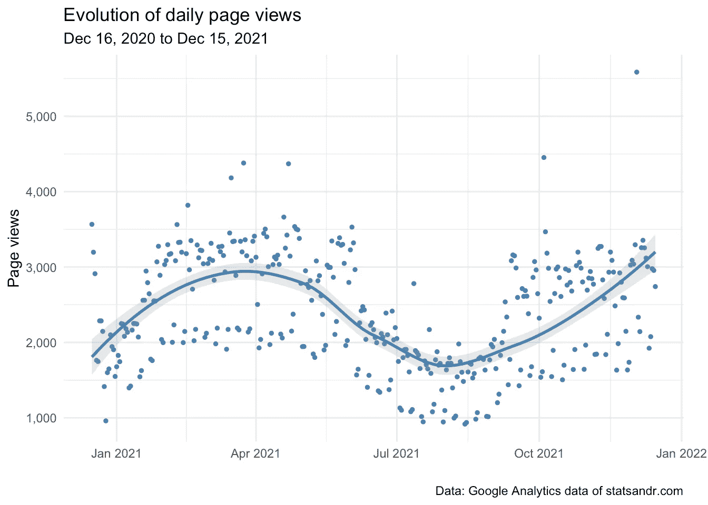

作者图片

尽管页面浏览量变化很大(异常值[在一天内超过 5000 次页面浏览量，有些日子低至不到 1000 次页面浏览量)，但它似乎是周期性的，在夏季会有所下降。值得注意的是，去年出现了同样的下降，可能是因为人们在暑假期间不太可能阅读关于](https://statsandr.com/blog/outliers-detection-in-r/)[统计](https://statsandr.com/tags/statistics/)和 [R](https://statsandr.com/tags/r/) 的帖子。

因此，如果你在博客中写一些技术方面的东西，夏季的低数据可能是意料之中的，并不一定意味着你的网站有问题。

# 每个频道的页面访问量

了解人们如何访问你的博客也是一个非常重要的因素。

以下是如何在[线图](https://statsandr.com/blog/descriptive-statistics-in-r/#line-plot)中可视化每个频道每日页面浏览量的变化:

```
# Get the data
trend_data <- google_analytics(view_id,
  date_range = c(start_date, end_date),
  dimensions = c("date"),
  metrics = "pageviews",
  pivots = pivot_ga4("medium", "pageviews"),
  anti_sample = TRUE # slows down the request but ensures data isn't sampled
)# edit variable names
names(trend_data) <- c("Date", "Total", "Organic", "Referral", "Direct", "Email", "Social")# Change the data into a long format
library(tidyr)
trend_long <- gather(trend_data, Channel, Page_views, -Date)# Build up the line plot
trend_long %>%
  filter(Channel != "Total") %>%
  ggplot() +
  aes(x = Date, y = Page_views, group = Channel) +
  theme_minimal() +
  geom_line(aes(colour = Channel)) +
  labs(
    y = "Page views",
    x = "",
    title = "Evolution of daily page views per channel",
    subtitle = paste0(format(start_date, "%b %d, %Y"), " to ", format(end_date, "%b %d, %Y")),
    caption = "Data: Google Analytics data of statsandr.com"
  ) +
  scale_y_continuous(labels = scales::comma) # better y labels
```

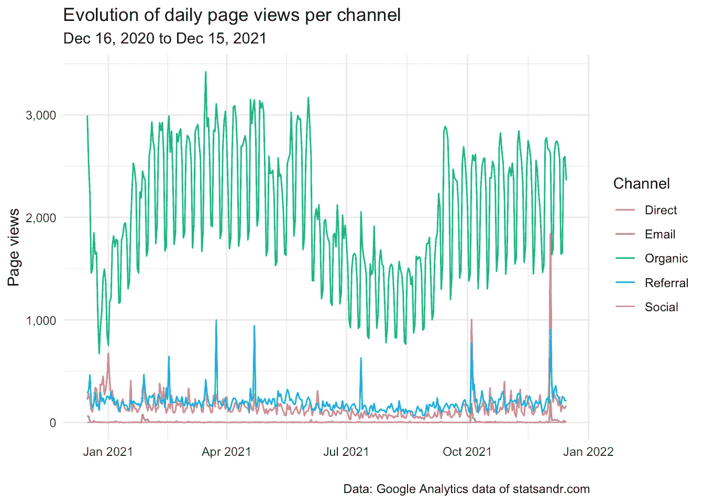

作者图片

从上面的图表中我们可以看出，绝大多数的页面浏览量来自有机渠道(比如来自谷歌、必应等搜索引擎)。)，当一篇文章发表时，一些峰值来自推荐(主要来自 R-bloggers 和 RWeekly)。(顺便说一句，如果你想在新帖子发布时收到电子邮件通知，你可以随时订阅时事通讯。)

如果你碰巧写教程，你也可以期待大部分访问者来自有机渠道。如果你在社交媒体上非常活跃，你很可能会从社交渠道吸引更多的访问者。

# 一周中每天和一年中每月的页面浏览量

正如在前面的情节中看到的，有许多起伏和交通似乎是周期性的。

为了进一步研究这个问题，我们绘制了一个一周**的每一天**的页面浏览量的[箱线图](https://statsandr.com/blog/descriptive-statistics-in-r/#boxplot):

```
# get data
gadata <- google_analytics(view_id,
  date_range = c(start_date, end_date),
  metrics = "pageviews",
  dimensions = c("dayOfWeek", "date"),
  anti_sample = TRUE # slows down the request but ensures data isn't sampled
)## Recoding gadata$dayOfWeek following GA naming conventions
gadata$dayOfWeek <- recode_factor(gadata$dayOfWeek,
  "0" = "Sunday",
  "1" = "Monday",
  "2" = "Tuesday",
  "3" = "Wednesday",
  "4" = "Thursday",
  "5" = "Friday",
  "6" = "Saturday"
)## Reordering gadata$dayOfWeek to have Monday as first day of the week
gadata$dayOfWeek <- factor(gadata$dayOfWeek,
  levels = c(
    "Monday", "Tuesday", "Wednesday", "Thursday", "Friday", "Saturday",
    "Sunday"
  )
)# Boxplot
gadata %>%
  ggplot(aes(x = dayOfWeek, y = pageviews)) +
  geom_boxplot(fill = "steelblue") +
  theme_minimal() +
  labs(
    y = "Page views",
    x = "",
    title = "Page views per day of week",
    subtitle = paste0(format(start_date, "%b %d, %Y"), " to ", format(end_date, "%b %d, %Y")),
    caption = "Data: Google Analytics data of statsandr.com"
  ) +
  scale_y_continuous(labels = scales::comma) # better y labels
```

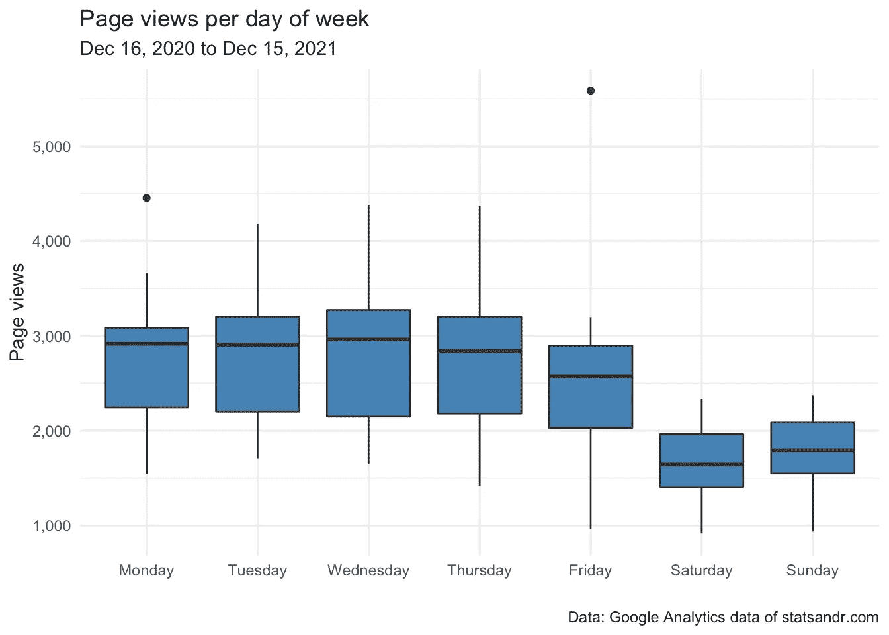

作者图片

我们还可以计算每天的总浏览量和平均浏览量，得到一个数字摘要，而不是一个图表:

```
# compute sum
dat_sum <- aggregate(pageviews ~ dayOfWeek,
  data = gadata,
  FUN = sum
)# compute mean
dat_mean <- aggregate(pageviews ~ dayOfWeek,
  data = gadata,
  FUN = mean
)# combine both in one table
dat_summary <- cbind(dat_sum, dat_mean[, 2])# rename columns
names(dat_summary) <- c("Day of week", "Sum", "Mean")# display table
dat_summary##   Day of week    Sum     Mean
## 1      Monday 141115 2713.750
## 2     Tuesday 143145 2752.788
## 3   Wednesday 146472 2763.623
## 4    Thursday 140712 2706.000
## 5      Friday 128223 2465.827
## 6    Saturday  85766 1649.346
## 7      Sunday  90847 1747.058
```

不出所料，与周末相比，工作日的读者更多。

可以对一年中的每个**月**而不是一周中的每一天进行相同的分析:

```
# get data
gadata <- google_analytics(view_id,
  date_range = c(start_date, end_date),
  metrics = "pageviews",
  dimensions = c("month", "date"),
  anti_sample = TRUE # slows down the request but ensures data isn't sampled
)# Boxplot
gadata %>%
  ggplot(aes(x = month, y = pageviews)) +
  geom_boxplot(fill = "steelblue") +
  theme_minimal() +
  labs(
    y = "Page views",
    x = "Month",
    title = "Page views per month",
    subtitle = paste0(format(start_date, "%b %d, %Y"), " to ", format(end_date, "%b %d, %Y")),
    caption = "Data: Google Analytics data of statsandr.com"
  ) +
  scale_y_continuous(labels = scales::comma) # better y labels
```

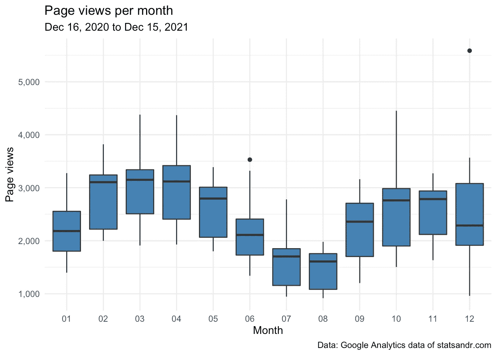

作者图片

```
# compute sum
dat_sum <- aggregate(pageviews ~ month,
  data = gadata,
  FUN = sum
)# compute mean
dat_mean <- aggregate(pageviews ~ month,
  data = gadata,
  FUN = mean
)# combine both in one table
dat_summary <- cbind(dat_sum, dat_mean[, 2])# rename columns
names(dat_summary) <- c("Month", "Sum", "Mean")# display table
dat_summary##    Month   Sum     Mean
## 1     01 68534 2210.774
## 2     02 80953 2891.179
## 3     03 92629 2988.032
## 4     04 88679 2955.967
## 5     05 81739 2636.742
## 6     06 64460 2148.667
## 7     07 49772 1605.548
## 8     08 46389 1496.419
## 9     09 68046 2268.200
## 10    10 79237 2556.032
## 11    11 77745 2591.500
## 12    12 78097 2519.258
```

从图表和数字摘要中可以清楚地看出，我们的[样本](https://statsandr.com/blog/what-is-the-difference-between-population-and-sample/)中的页面浏览量在一周中的每一天和一年中的每个月都是不同的。

如果你有兴趣更进一步，你可以随时执行一个 [ANOVA](https://statsandr.com/blog/anova-in-r/) 来查看每天或每个月的页面浏览量是否有显著的*差异。*

# 每月和每年的页面访问量

如果你有超过一年的数据，比较这些年来你每月博客的流量会很有用。

使用下面的代码，我们创建了一个[条形图](https://statsandr.com/blog/descriptive-statistics-in-r/#barplot)，显示每月**和每年**的日页面浏览量:

```
# set new date range
start_date_launch <- as.Date("2019-12-16")# get data
df2 <- google_analytics(view_id,
  date_range = c(start_date_launch, end_date),
  metrics = c("pageviews"),
  dimensions = c("date"),
  anti_sample = TRUE # slows down the request but ensures data isn't sampled
)# add in year month columns to dataframe
df2$month <- format(df2$date, "%m")
df2$year <- format(df2$date, "%Y")# page views by month by year using dplyr then graph using ggplot2 barplot
df2 %>%
  filter(year != 2019) %>% # remove 2019 because there are data for December only
  group_by(year, month) %>%
  summarize(pageviews = sum(pageviews)) %>%
  # print table steps by month by year
  # print(n = 100) %>%
  # graph data by month by year
  ggplot(aes(x = month, y = pageviews, fill = year)) +
  geom_bar(position = "dodge", stat = "identity") +
  theme_minimal() +
  labs(
    y = "Page views",
    x = "Month",
    title = "Page views per month and year",
    subtitle = paste0(format(start_date_launch, "%b %d, %Y"), " to ", format(end_date, "%b %d, %Y")),
    caption = "Data: Google Analytics data of statsandr.com"
  ) +
  scale_y_continuous(labels = scales::comma) # better y labels
```

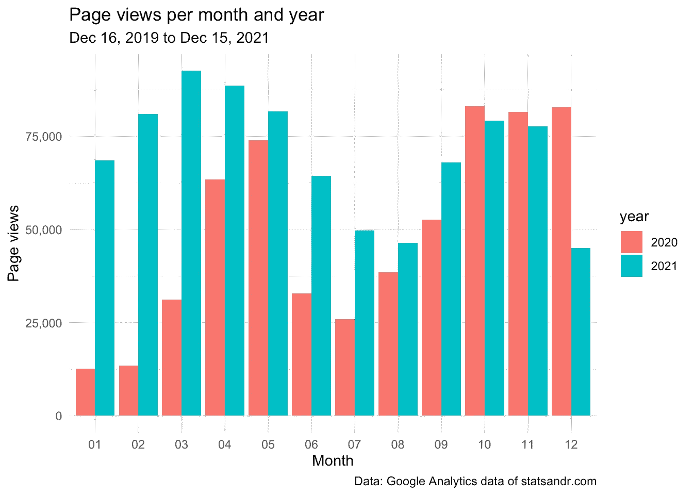

作者图片

这个柱状图可以很容易地看到几个月来页面浏览量的变化，但更重要的是，可以比较不同年份之间的变化。

# 表现最佳的页面

衡量你的博客或网站表现的另一个重要因素是每页的浏览量。

诚然，在谷歌分析中可以很容易地找到一年中页面浏览量最高的页面(你可以通过`Behavior > Site Content > All pages`访问)。

然而，对于感兴趣的读者，这里是如何获得 R 中的数据(注意，您可以在下面的代码中更改`n = 7`来更改要显示的最高性能页面的数量):

```
## Make the request to GA
data_fetch <- google_analytics(view_id,
  date_range = c(start_date, end_date),
  metrics = c("pageviews"),
  dimensions = c("pageTitle"),
  anti_sample = TRUE # slows down the request but ensures data isn't sampled
)## Create a table of the most viewed posts
library(lubridate)
library(reactable)
library(stringr)most_viewed_posts <- data_fetch %>%
  mutate(Title = str_trunc(pageTitle, width = 40)) %>% # keep maximum 40 characters
  count(Title, wt = pageviews, sort = TRUE)head(most_viewed_posts, n = 7) # edit n for more or less pages to display##                                      Title      n
## 1    Outliers detection in R - Stats and R 119747
## 2 Descriptive statistics in R - Stats a... 109473
## 3 Variable types and examples - Stats a...  83025
## 4 Correlation coefficient and correlati...  65703
## 5 Chi-square test of independence in R ...  62100
## 6 The complete guide to clustering anal...  40440
## 7                 ANOVA in R - Stats and R  32914
```

如果你和我一样喜欢可视化而不是表格，下面是如何在[柱状图](https://statsandr.com/blog/descriptive-statistics-in-r/#barplot)中画出表现最好的页面的表格:

```
# plot
top_n(most_viewed_posts, n = 7, n) %>% # edit n for more or less pages to display
  ggplot(., aes(x = reorder(Title, n), y = n)) +
  geom_bar(stat = "identity", fill = "steelblue") +
  theme_minimal() +
  coord_flip() +
  labs(
    y = "Page views",
    x = "Page title",
    title = "Top performing pages in terms of page views",
    subtitle = paste0(format(start_date, "%b %d, %Y"), " to ", format(end_date, "%b %d, %Y")),
    caption = "Data: Google Analytics data of statsandr.com"
  ) +
  scale_y_continuous(labels = scales::comma) + # better y labels
  theme(plot.margin = unit(c(5.5, 17.5, 5.5, 5.5), "pt")) # to avoid the plot being cut on the right edge
```

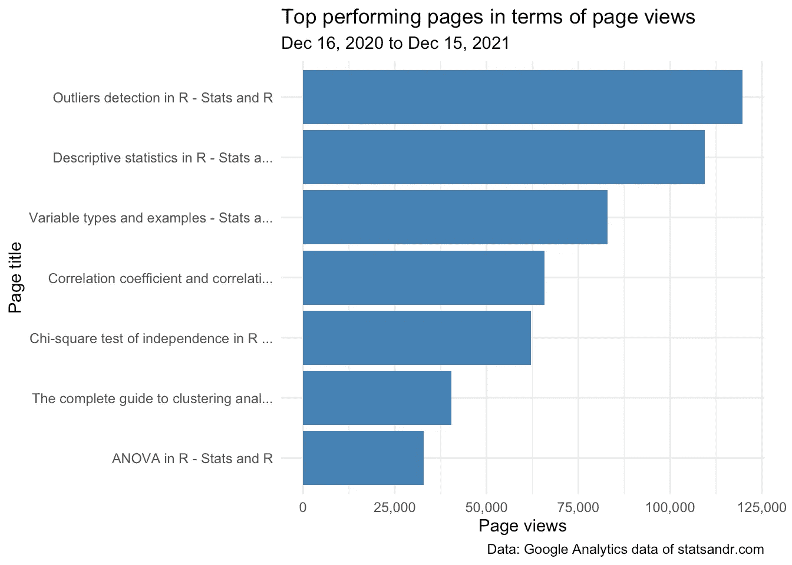

作者图片

这给了我一个很好的第一手概览，关于帖子在页面浏览量方面的表现，所以在某种意义上，人们发现什么是有用的。去年排名前三的文章是:

1.  [R 中的异常值检测](https://statsandr.com/blog/outliers-detection-in-r/)
2.  [R 中的描述性统计](https://statsandr.com/blog/descriptive-statistics-in-r/)
3.  [变量类型和例子](https://statsandr.com/blog/variable-types-and-examples/)

请注意，这个排名是基于过去 12 个月的总浏览量。因此，一篇最近的文章可能会出现在列表的底部，仅仅是因为它在比旧文章更短的时间段内收集了页面浏览量。因此，最好避免将最近的文章与旧文章进行比较，或者你可以在对页面浏览量进行“时间标准化”后再进行比较。请参见[上一年的评估](https://statsandr.com/blog/track-blog-performance-in-r/#time-normalized-page-views)，了解该指标的更多详情和图示。

你也可能有兴趣了解表现最差的人(以便最终改进他们或者将他们列入更高质量的帖子):

```
tail(subset(most_viewed_posts, n > 1000),
  n = 7
)##                                       Title    n
## 49 A guide on how to read statistical ta... 1477
## 50                      About - Stats and R 1470
## 51 How to embed a Shiny app in blogdown?... 1455
## 52                   About me - Stats and R 1277
## 53 One-proportion and chi-square goodnes... 1226
## 54 Running pace calculator in R Shiny - ... 1049
## 55                      Shiny - Stats and R 1018
```

请注意，我有意排除了浏览量少于 1000 的页面，以便从排名中删除已删除或隐藏的页面。

这个排名的另一个问题是，由于一些页面已经重复(例如，如果你编辑了标题)，它可能会有所偏差，但至少你对表现最差的页面有一个大致的了解。

# 按国家列出的页面浏览量

了解你的读者来自哪个国家对一些内容创作者或营销者来说也是很方便的。

我的读者的位置对我来说并不重要，因为我打算为每个人写作，但如果你在卖东西或经营企业/电子商务，这可能完全相反。

```
# get GA data
data_fetch <- google_analytics(view_id,
  date_range = c(start_date, end_date),
  metrics = "pageviews",
  dimensions = "country",
  anti_sample = TRUE # slows down the request but ensures data isn't sampled
)# table
countries <- data_fetch %>%
  mutate(Country = str_trunc(country, width = 40)) %>% # keep maximum 40 characters
  count(Country, wt = pageviews, sort = TRUE)head(countries, n = 10) # edit n for more or less countries to display##           Country      n
## 1   United States 244752
## 2           India  71797
## 3  United Kingdom  53272
## 4         Germany  38322
## 5          Canada  33812
## 6         Belgium  26421
## 7       Australia  26225
## 8     Philippines  23193
## 9     Netherlands  21944
## 10         Brazil  17956
```

同样，如果你更喜欢图表而不是表格，你可以在[条形图](https://statsandr.com/blog/descriptive-statistics-in-r/#barplot)中显示页面浏览量排名靠前的国家:

```
# plot
top_n(countries, n = 10, n) %>% # edit n for more or less countries to display
  ggplot(., aes(x = reorder(Country, n), y = n)) +
  geom_bar(stat = "identity", fill = "steelblue") +
  theme_minimal() +
  coord_flip() +
  labs(
    y = "Page views",
    x = "Country",
    title = "Top performing countries in terms of page views",
    subtitle = paste0(format(start_date, "%b %d, %Y"), " to ", format(end_date, "%b %d, %Y")),
    caption = "Data: Google Analytics data of statsandr.com"
  ) +
  scale_y_continuous(labels = scales::comma) + # better y labels
  theme(plot.margin = unit(c(5.5, 7.5, 5.5, 5.5), "pt")) # to avoid the plot being cut on the right edge
```

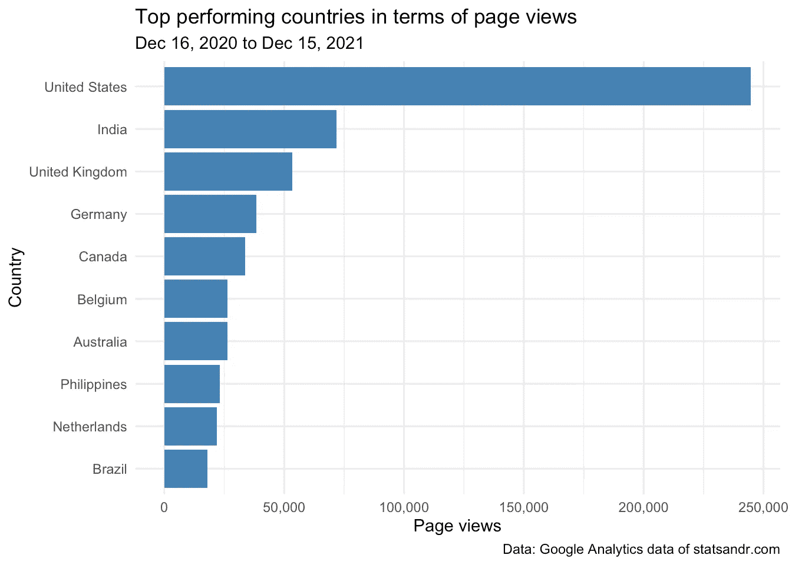

作者图片

我们看到很大一部分读者来自美国，而比利时(我的国家)在页面浏览量方面仅排在第六位。

请注意，由于不同国家的人数差异很大，如果您按绝对数值比较不同国家的页面浏览量，这个排名可能会隐藏一些见解。在去年回顾的[部分](https://statsandr.com/blog/track-blog-performance-in-r/#page-views-by-country)中可以看到原因。

# 设备的用户参与度

人们也可能有兴趣根据设备类型检查**用户如何参与**。为了对此进行研究，我们绘制了三张图表，描述了:

1.  页面浏览量**如何按设备类型分布？**
2.  按设备类型划分的第页上的**平均时间(秒)**
3.  按设备类型划分的每个会话的**页面浏览量**

那么首先，页面浏览量是如何按设备类型分布的？

```
# GA data
gadata <- google_analytics(view_id,
  date_range = c(start_date, end_date),
  metrics = c("pageviews", "avgTimeOnPage"),
  dimensions = c("date", "deviceCategory"),
  anti_sample = TRUE # slows down the request but ensures data isn't sampled
)# plot pageviews by deviceCategory
gadata %>%
  ggplot(aes(deviceCategory, pageviews)) +
  geom_bar(aes(fill = deviceCategory), stat = "identity") +
  theme_minimal() +
  labs(
    y = "Page views",
    x = "",
    title = "Page views per device",
    subtitle = paste0(format(start_date, "%b %d, %Y"), " to ", format(end_date, "%b %d, %Y")),
    caption = "Data: Google Analytics data of statsandr.com",
    fill = "Device" # edit legend title
  ) +
  scale_y_continuous(labels = scales::comma) # better y labels
```

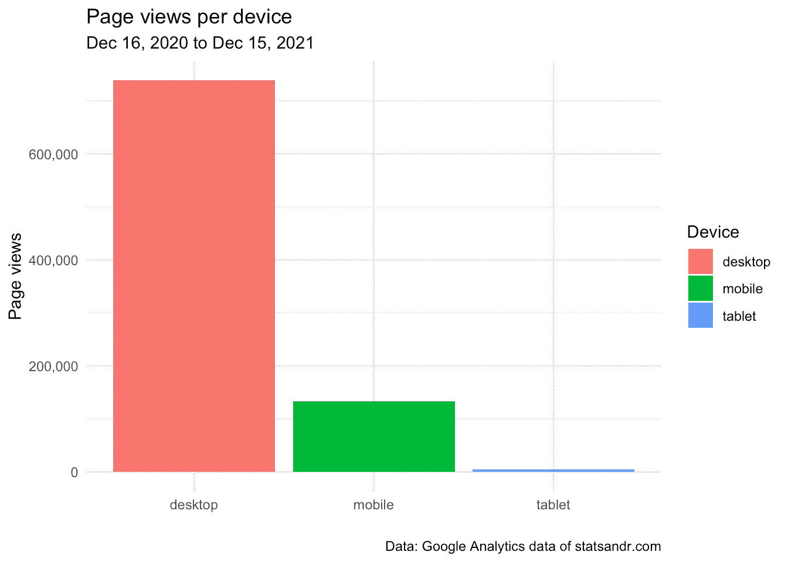

作者图片

从上面的图中，我们看到大多数读者从桌面上访问博客，只有很小一部分来自平板电脑。

这是有意义的，因为我猜想许多访问者在使用 R(只在桌面上可用)的同时阅读我的文章或教程。

然而，每种设备类型的总页面浏览量信息并不能告诉我在每个页面上花费的时间，因此也不能告诉我每种设备类型的参与度。以下情节回答了这个问题:

```
# add median of average time on page per device
gadata <- gadata %>%
  group_by(deviceCategory) %>%
  mutate(med = median(avgTimeOnPage))# plot avgTimeOnPage by deviceCategory
ggplot(gadata) +
  aes(x = avgTimeOnPage, fill = deviceCategory) +
  geom_histogram(bins = 30L) +
  scale_fill_hue() +
  theme_minimal() +
  theme(legend.position = "none") +
  facet_wrap(vars(deviceCategory)) +
  labs(
    y = "Frequency",
    x = "Average time on page (in seconds)",
    title = "Average time on page per device",
    subtitle = paste0(format(start_date, "%b %d, %Y"), " to ", format(end_date, "%b %d, %Y")),
    caption = "Data: Google Analytics data of statsandr.com"
  ) +
  scale_y_continuous(labels = scales::comma) + # better y labels
  geom_vline(aes(xintercept = med, group = deviceCategory),
    color = "darkgrey",
    linetype = "dashed"
  ) +
  geom_text(aes(
    x = med, y = 125,
    label = paste0("Median = ", round(med), " seconds")
  ),
  angle = 90,
  vjust = 3,
  color = "darkgrey",
  size = 3
  )
```

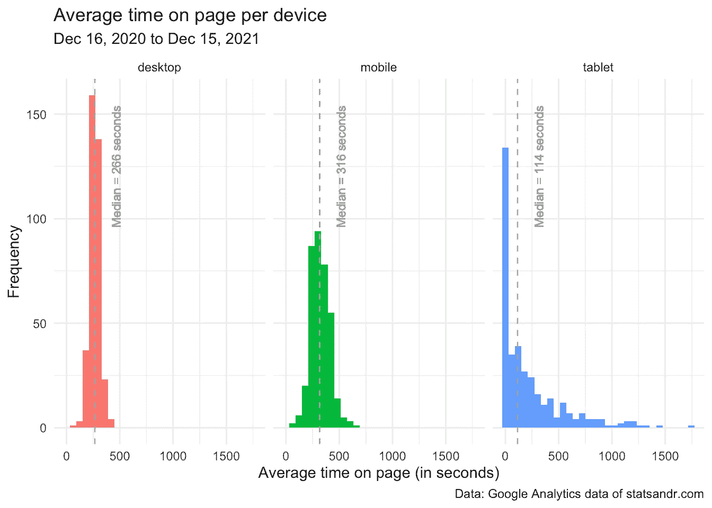

作者图片

从上面的图中，我们看到:

*   大多数来自平板电脑的读者实际上很快就离开了页面(参见平板电脑方面 0 秒左右的峰值)。
*   台式机和移动设备上的读者平均浏览时间分布非常相似，平均浏览时间大多在 125 秒(= 2 分 5 秒)到 375 秒(= 6 分 15 秒)之间。
*   非常令人惊讶的是，访客在移动设备上花费在页面上的平均时间的[中值](https://statsandr.com/blog/descriptive-statistics-in-r/#median)略高于桌面上的(中值=移动设备上 316 秒，桌面上 266 秒，参见代表桌面和移动设备中值的垂直虚线)。这表明，尽管更多的人从桌面访问博客(如设备的总页面浏览量所示)，但似乎移动设备上的人每页花费的时间更多。我发现这个结果非常令人惊讶，因为我的大多数文章都包含 R 代码，并且需要一台计算机来运行这些代码。因此，我认为人们在桌面上花的时间会比在移动设备上多，因为在移动设备上他们会快速浏览文章，而在桌面上他们会更仔细地阅读文章，并试图在自己的电脑上复制代码。至少我在手机上阅读博客和在桌面上阅读博客时是这样做的。更耐人寻味的是，去年就已经是这样了。如果有人发现类似的结果，并有一个可能的解释，我会很高兴听到她的意见(如果可能的话，在文章结尾的评论中，这样每个人都可以从讨论中受益)。
*   顺便提一句，我们看到今年的中位数比去年高(2021 年分别为 266、316 和 114 秒，而 2020 年在桌面、移动和平板电脑上分别为 190、228 和 106 秒)。这多少有些令人鼓舞，因为这表明人们在每个页面上花费了更多的时间(这至少部分表明了谷歌博客的质量)。 [1](https://statsandr.com/blog/statsandr-is-2-years-old/#fn1)

鉴于这一结果，我也相信通过设备类型来说明一个会话期间页面浏览的**数量**是有帮助的。

事实上，可能是这样的情况，移动设备上的访问者平均在每个页面上花费更多的时间*，但是桌面上的人每次会话访问更多的页面*(记住，会话是在给定的时间框架内发生的与你的网站的一组交互)。

我们通过[密度图](https://statsandr.com/blog/descriptive-statistics-in-r/#density-plot)验证了这一观点，为了提高可读性，我们排除了平板电脑的访问:

```
# GA data
gadata <- google_analytics(view_id,
  date_range = c(start_date, end_date),
  metrics = c("pageviewsPerSession"),
  dimensions = c("date", "deviceCategory"),
  anti_sample = TRUE # slows down the request but ensures data isn't sampled
)# add median of number of page views/session
gadata <- gadata %>%
  group_by(deviceCategory) %>%
  mutate(med = median(pageviewsPerSession))## Reordering gadata$deviceCategory
gadata$deviceCategory <- factor(gadata$deviceCategory,
  levels = c("mobile", "desktop", "tablet")
)# plot pageviewsPerSession by deviceCategory
gadata %>%
  filter(deviceCategory != "tablet") %>% # filter out pageviewsPerSession > 2.5 and visits from tablet
  ggplot(aes(x = pageviewsPerSession, fill = deviceCategory, color = deviceCategory)) +
  geom_density(alpha = 0.5) +
  scale_fill_hue() +
  theme_minimal() +
  labs(
    y = "Frequency",
    x = "Page views per session",
    title = "Page views per session by device",
    subtitle = paste0(format(start_date, "%b %d, %Y"), " to ", format(end_date, "%b %d, %Y")),
    caption = "Data: Google Analytics data of statsandr.com\nDashed lines represent the medians",
    color = "Device", # edit legend title
    fill = "Device" # edit legend title
  ) +
  scale_y_continuous(labels = scales::comma) + # better y labels
  geom_vline(aes(xintercept = med, group = deviceCategory, color = deviceCategory),
    linetype = "dashed",
    show.legend = FALSE # remove legend
  )
```

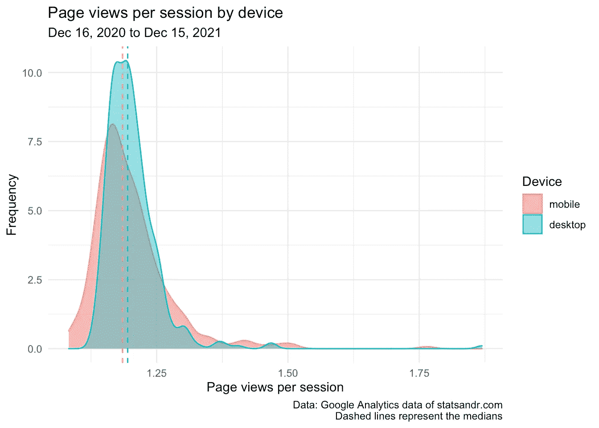

作者图片

最后一幅图显示，桌面和移动设备上的读者每次访问的页面数量大致相同，这可以从这两种分布相互重叠且相距不远的事实中看出。的确，使用台式机的人比使用移动设备的人的中位数要高，但差距很小(而且两者之间的差距比去年的调查要小)。

总结一下我们从最后三幅图中学到的东西，我们现在知道:

*   大多数读者从桌面访问博客；
*   移动设备上的读者在每个页面上花费的时间比桌面上的读者多(甚至比平板上的读者更多)；
*   台式机和移动设备上的用户似乎每个会话访问了大约相同数量的页面。

有人可能想知道为什么我选择比较中位数而不是平均值。主要原因是中位数是一种更稳健的方式来表示[非正态](https://statsandr.com/blog/do-my-data-follow-a-normal-distribution-a-note-on-the-most-widely-used-distribution-and-how-to-test-for-normality-in-r/)数据。对于感兴趣的读者，请参阅关于平均值和中值之间的[差异的注释](https://statsandr.com/blog/descriptive-statistics-by-hand/#mean-vs.-median)，以及每种度量更合适的上下文。

如果你想更进一步，你也可以执行一个学生的 t-test 来测试每个会话的平均页面浏览量在移动和桌面组之间是否有显著的差异。

# 浏览器信息

从更技术性的角度来看，您可能还对浏览器的**页面浏览量感兴趣。我个人并不真的想知道我的访问者使用最多的是哪种浏览器(主要是因为这个博客可以在所有常见的浏览器上使用)，但你们中最极客的可能就是这样。**

该信息可通过以下[柱状图](https://statsandr.com/blog/descriptive-statistics-in-r/#barplot)可视化:

```
# get data
browser_info <- google_analytics(view_id,
  date_range = c(start_date, end_date),
  metrics = c("pageviews"),
  dimensions = c("browser"),
  anti_sample = TRUE # slows down the request but ensures data isn't sampled
)# table
browser <- browser_info %>%
  mutate(Browser = str_trunc(browser, width = 40)) %>% # keep maximum 40 characters
  count(Browser, wt = pageviews, sort = TRUE)# plot
top_n(browser, n = 10, n) %>% # edit n for more or less browser to display
  ggplot(., aes(x = reorder(Browser, n), y = n)) +
  geom_bar(stat = "identity", fill = "steelblue") +
  theme_minimal() +
  coord_flip() +
  labs(
    y = "Page views",
    x = "Browser",
    title = "Which browsers are our visitors using?",
    subtitle = paste0(format(start_date, "%b %d, %Y"), " to ", format(end_date, "%b %d, %Y")),
    caption = "Data: Google Analytics data of statsandr.com"
  ) +
  scale_y_continuous(labels = scales::comma) # better y labels
```

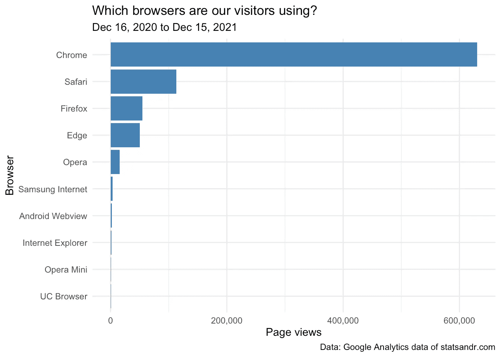

作者图片

大多数读者使用 *Chrome* 、 *Safari* 和 *Firefox* 访问该网站(这是意料之中的，因为它们是最常见的浏览器)。

这是本次审查中展示的最后一个指标。当然，更多的可能性取决于你的 R 技能(主要是，[数据操作](https://statsandr.com/blog/data-manipulation-in-r/)和`[{ggplot2}](https://statsandr.com/blog/graphics-in-r-with-ggplot2/)`)以及你在 SEO 或分析谷歌分析数据方面的专业知识。希望，感谢这篇评论，也可能来自去年的，你将能够使用 R 和`{googleAnalyticsR}`包分析你自己的博客或网站。至少，这是本文的目的。

对于那些对更简洁的分析感兴趣的人，请看我的[自定义谷歌分析仪表板](https://statsandr.com/blog/files/google-analytics-dashboard/)。 [2](https://statsandr.com/blog/statsandr-is-2-years-old/#fn2)

# 结束注释

我还想补充一点，这些数字不是用来比较的。每个网站或博客都是独一无二的，每个作者都是独一无二的(有不同的优先级和不同的议程)，而且越多并不总是越好。感谢这个博客，我学到了很多东西，我把它用于个人目的[和我的学生，作为我教学任务的一部分。只要我喜欢，只要我有时间，我就会继续写下去，不管点击量多低或多高。](https://statsandr.com/blog/7-benefits-of-sharing-your-code-in-a-data-science-blog/#personal-note-to-remind-my-future-self)

感谢过去一年的所有读者，一年后再会！与此同时，如果你保持博客，我会很高兴听到你如何跟踪它的表现。

和往常一样，如果您有与本文主题相关的问题或建议，请将其添加为评论，以便其他读者可以从讨论中受益。

1.  在每个页面上花更多的时间对谷歌来说是一个有利因素，因为这意味着人们会更仔细地阅读它。如果博客或帖子质量一般，用户往往会很快反弹(被称为反弹率)，并在其他地方寻找问题的答案(最终导致在页面或网站上花费的时间更少)。 [↩︎](https://statsandr.com/blog/statsandr-is-2-years-old/#fnref1)
2.  感谢 [RStudio 博客](https://blog.rstudio.com/2021/01/06/google-analytics-part2/)的启发。 [↩︎](https://statsandr.com/blog/statsandr-is-2-years-old/#fnref2)

# 相关文章

*   [如何在 R 中跟踪自己博客的表现？](https://statsandr.com/blog/track-blog-performance-in-r/)
*   [为什么我有一个数据科学博客？分享代码的 7 个好处](https://statsandr.com/blog/7-benefits-of-sharing-your-code-in-a-data-science-blog/)
*   [R 中的图形与 ggplot2](https://statsandr.com/blog/graphics-in-r-with-ggplot2/)
*   [R 闪亮中的抵押贷款计算器](https://statsandr.com/blog/mortgage-calculator-r-shiny/)
*   [如何发布闪亮的应用程序:以 shinyapps.io 为例](https://statsandr.com/blog/how-to-publish-shiny-app-example-with-shinyapps-io/)

*原载于 2021 年 12 月 16 日*[*https://statsandr.com*](https://statsandr.com/blog/statsandr-is-2-years-old/)T22。