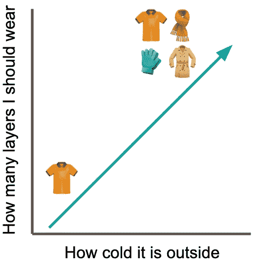
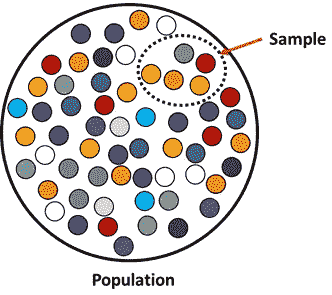
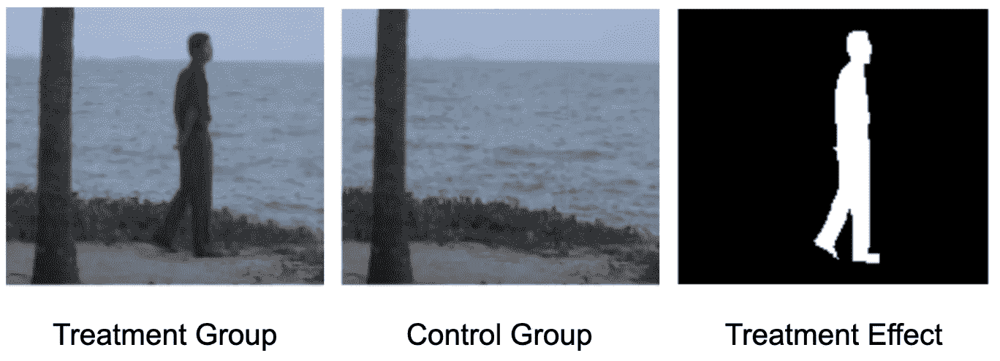
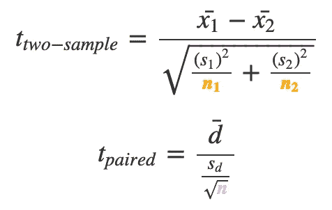
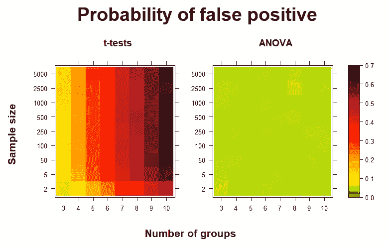
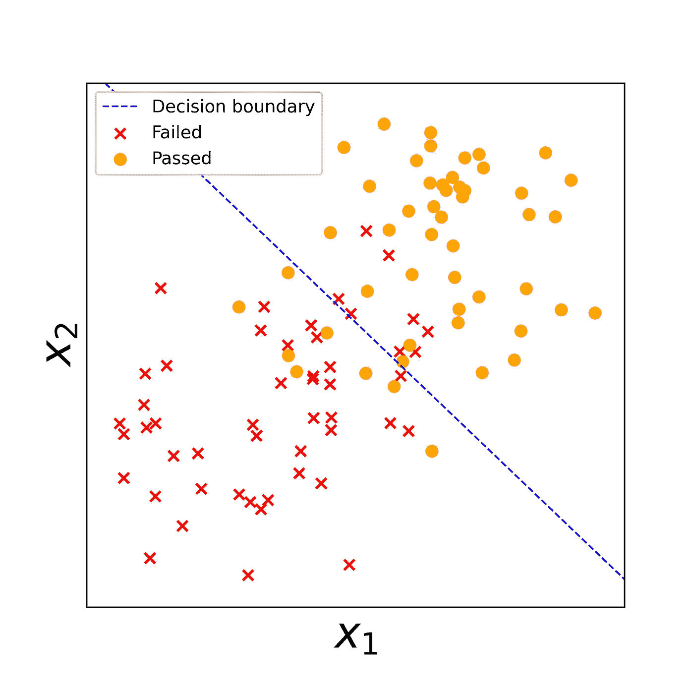
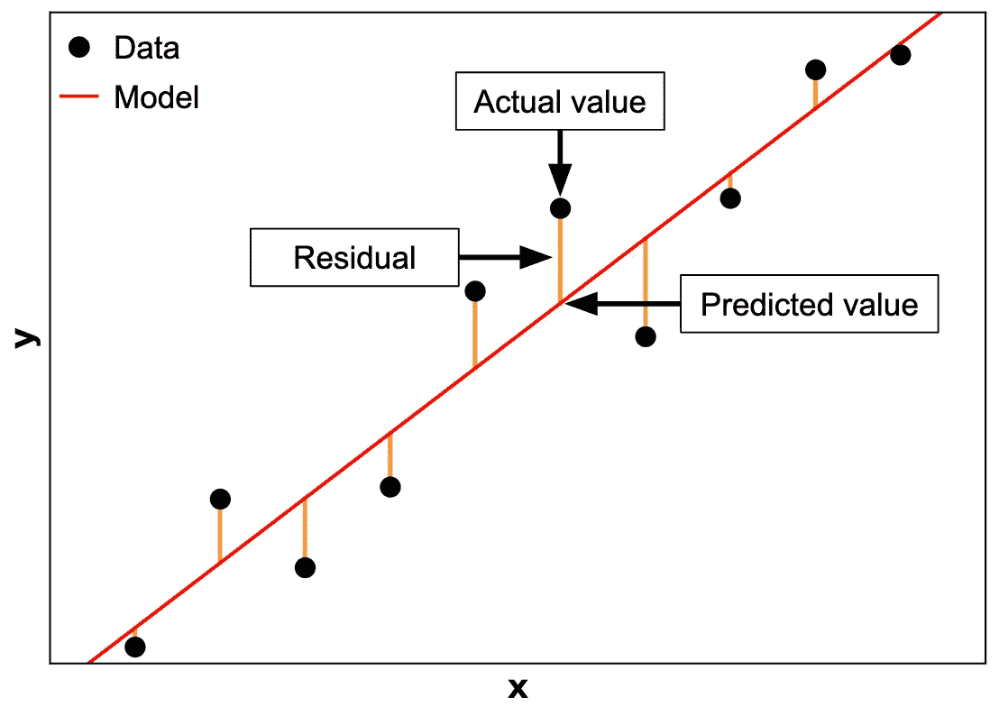
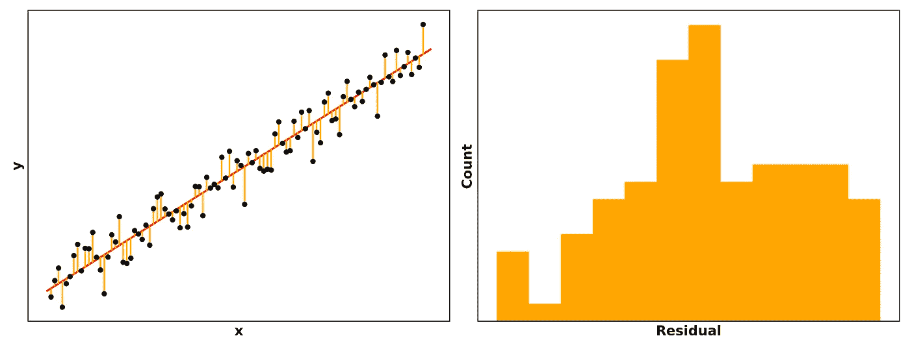
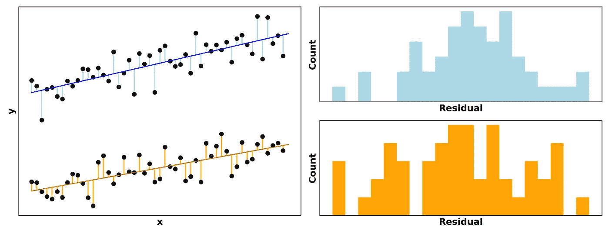
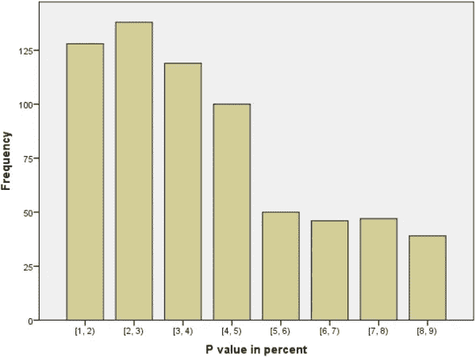

# 数据科学统计基础

> 原文：<https://towardsdatascience.com/stats-essentials-for-data-science-cfcdee17af68?source=collection_archive---------2----------------------->

## [入门](https://towardsdatascience.com/tagged/getting-started)

## 分析思维的基础

由 [Artem Maltsev](https://unsplash.com/@art_maltsev?utm_source=medium&utm_medium=referral) 在 [Unsplash](https://unsplash.com?utm_source=medium&utm_medium=referral) 上拍摄的照片

无论您是整天呆在电子表格还是 TensorFlow 中，成为一名高效的数据科学家都需要对统计学基础有扎实的理解。很难不写一本关于所有有用的统计数据的教科书，但在这篇文章中，我缩小了一组基本技能，无论你去哪里，它们都将帮助你开始你的角色。我们开始吧！

# 坚持住。我真的需要学习统计学吗？

在大数据和机器学习的时代，人们很容易对学习任何统计数据不屑一顾。当普通的笔记本电脑比让我们登上月球的计算机[1]强大 200 万倍时，将数据集投入深度学习算法比以往任何时候都更容易，在它处理数据时喝杯咖啡，然后回到总能提供震惊世界的见解的模型。对吗？嗯……不完全是。[2]

作为数据科学家，**我们工作的一个核心部分是生成帮助我们理解过去和预测未来的模型。**尽管获得正确的模型很重要，但是很容易创建出有严重缺陷的模型。然后*基于这些有缺陷的模型，很容易向利益相关者做出自信的建议。下面的引用通常指的是进入分析或预测的*数据质量*，但我认为这是一个恰当的总结，说明了为什么我们也需要关心统计数据。*

> 垃圾进，垃圾出

**模型是现实的简化表示。如果这种描述是有缺陷的，它描绘的画面很容易是荒谬的或误导的。人们毕生致力于研究统计数据的原因是，将现实浓缩成模型极具挑战性，但也是必要的。**

在做决定之前处理好每一个细节通常是不可能或不切实际的；例如，我们的大脑不断使用[处理捷径](https://jamesclear.com/schemas)来更快地解释世界。**你不需要记住外面各种可能的温度下该穿什么衣服；**你知道，一般来说，随着气温的下降，你会穿上更多的衣服。这个心理模型并不完美——有时有风或潮湿，不同的层数会感觉更舒服——但这是一个很好的经验法则。

作者图片

**当我们建立一个模型时，问题不是如何建立一个没有缺陷的模型；而是如何确保瑕疵不会影响结论。**风或湿度有时会改变最佳层数，但这并不能改变“天气越冷，我应该穿的衣服越多”是一个很好的模式。正如统计学家乔治·博克斯([据称是](https://en.wikipedia.org/wiki/All_models_are_wrong))所说:

> “所有的模型都是错的，但有些是有用的。”

一个*错误但有用的*模型和一个*只是错误的*模型之间的区别通常隐藏在细节中。**与编程不同，在半成品模型*上点击“运行”将会*输出一个在质量上看起来与高度抛光的精确模型相同的结果。但是这个模型是否代表我们实际生活的现实需要一双训练有素的眼睛。**

# 好吧，那么我到底需要多少统计数据？

当谈到数据科学的重要统计概念时，很难不写一整本教科书。考虑到预期的统计知识深度的巨大差异，也很难确定哪些概念与数据科学家最相关。

如果你希望为公共政策或公司发展方向等重大决策提供信息，你需要的不仅仅是介绍统计数据，但如果你的角色深入数据科学的工程领域，基本统计数据可能就足够了。

同样，如果你所在的领域实际上*可以访问流程中的所有数据，比如分析[物联网(IoT)](https://www.zdnet.com/article/what-is-the-internet-of-things-everything-you-need-to-know-about-the-iot-right-now/) 传感器数据，或者将[自然语言处理](https://en.wikipedia.org/wiki/Natural_language_processing)应用于法律文件，那么你会希望深入了解其他统计技能，比如[时间序列分析](https://www.statisticssolutions.com/time-series-analysis/)、[聚类](https://en.wikipedia.org/wiki/Cluster_analysis)和[异常检测](https://www.anodot.com/blog/what-is-anomaly-detection/)。*

*然后，考虑以下概念，作为起点*，然后您可以根据您的特定角色进行构建和定制。我假设你对统计学有一些基本的了解，但可能还没有深入研究假设、系数、残差等的细微差别。**

**这里有(一些！[4])统计要点我认为任何数据科学家都应该能够轻松地向技术和非技术受众解释:**

*   ****实验设计:**抽样和偏倚、对照组、相关性与因果关系**
*   ****组间比较:** t 检验，方差分析**
*   ****预测建模:**回归、分类**
*   ****模型内部:**系数、残差、p 值、R**

**我们将在接下来的文章中逐一讨论。我们开始吧！**

****

**照片由[布鲁斯·马尔斯](https://unsplash.com/@brucemars?utm_source=medium&utm_medium=referral)在 [Unsplash](https://unsplash.com?utm_source=medium&utm_medium=referral) 上拍摄**

# **试验设计**

**广义地说，实验设计指的是我们如何构建数据收集过程。我们是在脸书上调查我们的朋友，在商场里调查路人，还是随机的电话号码？是每个病人都得到药物，还是我们给一些人安慰剂？**

**把我们运行的任何分析的质量想象成一个漏斗，从我们收集的数据的质量开始。如果我们有坚实的数据，我们可以问更多有趣的问题，发现更多有意义的见解。如果我们有粗制滥造的数据，结果是否真的可信总是会有疑问的阴影。因此，让我们确保我们能够确定如何获得好的数据。**

## **采样和偏差**

**要理解的一个关键概念是，当你收集数据时，你是从**人口中**抽样**。**(除了像[物联网](https://en.wikipedia.org/wiki/Internet_of_things)这样较新的领域)。)因为我们要把一个庞大、多样的群体浓缩成一个相对较小的样本，所以我们需要确保这个样本实际上看起来像是更广泛人群的一个缩影。**

****

**作者图片**

**例如，在上图中，我们的样本并不能真正代表总体——有几种颜色根本不存在！我们不能对这个样本进行分析，然后推广到整个人群；我们只能概括为红色、橙色、黄色和绿色。无论我们对样本数据的建模有多完美，我们的模型的范围都是有限的。如果我们试图对更广泛的人群进行评论，我们会发现我们看似准确的模型突然做出令人尴尬的不准确预测。**

**这种样本人口差异的最近一个例子是 2020 年美国大选预测。在特朗普总统在 2016 年出人意料地赢得[藐视绝大多数民意调查](https://www.voanews.com/usa/us-politics/election-experts-puzzled-over-surprise-trump-victory)后，民意调查者花了数年时间调整他们的模型，修复盲点，为 2020 年的救赎做准备。然而，随着各州于 11 月 3 日开始发布结果，我们发现自己再次看到[民调低估了特朗普选民的数量](https://www.scientificamerican.com/article/why-polls-were-mostly-wrong/)。**

**Civis Analytics 的前政治数据科学主管 David Shor 认为，这些预测之所以如此离谱，是因为它们的潜在样本并不能代表美国选民。 简而言之，对民意调查做出回应的人往往在社会信任度上得分较高，而[综合社会调查](https://gssdataexplorer.norc.org/variables/441/vshow)显示，这仅代表了 30%的美国人。直到 2016 年，这一群体过去的投票与不接民意调查电话的低信任度选民相当——现在，低信任度选民倾向于更保守地投票，因此在样本中代表性不足。**

**如果我们意识到这些差异，我们可以尝试实现一些修正，比如在样本中对类进行[差分加权。但是最好的补救办法是确保样本](https://www.researchgate.net/post/How-can-I-deal-with-uneven-sample-sizes-in-my-study)[真正代表更广泛的人口](https://www.healthknowledge.org.uk/public-health-textbook/research-methods/1a-epidemiology/methods-of-sampling-population)。注意:这通常是说起来容易做起来难！**

## **对照组**

**实验设计需要知道的另一个关键概念是**对照组。**通常，当我们进行实验时，我们希望量化某些**治疗的效果。**抗抑郁药能减轻抑郁吗？新的网站布局增加了销售额吗？为了理解我们得到的效果大小的数字，我们需要一个*基线*来与之比较。这就是控制组介入的地方。**

****

**图片改编自 [Kumar 等人 2013 年](https://www.semanticscholar.org/paper/Background-subtraction-based-on-threshold-detection-Kumar-Sureshkumar/39ad370de4a39ca868e0b8d91ceba120d48612b3)**

**在现实世界中，无数的因素影响着我们观察到的每一个过程。我们需要一种方法来*控制*尽可能多的这些因素，这样我们就可以专注于我们感兴趣的一个因素——我们的治疗。**

****把一个好的对照组想象成我们治疗组的一个(几乎)同卵双胞胎，不同的只是我们的治疗方法。**“减去”控件，就像上面的背景减法一样，让我们处理的效果突出出来。(或者不是，如果我们的治疗实际上没有效果的话。)**

**安慰剂是控制的典型例子。检查新药有效性的医学研究总是包含一个得到安慰剂而不是真正药物的对照组，因为人们通常只知道他们得到了一种药物就会感觉更好，即使“药物”只是一颗糖丸。如果没有安慰剂组，我们的假阳性率会高得惊人。**

**另一个经典的对照组是治疗组本身，*在*接受治疗之前。受试者内部设计非常强大，因为我们可以更好地控制所有可能影响我们实验的外部因素:他们实际上是相同的参与者！**

**您可以在双样本 t 检验与配对 t 检验的等式中看到这种额外的功效:配对检验的 *t* 值将更大，因为分母更小，因为您只计算一个(配对)样本的 *n* 。[5]**

****

**最后一个与 web 开发特别相关的例子是 [A/B 测试](https://www.optimizely.com/optimization-glossary/ab-testing/)。为了实验性地确定提高用户参与度或转化率的方法，公司可以向用户呈现几乎相同的网页版本，仅在一个方面不同，如按钮的颜色。然后，该公司可以将这些网页变体相互比较，并与原始网页(对照组)进行比较，以选择最有效的选项。**

## **相关性与因果关系**

**在分析数据时，通常会看到两个变量**相关**:当 A 发生变化时，B 也会发生变化。例如，我们可能会注意到[冰淇淋和](https://www.abs.gov.au/websitedbs/D3310114.nsf/home/statistical+language+-+correlation+and+causation)防晒霜的销售整齐地一前一后，但是这是否意味着冰淇淋的销售*导致了*防晒霜的销售？(“我想要一勺巧克力片，嗯……我们也买些防晒霜吧。”)**

**弄清楚冰淇淋销量的变化是否**导致了防晒霜销量的变化(或者反之亦然)，有一些隐藏的因素影响着两者，或者[这只是一个随机的巧合](http://www.tylervigen.com/spurious-correlations)是实验设计的工作。要真正说 A 导致 B，我们需要控制 A 和 B 的外部变化*,然后仔细操纵 A 并观察 B。例如，我们可以全年进行冰淇淋营销闪电战，无论天气如何都推动销售，并观察防晒霜的销售是否随之而来。*****

**注意，说 A 和 B 是*相关的没有错。如果有相关性，它仍然告诉我们关于 A 和 b 的一些事情。但是如果你想说一个*导致另一个*的话，这个障碍要高得多。***

**

*[Ludemeula Fernandes](https://unsplash.com/@ludemeula?utm_source=medium&utm_medium=referral) 在 [Unsplash](https://unsplash.com?utm_source=medium&utm_medium=referral) 上拍摄的照片*

# *组间比较*

*统计学以及生活中的一个核心问题是事物是相同的还是不同的。吸烟者患肺癌的几率是否比不吸烟者高？早上吃一个苹果比吃一个橘子更有效率吗？当我们收集吃苹果和吃橘子人群的数据时，我们的*样本*的方法将不可避免地不同。但是吃苹果的人和吃橘子的人的生产力有区别吗？*

*我们需要使用统计学从样本中对总体进行推断。下面我将简要介绍 t 检验和方差分析。*

## *t 检验*

*双样本 t 检验背后的主要思想是确定**样本是否来自同一人群**。我假设这不是你第一次阅读关于 t-test 的文章(如果是的话，有很多很好的资源，比如[这篇文章](https://www.investopedia.com/terms/t/t-test.asp)，所以我将关注**如何避免误用 t-test。***

***当你进行 t 检验时，你假设你的数据如下:***

1.  *样本中的数据是连续的 T21，而不是离散的*
2.  *你的样本中的数据*彼此独立*并且*都同样可能从它们的总体中选择**
3.  *你的样本没有偏斜，也没有异常值([随着样本量的增加](https://www.ncbi.nlm.nih.gov/pmc/articles/PMC4744321/)越来越不重要)*
4.  *对于双样本检验，总体分布*的方差*是相等的*

*如果这些条件都不满足，*不要运行 t-test！* R、Python 和 t-test 等式本身都不会阻止你生成一个无意义的结果—***实现是否应该运行测试取决于你自己。****

*第二点对粗心的研究人员来说尤其具有毁灭性；违反这个假设意味着你不得不[使用一些粗糙的高级方法](https://www.ijcai.org/Proceedings/07/Papers/121.pdf)或者[丢弃数据并再次尝试](https://www.researchgate.net/post/How-do-you-compare-samples-if-they-are-not-IID)。#3 更慷慨:可以使用非参数替代方法，如 [Wilcoxon 检验](https://www.investopedia.com/terms/w/wilcoxon-test.asp)或转换你的数据使其呈正态分布。*

## *方差分析*

*如果你同时比较两个以上的样本，你需要运行一个[方差分析](https://en.wikipedia.org/wiki/Analysis_of_variance)。**不要进行多次连续的 t 检验！** [我在这里深入研究了](https://mattsosna.com/T-tests-vs-ANOVA)当你对多个组进行连续的两两 t 检验时，假阳性率是如何飙升的。我认为下面的热图很好地总结了主要信息。*

**

*作者图片*

*简而言之:如果你试图确定多个样本总体的均值是否不同，首先运行 ANOVA，然后是 [Tukey 的方法](https://support.minitab.com/en-us/minitab/18/help-and-how-to/modeling-statistics/anova/supporting-topics/multiple-comparisons/what-is-tukey-s-method/)或 [Bonferroni 的校正](http://mathworld.wolfram.com/BonferroniCorrection.html)，如果你发现显著差异。*

**

*[克里斯托夫辊](https://unsplash.com/@krisroller?utm_source=medium&utm_medium=referral)在 [Unsplash](https://unsplash.com?utm_source=medium&utm_medium=referral) 上拍照*

# *预测建模*

*预测建模是关于**获取数据并尝试对生成该数据的*潜在过程*进行建模。**一旦我们理解了底层规则，我们就可以为新数据生成*预测*。回想一下我们的室外天气与服装模型，我们不需要记住在每一个可能的温度下穿什么衣服；我们只需要使用我们的心智模型。*

*本节将介绍回归和分类。但是在我们开始之前，一个快速的专业提示:**在你开始构建任何模型之前，一定要绘制你的数据！**这一步可以帮助您捕捉异常值，确定是否需要像日志转换这样的特征工程步骤，并确保您的模型实际上描述了您的数据。*

## *回归*

*当我们想要预测一个*连续的*值时，我们使用回归。这是线性回归的方程式。好好学吧！*

**

*这里 *h* ( *x* )是我们的预测值， *n* 是我们数据中的特征数。我们根据学生的学习时间( *x* ₁)和前一天晚上的睡眠时间( *x* ₂)来预测学生的考试分数( *h* ( *x* )，这个模型的等式如下所示[6]:*

**

*无论你在哪里工作，都很难逃脱一个好的线性回归模型的简单和方便。线性回归的计算速度非常快，也很容易解释:系数给出了每个变量如何影响输出的清晰解释[7]，你只需将所有的 *βjxj* 相加就能得到你的输出。确保你为回归准备好了“30 秒的演讲”,因为你可能要向不同的利益相关者重复解释这些模型。*

*一旦你适应了，确保温习更高级的主题，如特征[缩放](https://en.wikipedia.org/wiki/Feature_scaling)、[交互](https://christophm.github.io/interpretable-ml-book/interaction.html)和[共线性](https://medium.com/future-vision/collinearity-what-it-means-why-its-bad-and-how-does-it-affect-other-models-94e1db984168)，以及[模型正则化](https://medium.com/@zxr.nju/the-classical-linear-regression-model-is-good-why-do-we-need-regularization-c89dba10c8eb)和[系数如何计算](https://mattsosna.com/LR-grad-desc)。这听起来可能很多，但是考虑到你可能经常在工作中运行和解释回归，真正理解它们是关于什么的是有好处的。*

## *分类*

*分类模型预测不同的输出*类别*。上述模型的**逻辑回归**版本，我们现在根据学生学习和睡眠的小时数来预测*他们是否通过考试*，看起来像这样:*

**

*这里*h*(*x*)=*β*0+*β*₁*x*₁+*β*₂*x*₂和 *y* 是通过考试的事件。[8]*

*给定我们的预测器，我们的模型将输出 *y* 发生的*概率*。我们可以直接处理这些输出的概率(如在[信用违约风险模型](https://financetrain.com/modelling-probability-default-using-logistic-regression/)中)，或者我们可以将它们二进制化为 0 和 1。在我们的学生模型中，这意味着预测学生是通过了考试(1)还是没有通过考试(0)。我们通常使用 *P* ( *y* ) = 0.5 作为概率截止值。*

*让我们快速浏览一下逻辑回归的两个重要概念:*

1.  *理解 *h* ( *x* )的值如何转化为概率 *P* ( *y* )*
2.  *理解决策边界*

***将 h(x)转化为 P(y)** 将 *h* ( *x* )设置为极端有助于阐明其在等式中的作用。假设 *h* ( *x* )是*极负。*这将意味着 *h* ( *x* )将是正的，这将使 1+*e*^−*h*(*x*)*巨大的*。例如，如果*e*^−*h*(*x*)是 10000000，我们看到 *P* ( *y* )几乎为零。*

**

*在另一个极端，如果 *h* ( *x* )是*极正的*，那么 *h* ( *x* )变成*极小的*，这意味着我们实际上是在用 1 除 1。当*e*^−*h*(*x*)为 0.0000001 时，我们看到 *P* ( *y* )差不多为 1。*

**

*最后，当 *h* ( *x* )等于零时会发生什么？任何实数的零次方都等于 1，所以*e^*h(*x*)变成 1。*

**

*当 *h* ( *x* )等于零时， *P* ( *y* )等于 0.5。如果我们使用 0.5 作为概率截止值，这意味着如果 *h* ( *x* )为正，我们将预测学生通过。如果 *h* ( *x* )为负，我们将预测该学生失败。这很好地引导我们进入下一部分…*

***搞清楚 h(x)** 那么 *h* ( *x* )是怎么回事呢？简而言之，当 *h* ( *x* ) = 0 时，我们得到**一条最好地将我们的数据分成类的线。**训练逻辑回归模型就是识别*在哪里放置这条线*以最好地分离数据中的类。*

**

*作者图片*

*在上图中，我们绘制了一些通过与未通过考试的学生的虚假培训数据。蓝线是模型的**决策边界**，它根据 *x* ₁和 *x* ₂.确定了“通过”与“失败”类别的最佳分离*

*对于落在决策边界左侧的任何新数据，我们的模型将预测该学生失败。对于任何落在右边的新数据，我们的模型将预测学生通过。*

*它并不完美——有些“及格”的学生在左边，有些“不及格”的学生在右边——但这是该模型能想到的最好的区分。*

*一旦你熟悉了这些主题，就可以向两个以上类别的逻辑回归模型迈出一小步，例如[多项式](https://en.wikipedia.org/wiki/Multinomial_logistic_regression)和[一对其余](https://scikit-learn.org/stable/auto_examples/linear_model/plot_logistic_multinomial.html)分类。*

**

*照片由[内森·杜姆劳](https://unsplash.com/@nate_dumlao?utm_source=medium&utm_medium=referral)在 [Unsplash](https://unsplash.com?utm_source=medium&utm_medium=referral) 上拍摄*

# *模型内部*

*一旦我们实际上适合了一个模型，它就在 R 或 Python 中，我们实际上有什么呢？我们如何判断哪些特征是重要的，以及模型是否真正解释了我们的目标变量的变化？本节将研究系数和残差，以及 p 值和 R 背后的含义。*

## *系数*

*我们再来看看预测学生考试成绩的线性回归模型。*

**

*截距( *β* ₀)、学习乘数( *β* ₁)、睡眠乘数( *β* ₂)是我们模型的**系数**。这些参数将我们的输入(学习时间和睡眠时间)转换成输出(考试分数)。例如，₁的系数 10 意味着学生每多学习一小时，分数就会增加 10 分。截距为 30 意味着如果学生根本不学习或睡觉，他们将得到 30 分。*

*模型系数有助于我们理解数据中的趋势，比如多学习一个小时和多睡觉是否会导致更高的考试分数。但是在接受我们的模型之前，我们应该总是仔细看看系数。*

*当我检查一个模型时，我总是试图在精神上验证每个系数的*强度*和*方向*，确保它与我预期的差不多，如果不是，就仔细看看。例如，负的睡眠系数 *β* ₂会表明我们的数据有问题，因为睡眠应该提高考试成绩！(如果不是，可能是我们的学生或者他们参加的考试很奇怪……)*

*类似地，如果我们的截距大于 100，并且学习和睡眠系数为负，我们可能数据太少，或者有异常值劫持了我们的模型。确保绘制你的数据，以确认趋势确实是你认为的那样。*

*最后，在接受系数之前，我们应该始终查看系数的**置信区间**。例如，如果区间过零，我们的模型就说它不能确定我们的特征影响目标变量的方向。除非你有充分的理由保留该特性(例如，特别表明它缺乏影响力)，否则你应该将其从模型中删除。*

*同样，如果区间没有过零，但相对于系数的大小仍然很大，我们的模型表明它不能精确定位我们的特征对目标变量的具体影响，因此我们可能需要更多的数据或不同的模型公式来理解这种关系。*

## *残差*

*一旦我们建立了一个模型，我们如何判断它是否好呢？一种方法是将*模型的预测*与*我们数据中的实际值*进行比较。换句话说，给定一些样本输入，模型*认为输出是*，而*认为输出实际上是*？对于回归模型，**残差**是预测值与实际值之间的距离。[9]*

**

*作者图片*

*你可以在上图中看到这一点。预测值(红线)和实际值(黑点)之间的距离是残差。建立模型的目标是获得尽可能相似的预测值和实际值——换句话说，就是*最小化残差*。[10]与不准确的模型相比，更准确的模型往往会产生更接近实际值的预测。*

*特别是对于线性模型，**残差应该正态分布在零附近**，这意味着我们的预测通常很好，但有时有点太高或太低，很少太高或太低。*

**

*作者图片*

*作为本节的第三个提醒，**绘制数据图很重要！R 和 Python 不会阻止你拟合一个没有意义的模型，如果利益相关者在你的模型中发现你没有发现的逻辑漏洞，他们会很快对你的建议失去信心。(说服涉众相信一个具有无懈可击的逻辑的模型通常已经够难的了…不要让它变得更难！)***

*例如，假设你建立了一个模型来预测*一个人有多快乐*作为*他收集的神奇宝贝卡片数量的函数。*你在模型预测的基础上绘制数据，绘制残差，然后看到如下结果:*

**

*作者图片*

*两组点和双峰残差清楚地表明，有一些未解释的因素影响了我们的数据…也许这个人是儿童还是成人！一个简单的解决方法是在我们的模型中添加一个“儿童对成人”的特性，或者将模型分成一个儿童模型和一个成人模型。*

**

*作者图片*

*好多了！*

## *p 值*

*p 值是一个棘手的问题。鉴于他们作为重要结果守门人的地位，研究人员面临着巨大的压力来“黑掉”分析，使他们的模型输出低于 0.05 的值，这是普遍接受的阈值。例如，来自[Perneger&combes cure 2017](https://www.researchgate.net/profile/Federico_Nave/post/What_is_your_opinion_on_a_new_p-value_threshold_P_0005_for_a_statistical_significance/attachment/59d658cb79197b80779ae8f4/AS:539943584124928@1505743990519/download/The+distribution+of+P-values+in+medical+research+articles+suggested+selective+reporting.pdf)的下图是来自四种医学期刊的 667 个报告 p 值的分布。请注意低于 0.05 的 p 值和高于 0.05 的 p 值之间的惊人差异…*

**

*图自[佩内格&combusecure 2017](https://www.researchgate.net/profile/Federico_Nave/post/What_is_your_opinion_on_a_new_p-value_threshold_P_0005_for_a_statistical_significance/attachment/59d658cb79197b80779ae8f4/AS:539943584124928@1505743990519/download/The+distribution+of+P-values+in+medical+research+articles+suggested+selective+reporting.pdf)*

*但是，直到每个人都转向[贝叶斯统计](http://www.scholarpedia.org/article/Bayesian_statistics)，p 值会一直存在，你需要理解它们。假设零假设是正确的，p 值的正式定义是获得至少与我们的结果一样极端的结果的概率。我们的零假设通常是真实效应大小、总体间均值差异、变量间相关性等。**是否为零**。p 值是一种普遍接受的方法，通过这种方法，我们可以说我们观察到的差异是:*

1.  **大到足以拒绝零假设*(意味着我们观察到的模式**具有统计显著性**)*
2.  **不足以拒绝零假设*(意味着我们观察到的模式只是**噪声**)。*

*请注意这里小心的措辞。你需要谦逊地对待统计数据；从我们目前的数据中得出的结论是我们对更广泛的人群的最佳猜测，但是当未来有更多的数据可用时，这个猜测可能会被证明是错误的。*

****即使有了“显著”的 p 值，我们可能还是错了！*** 我们的接受门槛是**也是我们的误报率。**换句话说，在截止值为 *p* = 0.05 的情况下，预计有 5%的重要结果实际上是假阳性。如果您的分析结果是重要决策的依据，我会将 p 值阈值设置为 0.01 甚至 0.001。*

*回到我们的“学习和睡眠”模型，如果我们看到我们的学习系数 *β* ₁的 p 值是 0.0008，而我们的睡眠系数 *β* ₂的 p 值是 0.26，我们会得出结论，学习会影响考试成绩，而睡眠不会。*

## *稀有*

*在我们结束这篇大文章之前，最后一个概念。r 平方是确定我们的模型是否真的好的一个有价值的度量。简而言之，R 是我们的目标变量*的**变化比例，由我们的预测变量***的*变化来解释。度量范围从 0(我们的模型对我们的目标没有任何解释)到 1(我们可以完美地预测我们的目标)。**

*在某种程度上，R 越高越好。我们的“学习和睡眠”模型的 R 为 0.8，这意味着学习和睡眠可以解释我们数据集中学生考试成绩变化的 80%。也许像*他们是否吃早餐*这样的额外特征可以将我们的 R 提升到 0.85，这意味着我们的模型在解释分数变化方面更好一些。*

*事实上，如果我们有很多特征可供选择，我们可以进行[特征选择](https://machinelearningmastery.com/feature-selection-with-real-and-categorical-data/)来确定哪些特征最有预测性。*

*但是一旦我们开始得到大于 0.97 的 R，我敢打赌我们会遇到以下问题之一:*

1.  *在我们的模型中有太多的特征，而且这个模型对我们的数据来说太多了*
2.  *一开始我们的数据太少了*
3.  *一些特征可能通过以另一种形式作为目标来“窥视”目标变量(例如包含目标的[工程特征](https://machinelearningmastery.com/discover-feature-engineering-how-to-engineer-features-and-how-to-get-good-at-it/))*

*现实世界很乱，很难浓缩成一个模型。除非我们在模拟宇宙的物理规律，否则在我们的模型中总会有我们无法解释的变化。也许学生的铅笔在考试中途断了，这让他们失去了兴趣。也许有一个学生实际上是一个 x 战警，可以偷偷阅读答案。*

*这再次反映了我们在谈论统计数据时需要的谦逊:我们的模型是解释现实世界的最佳猜测。*

**

*照片由[雅各布·欧文斯](https://unsplash.com/@jakobowens1?utm_source=medium&utm_medium=referral)在 [Unsplash](https://unsplash.com?utm_source=medium&utm_medium=referral) 上拍摄*

# *总结想法*

*唷，那是一阵旋风！重申之前的话，不写一本大规模的教科书写出对数据科学有用的统计数据是有挑战性的…但是我们至少可以写一篇大规模的博客文章。*

*Stats 是一系列用于从我们的数据中的*噪音*中解析*信号*的工具，你拥有的工具越多，你可以处理的问题类型就越多。但是当然，有了这么多的数据，我们需要选择先学什么。*

*这篇文章关注的是基础知识，而不是最新的前沿库，因为基础知识不会有太大的变化，高级主题*建立在核心概念的基础上。把这些真正理解好了，剩下的就水到渠成了。**

*最好，
马特*

# *脚注*

## *1.坚持住。我真的需要学习统计学吗？*

*阿波罗制导计算机有 4.096 千字节的内存。2021 年，一台普通笔记本电脑拥有 8 GB，这是其 195 万倍的性能。如果我们使用一个[内存优化的 AWS EC2 实例](https://aws.amazon.com/ec2/instance-types)，我们可以获得比阿波罗任务多 15.7 亿倍的计算能力。所有这些都是为了识别猫的照片…*

## *2.坚持住。我真的需要学习统计学吗？*

*大数据*没有消除对统计的需求，反而加剧了常见的统计风险。我在下面链接了一些进一步的阅读。**

*   *美国统计协会:[统计与大数据](http://higherlogicdownload.s3.amazonaws.com/AMSTAT/UploadedImages/49ecf7cf-cb26-4c1b-8380-3dea3b7d8a9d/BigDataOnePager.pdf)*
*   *国家科学评论:[大数据分析的挑战](https://www.ncbi.nlm.nih.gov/pmc/articles/PMC4236847/)*

## *3.好吧，那么我到底需要多少统计数据？*

*如果人们向你寻求帮助，从数据中做出关键决策，你会想要考虑统计上的细微差别，如[随机效应](https://www.theanalysisfactor.com/understanding-random-effects-in-mixed-models/)、[回归不连续性](https://en.wikipedia.org/wiki/Regression_discontinuity_design)、[非参数](http://mlss.tuebingen.mpg.de/2015/slides/ghahramani/gp-neural-nets15.pdf)或[贝叶斯](http://www.scholarpedia.org/article/Bayesian_statistics)替代[频率主义](https://en.wikipedia.org/wiki/Frequentist_inference)、[自举](https://en.wikipedia.org/wiki/Bootstrapping_(statistics))等等。*

## *4.好吧，那么我到底需要多少统计数据？*

*在写这篇文章的时候，我一直在想象统计专家批评这里的遗漏，或者那里的细节太少。经过几周的写作，我决定不再深入研究 [AIC](https://en.wikipedia.org/wiki/Akaike_information_criterion) 、[聚类](https://en.wikipedia.org/wiki/Cluster_analysis)、高斯分布以及其他一些话题。我们必须在某个地方停下来！我只是说这是一个不完整的列表。把它当作一个起点；根据需要添加到您的曲目中！*

## *5.对照组*

*在 R 或 Python 中，您可以很容易地看到这种效果。(下面我用 R。)注意:将`g2`设置为等于向上移动的`g1`非常重要，而不仅仅是另一个具有更高平均值的`rnorm`，因为成对 t 检验密切关注向量中每个元素之间的*成对差异*。如果`g1`和`g2`是不相关的样本，配对 t 检验将可能返回比双样本检验更弱的*结果，因为`g1 - g2`的分布跨越零。在 [#pruittgate 惨败](https://www.nature.com/articles/d41586-020-00287-y)……*之后必须注意的是，在科学研究中永远不要捏造数据！！这些演示的目的严格来说是为了更好地理解统计测试是如何工作的，而不是为了玩弄一个系统。***

## *6.回归*

*如果你仔细观察(或者用线性代数做了足够的统计)，你可能会注意到*

**

*期望有一个 *x* ₀陪伴 *β* ₀，但是在我们的示例模型*h*(*x*)=*β*₀+*β*₁*x*₁+*β*₂*x*₂.的等式中没有 *x* ₀*

*这反映了我们是否使用矩阵乘法来生成预测的差异。使用线性代数的一个必要的预处理步骤是在我们的特征矩阵中添加一列为 1 的( *x* 0 );否则，特征的数量( *n* )和系数的数量( *n* +1)不匹配。因为 *x* ₀总是 1，只是一个簿记步骤，当你展开它时，它通常会从等式中省略。*

## *7.回归*

*这里有*和*一个关于理解回归模型系数的容易程度的重要警告。是的，它们确实显示了每个输入变量对输出的影响，**但是这些系数受到模型中所有其他变量的影响。***

*例如，在我们的“学习和睡眠”考试模型中，从我们的模型中删除“学习时间”将导致“睡眠”系数飙升，因为它现在完全负责将“睡眠时间”转换为考试分数。*

*您会发现，当您添加或删除预测值并重新运行模型时，变量的系数会缩小、爆炸，甚至改变符号。试图理解这些变化是你需要深入理解你的数据的地方。*

## *8.分类*

*请注意，“成功”与“失败”的概念完全是任意的。如果在我们的数据中`1`对应于通过考试，而`0`对应于失败，那么我们的“成功”就是通过考试，并且我们的模型输出通过的概率，给定我们的预测器。*

*但是如果我们翻转`1`和`0`，那么我们的“成功”就变成了考试*失败*，我们的模型只是输出*失败*而不是通过的概率。*

## *9.残差*

*分类模型的“实际与预测之间的距离”更简单——唯一的选项是分类是正确还是不正确，即使对于多类分类也是如此。衡量分类模型准确性的一个重要标准是 [**混淆矩阵**](https://www.dataschool.io/simple-guide-to-confusion-matrix-terminology/) ，它提供了大量关于你的模型的准确性、假阳性和假阴性率等信息。*

## *10.残差*

*我在这篇博文的[中详细讨论了最小化残差，在这篇博文中，我手工重建了 R 的线性回归函数。如果您想深入了解如何确定线性回归模型的系数，请查看该网站。](https://mattsosna.com/LR-grad-desc)*