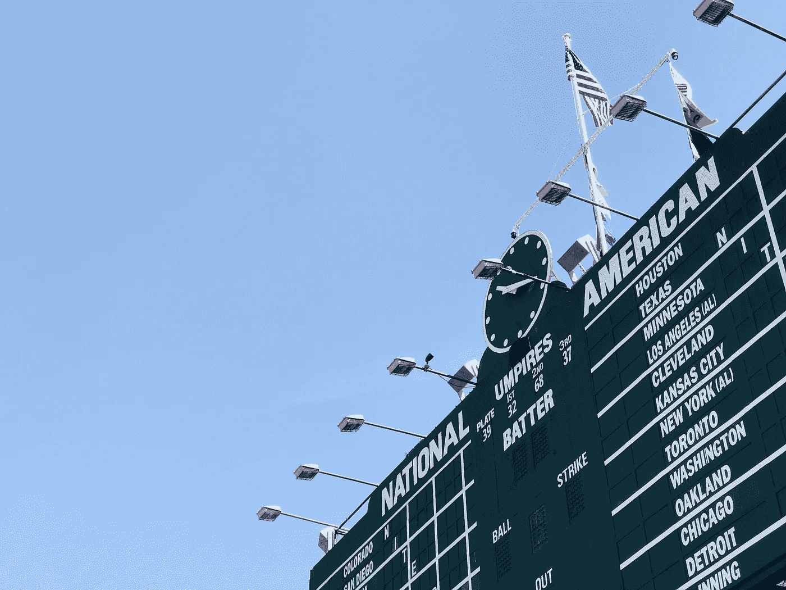
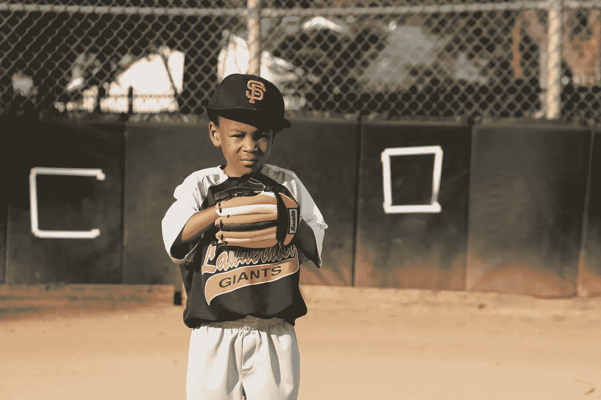

# 棒球迷统计:投球版

> 原文：<https://towardsdatascience.com/stats-for-baseball-fans-the-single-metric-for-pitching-is-era-e615a6c0710d?source=collection_archive---------32----------------------->

## 一名数据科学家表示，作为一名普通球迷，ERA 是最重要的统计数据

[克里斯·摩尔](https://unsplash.com/@chrismoore_?utm_source=unsplash&utm_medium=referral&utm_content=creditCopyText)在 [Unsplash](https://unsplash.com/collections/3997627/baseball?utm_source=unsplash&utm_medium=referral&utm_content=creditCopyText) 上拍照

又到棒球时间了。在我写作的地方，芝加哥，雪已经开始融化，小熊队在亚利桑那州的春训中给了我们希望。

当然，是时候掸掉统计记录的灰尘，和数据科学家一起看看棒球和统计数据了。

正如我在之前关于进攻统计的博客中所描述的，Moneyball 的统计学家会用不同的标准来评估一个球员的技术。投球也不例外。像“每 9 局允许的得分”和“调整后的胜数高于替补数”这样的指标允许那些分析师通过控制球队的防守能力或投手进入比赛时的比赛状态来了解投手的真实影响。

不幸的是，这些指标在国家电视广播中是不可用的，你将无法在观看比赛直播时计算它们。所以普通球迷在评估 MLB 投手时应该注意什么！？在这篇文章中，我解释了要关注的单一指标——在统计学的帮助下。

## 我为什么要写这个？

一篇棒球文章怎么会出现在数据科学家的博客上？这是因为我把我从小热爱的东西(棒球)和我建立职业生涯的东西(数据科学)融合在了一起。)

我从小就是一名棒球卡收集者。我父亲用他辛苦挣来的钱，时不时地在下班后给我买一两包，和一个玩少年棒球联盟并喜欢上这项爱好的儿子分享。

棒球卡上写满了数字。分解玩家如何玩游戏的每个小细节的指标。我会比较和对比我最喜欢的球员，一些最明显的数据会跳出来。佐治亚州的大个子棒球运动员弗兰克·托马斯会击出无数个本垒打，他的牌会证明这一点。诺兰·莱恩是德克萨斯的一名投手，他会有一大堆的三振出局数。

即使是那些把这些数据当做爱好的人也不知道应该关注什么来理解游戏中的最佳球员。

今天的博客是我上一篇博客的续篇，着眼于比赛中最好的击球手；我会让最普通的粉丝简单地回答这个问题:

要了解你队中最好的投手，你需要关注的一个统计数据是什么？那个统计是玩家的时代；但是让我们开始一段旅程，用统计学来理解为什么会这样。

TLDR:你最喜欢的球队中 ERA 数据最低的球员很可能是他们最好的投手。当你听到他们的入场音乐时，记得起立欢呼。

## 投球统计是信息过载。

由[杰森·温加特](https://unsplash.com/@jasonw?utm_source=unsplash&utm_medium=referral&utm_content=creditCopyText)在 [Unsplash](https://unsplash.com/s/photos/score-baseball?utm_source=unsplash&utm_medium=referral&utm_content=creditCopyText) 上拍摄的照片

投球统计是疯狂的。美国职业棒球大联盟使用高性能摄像机来收集在所有美国职业棒球大联盟体育场投掷的速度和旋转。同样的系统也测量每个球员在球场上的位置。

作为一名分析师和数据科学家，这个数据让我着迷。作为一个只想享受比赛的球迷，它在电视上看起来很酷——但没有办法处理所有的数据。作为一个不经意的球迷，碰巧有一个衡量标准可以让你了解任何球队的最佳投手。

当然，要了解谁是最好的，你可以依靠经理的决定。他们把谁放在轮换阵容的最前面，投手在比赛结束时要求谁上场，或者在与对手的关键比赛中谁是首发。那也行，但是我们是分析师，我们想知道为什么做出那个决定。或许还能理解谁该被叫到替补席上。那么，我们如何穿过噪音，评估那个阻止我的球队得分的球员呢？

首先，我们必须解决一些关于统计和棒球的问题。

## 为了有效地分析数据，我们必须处理棒球中的人为因素。

用投手的个人表现来理解投球数据的价值是有问题的。

照片由[妮可·格林](https://unsplash.com/@n_m_green?utm_source=unsplash&utm_medium=referral&utm_content=creditCopyText)在 [Unsplash](https://unsplash.com/s/photos/kid-baseball?utm_source=unsplash&utm_medium=referral&utm_content=creditCopyText) 上拍摄

玩家会生病。他们休假。经理让他们退出比赛，因为他们打得不好。有些人在比赛前一晚玩得太开心了。⁴

对于我们的投手分析，我们需要再次控制人为的可变性。**我们不分析投手，而是分析球队的投球能力，以确定需要关注的指标**。

我们关注常规赛球队的表现，因为平均而言，在 MLB 常规赛中的球队是可比的。球队通常打相同数量的比赛，有相同的机会得分，也有相同的机会得分。数据正常。标准化数据是统计学家最好的朋友。

这是球员表现与团队水平相同指标的对比图。一个显示了各种各样的个人球员的表现，许多球员得分很少，一些惊人的球员得分超过 2000 分！另一个显示团队表现趋于正常，分布在一个赛季中每个团队的平均 700 分左右。

*作者图片*

## 投球=不让对方得分。

Dictionary.comT2 这样定义棒球:

> *(棒球)两个九人队之间的一种球类运动，通常在一个场地上打九局，场地的焦点是一个菱形内场，有一个本垒板和三个相隔 90 英尺(27 米)的其他垒，形成一个必须由跑垒者完成才能得分的循环，中心进攻动作是用木制或金属球棒击打投球并跑垒，得分最多的一方获胜。*
> 
> 最好的投手应该是在防止球队得分方面做得最好的投手。—我

我们专注于得分，因为这是棒球唯一最重要的目标——击中跑者得分。得分最多的队赢得比赛。投手正在阻止这种情况发生。在对投手的这种分析中，我们的目标函数将是对投手所在球队的得分(即，得分)。)我们的目标是找到与跑垒最相关的投球统计。我们的假设是，一个投手在没有保送球员的情况下防止安打的能力将是一个强投手的信号。

## 球队中最好的投手可能有最低的 ERA。

Chadwick 棒球 Database⁵包括我们将用于此分析的原始统计数据。它不包括被认为是评估投手 talent⁶.的关键指标它也不包括显示在棒球记分牌上的指标。因为，作为一个普通的球迷，我们可以看到记分牌，基本的投球比率是这次分析的目标。潜在的度量包括平均得分率(ERA)、每局保送加安打数(WHIP)、每 9 局安打数(h/9)、三振出局百分比(K%)以及处理或放弃的安打统计的其他常见投球度量(K、BB、H、2B、3B、HR 等)。)

由于 Chadwick Baseball 数据库不包含计算的指标，我们将通过计算来包含这些指标。

计算出的投球统计数据及其计算如下所示:

鞭笞=(保送+安打)/投球局数

K/BB 比率=三振/保送

ERA =得分/投球局数* 9

在这个分析中，我通过删除一些异常的季节进一步规范化了团队数据。以下是我的团队剔除异常值的全部细节:

*   **删除 1970 年之前的球队**:1970 年赛季之前没有跟踪几个关键指标(包括牺牲苍蝇、被投球击中和其他)。)我们也知道规则的改变使得 1970 年成为一个很好的转折点来规范投球数据。
*   **删除了比赛次数少于 158 场的团队赛季**:我想删除因罢工和其他日程古怪而缩短的赛季。
*   **删除了不在国家或美国联盟打球的球队**:我们的重点是美国职业棒球大联盟，在投手的最终评估中包括非裔美国人联盟。

有了干净的数据，我们运行一个简单的相关性统计，将常见的投球指标与投手团队的得分相关联。分析表明 ERA 是最重要的指标，相关系数为 0.982。这很有意义，因为平均得分显示了一个投手/球队平均得了多少分。我们的结论:**时代越低，投手越好。**

*作者图片*

*作者图片*

## ERA 有史以来最佳投手，带*调整*

既然我们知道我们应该最关注 ERA，那么根据这个统计数据来看谁是有史以来最好的球员是很自然的事情。如果我们的分析中有很多名人堂的天才，我们就一定会有所发现。

不幸的是，这并不像计算每个玩家的纪元那么简单。

如果我看看棒球历史上球员的最低年龄，我注意到一个非常有趣的趋势…

*作者图片*

现代投手比 1871-1968 年的投手有更高的自责分率！什么？为什么会这样？

答案是:在早期棒球史上，规则(或者说缺乏规则)给了投手优势。

来自“死球”时代(1871-1920)甚至“黄金时代”(1921-1968)的球员以他们使用现在是非法的投球技术而闻名。

何塞·弗朗西斯科·莫拉莱斯在 [Unsplash](https://unsplash.com/s/photos/baseball-pine-tar?utm_source=unsplash&utm_medium=referral&utm_content=creditCopyText) 上拍摄的照片

已知死球投手使用[吐球](https://en.wikipedia.org/wiki/Spitball)。一种投球，现在是非法的，在棒球运动中不可预测地移动并损害击球手的生产力。

黄金时代的投手有较大好球带的优势。1968 年，好球带缩小，[对投球技术的限制更加严格。](https://www.si.com/mlb/2019/03/14/history-mlb-major-rule-changes-three-batter-minimum)

为了选出任何时代的最佳投手，我们需要调整他们的时代，以适应这些规则的变化。幸运的是，我们的统计“印章”将有助于做到这一点。

**线性模型**

为了确定我应该调整多少死球时代和黄金时代的投手，我们需要使用一个模型，可以说明投手投球的年份的影响。因此，我们返回到我们的团队数据，并使用线性模型来确定对主要在每个时代投球的任何投手的适当调整。

我的方法是添加一个虚拟变量。如果投手在死球时代的出场次数超过 50%，他们在“ap_era_deadball”功能中被分配“1”。如果一个投手在黄金时代出场超过 50%，他们在“ap_era_golden”功能中被分配“1”。所有其他投手都被定为 0 分，因为他们是现代投手。

我们使用线性回归模型来了解在棒球的死球和黄金时代，我们应该调整每个投手的投球量。

我的模型的输出如下:

*作者图片*

你会发现这个模型没问题。我们的每一项统计数据都具有统计学意义；但模型只解释了 19.8%的方差。然而，系数是最重要的输出。它们具有统计学意义，并给了我们一种调整早期投手的方法，这样现代投手就有公平的机会成为历史上最好的投手。

**我的调整:**

**“死球”时代投手的职业生涯时代将增加 0.83529。**

**“黄金”时代投手的职业生涯时代将增加 0.15738。**

**“现代”时代的投手对他们的职业时代将没有调整。**

不多说了，根据我的分析，下面是历史上最伟大的 15 名首发球员的名单。

*作者图片*

我童年的英雄，诺兰·莱恩，根据时代进行了删减。前 15 名没有现役首发；格罗弗·克利夫兰“皮特”亚历山大是首发之王。

根据我的分析，这是前 15 名救援队员的名单。

*作者图片*

拥有有史以来最快快速球记录的投手阿洛迪斯·查普曼是最佳中继投手。他也是纽约扬基队的一名活跃球员，前芝加哥小熊队队员，准备在 2021 年向我们展示他的东西。

**根据我的分析，最后是前 15 名结案者。**

*作者图片*

一个有争议的选择，克雷格金布雷尔，坐在关闭名单的顶部。大多数人会反对我写这个，但马里安诺·李维拉紧随其后——所以给我一点信任。任何我个人投票选出的游戏中最好的小胡子，由 [Rollie Fingers](https://en.wikipedia.org/wiki/Rollie_Fingers) 拥有，在 15 个关闭者名单中排名第 11。

# 最后

自责分率是一个经过检验的真实指标，当关键时刻到来时，它会告诉你哪些投手最擅长防止得分。

我的建议是留意你团队中 era 最低的投手。那些投手是你阻止对方击球手得分的最好机会。

*作者图片*

[1]“棒球。”Dictionary.com 2021。[https://www.dictionary.com/browse/baseball](https://www.dictionary.com/browse/baseball)(2021 年 3 月 23 日)

[2]E baccelleri，[DH，喷壶和……最少三个击球手？主要规则变化简史](https://www.si.com/mlb/2019/03/14/history-mlb-major-rule-changes-three-batter-minimum) (2019)，《体育画报》杂志(2021 年 3 月 23 日)

[3] [最快棒球场(男)](https://www.guinnessworldrecords.com/world-records/fastest-baseball-pitch-(male)/) (2010)，吉尼斯世界纪录有限公司(2021 年 3 月 23 日)

[4]M . feinstand， [CC Sabathia 不记得季后赛前的巴尔的摩本德，他说喝酒并没有影响他为洋基队投球:“我就像一个酒鬼”](https://www.nydailynews.com/sports/baseball/yankees/cc-sabathia-talks-struggles-alcohol-chose-rehab-article-1.2425326) (2015)，《纽约每日新闻》(2021 年 3 月 24 日)

[5][https://github.com/chadwickbureau/baseballdatabank](https://github.com/chadwickbureau/baseballdatabank)(2020)，查德威克棒球统计局(19，2021 年 3 月)

[6] [美国职业棒球大联盟的统计词汇](https://www.mlb.com/glossary) (2021)，美国职业棒球大联盟(19，2021 年 3 月)