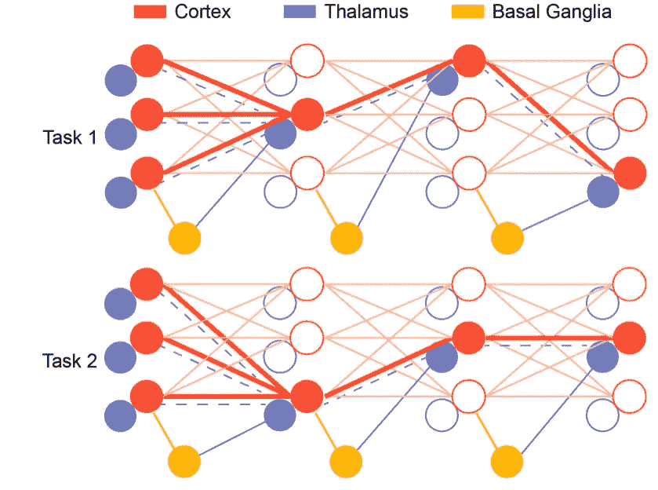
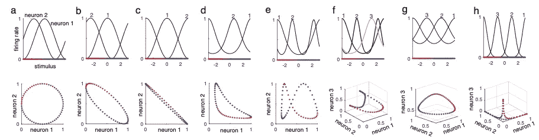
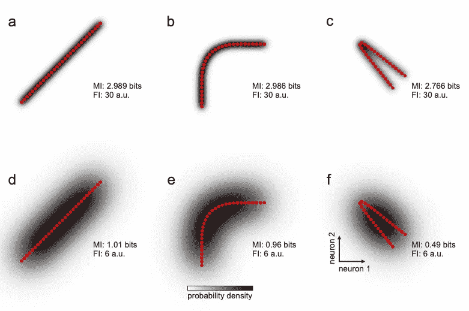
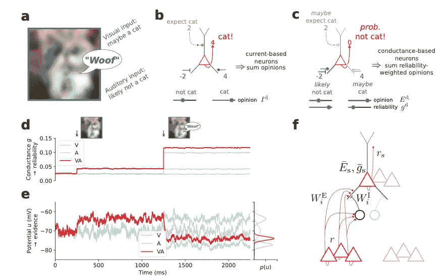

# 与神经科学保持同步:2021 年 4 月必读

> 原文：<https://towardsdatascience.com/stay-updated-with-neuroscience-april-2021-must-reads-668bd345f50f?source=collection_archive---------33----------------------->

## 麻省理工学院和突触强化🎰、神经调谐和代表性几何🏗皮质神经元是贝叶斯最好的朋友🤝👊

[图片](https://unsplash.com/photos/B2wIx44pYAU)由[马丁·亚当斯](https://unsplash.com/@martinadams)在 Unsplash 上拍摄

**你为什么应该关心神经科学？**

神经科学是当今人工智能🧠的根源🤖。阅读并意识到神经科学中的进化和新见解不仅会让你成为一个更好的“人工智能”的家伙😎而且还是一个更好的神经网络体系结构的创造者👩‍💻！

在这里，我列出了 3 篇值得这个月阅读的论文，它们涉及神经元和认知。第一部分对神经动力学有所启发，这可能有助于开发新的基于马尔可夫链的神经网络。第二篇是关于神经编码和统计背后的数学的精彩综述——从数学的角度来看，这无疑是一个更好地理解神经元行为的好机会。最后，论文用提出的神经网络模型证明了皮层神经元的贝叶斯行为。享受:)

# 丘脑皮层对解决神经系统信用分配的贡献

米安·布拉巴·王，迈克尔·哈拉萨， [**论文**](https://arxiv.org/pdf/2104.01474.pdf)

神经科学的标志之一是学习在不确定的环境中选择哪种行动。当动物探索陌生的环境时，它们倾向于强化导致意外回报的行为。这种加强来自突触连接的变化。特别是，一个最受认可的模型表明，多巴胺(DA)携带奖赏预测误差信号(RPE)，在基底神经节(BG)的神经支配水平上起作用。然而，是什么让这种电路加强了适当的连接仍然是一个谜。这种强化意味着理解什么是正确的线索、背景和行为，这是一个被称为*信用分配问题*的问题。此外，这种问题可以分为结构性*信用*分配、*情境性*信用分配和*时间性*信用分配。在*结构*任务中，我们需要理解导致奖励的线索，而不是干扰物线索；*语境*任务可以被认为是学习新的东西而不忘记通常的行为——例如，一个在美国的人在过马路前学会向左看，但是，在英国呆了一段时间后，这个人在回到美国时不应该忘记向左看的行为；*时间上的*信用处理的是回报远在时间上的决策。一个例子是围棋的游戏，几百手之后会有一个奖励显露出来，可以得到职业棋手的认可。

应对这一挑战的人工帮助可能来自机器学习。ML 模型解决信用分配问题的方法是反向传播。*反向传播*允许根据数据训练神经网络，加强突触连接的权重。虽然反向传播的实现是通用的，但这种方法通常会遇到一个被称为*灾难性遗忘*的问题。事实上，随着时间的推移，ML 模型往往会忘记他们所学的内容，尽管一些计算昂贵的解决方案正在试图解决这个问题。作者认为*人类的大脑可以被看作是以一种特殊方式组合在一起的特殊硬件的集合*。专门的硬件安排可以在大脑中发生，其中*丘脑及其与基底神经节(BG)和皮质的相互作用作为这三种类型的信用分配的系统级解决方案。*

事实上，作者提出，基底神经节的强化过程选择丘脑控制功能，随后激活皮层关联，以允许跨不同背景的灵活映射。这个过程可以简化为三个步骤:

*   首先，一个基本的学习发生在基底神经节，在皮质纹状体突触中，正如 DA 的水平所强调的。这是一个快速学习系统，但是推广起来非常慢
*   另一方面，皮层可塑性在一个慢得多的时间尺度上运作，但允许灵活的行为和快速的概括:*元学习*
*   丘脑学习这两种动态，并提供控制节点，使皮质活动关联空间参数化。

作者强调了这一工作流程，描述了文献支持的三个主要特征:1) BG 可以指导丘脑皮层结构的可塑性，特别是在初始学习中；2)丘脑皮层结构在不同的时间尺度上巩固了对丘脑控制功能的 BG 选择，以实现元学习；3)如图 1 所示，丘脑选择性地放大功能性皮质连接，作为情境信用分配和灾难性遗忘的解决方案

图 1 对比信用分配问题，提出了人脑的作用机制。在任务 1 中，BG 选择放大相关皮层子网络的丘脑神经元。这发生在快速时间尺度上，这允许系统巩固灵活的切换行为。当下一个任务，即任务 2，到来时，BG 选择其他丘脑神经元，因为前一个神经元受到保护，不会被覆盖。与此同时，一个缓慢的时间尺度正在发挥作用，让皮层神经元发展出一种与任务相关的共享表征，这种表征可以在不同背景下进行归纳。这使得动物可以在不同的任务之间自由转换，而不会忘记之前的任务。

总之，与传统的*丘脑*的中继观点相反，作者提出丘脑皮层相互作用是元学习的*位点，其中*丘脑提供皮层控制功能，如感觉过滤、工作记忆门控和 os on* 。 *BG 在两个特定的时标*上工作，选择特定的丘脑控制功能，实现元学习，解决学分分配问题。较快的可塑性学习上下文关联，以实现快速的行为灵活性，而较慢的可塑性建立概括的皮层表征。*

# 神经调谐和表征几何

尼古拉·克里格斯科特，薛-韦辛*，* [**论文**](https://arxiv.org/abs/2104.09743)

这是一篇精彩的综述，对于感兴趣的读者来说，这是一个了解更多关于神经调谐及其几何表示的绝佳机会。神经元可以用*调谐*来表征，作为对刺激的反应。*调谐曲线*继续为单个神经元如何在感觉、认知和运动过程中编码行为相关信息提供有用的一阶描述——例如*调谐曲线告诉我们单个神经元的平均活动水平如何根据刺激而变化*。另一方面，神经元可以通过*解码*视角作为一个群体来研究。解码解决了从一群神经元中可以读出什么信息的问题，使用了简单的生物学似是而非的解码器，如线性解码。因此，解码返回群体响应空间中的特定响应模式。这个解码方面严格地依赖于*表示几何*，它从它们的调谐曲线中捕获神经群体响应模式的所有可能投影。图 2 举例说明了几何学在神经科学中的意义。

*几何可以被视为一个称为流形的数学对象，即一个超曲面，其中每个点对应于来自神经群体调谐曲线的定义的特征和变量*。如你所见，图 2 a)和 b)给出了在几何空间中混合的两条调谐曲线的简单例子，显示了神经元流形空间。如果可以计算点之间的欧几里得距离，通常接受神经流形。例如，图 2 e)示出了不可行的神经流形的例子，但是仅仅对一条神经调谐曲线进行简单的校正，图 2 f)就可以将该流形带回欧几里德空间。

*几何图形由分离任意两个刺激的表示的多元响应空间中的距离决定。调谐曲线定义了响应模式，从中我们可以计算代表距离。因此，几何形状取决于调谐，但反之亦然是无效的。*

图 2 上图显示调谐曲线，下图显示调谐歧管。图 a)和 b)考虑几个神经元。在这种情况下，根据两条曲线之间的偏移，流形类似于圆形或椭圆形。图 c)、d)、e)、f)、g)和 h)显示了 3 个神经元的调谐曲线的情况。图 d)显示了由两条 van Mises 调谐曲线引起的新月形响应流形。图 e)显示了一个非欧几里德流形几何，这在原则上是不可能达到的神经群体。这种纠缠的情况可以如 f)所示解决，其中第三个神经元再次返回流形。

调谐和几何是密切相关的，它们可以根据 Fisher 信息和互信息量化从神经群体中检索的信息。特别是，反应 **r** 和刺激 **T** 之间的*互信息(MI)* 测量反应传达的关于刺激的信息——这大致是*一个变量包含关于另一个变量*的多少信息。另一方面，自然群体代码的 *Fisher 信息(FI)* 仅是刺激的函数，反映了代码对刺激的局部变化有多敏感，即*对刺激属性进行编码的精度。*

图 3 示出了歧管几何形状与 FI 和 MI 之间的关系。在该图中，作者模拟了均匀的先验刺激 **T** 。图 3 a)示出了直线神经响应流形，然后在图 3 b)和 c)中对其进行调制。如果刺激沿着流形的分布是均匀的，那么刺激在空间的每一点都是可分辨的，FI 保持不变。MI 略有变化，最小值出现在图 3 c)中，其中流形的两个极端在空间上接近，使得这些点更加容易混淆。如图 3 d)、e)和 f)所示，这种情况在存在噪声的情况下变得完全不同。

图 3 流形几何、Fisher 信息和互信息之间的关系。这些是一维刺激空间编码的流形，来自两个神经元。响应分布显示在背景(灰度)中，用于刺激空间上的均匀先验。总流量与总管的长度成正比。如果存在一些噪声(d)，e)和 f))，FI 减小。这证明 FI 测量沿流形的可分辨性，而几何和 MI 测量所有刺激之间的可分辨性。

一旦解释了神经调谐、几何、FI 和 MI 的概念，就清楚了什么是有效的代码*。如果神经代码提供关于刺激的大量信息，高 MI，并在尖峰和神经元数量的限制下保持一致的响应，即高 FI* ，则该神经代码是有效的。这样的定义提供了一种理性，可以解释为什么神经元采用特定的调谐函数来表示各种感官和非感官变量——即*为什么大脑不同区域的神经元可以对相同的刺激做出反应，但它们有不同的调谐曲线*。此外，有效的代码应该将更多的资源分配给更频繁的刺激，这可以通过刺激参数化的非线性变形来实现。

# 学习贝叶斯最优树状意见池

雅各布·乔丹、若昂·萨克拉门托、威廉 A.M 怀博、米海·a·彼得罗维奇、沃尔特·森*、*[T3、纸](https://arxiv.org/pdf/2104.13238.pdf)

在这篇论文中，作者通过创建一个反映生物学对应物的特别人工神经网络，提出了树突状膜电位和电导如何编码观点以及它们作为决策者的作用。该论文的核心部分如图 4 所示。

图 4:基于电导的神经元动力学实现概率线索整合。a)显示多感官刺激、图像和听觉输入。b)首先，基于电流的神经元产生响应，其仅使用其偏好的特征来积累关于图像可能是什么的意见 c)然后，基于电导的神经元帮助基于电流的神经元整合它们的信息，总结它们的意见和可靠性。d)总身体电导可靠性，您可以清楚地看到基于电导的神经元何时起作用。e)体细胞膜电位。f)最终电路实现

大脑中的信息是通过各种方式传递的。行为证据表明，人类能够整合来自不同模态和先前经验的感觉输入，以实现与贝叶斯最优线索整合模型相似的性能。成像你看到一个模糊的图像，最初基于电流的神经元会试图整合信号以给出响应。然后，通过使用树突电导作为额外的编码维度，通过加权听觉输入和视觉输入，有可能获得正确的响应。这一观点建立了一个新的框架，*以电导为中心的神经元意见加权框架，它预测了不同于经典的基于电流的模型的神经元反应特性。*

*电导中心模型的特性显示出与贝叶斯统计的严格关系—* 也在具有胡须刺激实验的小鼠上得到实验证明。*在没有感觉输入的情况下，先前的观点被编码在体细胞膜电位*中。*这些先验通常可靠性较低。*因此，神经元更容易受到背景噪声的影响，导致先前电位附近的膜电位大幅波动。*当提示出现时，突触前活动增加，因此先验分布与提示特异性分布结合*，这导致具有适应的平均值和减少的方差的更新的体细胞分布。如果先验信息与线索信息非常不一致，则均值的变化大于先验信息和线索信息一致的情况。*重要的是，无论是否与之前的信息冲突，在新信息出现的情况下方差总是减小的:贝叶斯推理！*

我希望你喜欢 2021 年 4 月神经科学`arxivg.org`论文的这篇综述。请随时给我发电子邮件询问问题或评论，地址:stefanobosisio1@gmail.com