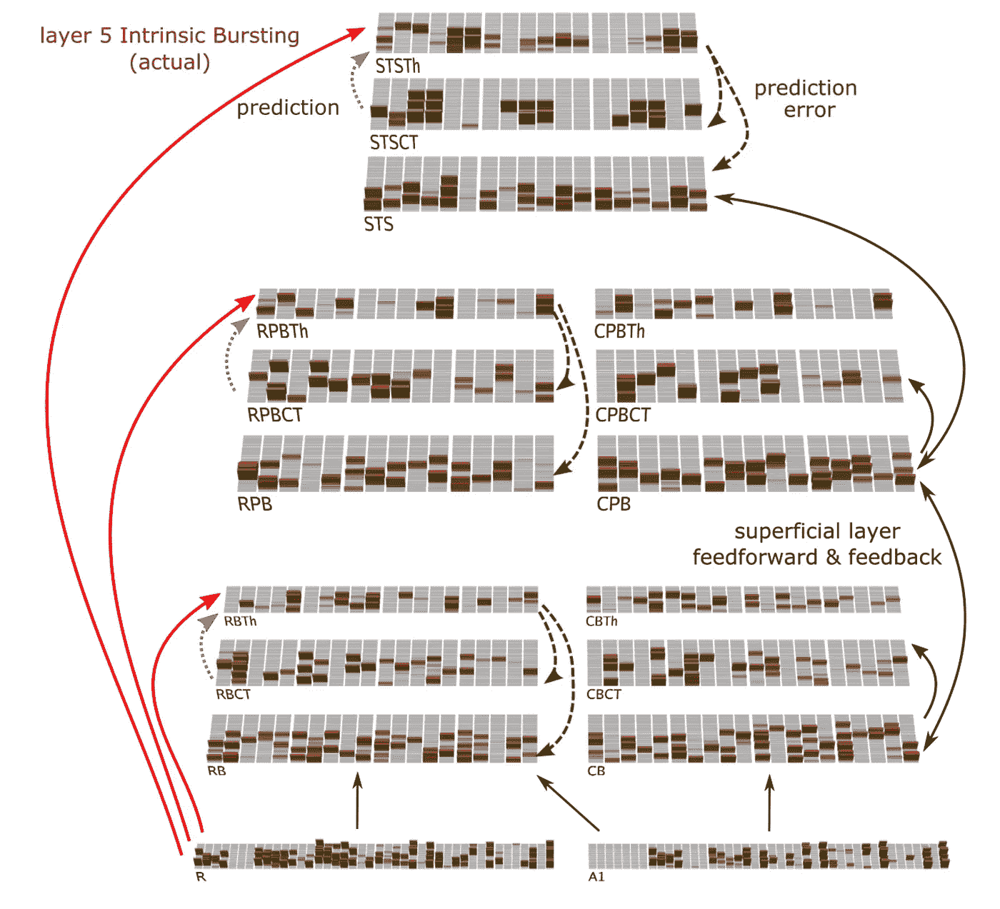
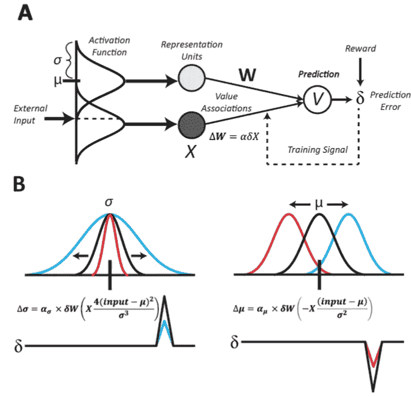
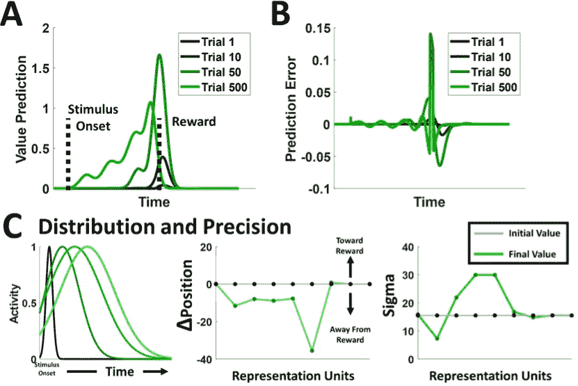
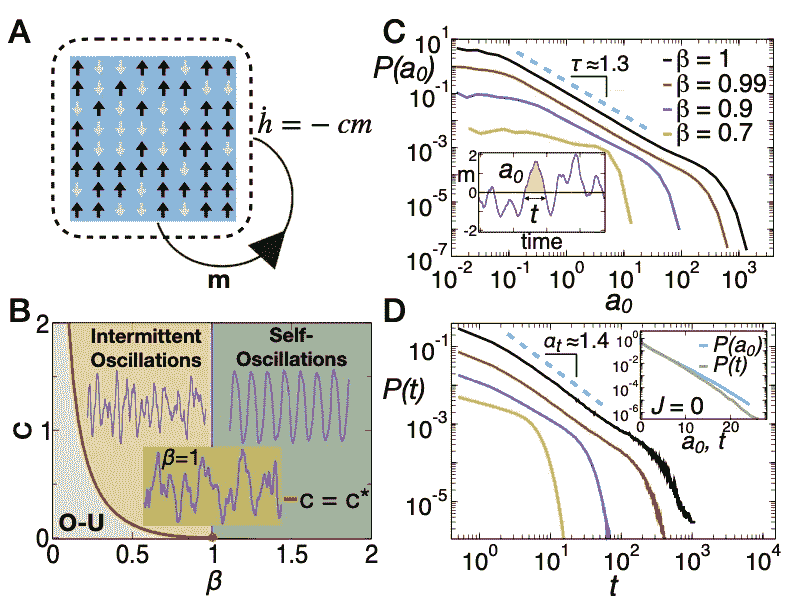

# 与神经科学保持同步:2021 年 8 月必读

> 原文：<https://towardsdatascience.com/stay-updated-with-neuroscience-august-2021-must-reads-3d0c3615a064?source=collection_archive---------17----------------------->

## 婴儿如何学习说🗣️语？；哈佛大学🏛️为生物🧠启发的强化学习定义了一个新的数学框架；神经元雪崩建模🏂

加州，图片由尼克·莱特在 T2 Unsplash 电视台拍摄

<https://medium.com/@stefanobosisio1/membership>  

**你为什么要关心神经科学？**

神经科学是当今人工智能🧠的根源🤖。阅读并意识到神经科学中的进化和新见解不仅会让你成为一个更好的“人工智能”的家伙😎而且还是一个更好的神经网络体系结构的创造者👩‍💻！

奥古斯特提出了三篇复杂的论文，我试图让它们变得简单易懂。我猜你们中的许多人一直想知道婴儿是如何将所有的声音放在一起并学习语言的。加州大学戴维斯分校的🗣️·罗利希和奥赖利试图评估这个问题，他们开发了完全受生物启发的神经网络，这证明了在婴儿身上的实验结果——已经在 1996 年进行了测试！第二篇论文来自哈佛的研究人员。这是一个数学问题，一个奇妙的阅读，其中强化学习是根据奖励预测误差和基于生物学假设进行审查的:🔝。第三篇论文是我喜欢的，因为它与统计物理学有关——这是我隐藏的热情。作者展示了一个接近非平衡态的简单伊辛模型如何模拟大脑中的相变，模拟诸如神经元雪崩之类的对立动力学🔥和神经元振荡📶。享受:)

# 语音中的统计学习:一个基于生物学的预测学习模型

约翰·罗里希，兰德尔·c·奥莱利， [**论文**](https://arxiv.org/abs/2108.06065)

婴儿时期，我们如何从纯粹原始的感官经验中学习语言？你想得越多，声音就越复杂，婴儿的大脑是如何处理和排列声音，并在几个月后将它们转换成声音和真正的语言的。这个问题在神经科学中被称为*统计学习*，它一直是多年来研究的中心。事实上，几十年的研究一直致力于建立*预测学习*方法，这是一种可能成为统计学习驱动过程的机制。在这篇论文中，作者建立了一个人工神经网络，以模拟皮质丘脑回路，新皮质互连和丘脑核为基础，提供对统计学习的见解。该模型阐明了婴儿的语音分段范式。简而言之，婴儿预测言语中的下一个单词音节——被视为原始的听觉体验——并从那里开始学习说话。

正如我们从许多其他评论中看到的，该模型的核心是该过程是预测性错误驱动的学习。错误驱动的过程是由新皮层和丘脑高阶核之间的连接模式触发的。对于听觉皮层，主要输入来自核心区 A1 和 R 中的内侧膝状体(MGB)。前一个区域可以跟踪快速声振幅调制(20-30 毫秒振荡)，而 R 区域处理 100 毫秒或更长时间的调制。因此，在核心区本身内存在时间响应差异，对高阶核团中的丘脑中继细胞(TRCs)产生几个微弱的预测。这些预测在皮层的第 5 层产生驱动输入，来自爆发的神经元 5ib，每 100 毫秒触发一次。因此，很明显，我们有两个不同的区域，在不同的时间激活，这种时间差产生了预测误差。时间差异可以驱动整个新皮层的突触变化，这可能类似于一种生物误差反向传播，以随着时间的推移改善预测。

图 1 显示了计算的对应物。该模型模拟 R 和 A1 区域。从那里，预测被发送到更高级的丘脑核(红色箭头，RBTh，RPBTh 和 SYSTh)。同时，每个丘脑核的预测通过相同神经网络内的子预测得到增强，通过反向传播(绿色虚线箭头)得到时间上的改善。该模型的任务是预测下一个简短的语音片段，它可以是下一个词的过渡或词内音节的过渡。

图 1:基于听觉皮层实现的神经网络示意图。有关模型的具体信息，请查看论文的第 18 页。该模型从区域 R 和 A1 开始，将初始预测发送到丘脑高阶核 RBTh、RPBTh 和 STSh。每个高阶电路都有自己的预测，这些预测通过反向传播得到增强。

结果支持 Saffran 的早期发现——发表于 1996 年。特别是，该模型比语音中的下一个单词更准确地正确预测下一个音节。进一步的测试和模拟显著地证明了正确地预测了词内转换，而不是下一个词的转换，婴儿的实验结果和计算结果之间有重叠。

实际结果是什么？该模型证明了婴儿的初步实验结果，具有以下关键点:

*   该模型完全模仿了听觉皮层中可能遵循的生物路径
*   这个过程被证明是错误驱动的，因此学习本身也是错误驱动的
*   用于训练的扩展声音集类似于我们在婴儿时听到的声音——就像一大堆声音。这些声音的多样性有助于生物网络概括类似音素的表示
*   类似音素的表示是词内过渡，因此语音学习从简单的音节预测开始，而不是从下一个词的过渡开始

# 具有奖励预测误差的表征学习

威廉·H·亚历山大，塞缪尔·J·格什曼， [**论文**](https://arxiv.org/abs/2108.12402)

又来了！奖励预测误差的概念是神经科学的核心，它可以在现代机器学习世界中带来惊人的后果。在这篇论文中，哈佛大学的作者提出了一个新的强化学习(RL)的数学框架，将学习过程建模为多巴胺能系统(DA)。特别是，作者将 RL 框架固定在根据回报预测误差(RPE)检查 RL 的*表示*上。该表示可以是目标函数、时间或空间域。

从生物学角度来看，来源于 RL 的 RPE 可能对学习最佳状态表征以及学习联想本身是有用的。我们将不会通过数学的见解，但图 2 可以大大有助于理解亚历山大和格沙曼 RPE-RL 方法的基础是什么。粗略地说，作者导出了一种 RPE 方法来校正单元激活函数中的错误，而不是单个单元的权重，检索参数来导出用于调整 RL 高斯参数的生物友好学习规则。

图 2 使用 RPE 生物启发方法的 RL 的一般视图。a)RL 模型的总体视图。为了将刺激和表征联系起来，在训练期间使用奖励预测误差。通常，误差通过模型的权重传播。然而，在作者的框架中，误差可以被传播，以便调整单元的活动。b)在这里，我们可以证明，通过改变单元激活函数的参数，可以使误差最小化。正误差(B-左)可以通过增加高斯分布(蓝线)或向预测误差方向移动高斯位置(B-右)来减少。反之则为负误差。

这个模型的一个特殊例子是学习时间表征。为了证明基于 RPE 的 RL 如何学习时间表示，作者采用了 RL [标准时间差异学习规则(TD)](https://en.wikipedia.org/wiki/Temporal_difference_learning) ，图 2 显示了来自训练会话的结果。进一步的例子给出了空间表示，类别表示和运动控制。

图 3:学习时间表征。a)增加训练，从试验 1 到试验 500，当给予刺激时，模型识别时间动态 B)随着训练预测收敛，预测误差随时间减少 C)RL-RPE 有多精确？第一个图描绘了给定神经单元的活动变化，这达到了更精确的模式。特别是，高斯位置和方差随时间重新分布，向奖励方向收敛

我们能从这里带什么回家？这篇论文为 RPE RL 框架奠定了基础。这证明 RPE 可以调节来自外部刺激的内部 RL 表征的位置和扩散。此外，我们在这里采用了完全生物启发的 RL，而不是模仿 DA 系统的纯人工 RL。很多发展很快！

# 量化神经元振荡和雪崩的共存

法布里齐奥·隆巴迪、塞尔维尔·佩皮奇、柳文欢·什里基、加斯珀·特拉克、丹尼尔·德·马蒂诺、[T3 纸](https://arxiv.org/abs/2108.06686)

正如你从以前的帖子中看到的，我们经常将大脑动力学与人工神经网络联系起来。然而，我们是否总是需要人工神经网络来证明验证人脑？本文给出了一个更基于物理的方法来看待大脑，采用一个来自统计物理学的简单模型来解释大脑中多种神经元动力学的共存。

作者提出了*伊辛模型*的非平衡扩展，以捕捉神经振荡、极端事件统计和无尺度神经元雪崩。这些现象是周期性的，或者在电记录(例如 EEG、MEG)中被表示为大偏转，并且被认为在脑动力学中起着基本作用。此外，大脑的振荡通常是周期性和非周期性状态的共存——对立状态。一个例子是对大脑节律中“神经元雪崩”的观察，其中记录显示了神经元活动的级联，没有特征时间或空间尺度。

伊辛模型可以被认为是 2D 网格中的神经元(图 4)。每个神经元由定义极化波的自旋状态(例如+1 和-1)定义。外场可以改变神经元群体的极化，在网格中创建不同的状态，从而导致不同的结构阶段。监控结构阶段返回阶段转换的简化现实模型。

图 4:伊辛模型。A)神经元伊辛模型的草图，其中神经元极化用向上或向下的箭头表示，外部时变场 h(t)类似于依赖于活动的反馈机制。b)作为伊辛模型的结果，我们可以得到相变。对于β= 1，在自持振荡(绿色)和间歇振荡(黄色)之间存在分离阶段。C)反转时间，即总网络活动 m(t)的连续过零事件之间的时间间隔。从这里，我们可以提取幂律行为，其决定了临界点(β= 1)附近的反转时间的 P(t)的脑动力学 D)分布

从实验结果来看:

*   伊辛模型用人脑静息清醒状态的脑磁图记录进行了测试，其中主要振荡在阿尔法波段(8-13 赫兹)。通过信号自相关函数的推断，伊辛模型正确地模拟了来自阿尔法带的大脑活动。此外，自适应伊辛模型检索单个脑磁图传感器的动态
*   神经元雪崩和极端事件的动力学被正确地建模。此外，该模型可以再现连接平均雪崩大小和它们的持续时间的标度关系。

这些都是显著的成果。伊辛模型是我们能够创建的最简单的物理模型，如果调整正确，它可以结合兴奋性神经元尖峰的微观和随机描述。这种描述通过依赖于活动的反馈的粗粒度平均场模型得到增强，因此可以模拟任何外部刺激。令人印象深刻的是，一个简单的模型可以再现对立动力学的共存，如神经元雪崩和周期性振荡。

我希望你喜欢 2021 年 4 月神经科学`arxivg.org`论文的这篇综述。请随时给我发电子邮件询问问题或评论，地址:stefanobosisio1@gmail.com