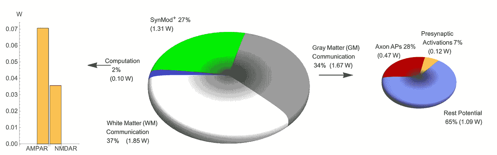

# 与神经科学保持同步:2021 年 2 月必读

> 原文：<https://towardsdatascience.com/stay-updated-with-neuroscience-february-2021-must-read-7f777aa62431?source=collection_archive---------38----------------------->

每天都有数百篇经过预先审核的论文发表在`arxiv.org` Stay updated with me 上，这个迷你指南会告诉你每个月最有趣的论文。2021 年 2 月最奇特的论文

大脑。[图片](https://unsplash.com/photos/tEVGmMaPFXk)由 [Alina Grubnyak](https://unsplash.com/@alinnnaaaa) 在 Unsplash 上拍摄

神经科学是当今人工智能🧠的根源🤖。阅读并意识到神经科学中的进化和新见解不仅会让你成为一个更好的“人工智能”的家伙😎而且还是一个更好的神经网络体系结构的创造者👩‍💻！

2021 年 2 月有 3 篇有趣的论文值得一读，在这里我总结并将其转换为外行术语

# 相关神经群体中信息编码的几何学

*Rava Azeredo da Silveira，Fred Rieke，* [**论文**](https://arxiv.org/abs/2102.00772)

神经元在其集体活动中代表信息。这种神经群体在编码和解码刺激信息时的保真度取决于每个单个神经元的响应可变性是否以及如何在其他神经元之间共享。因此，定量神经科学的研究试图将神经反应的几何学(统计学)与刺激或任务联系起来，以更好地理解相关噪声。然而，这个问题很难解决，因为它包含了大量的变量，是一个高维的问题。本文作者试图定义噪声相关性对神经编码的相关性，回顾文献并强调噪声相关性如何影响信息模式(即神经元携带的信息)的几何观点。

作者定义的一般方法考虑了信噪比上的噪声相关性。这种相关性取决于没有噪声相关性的独立神经元所携带的信息、噪声相关性本身所携带的信息以及由于信号相关性和噪声相关性与神经群体之间的相互作用而导致的增量或减量信息保真度。这些贡献可以从图 1 所示的几何角度来看。信号(图 1A 中的绿线)受到噪声的影响，噪声可能出现在这条绿线上的任何一点。噪声由蓝色椭圆表示。在这些噪音中，我们可以将两个神经元携带的相互信息，或信噪比(SNR)——即信息响应的保真度——定义为绿线在刺激的“测试”方向上的投影。因此，SNR 取决于噪声区域内定义的角度θ。图 1C 示出了为了最大化 SNR，神经群体可以执行的优化任务，通过将当前 SNR(绿色圆圈)移动到最大值(红色点),找到正确的信息方向。因此，在具有噪声相关性的神经群体的信息编码中，重要的是噪声沿着信息维度的投影。

图 1:两个神经元的信息和噪声的几何关系。**答:***绿线是信号，*定义自己的超曲线。对于绿线中的每个点，我们可以定义相关噪声，其统计分布由蓝色椭圆表示。想象一个由黑色“测试”方向定义的信号方向，通过将绿线信号投射到测试方向上，可以看到噪声对信号的影响。因此，信噪比(SNR)将取决于角度θ**B:**SNR 比率的行为是θ和测试方向的函数。绿色圆圈对应于信噪比和测试方向相同的情况。**C:**SNR 与角度θ的函数关系。绿点是我们想要优化的，直到红点处的最大 SNR 值，它定义了一个信息方向。图片摘自[作者的论文](https://arxiv.org/abs/2102.00772)

# 大脑皮层通讯掩盖了计算能量的使用，但是这些结合起来预测突触数量

*威廉·b·利维，维多利亚·g·卡尔弗特，* [**论文**](https://arxiv.org/abs/2102.06273)

作者从能源效率的角度定义了一种数学方法来确定神经计算成本——即神经元执行计算任务的成本。

这个数学优化问题可以根据每个神经元的突触数量 *N* 来解决。他们发现，从能量效率的角度来看，每个神经元的最佳突触数量约为 2500 个。然而，这样的值与经典的统计物理推导结果非常不一致，导致每次计算的能量消耗大约为 10⁸比特/J！这种不协调可能源于物理简化——例如，物理上时间与神经元通信无关，因此脉冲式通信是无能量的。虽然类似的考虑可能适用于数学-物理学推导，但生物学必须为这一阶段付出代价，并且在神经元之间的交流方面付出代价。

深入研究通信和计算成本，他们得出的计算消耗约为 0.1 W(图 2)。将灰质(GM)通信成本与总白质(WM)成本相结合，约占葡萄糖摄入能量的 71%，总 4.94 W 中的 3.52 W 用于通信，相比之下占计算的 2%。假设所有的 WM 成本本质上都是通信成本，那么通信与计算的比率是 35:1。

这些考虑导致我们重新考虑大脑中 20 W 的总葡萄糖能量消耗。从最近的 PET 扫描来看，大脑大约需要 17 W，代替索科洛夫(~ 1950)的 20W 值。去掉 8.89 W 加热后，全脑可用的只有 6.19 W。这些支持作者的发现，分配给 GM 大约 3.09 W，在计算、通信和内务成本之间分割。

图 2:计算和通信成本的比较。左边的柱状图将计算成本定义为两种离子型谷氨酸受体(AMPAR 和 NMDAR)的总和。中间的饼图将能量成本划分为白质(WM)、灰质(GM)、计算(蓝色)和大脑内务管理成本(SynMod+)。特别是，计算成本仅占总可用能量的 2%。WM 几乎只计算通信成本，SynMod+包括跨膜过程的增长和传输。最后一个饼图，在右边，细分了 GM 的通讯成本，即前突触激活，轴突成本和休息潜力。图片摘自作者的 [**论文**](https://arxiv.org/abs/2102.06273)

# 脑疾病中的神经回路功能冗余

比阿特丽斯 E.P 水崎，钱璐·安东内尔，[**论文**](https://arxiv.org/abs/2102.03039)

图 3:作为行为/环境参数θ和冗余度的函数的神经回路。作者将冗余聚类细分为“典型的人”(浅蓝色)和“遗传性障碍”(绿色)，用于三个冗余子概念:溢出、依赖性和多解性。图片来自作者 [**论文**](https://arxiv.org/abs/2102.03039)

作者研究了冗余在识别大脑疾病中的可能作用，将冗余与神经组件功能变化联系起来。这项研究试图提出一种新的研究路线，为神经回路中每一种特定的冗余变化提供更具体、更有针对性的治疗

冗余在神经系统中普遍存在，它是神经回路采用的一种方式，具有不同的细胞和突触配置，可以在大脑的不同位置实现相同的神经功能。冗余可以分为三个不同的子类别进行分析:

*   草率:这种想法认为，高层次的电路属性对其每个组件的属性并不同样敏感。例如，对特定神经组件中的一束神经元的扰动可能导致整体功能的极端变化，而其他组件可能具有类似的变化并导致微小的变化
*   依赖性:一种发展现象，其中多个回路相互协调，它们对整体功能影响之间有很强的依赖性
*   多种解决方案:观察到蜂窝组件的各种配置不需要相互连接来实现令人满意的电路级功能。

如图 3 所示，与典型的冗余模式相比，作者将冗余定义为调查可能的遗传疾病的新关键。真实的系统将依赖于数百万个参数，然而，作者采用了一个清晰的 2D 可视化大脑回路作为冗余功能。图 3A 显示了两种可能的基因突变 A 和 B 如何与相同的大脑疾病相关联，用较暗的粉红色区域突出显示。这种突变可能会导致参数θ的变化，这可能是 pH 值或温度的变化——正如实验中在龙虾神经节(STG)上发生的那样。在现实生活中，人们可以想象图 3A 描绘了一种环境效应，如药物或压力生活事件，这可能导致在一个方向(θ₁).对于普通人和 A 型遗传疾病患者来说，这种影响是良性的，因为它不会引起电路功能的变化。然而，这种影响对基因突变 b 的人来说可能是可怕的。类似的场景可以描述为所有的冗余子类，所以草率，依赖和多解。

这项研究可以与文献研究相比较，文献研究探索了大脑疾病中冗余的后果。即使这一领域的文献并不多，但大多数报道的研究都发现了稳态补偿(如温度变化)的证据，其中一个大脑神经成分的变化似乎被其他成分的变化抵消(这一过程可以被视为冗余)。因此，由于冗余似乎是神经系统的一个核心特征，作者认为，在试图了解或开发大脑疾病的治疗方法时，研究应该更多地关注冗余模式变化的核心考虑。

我希望你喜欢这篇关于 2021 年 2 月神经科学 arxiv.org 论文的评论。请随时给我发电子邮件询问问题或评论，地址:stefanobosisio1@gmail.com