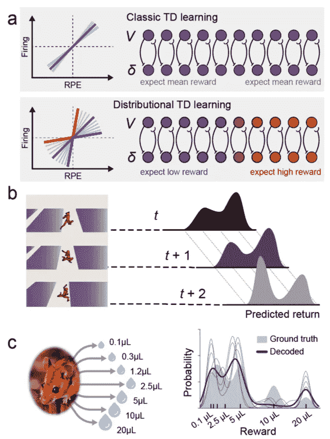

# 与神经科学保持同步:2021 年 7 月必读

> 原文：<https://towardsdatascience.com/stay-updated-with-neuroscience-july-2021-must-reads-56ed35f88eb3?source=collection_archive---------43----------------------->

## DeepMind 🧠谈深度强化学习和神经科学；艾👍🏻重新提出了 SGD 动力学的数学基础；果蝇🪰启发神经网络优于经典 ones⚡⚡⚡

加固。图片由 [Ricardo Gomez Angel](https://unsplash.com/@ripato) 在 [Unsplash](https://unsplash.com/photos/z6CcN8rlftY) 上拍摄

<https://medium.com/@stefanobosisio1/membership>  

**你为什么要关心神经科学？**

神经科学是当今人工智能🧠的根源🤖。阅读并意识到神经科学中的进化和新见解不仅会让你成为一个更好的“人工智能”的家伙😎而且还是一个更好的神经网络体系结构的创造者👩‍💻！

今天这里有三篇来自 arxiv.org 的新论文。DeepMind 和 UCL 发表了一篇关于深度强化学习及其对神经科学的影响的精彩评论。毫无疑问，这是一个热门话题，将会有更多的论文发表，以及关于人类大脑的新发现！第二篇论文是脸书·艾写的。研究人员已经对扩散 SGD 动力学的起源及其与统计物理的关系进行了奇妙的数学工作。这些暗示揭示了神经网络最初应该如何在纸上创建，具有正确的设置和期望，而不是等待“随机”收敛。最后，KAIS 的研究人员发表了一项基于稀疏编码的模型的伟大工作，以模仿果蝇的嗅觉系统，这优于经典的香草模型。享受:)

# 深度强化学习及其神经科学含义

Matthew Botvinick，Jane X. Wang，Will Dagney，Kevin J. Miller，Zeb Kurth-Nelson， [**论文**](https://arxiv.org/pdf/2007.03750.pdf)

在这篇论文中，DeepMind 和 UCL 的作者撰写了第一篇关于深度强化学习(DRL)在神经科学中的应用的综述。尽管 DRL 的研究才刚刚开始，但对神经研究的潜在影响却非常大。事实上，DRL 反映了大脑组件(神经元)、连接(突触)和系统必须自行学习的环境情况。DRL 可能会导致对什么是记忆，以及动物和社会认知如何管理情境探索的更深入的见解。总结本次审查，我们可以定义这些部分:

*   *DRL 对神经科学的早期研究*

在文献中，我们可以找到 DRL 的神经任务的早期方法:

Yamins & DiCarlo 创建了一个深度卷积网络来模拟猕猴腹部流各个部分的组成；

[Niv](https://www.princeton.edu/~yael/Publications/Niv2009.pdf) 进行了寻找阶段性多巴胺释放与时差报偿预测误差信号(RPE)之间联系的研究；

【宋、杨和王设计了一个网络来解决实验研究中猴子的任务。由此产生的模式与神经生理学实验数据密切相关。

*   *元和分布学习*

[王*等*](https://www.nature.com/articles/s41593-018-0147-8) 探索了元强化学习:对于特定的相互关联的任务，网络能够在不改变权值的情况下适应新的任务，突出了隐含网络结构中的动力学效应，即慢 RL 驱动学习和快 RL 学习；

[达布尼*等人*。](https://www.nature.com/articles/s41586-019-1924-6)将 DRL 带入了一个新的场景，*分布 RL，*即 RL，其中 RPE 不仅是一个标量，还是一个向量，更类似于与大脑相关的结构，并为任务提供了更广泛的概率

图 1:分布 RL:图中显示了达布尼的实验。a)时差任务。经典 RL 算法返回相同的 RPE，而在分布式 RL 中，RPE 的值可能有很大不同，导致概率从悲观到乐观。b)在这种情况下，代理必须学会在平台之间跳跃，概率回报分布显示在右边。c)真实案例场景。用概率奖励训练老鼠是可能的(右边灰色阴影区域)。奖励可以清楚地解释为一个分布 RPE。(图片由作者提供)

*   米艾默里

DRL 可以帮助我们理解记忆是如何支持基于奖励的学习和决策的。

Mnih 展示了 DRL 模型如何依靠记忆/经验重放，存储过去的经验，并在雅达利游戏的新挑战中使用它们，模仿海马体进行记忆巩固；

Pfeiffer 和 Foster 研究了在线决策的记忆维护和提取。特别是，在 DRL，在线决策是两个记忆之间的相互作用:一个是“情节”记忆，它读取和写入长期记忆槽，另一个是“激活”记忆，即存储激活信息；

*   *探险*

对于 DRL 来说，探索是一个棘手的概念，因为 RL 算法通过测试新的可能性和组合来找到解决方案。

[内在动机](http://www.pyoudeyer.com/oudeyer-kaplan-neurorobotics.pdf)作为 RL 探索的替代方案出现，并由 [Badia](https://arxiv.org/abs/2002.06038) 和 [Osband](https://arxiv.org/abs/1602.04621) 进一步发展，在那里代理人被鼓励探索预测不那么有信心的新环境。

关于这个研究领域，元学习提供了有趣和有前途的解决方案。元强化学习系统中的探索可以被认为是假设驱动的实验，这使得该解决方案成为研究动物任务探索的最有吸引力的解决方案之一

*   *社会认知*

社会认知是神经科学中一个不断发展的领域。DRL 最近在这一领域有了新的发展，有了多智能体场景，比如竞技团队游戏或社交困境。有希望的未来研究致力于潜在的心智模型，被称为[‘心智理论’](https://arxiv.org/abs/1809.11044)

# 重新思考 SGD 的极限动力学:修正损失、相空间振荡和异常扩散

大卫·库宁、哈维尔·萨加斯图伊-布雷纳、劳伦·吉莱斯皮、埃希德·马尔加利特、田畑秀则·田中、苏亚甘古利、丹尼尔 L.K 亚明斯、 [**论文**](https://arxiv.org/abs/2107.09133)

这是斯坦福、NTT 和脸书人工智能研究人员的一项了不起的工作，他们研究了随机梯度下降(SGD)的动力学，将模型超参数探索与统计物理联系起来。作者从基本假设出发，认为现在的神经网络模型缺少理论驱动的设计。事实上，训练通常是通过启发式参数完成的，并且没有将超参数优化与神经网络体系结构和数据集的几何结构联系起来。这项研究试图量化所有这些元素如何在 SGD 动力学中发挥作用，理解为神经网络的学习动力学建立完整理论的关键步骤。

图 2:5 个卷积神经网络的局部(上图)和全局(下图)位移的平方欧几里德范数。尽管模型的性能已经收敛，但是在训练之后，模型仍然在探索相空间。对于局部位移，这以固定的恒定速度发生，而对于全局位移，存在扩散的准布朗行为

首先，作者挑选并训练预训练模型，并监控局部参数位移(逐步超参数之间的差异)和全局参数位移(当前步骤的超参数与预训练模型的参数之间的差异)的波动。如图 2 所示，局部位移(图 2 顶部)继续以恒定速度波动，而全局位移(图 2 底部)根据幂 *c* 以布朗方式演变为步数的函数。这就产生了下面的问题:为什么网络在训练结束时继续扩散地探索相空间？

为了回答这个问题，作者将 SGD 建模为欠阻尼的朗之万方程。朗之万方程描述了一个粒子在随机力作用下的运动。这种随机力是布朗运动的本质，由于周围分子的碰撞，朗之万计算返回了流体中粒子运动的统计数据。将 SGD 建模为朗之万过程，作者发现欠阻尼版本的朗之万方程正确地模拟了相空间中网络的波动轨迹。

在以下设置下，作者用 SGD 分解线性回归，发现由 SGD 驱动的相空间探索导致了奥恩斯坦-乌伦贝克过程(OU 过程)。OU 过程是一个嘈杂的松弛过程。例如，弹簧可以在长度上摆动。在过阻尼的情况下，会有一个摩擦系数阻碍波动。如果存在热波动，弹簧长度将围绕弹簧静止长度随机波动。由此，通过使用梯度噪声和 Hessian，可以计算超参数优化过程的统计矩的解析表达式。第一个矩描述了扩散过程的振荡行为。二阶矩可以洞察驱动随机成分。

为了进一步理解这第二个组成部分或 SGD 扩散行为的驱动力，可以将 OU 过程发展为 Fokker-Plank 方程(FP 方程)。FP 方程返回了朗之万动力学下粒子位置分布的时间演化。在这一点上，作者意识到，关于线性回归，数据分布中的各向异性导致梯度噪声和扩散中的各向异性。对于大多数数据集，SGD 轨迹不是由原始最小二乘损失驱动的，而是由修改的损失驱动的。

也可以为神经网络计算这种修改的损失。根据经验，作者可以确认超参数的优化受到扩散指数的强烈影响，扩散指数表现为学习速率、批量大小和动量的函数。所有这些元素独立地起作用，并引起异常扩散机制。此外，较大的学习速率会导致欠阻尼振荡，从而降低扩散指数。另一方面，批量大小不影响阻尼比，但导致对扩散指数的非单调影响

# 果蝇持续学习的算法洞察

杨慎，Sanjoy Dasgupta，Saket Navlakha， [**论文**](https://arxiv.org/abs/2107.07617)

这是一篇精彩的灵感来自大脑的方法论文，旨在创建一个可能能够匹配神经网络性能的新模型。作者研究了果蝇如何不断学习将气味与行为联系起来，发现了一种新的人工神经网络，它可以超越经典网络，而无需反向传播。特别是，连续学习对于现代神经网络来说是一项复杂的任务，因为经常会出现灾难性的遗忘问题。受果蝇嗅觉系统的启发，作者创建了一个模型，该模型使用稀疏编码、突触冻结和感知器式学习来学习并返回任何气味的特定动作。

图 3 两层嗅觉系统网络:A)嗅觉系统表示。当一种气味被接收时，一个深层的两层网络被启动。投射神经元对输入信号进行预处理。然后，由凯尼恩细胞(KCs)执行随机投影。通过 APLs 反馈，只有 5%的细胞被激活，并能与 MBONs 相互作用，根据行为对气味进行分类。b)当第二种气味进入时的例子。在这个阶段，不同的 Kenyon 细胞被激活，产生与不同 MBONs 的相互作用

果蝇有两层嗅觉系统(图 3)。当闻到一种气味时，就被投射神经元(PNs)的放电频率编码。PNs 响应进入第一层。在第一层中，2000 个凯尼恩细胞(KC)通过从 PNs 中随机采样，将 PNs 输入表示转换成稀疏和高维的表示。然后，信号被发送到抑制性神经元(APL)，反过来，抑制性神经元将抑制反馈到每个 KC。因此，95%的低点火 KC 被关闭，剩下的 5%用于赢家通吃(WTA)计算。第二层把气味和行为联系起来。这是通过 KCs 和蘑菇体输出神经元(MBONs)之间的相互作用来完成的。KCs 细胞以相同的重量向“接近”和“避开”MBON 细胞发出气味。如果气味与不良行为有关，就会释放一种多巴胺信号来减少 KCs 和“接近”MBONs 之间的联系。

计算对应物也在 2 层电路中实现(FlyModel)。第一层计算输入信号的高维稀疏表示。输入层通过稀疏的二进制随机矩阵连接到第一层。然后，应用赢家通吃过程，仅顶部最活跃的 KC 保持开启，而所有其余的被设置为零。第二层看到这个稀疏的输入。给定学习速率和背景记忆衰减，可以在输入和输出之间编纂权重更新规则(论文的等式 3)。

该电路已经在 MNIST-20 数据集上进行了测试，其中训练数据被排序并分成顺序任务，并与以下各项进行比较:

*   EWC:弹性权重合并模型，其中费雪信息标准用于确定权重
*   GEM:梯度情景记忆，存储以前学习任务的数据子集
*   BI-R:大脑启发的重放，它用一个生成模型来重放活动模式，从而保护旧的记忆
*   标准全连接神经网络
*   离线，像香草，但学习任务随机，而不是顺序

结果，FlyModel 的表现超过了所有的模型。对于 MNIST-20，FlyModel 达到了 0.86 的精度，而 BI-R 为 0.77，GEM 为 0.69，EWC 为 0.58，Vanilla 为 0.19。此外，在训练步骤结束时，FlyModel 的记忆损失只有大约 7%。对于 CIFAR-100 数据集记录了类似的结果

为什么 FlyModel 取得了类似的成绩？FlyModel 的主要特点是稀疏编码和突触冻结。两者在神经科学界都很有名，研究人员发现这些方面对学习和大脑启发的模型有巨大的影响。然而，很难确定为什么这些特征也是顺序学习的关键因素。

请记住这篇文章是一篇开创性的工作，可以让你进入一个更受生物大脑启发的神经网络世界:)

我希望你喜欢 2021 年 7 月神经科学`arxivg.org`论文的这篇综述。请随时给我发电子邮件询问问题或评论，地址:stefanobosisio1@gmail.com