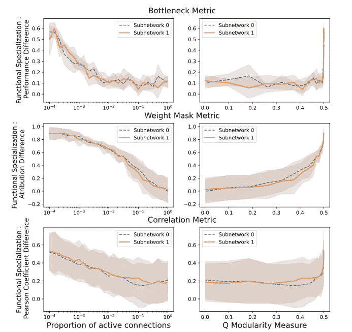
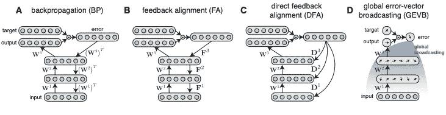
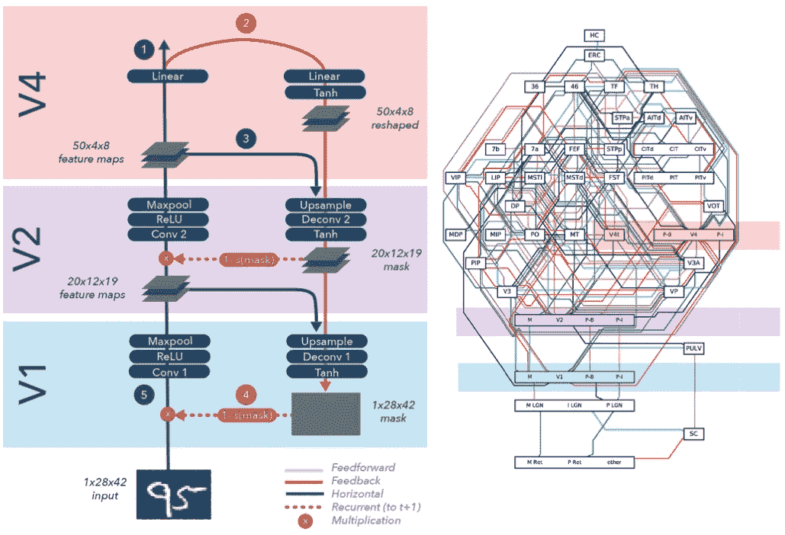
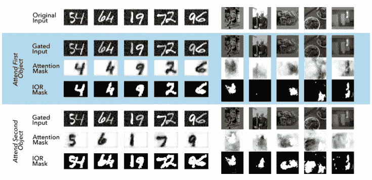

# 与神经科学保持同步:2021 年 6 月必读

> 原文：<https://towardsdatascience.com/stay-updated-with-neuroscience-june-2021-must-reads-d4bb078d03b8?source=collection_archive---------29----------------------->

## 稀疏神经连接🖇️如何影响功能行为？一个更符合生物学原理的反向传播:误差向量广播📡，又是如何关注 work⚡⚡⚡的？

图片来自 [Unsplash](https://unsplash.com/photos/Lej_oqHljbk)

 [## 通过我的推荐链接加入 Medium-Stefano Bosisio

### 作为一个媒体会员，你的会员费的一部分会给你阅读的作家，你可以完全接触到每一个故事…

medium.com](https://medium.com/@stefanobosisio1/membership) 

**你为什么要关心神经科学？**

神经科学是当今人工智能🧠的根源🤖。阅读并意识到神经科学中的进化和新见解不仅会让你成为一个更好的“人工智能”的家伙😎而且还是一个更好的神经网络体系结构的创造者👩‍💻！

今天这里有三篇来自 arxiv.org 的新论文。第一个研究稀疏连接性及其对功能模块性的影响。第二篇文章提出了一种反向传播的新方法，这可能在生物学上更合理——毫无疑问，这里应该进行大量的研究。最后，第三篇论文研究深度学习神经网络中的注意力，试图捕捉注意力在大脑中是如何工作的。

# 极度的稀疏导致了功能的专门化

加布里埃尔·贝娜，丹 F.M 古德曼， [**论文**](https://arxiv.org/pdf/2106.02626.pdf)

神经网络是*模块化*，也就是说，它们可以分解成独立的子网。这些子网络呈现出*结构模块化*，其中神经元被划分为不同的模块，以及*功能模块化*，其中每个模块都可以执行独立的操作。给定这些概念，结构模块化和功能模块化之间有关系吗？我们能评估结构模块化在多大程度上影响功能模块化吗？作者对这些方面进行了研究，提出了一种可控的结构模块化神经网络，并监测功能模块化度量，了解这两种模块化在多大程度上相互影响，试图找到神经生物学对应物的答案。

具有高模块化的网络在模块内的节点之间具有密集的连接，但是在不同模块的节点之间具有稀疏的连接

所提出的架构由两个子网络组成。这些网络作者具有不同程度的互连，从不同子网络模块中的节点之间的稀疏连接，到实现全密集架构时的无模块性。作为输入任务，每个子网接收一个 MNIST 数字，并且该网络必须与所有其他子网通信，以返回跨网络的两个数字是否具有奇偶性。同时，每个子网能够专门识别它们自己的数字。为了测量功能模块性，作者监控了三个度量标准:

*   瓶颈度量:在读出以检查它们是否能够识别输入数字之后，窄的 5 个神经元层的平均准确度
*   权重屏蔽度量:这是一个专门化的度量，其中保留了来自一个子网络的参数的子集 *q%* ,以检查给定任务的性能
*   相关性度量:对隐藏层进行分析，计算相同数字示例的子网络 *n* 的隐藏状态之间的皮尔逊相关系数

图 1 显示了所研究的子网的三个度量中的每一个的最终结果。总的来说，所有这三个指标都随着网络的结构模块性而变化，用稀疏性(活跃连接的比例)和 [Q 模块性](https://en.wikipedia.org/wiki/Modularity_(networks))来衡量。可以得出以下结论:

*   强加结构模块化(Q 模块化的高值)导致更多的功能模块化(活动连接比例的高值)
*   在稀疏性或结构模块化的极端水平上，我们在所有三个度量上都有高度的结构专门化
*   需要高水平的结构模块性(Q 模块性)来确保功能模块性——即功能模块性可以通过子网之间非常稀疏的连接来实现

图 1:左边是两个子网络之间的稀疏度，右边是 Q 模块度。线条表示该指标的平均值，而阴影区域表示同一实验的 10 次重复的 1 个标准偏差

这些结论对生物神经网络有显著的意义。连接组学的整个思想，即知道网络的结构属性就足以让我们理解功能属性，可能不再正确。正如作者所写的:

> 我们不应该仅仅通过观察适度的结构模块化来得出任何程度的功能模块化

# 通过广播全局误差向量的信用分配

大卫·g·克拉克，L.F 阿博特，钟素妍， [**论文**](https://arxiv.org/pdf/2106.04089.pdf)

神经回路不实现反向传播方法(BP)，因为进化已经找到了另一种算法或路线，允许回路可塑性工作并训练所有的大脑网络。BP 的一个可能的生物学解决方案是学分分配——这里是我们讨论学分分配问题的回顾——一个神秘的全球学习信号在整个网络中传播。

从这里，作者提出了一种新的替代 BP 的方法，称为*误差向量广播(GEVB)* ，其中全局学习信号被广播到神经网络中的所有隐藏单元以更新权重。特别地，在网络上分发的信号是关于*输出误差*的信息，充当无*单元特定反馈。*实现 GEVB 的神经网络被称为*矢量化非负网络(VNNs)* 。此外，GEVB 回忆起生物神经网络，对第一层施加非负权重，因为它发生在皮质投射神经元的兴奋行为上。最后，通过由突触前激活和全局误差向量的内积给出的量来更新每个权重。图 2 显示了理解 BP 的各种替代方案的差异的图形方式。

图 2:关于反向传播(BP)算法的替代实例:a)BP 算法，其中通过逐步转置误差来逐层更新权重；b)反馈对准(FA ),其中误差被逐层向后发送；c)直接反馈对准(DFA ),其中误差被直接广播到每个隐藏层；d)提出的全局误差向量广播(GEVB ),其中全局误差向量被广播到所有隐藏单元，而没有单元特定的反馈。

我们有什么结果？首先，作者尝试使用矢量化非负网络(非负权重网络)和传统网络，针对不同的连接范围，针对 MNIST 和 CIFAR-10 数据集，比较 BP 和 GEVB。我们的注意力将集中在矢量非负网络上，如表 1 和表 2 所示。总的来说，误差比较在不同的连接性和权重更新算法上是兼容的，在 GEVB 和 BP 之间有显著的重叠

表 1 矢量网络的 MNIST 检验误差(%)比较，在不同连接范围(完全连接、卷积连接、局部连接)下，GEVB 和 BP 之间具有非负权重或混合符号 wegiths。

标签。2: CIFAR-10 测试误差(%)比较，术语根据表 1

当使用 t-SNE 对 CIFAR-10 图像进行聚类时，获得了进一步令人鼓舞的结果，其中 GEVB 聚类质量在统计上优于 BP 方法。

这些显著结果可能为使人工神经网络更类似于生物神经网络铺平新的道路。GEVB 算法提出了一个新的问题，关于矢量化的生物学实现，以及突触前和突触后神经元的响应如何相互干扰，在网络中传播“权重更新”信号。伙计们，请继续关注！

# 通过内部门控的基于对象的注意

乔丹·雷，阿里·本雅明，康拉德·保罗·柯丁， [**论文**](https://arxiv.org/pdf/2106.04540.pdf)

> 注意力是大脑用来选择给定刺激或特征的有意义子集的机制

大脑中的一个神秘机制是注意力。计算神经科学和机器学习已经成功地为我们提供了使用注意机制在简单任务中检测和识别对象的模型。使用深度神经网络已经取得了更彻底的结果，这些网络被证明能够理解更复杂的场景，但是，它们仍然远远不能达到人脑的水平。人类大脑的注意力可以被认为是这些给定元素的混合:

*   *神经激活的调制:*当受试者识别一个物体时，视觉神经元表现出活动的变化，从大约 5%到 30%的调制，增加了视觉皮层中的注意力机制
*   *注意力不变调谐:*虽然神经活动的调节是开启的，但是注意力保持神经元的调谐特性不变
*   *内部门控:*注意力是过滤不相关的特征，返回更清晰的信号
*   *分层处理:*在大脑中，存在着分层组织的细胞，这些细胞呈现出广泛的调谐特性。这使得大脑能够学习复杂的非线性特征。这些细胞的输出增加了注意力层收集的信息
*   *自上而下的注意神经调节:*以视觉问题为例，信息是以前馈、反馈、横向流动的方式行进的。反馈和横向流动使自上而下的注意成为可能，而前馈路径则定义了早期层中的感受野。
*   *返回抑制:*由视觉输入激活的区域被抑制，以允许受试者从一个检测到的物体移动到一个新的物体。

作者提供了一个新的神经网络模型，它可以包含所有这些特征，以便研究对视觉刺激的注意力的本质，试图复制生物学上正在发生的事情，以给出一个似乎合理的生物学答案。

图 1 显示了实现的神经网络，其被细分为 3 个主要区域，反映了大脑视觉路径。存在三条线，前馈(黑线)，其可以生成特征图并返回预测；实现注意力屏蔽的反馈通路(橙色线)和将前馈通路投射到反馈通路上的水平连接(绿色线)。注意力屏蔽在 V2 中充当内部注意力门控，并且在最后阶段，创建像素空间可解释的图像。最后的结果对注意及其机制给出了一个可能的解释

图 3:左边是实现的基于注意力的神经网络，右边是视觉注意力路径，因为它可能在大脑中。所实现的神经网络的特点是保持前馈、横向和反馈连接。

图 4 显示了 MNIST 和可可数据集的结果。根据注意机制，原始输入在不同阶段被处理。门控输入显示了注意力如何作用于输入图像，黑白区域是受抑制的区域，黑色区域是不受抑制的区域。注意掩码驱动门控机制，集中在最重要的区域，最后，IOR 掩码(返回的抑制)指定哪些区域已经被检查，哪些区域将被抑制用于将来的迭代。

图 4 是 MNIST 数据集(左侧)和可可数据集(右侧)的关注层的结果。

这种学习方法促进了对大脑中注意力机制的理解，这种机制是前馈、反馈和与内部门控和返回抑制的横向联系的混合。从神经网络输出来看，似乎有一个处理对象的一般注意规则:

*   神经元的调谐曲线不会改变
*   在不同的神经层次都有抑制
*   在深层神经层有一个注意力的峰值调制

这项研究为更深入地理解注意力奠定了基础，但未来的工作必须继续。与前一篇文章相关的一个注意事项是:如果我们对网络实现一个更符合生物学原理的反向传播算法，比如 GEVB，会怎么样？

我希望你喜欢 2021 年 6 月神经科学`arxivg.org`论文的这篇综述。请随时给我发电子邮件询问问题或评论，地址:stefanobosisio1@gmail.com