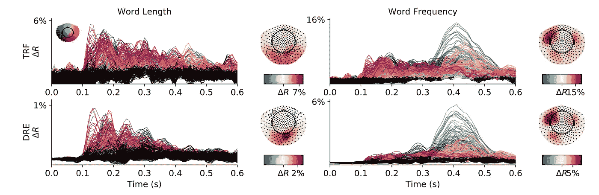
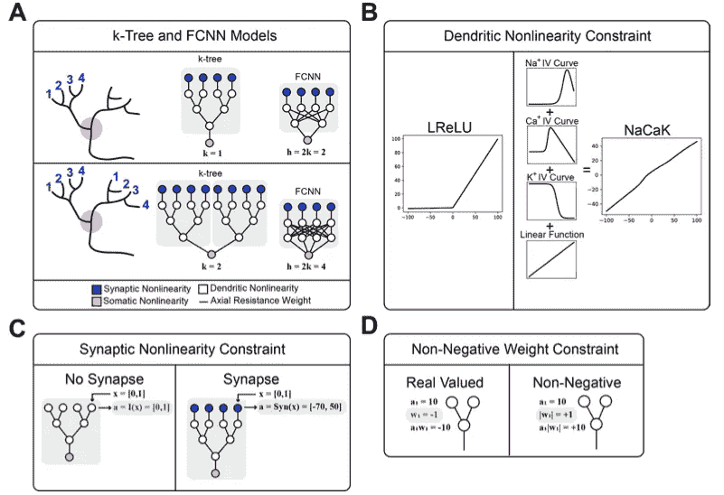
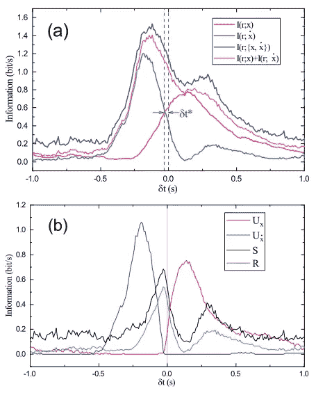

# 与神经科学保持同步:2021 年 3 月必读

> 原文：<https://towardsdatascience.com/stay-updated-with-neuroscience-march-2021-must-reads-bf19bd73560e?source=collection_archive---------34----------------------->

本月:脸书人工智能 vs 大脑信号👍人工神经网络中的树突🚨理解视网膜动力学中的错觉👁️

[图片](https://unsplash.com/photos/ahi73ZN5P0Y)由[费德里科·贝卡里](https://unsplash.com/@federize)在 Unsplash 上拍摄

# 深度递归编码器:模拟大脑信号的可扩展端到端网络

*奥马尔·谢哈布，阿列安德烈·笛福塞，让-克里斯托夫·卢瓦索，亚历山大·格拉姆福特，让-雷米·金，* [**论文**](https://arxiv.org/abs/2103.02339) **，** [**代码**](https://github.com/facebookresearch/deepmeg-recurrent-encoder)

这篇论文直接来自脸书人工智能研究所、巴黎大学和巴黎高等师范学院的合作。这篇论文的主旨是设计一种新的方法来帮助神经科学界分析大脑对感觉输入的反应。特别是，作者将注意力集中在从阅读活动中获取大脑信号，定义单词长度和单词使用频率在大脑中的反映。

事实上，来自人类任务的大脑记录经常是非常嘈杂和高维的。只是给你一个想法，一个小的眨眼可以破坏信号记录，以及心脏跳动需要考虑在内，以避免太多的噪声存在。迄今为止，神经科学界试图用线性技术来破译这些记录，如时间感受野(TRF)或递归时间感受野(RTRF)，然而，这些技术无法处理记录信号产生的如此多的非线性。

为了解决这一挑战，作者提出了一种特定的端到端深度学习架构，经过训练可以一次预测多个受试者的大脑反应(深度递归编码——DRE)。该架构基于两个相互堆叠的改进的长短期记忆(LSTM)模块。输入数据通过卷积层和 ReLU 函数进行编码，然后 LSTM 模型对隐藏状态进行排序，最后通过卷积转置 1D 层和 ReLU 激活函数转换回 MEG 活动估计。

该模型在 68 名受试者身上进行了测试，他们有一个小时的阅读任务，同时用 273 通道的 CTF 脑磁图扫描仪进行记录。这项任务包括快速阅读屏幕上闪现的大约 2700 个单词。4 个众所周知的特征在这项研究中受到关注:单词长度、自然语言中的词频、序列中第一个和最后一个单词的二元指示器。

结果证明，不仅 DRE 比经典的 TRF 方法更好地预测大脑反应，而且 DRE 的特征重要性突出了哪些特征是大脑反应中最突出的特征。图 1 示出了作为 MEG 扫描的空间位置的函数的单词长度和频率的排列重要性的结果。在后部脑磁图通道中，单词长度在 150 毫秒后达到峰值，而在额颞脑磁图通道中，单词使用频率在 400 毫秒左右达到峰值。此外，DRE 能够跟踪一个额外的现象，这是大脑中词汇处理的侧化。事实上，对于词频，峰值反应出现在两个半球，但在额叶区的左半球幅度很大。

图 1:经典线性方法(TRF)和 DRE 之间的比较，用于分析大脑区域的特征峰值。根据时间活动和大脑位置(颜色编码的大脑地形图)，在两个模型中比较单词长度和单词(使用)频率。DRE 的字长在 150 毫秒左右出现峰值，这与后部脑磁图通道的活动有关。TRF 和 DRE 都在 400 左右出现词频峰值。DRE 女士强调这种反应来自大脑的 3 个区域，但活动集中在左半球。通过将单词长度(左侧)和单词频率(右侧)的排列重要性(δR)用作空间位置(由脑地形图中的通道位置进行颜色编码)和相对于单词开始的时间的函数

# 生物限制会损害树突计算吗？

*伊莲娜·西蒙娜·琼斯，*<https://arxiv.org/abs/2103.03274>**论文**

**作者研究了人工神经网络(ANN)中树枝状非线性的影响。出发点是想知道将树枝状连接建模为线性积分器的主导思想是否有意义。事实上，由于其电压依赖离子通道，枝晶是高度非线性的。三点被确定为在人工神经网络中模拟更类似生物的树状结构的关键:**

1.  **树突显示出非线性激活函数，其类似于泄漏整流线性单元(LReLU)，但是可以用 NaCaK 函数(钠、钙和钾电压依赖性的总和)以更生物合理的方式建模；**
2.  **通常树突输入是 0/1，但是它们可以被建模为基于电导的突触非线性；**
3.  **由于类似于隔间之间的轴向阻力，树突的权重参数可以是正的和负的，或者建模为非负的值。**

**这三点可以看作是对 ANN(或约束)的一种生物学上的改进。这些约束在二叉树模型中实现，修改了不同论文中提出的经典 k 树算法结构，如图 2 所示，并且针对 7 个机器学习数据集的性能与对照 2 层全连接神经网络(FCNN)进行了比较。**

****

**图 2: (A):实现的 k 树模型，具有树状约束，以及“控制”完全连接的神经网络(FCNN)。蓝色节点是输入的突触非线性。白色节点应用可选的树枝状非线性。黑线是受约束的非负权重。“k”决定了有多少相同输入的子树在模型中重复，类似于不同树突树上重复的突触输入。“h”是 FCNN 隐藏层中的节点数。(LReLU 和树突的 NaCaK 激活功能之间的比较。(C)没有突触非线性和具有突触非线性的模型的比较(D)没有和具有非负权重约束的模型权重的比较。**

**通过将 MNIST、CIFAR-10、FMNIST、EMNIST、KMNIST、SVHN 和 USPS 数据集的 k 树结果与 FCNN 进行比较，作者得出了以下结论:**

*   **对于 MNIST、FMNIST、KMNIST 和 EMNIST，NaCaK 激活函数优于 ReLU、LReLU 和 sigmoid 激活函数，而对于 SVHN、USPS 和 CIFAR-10 数据集，达到类似的性能**
*   **突触非线性约束非线性地将树突的输入映射到实际的毫伏单位，影响 k 树的性能，对于 MNIST、FMNIST、KMNIST、EMNIST 实现了比 FCNN 更高的精度，并且对于 SVHN、USPS 和 CIFAR-10 实现了相同水平的精度**
*   **非负权重添加到 k 树非线性映射 synapse 在具有 synapse 的正 k 树和负 k 树的水平上执行或者比其更好。对于 MNIST、KMNIST 和 CIFAR-10，该模型优于 FCNN。**

**尽管有这些令人鼓舞的结果，目前的 k-tree 树突模型仍有一些局限性。首先，NaCaK 函数是一个近似值，因为在树突中有不止 3 个离子通道，尽管钠、钾和钙是最具代表性的离子通道。第二，非负权重是离子通道在整个树枝状形态中分布的结果。因此，比 k 树更现实的形态和每个节点的可学习的 NaCaK 函数的组合可以引入更多生物学相关的自由度，这可以影响模型计算性能。最后，k-tree 结构呈现对称性，这在真实的自然界中是不重复的。对多突触输入重复以及这些输入如何到达不同的树状子树的进一步研究是必要的，以允许架构被更好地训练。总的来说，这项研究显示了神经生物学的限制有多重要，以及如何在当前的人工神经网络文献中反映出来，以便找到更好的神经网络结构。**

# **视网膜预期动力学中的信息协同**

***齐，周博宇，陈国华，* [**论文**](https://arxiv.org/pdf/2103.07122.pdf)**

**我们的视觉很容易出现错误，这就是所谓的视错觉。例如，[闪光滞后](https://en.wikipedia.org/wiki/Flash_lag_illusion)现象是一种保护机制，由我们的视网膜针对移动物体触发。同时，预期是一种时间错觉，它让动物从过去的经历中感知未来的事件。本文作者研究并证明了视网膜的预期可以描述为负群时延(NGD)现象。NGD 是一个物理模型，其中“预期”是由神经网络基于过去感知的延迟反馈创建的。**

**为了研究这种效应，作者对青蛙的视网膜进行了实验和计算研究。从牛蛙身上切下一小块视网膜，固定在 [60 通道多电极阵列](https://www.3brain.com/technology?gclid=CjwKCAjwgOGCBhAlEiwA7FUXkjKgQ71PIBel3H3AjlZCaGhcRttajVuAwlJOBFu5tbe-lkPtyn8DMBoCVCUQAvD_BwE) (MEA)上，灌注并充氧长达 10 小时。随机光刺激 *x(t)* 通过 LED 照明发送到视网膜，强度 *I* 与 *x 成比例。*视网膜的反应由 MEA 在不同频率 *fc* (1、2、3.5 和 5 Hz)和强度时间 0.5 s 的刺激下在 25°c 下记录。**

**图 3 显示了大约 20 个视网膜的预期效果的平均刺激结果。 *x(t)* 为随机信号， *r(t)* 为视网膜放电频率，即从受刺激的视网膜上提取的电锋电位。特别地， *r(t)* 可以包含由视网膜创建的预期信息，作为信号 *x(t)* 及其时间修改 *ẋ(t).的结果*对于刺激频率 *fc* =1Hz(或每秒 1 个周期)的实验，视网膜的响应被分析为跨神经网络的互信息，作为时滞δt 的函数，这对于视网膜来说足够小以产生预期的响应。人们可以清楚地看到*I(r；x)* 在原点的右边(0.0 s 处)，表示来自视网膜的响应(尖峰)是 *x(t)* 的预期。此外，对于 *I(r,ẋ，*可以注意到额外的峰值，再次在原点的左侧，指示预期行为。图 3(b)显示了*I(r；*{x,ẋ})通过部分信息分解(PID)，进一步证明了预期现象的存在。**

****

**图 3:来自强度 I(r，x)的刺激的视网膜检测信号。(a):随机光信号为 I(r，x)，红色；δt 是时间延迟，蓝色、紫色和黑色表示视网膜对信号的预期反应。(b)部分信息分解贡献**

**接下来，作者用计算线性模型模拟了视网膜的反应。该模型结果依赖于参数 *λ(t)* ，该参数作为时间的函数而变化。 *λ(t)* 似乎取决于刺激频率 *fc* 以及神经节细胞的特性，神经节细胞负责视网膜中“预测”细胞的放电——即触发预期事件的细胞。**

**总之，这篇论文阐明了视网膜中发生的预期事件。这种现象来自一组细胞的原始刺激中不存在的信息的重组。特别是，似乎在输入信号 *x(t)* 和它的时间修正 *ẋ(t)* 之间存在协同作用，这引起了视网膜的预期。因此，视网膜电路能够以某种方式从 *x(t)* 中提取 *ẋ(t)* 的信息，然后将它们重组以形成棘波 *r* 。**

**我希望你喜欢这篇 2021 年 3 月神经科学 arxiv.org 论文的综述。请随时给我发电子邮件询问问题或评论，地址:stefanobosisio1@gmail.com**