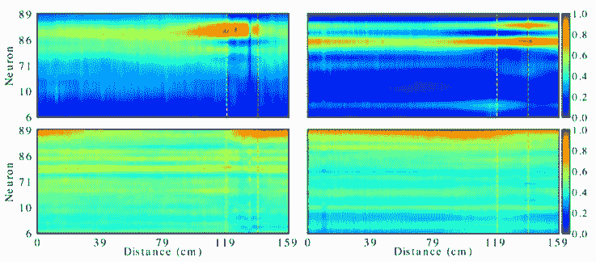

# 与神经科学保持同步:2021 年 11 月必读

> 原文：<https://towardsdatascience.com/stay-updated-with-neuroscience-november-2021-must-reads-e2fba4692b21?source=collection_archive---------29----------------------->

我们能雇用甘斯吗💻在神经科学实验中🐁？几何流形是什么💎我们的记忆存在于？我们能进行生物启发的独立成分分析吗📈？

杰弗里·布鲁姆在 [Unsplash](https://unsplash.com/photos/7-gaPkhIgqs) 上拍摄的图片

 [## 通过我的推荐链接加入 Medium-Stefano Bosisio

### 作为一个媒体会员，你的会员费的一部分会给你阅读的作家，你可以完全接触到每一个故事…

medium.com](https://medium.com/@stefanobosisio1/membership) 

**你为什么应该关心神经科学？**

神经科学是当今人工智能🧠的根源🤖。阅读并意识到神经科学中的进化和新见解不仅会让你成为一个更好的“人工智能”的家伙😎而且还是一个更好的神经网络体系结构的创造者👩‍💻！

本月 3 篇惊险论文！来自爱丁堡大学的科学家们第一次使用了生成对抗性神经网络，从而拓展了神经科学分析的边界。对小鼠进行了实验，以研究学习前和学习后阶段之间的神经元动力学变化。第二，斯坦福大学、普林斯顿大学、哥伦比亚大学和高级研究所合作，利用递归神经网络研究了记忆几何流形应该是什么样子。最后，罗格斯大学的研究人员展示了生物启发的神经网络独立成分分析的实现及其对神经形态计算的影响。

**使用循环一致的对抗网络进行神经元学习分析** *布莱恩·m·李、奥克利托斯·阿姆夫罗西迪斯、娜塔莉·l·罗什福尔、阿诺·翁肯、* [**论文**](https://arxiv.org/abs/2111.13073)

神经科学的核心研究领域旨在了解学习过程中发生的神经元重塑动力学。从神经实验中提取可解释的信号并进行有意义的分析现在已经成为进一步理解神经元动力学的优先要求。许多出版物显示了使用标准技术(如 TCA 的五氯苯甲醚)得出的显著结果，但是，这些标准技术具有线性响应和映射的基本假设。在这篇论文中，爱丁堡大学的研究人员将分析扩展到生成对抗性神经网络，特别是，他们采用朱的 CycleGAN 来学习神经元活动的学习前和学习后之间的映射。

CycleGAN 可以学习两种概率分布，在这种情况下是学习前和学习后的神经元动力学，并将一种转换为另一种。这一过程使我们能够更好地理解哪些可能是学习过程中出现的关键特征，以及从神经元获得即时反应模式。

在这个实验中，我们用一只头部固定的老鼠研究了学习前后的动力学，这只老鼠被放在一个可以前后移动的线性跑步机上。在鼠标前面，有一个带有明确光栅图案的监视器。如果鼠标能够在跑步机上前进 120-140 厘米，显示器将切换为黑色模式。在这里，如果老鼠在虚拟奖励区内舔了一下，就会得到奖励(水滴)。这项活动迫使老鼠学会利用屏幕上的视觉信息和自身运动来获得最大的回报。初级视觉皮层神经元用钙指示剂标记，并监测 4 天，随时间测量相对荧光。

第一天是学习前，第四天是学习后，所以从这几天开始，我们会分别得到学习前和学习后的概率分布。GAN 的生成器和鉴别器必须以数据驱动的方式识别与动物实验相关的模式。图 1 显示了 GAN 鉴别器和生成器的主要结果。前两个顶部图显示了分别计算为平均注意力掩模的学习前和学习后鉴别器注意力图。学习前鉴别器专注于虚拟动物位置上 100-130 厘米之间的特定神经元组，这与奖励区一致。学习后鉴别器突出了两组神经元，总是在 100-130 厘米左右。同样，对于发电机来说——两个底部的图。特别是，预学习生成器(左下方)专注于流程开始和结束时的活动(奖励区)。后学习生成器在奖励区之前给予更多的关注。这些结果表明，要了解从学习后到学习前反应的转变，最重要的特征是在老鼠到达奖励区时获得的。

图 1:来自 CycleGAN 模型的注意力地图，是老鼠在跑步机上每跑一段距离的平均值。上图:学习前(左)和学习后(右)辨别者的注意力地图。下图:学习前(左)和学习后(右)生成者的注意力地图。虚线表示奖励区。

总之，本文首次将 GAN 的方法应用于活体神经元实验。作者能够通过 GAN 生成的潜在特征来可视化学习过程，强调奖励区周围的活动在整个动力学中具有高度影响力。未来的研究必须加强记录过程，利用垂直和水平空间信息来丰富模型的特征。

**连续变量工作记忆的递归神经网络模型:活动流形、连接模式、动态代码** *克里斯托夫·j·库埃瓦、阿德尔·阿达兰、米沙·佐戴克斯、钱宁、* [**论文**](https://arxiv.org/abs/2111.01275)

我们的记忆能够以适当维度的连续结构存储信息。例如，考虑两个视觉刺激，它们在我们视觉区域的相同位置依次出现。刺激是一样的，唯一不同的是方向，比如一个刺激指向左边，另一个指向右边。我们的大脑如何将两个刺激识别为两个不同的刺激，并避免第二个刺激在记忆中覆盖第一个刺激？从数学和计算的角度来看，这是一个奇妙的问题。为了模拟大脑动力学，我们需要找到一种在模型中存储记忆的方法，利用一些几何特性。在这篇论文中，麻省理工学院、普林斯顿大学、哥伦比亚大学和 IAS 的研究人员通过递归神经网络(RNNs)研究了这个问题。rnn 用于存储两个不同方向的连续闪光，并研究网络的连接模式。RNN 之所以被选中，是因为他们能把刺激保持在记忆中。

图 2 显示了实验装置。延时后，两个输入信号按顺序给出。除了方向之外，信号是相同的。用于网络模式研究的 RNN 由 100 个全连接单元组成。

图 2:实验设置。(a)训练 RNN 记住两条线的方向，给定两条线之间的延迟时间。(b)RNN 建筑:100 个循环连接的单元。输入是 32 个方向调谐的信号线。输出由方向角的余弦和正弦表示

主要结果如图 3 所示。首先，作者将主成分分析应用于一段时间内循环单位的活动，以了解低维结构。当两种刺激都作为输入出现时，主成分图显示 Clifford torus 流形的出现。一个标准的环面流形——就像一个甜甜圈形状的物体——当它有两个不同方向的两个信号的两个宿主时就会变形。相反，Clifford 环面可以同等地表示这两种信号。在正交性检查中给出了进一步的证明(如图 3 所示)。如果我们在两个环面上运行正交性和平行性测试，我们可以看到标准环面如何不对称地处理角度，而 Clifford 环面可以对所有角度保持对称。在早期训练阶段的 RNNs 显示出与标准圆环相似的结果。在后学习中，RNN 单元可以识别不同的方向，给出关于 Clifford 环面的正交性和平行性测试输出。

图 3:标准环面和 Clifford 环面的区别。RNN 在早期训练阶段展示了标准环面几何的典型行为。学习之后，由于克利福德流形，记忆得以保留。

此外，作者研究了所有 100 个单位的连接模式。出现了在第一延迟周期期间存储关于特定线路的信息的单元在第二延迟周期期间不总是继续存储关于同一线路的信息。特别是，有一个权重的调整和平衡，这可以防止内存被覆盖。

结论是:

*   记忆可能存在于类似 Clifford 环面的几何流形上。这个环面可以保持信号的连续表示，其中任何信号都可以被区分，它是一个正交基。
*   在学习时，存储第一方位记忆的单元随时间改变它们的调谐，防止覆盖第一个存在的方位。
*   这可能是拥有更多类脑网络和记忆系统的通用解决方案
*   这是对 RNN 如何存储多个连续变量的解释

**一种用于独立成分分析的规范且生物学上可行的算法** *Yanis Bahroun，Dmitri B. Chkolvskii，Anirvan M. Sengupta，* **论文**

大脑是一个奇妙的机器，它可以很容易地将系统信号(如听觉、视觉和嗅觉系统)分开，从系统混合物中识别潜在的来源。这项任务被称为盲源分离(BSS)。在计算机科学中，通常用独立分量分析(ICA)来解决盲分离问题。ICA 假设潜在的刺激是独立源的线性组合。尽管在文献中有成千上万种 ICA 风味，但是很少有 ICA 具有生物学启发的实现。对作者来说，生物启发意味着该算法可以 1)以流的形式运行，而无需将数据集保留在内存中 2)如果 ICA 是神经网络的一部分，则应该使用局部学习规则来更新突触权重。作者从四阶盲识别(FOBI)过程中获得灵感，探索了一种可能的生物启发 ICA 算法。

ICA 算法是以这样一种方式构造的，使得它可以在生物似然神经网络(NN-ICA)中实现。首先，神经网络输入有 *d* 个神经元，是要分离成独立分量的输入数据。网络呈现输入和输出的树突之间的前馈突触，以及横向突触(图 4)。实际上，输入信号首先乘以神经元的权重矩阵。输出投影然后在输出层的树枝状部分被白化。最后，躯体区域通过用局部学习规则平衡权重来计算最终输出。

图 4:生物启发 ICA 的神经网络实现。输入信号由 d 个神经网络单元混合和接收。这里前馈突触分解输入信号。输出层由两个神经元组成，其权重遵循局部学习规则。输出的树枝状部分白化数据。身体空间重建了源头。蓝色阴影意味着输出活动被调节，以模仿大脑的可塑性。

图 5 显示了来自不同输入源的结果。图 5A 报告了合成数据，其中周期信号和随机噪声作为 NN-ICA 的输入给出。图 5B 报告了在 16kHz 下记录的真实世界语音信号的结果。图 5C 的结果来自自然场景图像，其中算法从混合图像中恢复所有元素。很明显，对于大范围的输入数据集，所提出的规则可靠地收敛到正确的解。此外，整个 NN-ICA 算法易于实现，除了扩展我们关于大脑如何能够执行 BSS 任务的知识之外，还可以进一步促进神经形态计算。

图 5:神经网络独立分量分析结果。a)来自周期信号混合的结果 B)真实语音数据分解 C)自然场景图像。

我希望你喜欢 2021 年 11 月神经科学`arxivg.org`论文的这篇综述。请随时给我发电子邮件询问问题或评论，地址:stefanobosisio1@gmail.com