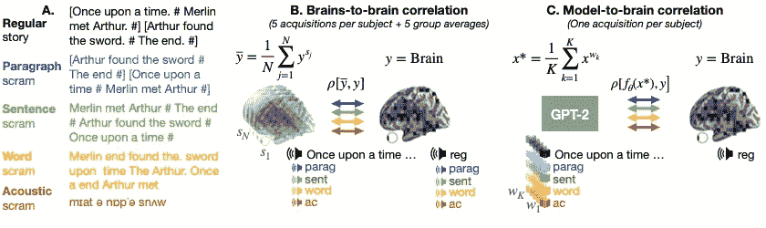
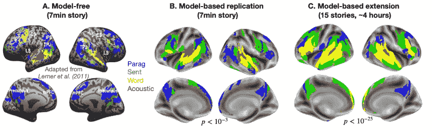
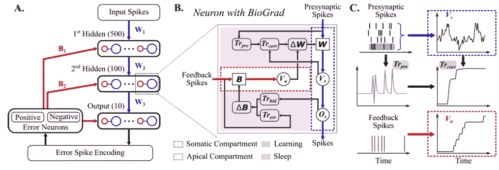
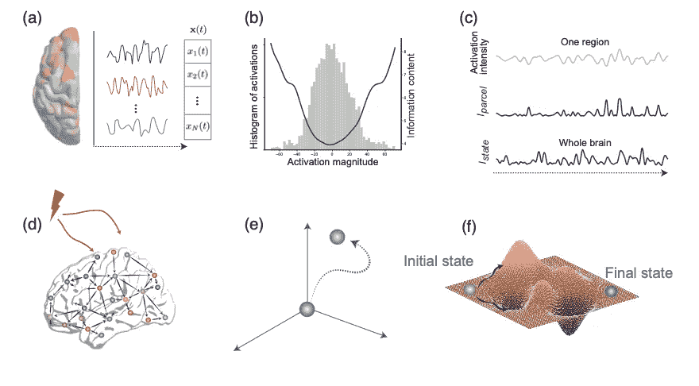
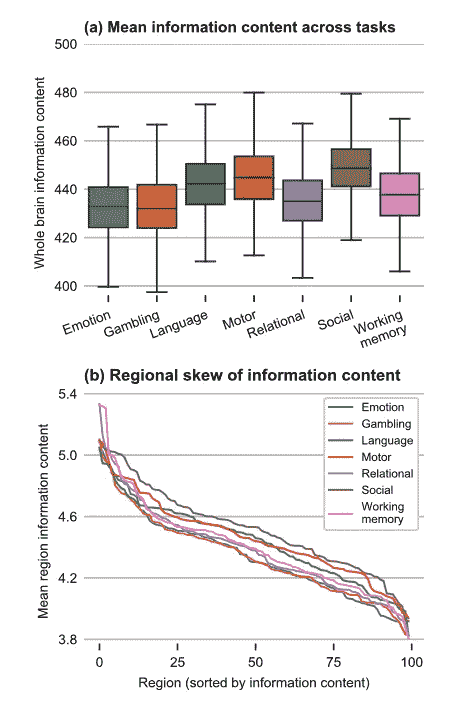

# 与神经科学保持同步:2021 年 10 月必读

> 原文：<https://towardsdatascience.com/stay-updated-with-neuroscience-october-2021-must-reads-a0cc1d50b746?source=collection_archive---------28----------------------->

脸书艾和因里亚👍🏻调查语言🗣️和 brain🧠；罗格斯·uni🇺🇸用生物反向传播算法推进了神经形态计算；🇩🇪 🇺🇸用信息论研究大脑状态👩‍💻揭示了社会任务的高信息含量！

图片由[阿德里安·施瓦茨](https://unsplash.com/@aeschwarz)在 [Unsplash](https://unsplash.com/photos/XS7q-baZrmE) 上拍摄

 [## 通过我的推荐链接加入 Medium-Stefano Bosisio

### 作为一个媒体会员，你的会员费的一部分会给你阅读的作家，你可以完全接触到每一个故事…

medium.com](https://medium.com/@stefanobosisio1/membership) 

**你为什么应该关心神经科学？**

神经科学是当今人工智能🧠的根源🤖。阅读并意识到神经科学中的进化和新见解不仅会让你成为一个更好的“人工智能”的家伙😎而且还是一个更好的神经网络体系结构的创造者👩‍💻！

这个月有很多激动人心的出版物！首先，FacebookAI 和 Inria 以及 CNRS 提出了一种新的基于模型的方法来研究大脑中的语言基础，带来了一种新的研究方法，可以与经典的和需要大量数据的实验相媲美。第二，Rutgers 大学对神经形态计算的一个了不起的改进，它定义了一个满足神经形态原则的生物启发的反向投影。最后，宾夕法尼亚大学、圣达菲大学、朱利希研究中心和亚琛工业大学合作，确定连接体如何节能和优化，以处理高信息量状态。

## 基于模型的大脑活动分析揭示了 305 名受试者的语言等级

*夏洛特·柯谢特，亚历山大·格拉姆福特，让-雷米·金，* [**论文**](https://arxiv.org/pdf/2110.06078.pdf)

正如我们在这个系列中多次看到的，语言的基础，语言在大脑区域中的结构，我们如何学习语言是神经科学研究中的热门话题。为了更深入地了解大脑内部的语言过程，神经科学家通常会运行一个标准的实验程序，该程序由 Lerner 等先驱成功应用，采用功能性磁共振成像(fMRI)。功能磁共振成像记录刺激后的大脑反应信号(例如，听一个故事，一个特定的段落，或杂乱的声音)。然后，对于单个受试者脑体素，利用来自其余受试者的平均脑体素活动，计算称为受试者间相关性(ISC)的相关性。最终的大脑地图定义了语言刺激特别激活的区域。虽然勒纳的技术已经被证明是成功的，但 fMRI-ISC 需要大量的数据来获得有意义的结果，随着受试者的数量乘以刺激的数量而扩大。在本文中，来自脸书 AI、Inria 和 CNRS 的研究人员提出了一个基于模型的 Lerner 实验，该实验使用更少的数据，可以达到与 ISC 研究相同的性能。

图 1 比较了这两种方法。如果一方面，Lerner 的方法“脑-脑关联”需要来自不同对象的大量记录来实现对大脑时间感受域(TRFs)的解释，那么“模型-脑关联”利用深度学习模型(如 GPT-2)的能力来实现相同的性能。GPT 模型已经得到了广泛的研究，它们在构造常规语音和修改的刺激响应的映射方面与人脑有许多相似之处。通过分析和提取第八 GPT-2 层的潜在特征，语言处理的层次被恢复和足够准确地预测。选择第八层是因为它是证明编码相关语言特征的转换器的中间层。

图 1:传统脑-脑关联和模型-脑关联的比较。a)在开创性的神经科学研究(Lerner 等人)中，每个受试者都有一个故事、故事中的一个段落、一个句子、特定的单词和声学加扰信号(条件)。b)对于每种情况，ISC 计算为平均脑反应和单个 y 脑反应之间的相关性。c)本研究试图复制传统方法，仅使用由常规故事诱发的录音。GPT-2 层用于提取加扰的激活信号。然后将该信号与线性变换后的受试者大脑活动进行比较。

图 2 报告了实验结果，其中每种颜色代表一种特定的刺激。基于模型的方法复制了相同的勒纳的实验表现，只使用 7 名受试者听 7 分钟的故事和混乱的叙述。作为收敛性的进一步证明，作者将该模型扩展到 305 名受试者，让他们听一个 4 小时的故事，展示了该模型是如何有效的。

这篇论文是一个很好的例子，它强调了自然刺激和深层神经网络对语言基础研究形成了一个强有力的结合。如果一方面我们需要了解一些深度学习模型的限制，另一方面我们可以为这些模型想出新的解决方案，将它们常规地用于体内研究。

图 2:传统神经科学研究之间的结果比较(Lerner 等人)。这种颜色描绘了大脑区域对一个段落(蓝色)、一个句子(绿色)、一个单词(黄色)和一个声音加扰信号(红色)的反应。a)在标准的无模型实验中，受试者听 7 分钟的故事或声音信号 B)基于模型的能够复制 Lerner 的研究，数据来自 75 个受试者听 7 分钟的相同故事。c)此外，基于模型能够将研究扩展到 305 个受试者，听 4 小时的 15 个音频故事。

## BioGrad:用于脉冲神经网络的基于生物似然梯度的学习

*唐，尼莱什库马尔，约安尼斯波利克雷蒂斯，*[**论文**](https://arxiv.org/abs/2110.14092)

神经形态计算是一种新兴的计算范式。这种硬件是受大脑启发的，允许轻松旋转神经网络架构。最有前途的神经网络架构之一是脉冲神经网络(SNN)，它已经显示出在神经形态硬件上解决人工智能问题的高能效、大规模并行和低延迟的解决方案。尽管他们取得了成功，SNN 还有一个障碍需要解决，那就是反向传播的使用。反向传播在传统的神经网络应用中已经被广泛使用，然而，它不是由人脑启发的。这导致研究寻找 backprop 的替代品，它可以满足三个神经形态原则:

*   *基于尖峰的计算*:每种计算都是基于尖峰的，应该提供节能的解决方案(backprop 没有)
*   局部信息处理:神经形态网络应该能够实现异步计算和大规模并行处理——这是 backprop 很难实现的
*   *快速在线计算*:网络不应需要来自未来时间步骤的信息(低延迟解决方案)

出于这些原因，罗格斯大学的研究人员在这篇论文中提出了生物学上看似合理的基于梯度的学习被称为 SNN 的生物梯度。图 1 显示了该算法的构建模块，它满足神经形态计算原理。该算法的核心是使用一个多隔室神经元模型，该模型由一个锋电位的躯体部分和一个非锋电位的心尖区组成。特别是，体细胞区域将前馈突触前输入整合到其膜电压中，每当电压高于阈值时就会出现尖峰。顶室接收来自错误神经元的自上而下的反馈，整合其膜电压。引入周期性睡眠阶段，使得权重以无监督的方式用局部 Hebbian 规则和随机输入更新。

图 3: A)使用 BioGra 实现的建议 SNN。SNN 从输入尖峰开始，由隐藏层进行处理。每个隐藏层作为 BioGrad 实现，由顶端(红色圆圈)和体细胞(蓝色圆圈)隔间组成。顶端隔室具有从错误神经元接收的自上而下的反馈(红色箭头)，而体细胞隔室整合前馈输入(蓝色箭头)。b)调查 BioGrad。我们可以识别学习和睡眠阶段。睡眠阶段基于资格轨迹更新神经元的权重 C)突触前和反馈尖峰对隔室电压和资格轨迹的影响的例子。

该实验装置在 MNIST 数据集上进行了测试，并与生物启发的方法进行了比较(表 1)。BioGrad 在 MNIST 数据集上实现了 98.13%的准确率，这优于或相当于其他方法，但是这些方法不满足神经形态学原则。BioGrad 还经过了标准反向投影算法的测试，采用随机梯度下降或 Adam 优化器，达到了相同的精度水平。

最后，为了表明 BioGrad 算法可以直接在片上使用，作者在英特尔的 Loihi 处理器上部署了该模型。由于硬件限制，训练是在单个隐藏层上进行的，MNIST 上有 100 个隐藏单元。最终测试准确率为 93.32%，每个训练样本消耗的能量比在 GPU 上少 400 倍。

表 1:MNIST 数据集的 BioGrad 与文献中生物学启发的 backprop 的比较。BioGrad 是唯一一个满足所有三个神经形态学计算要求的方法，达到 98.13%的准确率，与其他方法相当或更好。

## 大脑状态的信息内容由状态能量学的结构约束来解释

*莱昂·韦宁格、普拉加·斯里瓦斯塔瓦、戴尔·周、杰森·z·金、伊莱·j·康布拉斯、麦克斯韦·a·贝尔托莱罗、乌特·哈贝尔、多里特·梅尔霍夫、达尼·s·巴萨特、*[T3【论文】](https://arxiv.org/abs/2110.13781)

大脑在处理一条信息时会发生什么？我们认为这一信息触发了信号传播，信号沿着大脑的结构连接体传播并引发变化。然而，我们对这些变化了解多少呢？不同状态之间的过渡如何？在宾夕法尼亚大学、亚琛工业大学、Julich 研究中心和圣达菲研究所的合作中，作者研究了 fMRI 数据集的信息内容，并证明了以下假设:

*   基于特定的认知功能，大脑会显示不同层次的信息内容
*   结构连接体被组织起来以支持观察大脑状态的转换，具有高效的能量消耗
*   达到高信息含量状态所需的能量大于达到低信息含量状态所需的能量。

图 4:信息内容状态研究。a)fMRI 可以基于特定活动 x(t)跟踪大脑区域的激活强度 B)从 fMRI 中，可以从激活的直方图中检索信息内容及其大小 C)从一个区域的激活强度，作者通过该区域的信息理论确定信息内容(Iparcel)。也可以检索整个大脑的信息内容，对大脑的所有区域求和。d)给定一个控制信号，大脑的状态从初始状态(E)移动到最终状态。f)这种运动是由能源景观决定的。

图 5a 示出了对 596 名受试者的所有观察任务的平均信息量的分析。有趣的是，社会活动任务显示出比所有其他任务显著更高的信息含量。另一方面，赌博和情绪任务显示出较低的信息含量。此外，如图 5b 所示，作者已经研究了信息内容在大脑区域的分布。工作记忆、情绪和关系任务显示出正偏斜，表明大脑中各向异性的区域分布，一些区域比其他区域贡献更大。总的来说，剩下的任务显示了高斯分布。

图 5:对 596 个亚受试者进行功能磁共振成像扫描，得到不同活动的信息内容。a)为不同活动计算的平均信息量。平均而言，社交任务的信息量较高，而情感和赌博任务的信息量最低。b)信息内容的地区差异。总体而言，大多数任务呈高斯分布，而工作记忆、情绪和关系任务呈正偏态分布。

偏斜分析导致作者调查高信息状态的能量需求，高信息状态应该远离平均状态，并且应该比低信息内容的状态需要更高的能量。事实上，根据统计分析，高信息状态(如社交任务)需要更高的能量来驱动大脑进入这些状态。特别是，结构连接体看起来结构膨胀，达到高信息含量状态，满足最终论文的假设。

综上所述，作者对 fMRI 进行了全面的统计分析，以检测大脑信息内容。社交任务显示的信息含量最高，而情感和赌博任务的权重较低。将大脑作为一个整体来分析，信息内容对大脑区域之间的任务差异很敏感，这可以用作理解大脑动力学改变、功能障碍和精神病理学的关键假设。最后，本文证明了信息论可以如何容易地应用于神经科学，以及我们可以有多少关于大脑能量约束和连接体的发现，以在不久的将来进一步扩展人工神经网络。

我希望你喜欢 2021 年 10 月神经科学`arxivg.org`论文的这篇综述。请随时给我发电子邮件询问问题或评论，地址:stefanobosisio1@gmail.com