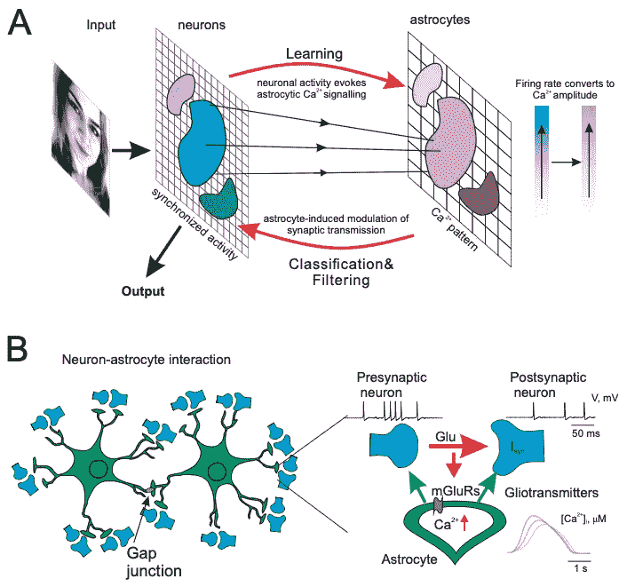
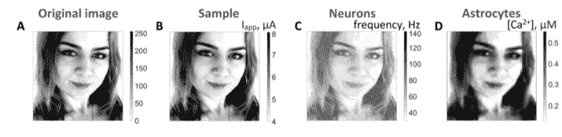
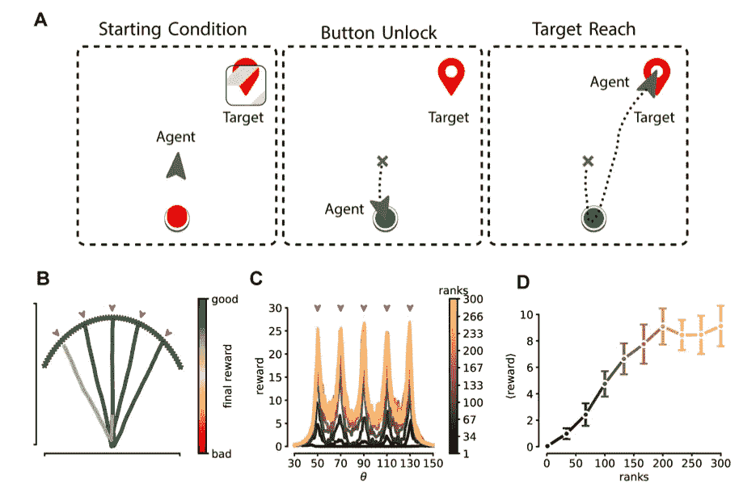
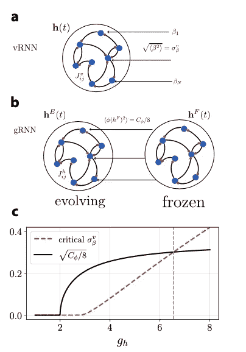

# 与神经科学保持同步:2021 年 9 月必读

> 原文：<https://towardsdatascience.com/stay-updated-with-neuroscience-september-2021-must-reads-45f600028eb6?source=collection_archive---------28----------------------->

星形胶质细胞在记忆处理中的作用✨:SISSA 的研究人员致力于生物学启发的强化学习🧬；普林斯顿大学🎓和数学神经网络记忆流形👩‍🔬

图片由[博斯科在](https://unsplash.com/@bosco_shots) [Unsplash](https://unsplash.com/photos/30MiC1peec4) 上拍摄。一张夜间高速公路照片完美地再现了在黑暗中寻找大脑连接答案的过程。

 [## 通过我的推荐链接加入 Medium-Stefano Bosisio

### 作为一个媒体会员，你的会员费的一部分会给你阅读的作家，你可以完全接触到每一个故事…

medium.com](https://medium.com/@stefanobosisio1/membership) 

**你为什么应该关心神经科学？**

神经科学是当今人工智能🧠的根源🤖。阅读并意识到神经科学中的进化和新见解不仅会让你成为一个更好的“人工智能”的家伙😎而且还是一个更好的神经网络体系结构的创造者👩‍💻！

这个月 3 篇惊人的论文！第一个向我们展示了人脑和人工神经网络中星形胶质细胞的重要性。星形胶质细胞对于人类的记忆存储和处理至关重要，本文为所有数据社区敲响了警钟，让他们更密切地关注生物启发的神经网络。第二篇论文来自 SISSA 神经研究人员，他们将行为克隆规则转化为强化学习，使这种方法更受大脑启发。最后一篇论文是普林斯顿大学的一项艰巨工作，在那里，作者创建了一个新的门控递归神经网络(gRNN)，它可以存储记忆而无需微调参数，只是从 gRNN 的基础知识中发展了进一步的数学见解。尽情享受吧！:)

# 星形胶质细胞在多层神经元-星形胶质细胞网络中介导模拟记忆

尤利娅·齐比纳、因诺肯蒂·卡斯塔尔斯基、米哈伊尔·克里沃诺索夫、阿列克谢·扎伊金、维克托·卡赞采夫、亚历山大·戈尔班、苏珊娜·戈尔德列娃

我们能在人工神经网络中模拟星形胶质细胞吗？人脑中星形胶质细胞的作用是什么？在这篇论文中，作者将他们的注意力集中在一个长期未知的问题上:大脑如何处理信息并将其作为记忆储存，在星形胶质细胞层中找到了一个可能的解决方案。星形胶质细胞是神经胶质细胞家族的一部分。它们通常呈星形，主要职责是处理神经元的突触。例如，一个人的星形胶质细胞可以同时与多达 200 万个突触相互作用😱特别是，星形胶质细胞通过钙离子调节突触神经元传递，导致放电频率的调节。这些调节已被证明与工作记忆有关，揭示了星形胶质细胞记忆处理的关键作用。

在这项工作中，作者进一步发展了以前的生物启发神经网络模型(SNN ),增加了星形胶质细胞介导的反应作为突触权重的变化，以存储输入图像的记忆。SNN 模型是由稀疏连接的伊兹克维奇神经元组成的。这里，通过微分方程描述神经元，该微分方程考虑了神经元跨膜电位，取决于输入信号、来自所有突触前神经元的总突触电流和星形胶质细胞通过钙离子诱导的电位调制。两层神经元与星形胶质细胞层相互连接，由 Ullah 的模型模拟。星形胶质细胞可以与神经元群进行双向交流，一方面提供生物相似性，另一方面提供信息的加载、存储和检索。

该模型被训练以记忆灰度图像(图 1)。这些图像被转换成输入电流，供给神经元层。神经元以不同的速率放电，这取决于输入电流的幅度。这种反应的差异引发了星形胶质细胞的钙反应，形成了每一个输入的特定模式。这种钙浓度分布持续几秒钟，并参与记忆储存过程。

图 1:A)SNN-星形胶质细胞模型。输入 BW 图像馈入神经元网络。每个神经元都有自己的放电频率，组成一个整体反应(神经元层中的蓝色阴影)。放电频率由星形胶质细胞调节。双向连接有助于分类过程，在神经元层解码为输出模式。b)生物学相似性:神经元集合触发星形胶质细胞中的钙浓度水平。结果，谷氨酸被释放，因此突触强度可以被调节。

图 2 显示了伴随星形胶质细胞双向调节的 SNN 的输入-输出响应的实际例子。一方面，输入灰度图像用于刺激神经元活动。神经元反应由星形胶质细胞调节，星形胶质细胞最终能够存储来自钙浓度信号的图像。这个信号持续几秒钟，这允许系统保持原始信息并检索它。

图 2:输入图像信号 A)的例子，该图像被转换为输入电流 B)，来自神经元层放电速率 C)的结果和来自钙浓度的星形胶质细胞记忆。

这是一个了不起的结果，一如既往地提醒了数据科学界。事实上，这篇论文是向大脑启发的人工智能迈出的一小步。可以在神经形态计算中找到应用，其中可以通过简单地考虑星形胶质细胞介导的反应来增强神经元和突触计算。此外，星形胶质细胞层提供一次性学习，这是对通常的通用神经网络架构的巨大改进。这种方法可以帮助实现比深度学习本身更好的结果，在训练过程中使用更少的数据！

# 循环尖峰网络中的行为克隆:一个综合框架

克里斯蒂亚诺·卡彭，保罗·穆拉托雷，皮尔·斯坦尼斯劳·保鲁奇，

**正如我们在前一篇论文中看到的，学习方法是神经科学中的一个热门话题。特别是，有两种互补的学习方法:基于错误策略的学习和基于目标策略的学习。在前一种方法中，误差信息被注入到神经网络中，并用于改善未来的性能，而在基于目标的方法中，选择并学习目标。在本文中，作者设计了一个新的更通用的框架，它可以被视为基于错误和基于目标的方法的来源，为神经网络学习动力学提供了新的见解。这种普遍观点可以看作是模仿学习和行为克隆的自然进化。特别地，基于文献，该模型假设了基于尖峰定时的神经网络的形式，该神经网络在实验上被认为在大脑中是关键的。**

**作者提出了一个循环尖峰模型，其中每个神经元可以暴露一个可观察的状态，该状态代表一个神经元在某一时间出现一个尖峰。这个模型必须与环境互动，以解决特定的任务。该模型从模仿学习最优策略中学习，而不是使用强化学习。模仿学习允许代理在给定一组状态的情况下复制一组专家行为。对于学习步骤，模型通过目标而不是从错误中学习。内部权重受反馈矩阵的影响，反馈矩阵的等级用作基于其等级值检查学习的度量。**

**这里调查了两种情况:按钮和食物任务，其中代理必须按下按钮解锁食物并够到它，以及来自 OpenAI 数据集的 2D 两足步行器，其中代理必须学习走路并尽可能远地旅行。我们将把注意力集中在第一个实验上，其结果如图 3 所示。在这个实验中，针对反馈矩阵的不同秩值来训练代理。所有的训练条件都显示出结果的趋同性。当给出高等级的反馈结构时，奖励是最大的。在第二个实验中，2D 两足步行器，尖峰脉冲时间被调整，而不是反馈矩阵秩，这证明了学习也是特定尖峰脉冲模式的结果。**

****

**图 3:按钮和食物任务 A)任务，代理必须点击红色按钮来解锁目标食物。一旦食物被解锁，代理必须找到到达食物的轨迹，不要忘记按钮已经被按下。b)由受过训练的代理为不同目标位置产生的轨迹的例子。箭头(紫色)是专家行为。c)作为目标位置的函数的最终奖励(通过角度测量)，重复 10 次。d)作为反馈矩阵秩 d 的函数的平均奖励**

**以下是结论:**

*   **反馈矩阵秩修改导致代理的更高的解决方案空间，这可以阐明错误如何在大脑的不同区域传播的实验发现**
*   **另一方面，典型的运动任务确实需要并受益于精确的定时编码。这对于获得更精细的移动控制以实现更好的性能可能是必要的。在这种情况下，高等级是不相关的，而尖峰调制是相关的。**

# **记忆流形的出现**

**Tankut Can，Kamesh Krishnamurthy， [**论文**](https://arxiv.org/abs/2109.03879)**

**这不是一篇容易阅读的论文，因为它的根源是在一个新的机器学习数学领域。我将很快就此发表一些东西，特别是关于 Martin-Siggia-Rose-De Dominic is-Jansen(ms rdj)形式主义，它为神经网络带来了新的见解。这篇论文背后有一个简单的想法。**

**人脑可以储存记忆，并根据输入的任务在合适的时间提取记忆。这意味着生物系统可以在比神经元反应的内在时间尺度更长的时间内保持记忆。对于计算神经网络来说，这是一个难以解决的问题，即使有了最新的进展，在正确的时间利用记忆仍然是一个巨大的障碍。**

**从数学的角度来看，记忆/大脑系统不断产生变量，这就产生了一个对象:记忆流形。流形是一种几何结构，存在于多维空间中，其中每个点都可以被视为给定输入问题的固定点(解决方案)。从这里进一步的数学问题出现了:流形是稳定的吗？什么时候不稳定？有分叉点吗？歧管有需要调整的参数吗？**

**为了在计算上解决这个记忆流形问题，作者为神经网络定义了一个新的数学视角。换句话说，论文的关键问题是:如何在不改变数量或使用特殊对称性或微调参数的情况下，在神经网络中实现内存？最终目标是扩展网络的内存，而不要过多地使用它的参数，在正确的时间使用内存，所以很长一段时间没有看到这些。**

**作者将记忆流形定义为处于边际稳定点的系统。然后，他们用“冻结稳定”(FS)定义了一个可能的场景。FS 是一个过程，其中神经网络家族可以自组织到一个临界状态，表现出记忆流形而无需进一步调整。因此，递归神经网络(RNN)框架是从其数学根源发展而来的，定义了一个二元变量，该变量可以根据当前系统状态减慢系统的一部分。**

****

**图 4: a)香草 RNN (vRNN ),其中每个节点都有随机偏差，动态通常流向定点 b)门控 RNN (gRNN ),其中一半的种群被冻结，另一半在任何给定的时间内自由进化。冻结的那一半给进化的那一半提供了随机偏差。gRNN 的相图(黑线)，稳定 vRNN 动态所需的临界方差(红色虚线)。**

**早期的结果非常令人鼓舞。FS 允许神经网络自组织到展示记忆流形和长时间尺度的状态。神经元的内部动力学是冻结的，而它的一部分仍在进化，并偏向另一半。**

**我希望你喜欢 2021 年 9 月神经科学`arxivg.org`论文上的这篇综述。请随时给我发电子邮件询问问题或评论，地址:stefanobosisio1@gmail.com**