# 通过线性模型保持竞争力

> 原文：<https://towardsdatascience.com/staying-competitive-with-linear-models-19444bc3698e?source=collection_archive---------16----------------------->

## [可交代的 AI](https://medium.com/tag/explainable-ai)

## 有了正确的特征，线性模型可以变成野兽


照片由 [Z S](https://unsplash.com/@kovacsz1?utm_source=medium&utm_medium=referral) 在 [Unsplash](https://unsplash.com?utm_source=medium&utm_medium=referral) 拍摄

作为一名数据科学家，你有许多不同类型的闪亮的机器学习模型可供选择。有神经网络模型、梯度增强模型、bagging 模型，仅举几个主要类别。

在这些家伙的阴影下，也存在着像线性和逻辑回归这样的模型。线性模型通常在最好的情况下仅仅被用作基线，在最坏的情况下被取笑。然而，我认为这是不合理的。简而言之，我的请求如下:

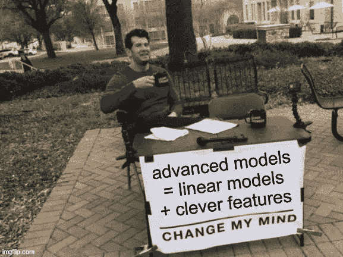

作者在 imgflip.com 创作的。

让我通过考虑**回归任务**来解释我的意思，但是记住这同样适用于分类任务。

首先，我将向您展示带有**坏**特征的线性回归会导致什么，这样您就不会上当。然后，我将向您展示线性回归是非常通用的，如果给予**良好的**特性，它可以用于**模拟复杂的模型**。最后，我们将使用线性回归进行简单有效的时间序列预测。

## 添加多项式特征(不好！)

我们可能已经全部完成了。创建新要素的一种最常见、最简单但也最可怕的方法是添加基础要素的多项式幂。除了只使用特征 *x* 之外，您还可以添加 *x* *，x* *，…* 作为特征，然后进行多元线性回归。让我们在 *x* 中创建一个非线性的小型一维数据集来说明这一点，这样每个人都在同一页上。

```
import numpy as np

np.random.seed(123)

x = np.random.uniform(0, 10, 10)
y = 3*np.sin(x) + x + np.random.randn(10)
```

以 *x* 为唯一特征的简单线性回归产生一条不太符合数据的直线。

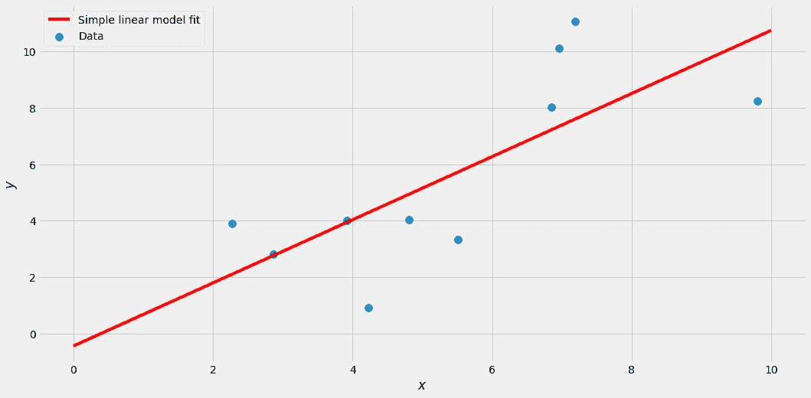

图片由作者提供。

现在让我们添加一些四次幂的多项式项。

```
from sklearn.linear_model import LinearRegression
from sklearn.preprocessing import PolynomialFeatures
from sklearn.pipeline import make_pipeline

lr = make_pipeline(
    PolynomialFeatures(degree=4),
    LinearRegression()
)

lr.fit(x.reshape(-1, 1), y)
```

我们得到了这种契合:

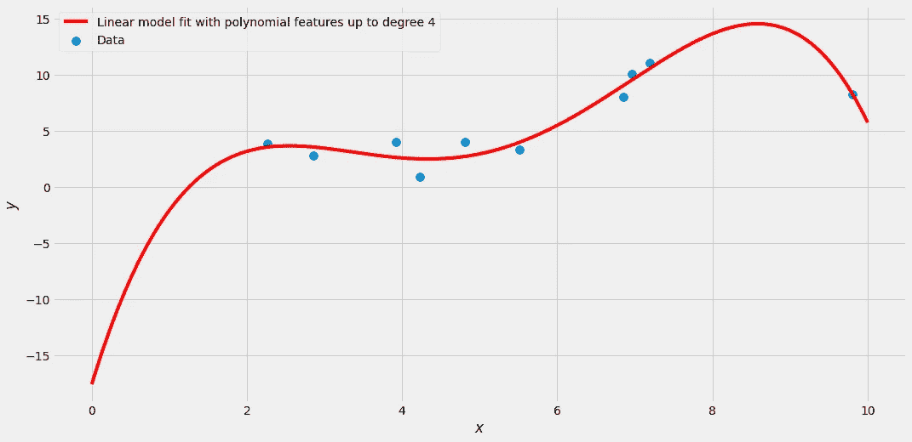

图片由作者提供。

好多了，对吧？我们可以通过设置`degree=9`变得更疯狂，得到如下结果:

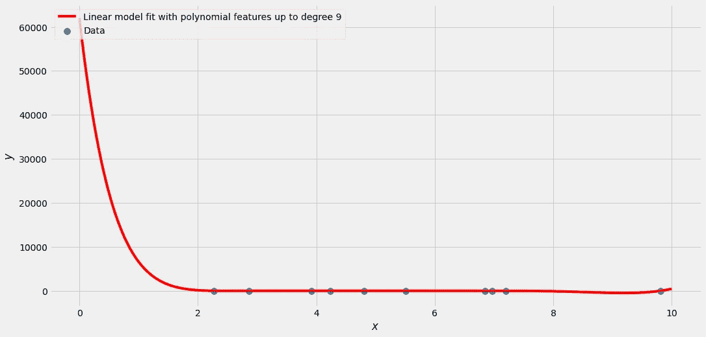

很难看出，但这是一个完美的拟合，它通过所有的点。不幸的是，曲线*围绕*摆动很大。训练集中的所有标签 *y* 都在 0 到 12 之间，但是该模型以某种方式预测大约*x*1 的值大于 10.000。为什么？**因为多项式特性不好。可悲的是，这通常是线性回归旅程的终点。**

> “线性模型是给孩子们看的，让我们继续看好的东西。涉及树或者前馈连接的模型，你懂的！”—也许是你？

然而，让我告诉你为什么这样想是错误的。可以创建行为完全类似于神经网络的线性模型或基于决策树的模型。你只需要*好的*特性，而不是多项式特性。

# 模拟高级模型

## 神经网络

快速提醒一下，这是一个简单的前馈神经网络的例子，它有一个大小为 3 的隐藏层，将一个数字 *x* 作为输入，输出一个值 *y* (没有偏差):

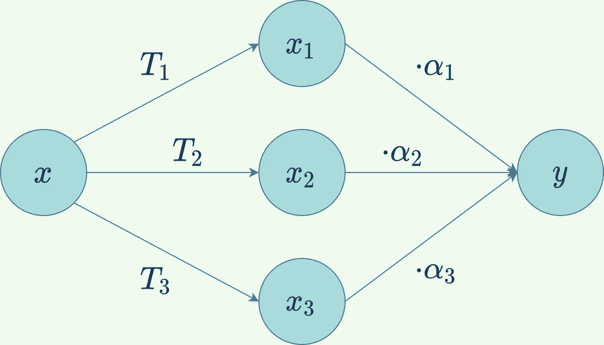

图片由作者提供。

可以看到 *x* 进入神经网络。然后使用三种不同的变换对其进行变换 *T* ₁、 *T* ₂和 *T* ₃，留给我们三个新值*x*₁=*t*₁(*x*)、*x*₂=*t*₂(*x*和 *x* ₃ = 【T36 这些变换通常涉及乘法、求和以及某种非线性激活函数，如 [ReLU](https://en.wikipedia.org/wiki/Rectifier_(neural_networks)) 或 [Sigmoid](https://en.wikipedia.org/wiki/Sigmoid_function) 。

然后，这三个导出值被用作神经网络最后一步的输入:将它们乘以一些值 *α* ，然后将所有值相加。因此，最终的输出是*y*=*α*₁*x*₁+*α*₂*x*₂+*α*₃*x*₃=*α*₁*t*₁(*x*+*α【t67*

> 观察最后一个等式是如何在三个新特性 *x* ₁、 *x* ₂和 *x* ₃中只是一个线性模型！

这就是神经网络的神奇之处:特征是自动组装的。我们不必像处理多项式特征那样手工制作它们，而是由网络来学习它们。但是一旦我们得到了这些新的特征，最后一步就是运行一个简单的线性回归。

让我们看一个使用小玩具数据集的具体例子。

```
from sklearn.neural_network import MLPRegressor

mlpr = MLPRegressor(
    hidden_layer_sizes=(3,),
    random_state=142,
    max_iter=10000
)
mlpr.fit(x.reshape(-1, 1), y)
```

这会产生以下输出:

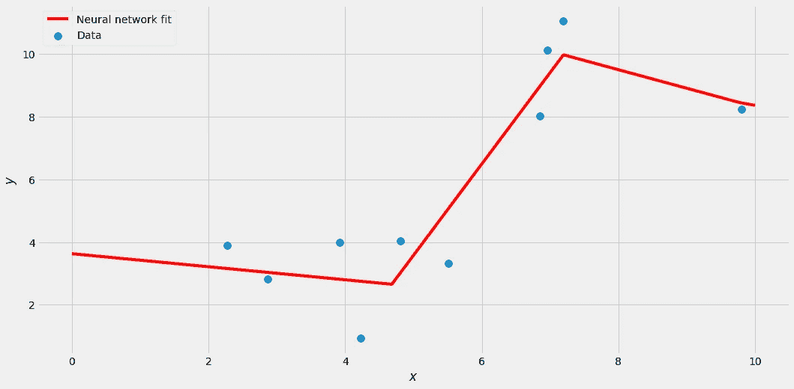

图片由作者提供。

这一切都很好，但现在我声称，当使用正确的特性时，我们可以通过简单的线性回归来重新创建这个输出。而我们可以从训练好的神经网络中得到这些特征。下面的代码模拟了神经网络在中间部分所做的事情:它将我们的 10 个一维输入样本转换为 10 个三维智能输入样本。

```
transformation_coefs = mlpr.coefs_[0]
transformation_biases = mlpr.intercepts_[0]
x_linear_transformation = x.reshape(-1, 1) @ transformation_coefs + transformation_biases # linear transformation
x_clever = np.maximum(x_linear_transformation, 0) # ReLU
```

从图形上看，这种情况会发生:

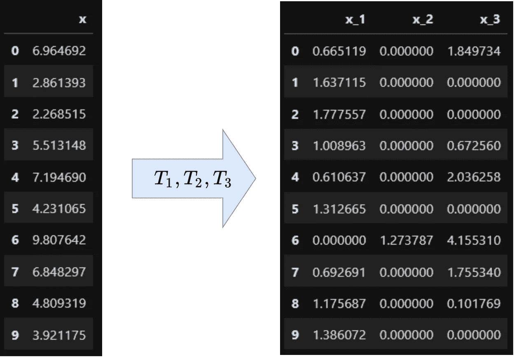

图片由作者提供。

我们现在可以用`x_clever`代替`x`来训练一个线性回归模型。结果如下:

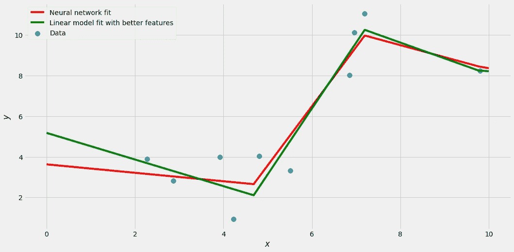

图片由作者提供。

请注意，线性回归拟合略有不同。事实证明，它对训练数据的跟踪甚至比神经网络的输出更好！这是因为神经网络必须一次优化许多参数——它必须专注于特征创建**和**最终的实际线性回归。特别是第一步要对麻烦负责，因为它使拟合过程优化非凸函数，这是困难的。另一方面，找到线性回归的最佳参数很容易。

因此，在这种情况下，我们甚至可以提高一点点性能，至少在训练集上。我们仍然要小心过度拟合，但这不是我们在这里的主题。**关键是:有了正确的特征，我们能够建立一个像神经网络一样好的模型。**

我已经听你说过了:

> “好吧，那么我们先训练一个神经网络。然后，我们从中提取特征来训练一个线性模型，它和原始的神经网络一样好。为什么不直接用神经网络？”

你是对的。我们投入了更多的工作来创建一个与原始神经网络一样好的线性模型。但是我从来没有说过找到好的特性是容易的。这实际上是建模最难的部分。

艺术是想出好的特征，而不必窥视一些神经网络正在做什么。这些特征也可能看起来与神经网络创建的完全不同。我们不需要使用 ReLU 函数或者类似的函数。例如，在我们的例子中，sin( *x* )将成为一个很好的特性，因为我们甚至在数据生成过程中使用了它。

总之，我们已经看到了如何使用线性回归来模拟神经网络的输出。现在让我们转向树木，因为我们可以在那里做同样的事情！

## 决策树

我不会介绍决策树是如何工作的，因为有很多很好的资源可以让你重温这方面的知识。你只需要知道决策树输出分段常数函数。让我们训练一个深度为 2 的决策树。

```
from sklearn.tree import DecisionTreeRegressor

dt = DecisionTreeRegressor(max_depth=2)
dt.fit(x.reshape(-1, 1), y)
```

结果是具有(最多)个 2^max_depth 不同值的分段常数函数。

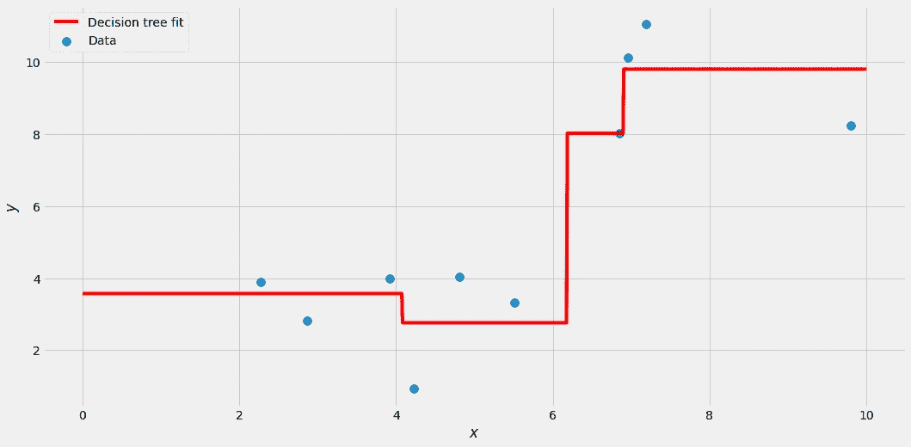

图片由作者提供。

为了提取允许我们模拟这个函数的特征，函数值变化的点——分裂点*—*—是很重要的。我们可以这样得到它们:

```
from sklearn.tree import plot_tree

plot_tree(dt)
```


图片由作者提供。

此外，让我们在-∞和∞处再增加两点。总的来说，我们在(-∞，4.08，6.18，6.91，∞)处有分裂点，我们创建的特征将如下所示:

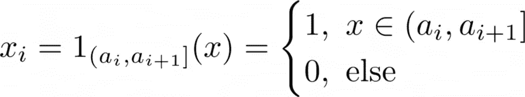

图片由作者提供。

其中( *a* ₁=-∞ *，a* ₂ *，a* ₃,…，∞)为拆分点，升序排列。

> ***注:*** *这基本上意味着我们 bin 了样本，见下图。*

对于熊猫，你可以这样做:

```
import pandas as pd

split_points = [-np.inf, 4.076, 6.181, 6.906, np.inf]

x_clever = pd.get_dummies(
    pd.cut(
        x,
        bins=split_points),
    prefix='x'
)
```

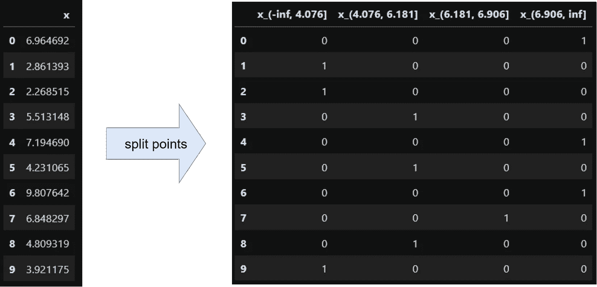

使用这些新特性进行线性回归，我们可以得到:

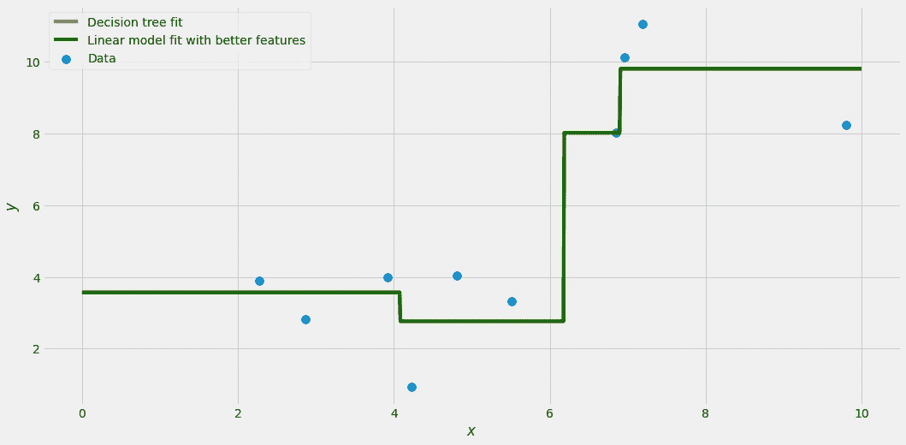

图片由作者提供。

在这种情况下，您无法区分原始模型和线性模型，它们完全相同。这是因为决策树不像神经网络那样有数字上的困难。**于是，我们学会了如何用线性回归模拟单个决策树！**

再次强调:想出这些特性并不容易，但是一旦你拥有了它们，一切都变得简单了。

我们甚至可以从这里继续:随机森林、AdaBoost、梯度增强、额外的树……都只是具有特殊权重的决策树的总和。分段常数函数的和也是分段常数函数，只是可能有更多的分裂点。**这意味着，只要有合适的特性，我们也可以用线性模型模拟这些更高级的树模型！**

# 时间数列预测法

到目前为止，我们已经处理了很多抽象的东西。理论上，线性模型和更复杂的模型一样好，只要有正确的特征。但是，如果我们不想使用预先训练好的神经网络或基于树的模型，这些正确的特征会是什么样子呢？

我认为一个简单但非常有用的领域是**时间序列预测**，这是一项在你的日常数据科学工作中经常出现的练习。

## 数据

现在让我们用一些真实的数据。首先，通过`!pip install sktime`安装 sktime，这是一个很棒的时间序列预测库。我们可以得到如下的航空乘客数据集:

```
from sktime.datasets import load_airline

y = load_airline()
```

数据看起来像这样:


图片由作者提供。

有两件事应该引起你的注意:

1.  有上升趋势，而且
2.  每年都有季节性。

如果人们想做一个预测，通常他们会选择统计方法，比如 ARIMA T2、萨里玛、萨里玛……但是我不太喜欢这些方法，因为它们太复杂了。让我们做一些简单的事情，用可解释的特性和一个简单的线性模型。

## 简单的线性模型

为了捕捉上升趋势，我们可以创建一个向上计数的特征。最早的观察值—在我们的例子中是 1949 年 1 月—得到值 0，1949 年 2 月得到值 1，1949 年 3 月得到值 3，…在代码中:

```
import numpy as np
from sklearn.linear_model import LinearRegression

x = np.arange(len(y)).reshape(-1, 1)
lr = LinearRegression().fit(x, y)

y_forecast = pd.Series(lr.predict(x), index=y.index)
```

结果看起来像这样:

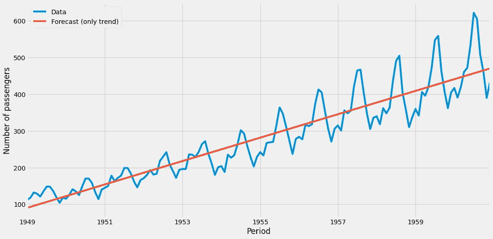

图片由作者提供。

它看起来并不可怕，尤其是考虑到我们到目前为止只添加了一个单一的功能。要模拟每年的季节性，最简单的方法是为每个月创建一个热编码变量，一个例子是特征“month_5 ”,它在第 5 个月(5 月)的值为 1，在其他月份的值为 0。你可以这样做:

```
X = pd.get_dummies(y.index.month, prefix='month')
X['trend'] = range(len(y))
X.index = y.index
```

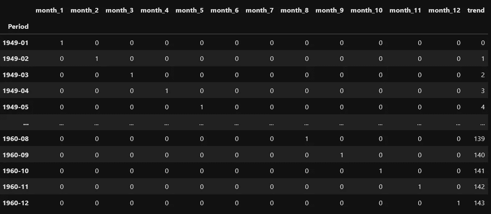

图片由作者提供。

这些都是非常便宜的特征，但是看看基于它们训练的线性模型给我们带来了什么:

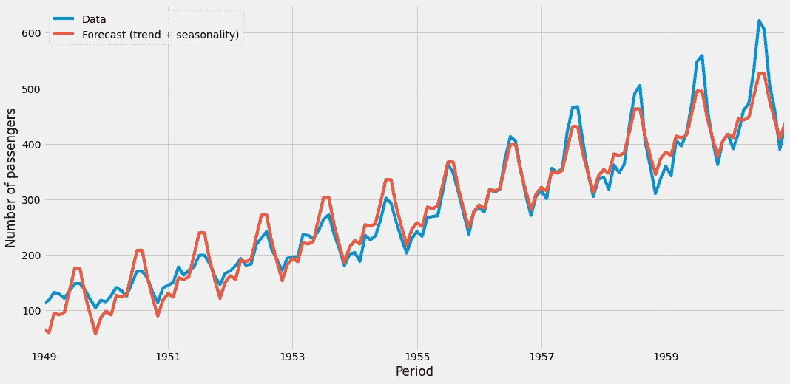

图片由作者提供。

这相当不错。模型捕捉到了趋势和季节性，很容易将这条曲线延续到未来。然而，只有最后一个挑战:季节性的强度随着时间的推移而增加。我们的模型尽了最大努力，但在开始时，我们的模型*在*附近摆动得更强，最后比原始时间序列更弱。这是我们无法用更多的功能来解决的。但是处理这个问题的一个简单方法是

1.  用对数变换原始标签`y`，
2.  对这个新数据集使用线性回归，然后
3.  使用求幂运算将预测值转换回来。

在 scikit 中有一个简洁的方法——学习实现这三个步骤，而不需要太多的开销并跟踪转换:

```
from sklearn.compose import TransformedTargetRegressor
from sklearn.linear_model import LinearRegression

lr = TransformedTargetRegressor(
    regressor=LinearRegression(),
    func=np.log, # use logarithm on the no. of passengers
    inverse_func=np.exp # transform the data back with exp
)

lr.fit(X, y)
```

然而，结果是惊人的，在训练集上 *r* 为 0.98，**。**

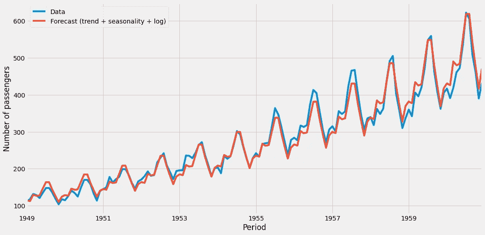

图片由作者提供。

我希望你能享受这有多棒！该模型仍然是一个简单的线性模型，即使进行了变换。此外，构建特征是琐碎的，然而结果是极其精确的。像这样的模型是黄金。


完整的模型，简化的符号。图片由作者提供。

你甚至可以创建一个更长的时间范围，并获得预测。

```
future = pd.date_range(
    start='1949-01-01',
    end='2021-12-31',
    freq='M'
)

X_future = pd.get_dummies(future.month, prefix='month')
X_future['trend'] = range(len(future))
X_future.index = future
```

如果我们把这个输入模型，我们会得到 1949 年 1 月到 2021 年 12 月之间的预测。

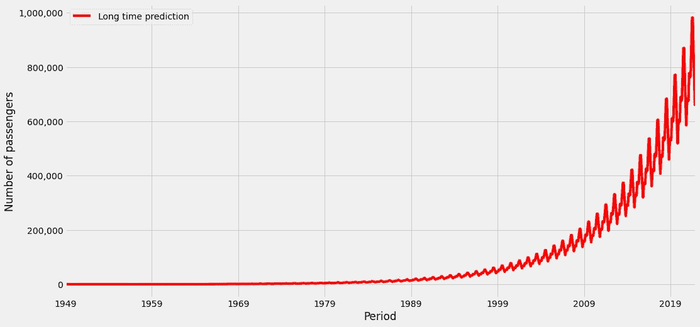

图片由作者提供。

根据该模型，我们今年的航班乘客人数将接近 100 万。然而，这个模型被输入了非常旧的训练数据，而且它也不了解新冠肺炎，所以对这个预测有很大的怀疑。根据我找到的数字，在 Covid 之前，2019 年每月约有 40 万名航空乘客。我们的模型说的是 60 万左右的东西，至少和真相差不多一个量级。但这说明过去的增长比现在高，是有道理的。这就是为什么该模型高估了真实的航空乘客数量。

# 结论

我们已经看到，就性能而言，说线性模型不好而复杂模型好通常是错误的。通过正确的功能，线性模型可以像神经网络或梯度推进一样执行。不幸的是，找到这样的优点很难，但这也是这份工作有趣的地方。如果对原始数据进行简单的*拟合/预测*就足够了，许多数据科学家可能明天就会失业。

虽然有时候想出好的特性很容易。当处理时间序列数据时，一个很好的起点是添加月份、星期几、星期几。或者像圣诞节、复活节、黑色星期五这样的特殊日子。包含一个趋势特征也是很好的。这可以是一个从零到观测值减一的数，正如我们在飞机乘客的例子中所看到的。但这只能让我们模拟一个线性趋势。我们还可以添加一个二次或根趋势，我们所要做的就是应用一些简单的函数，例如，0，1，4，9，…，，(#observations-1)。找到正确的指数，让它成为 1、2、0.5 或其他值是超参数调整的典型用例，您不必手动尝试所有东西。

因此，精心制作一些有意义的特性，尝试一下线性模型。这样做的好处是，该模型易于解释，快速且健壮，并且您可以确保线性回归适用于每种编程语言。这是**而不是**像 [CatBoost](https://catboost.ai/) 等高级模型的情况。

我希望你今天学到了新的、有趣的、有用的东西。感谢阅读！

**作为最后一点，如果你**

1.  **想支持我多写点机器学习和**
2.  **无论如何都要计划获得中等订阅量，**

**为什么不做** [**通过这个环节**](https://dr-robert-kuebler.medium.com/membership) **？这将对我帮助很大！😊**

透明地说，给你的价格不变，但大约一半的订阅费直接归我。

非常感谢，如果你考虑支持我的话！

> *如有问题，请在* [*LinkedIn*](https://www.linkedin.com/in/dr-robert-k%C3%BCbler-983859150/) *上写我！*