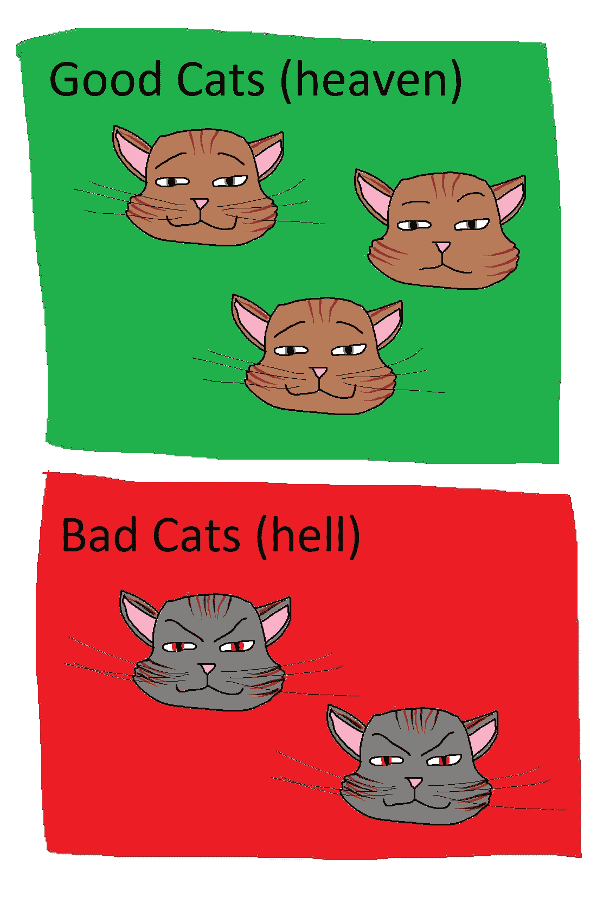

# 正确使用熊猫类别是很棘手的，原因如下…

> 原文：<https://towardsdatascience.com/staying-sane-while-adopting-pandas-categorical-datatypes-78dbd19dcd8a?source=collection_archive---------2----------------------->

## 了解常见的陷阱和意想不到的行为，如何避免让猫抓你

在 pandas 中，分类数据类型经常被吹捧为减少数据帧内存使用的简单方法，它们确实是一个有用的工具。然而，如果你想象你可以在代码的开头加上一个`.astype("category")`,其他的都一样(但是更有效)，你可能会失望。

本文主要关注在 pandas 中使用分类数据类型时可能会遇到的一些现实问题；要么调整您现有的思维模式，使用类别编写新代码，要么尝试使用类别列将现有管道迁移到流中。

*本文中描述的行为是截止到*`*pandas==1.2.3*`*(2021 年 3 月发布)的当前行为，但是如果您在更晚的日期阅读本文，请不要担心，所描述的行为不太可能在未来的版本中有重大改变——但是如果有，请留下评论！*

## 为什么在 pandas 中使用分类数据类型？

如果分类数据是一种痛苦，那么为什么不干脆完全避免它呢？嗯，使用类别可以带来一些显著的好处:

*   **内存使用** —对于有许多重复值的字符串列，类别可以大大减少在内存中存储数据所需的内存量
*   **运行时性能** —有一些优化可以提高某些操作的执行速度
*   **库集成** —在某些情况下，库对分类列有特殊的功能，例如`lightgbm`在构建模型时以不同的方式处理分类列

## 快乐之路

让我们做一个强制性的“快乐之路”的例子。这是在一个简单的世界里，每个人都互相微笑的样子:

```
df_size = 100_000
df1 = pd.DataFrame(
    {
        "float_1": np.random.rand(df_size),
        "species": np.random.choice(["cat", "dog", "ape", "gorilla"], size=df_size),
    }
)
df1_cat = df1.astype({"species": "category"})
```

这里我们创建了两个数据帧，`df1`包含作为对象列的`species`和`df1_cat`，后者是相同数据帧的副本，但是使用`species`作为分类数据类型。

```
>> df1.memory_usage(deep=True)Index          128
float_1     800000
species    6100448
dtype: int64
```

我们可以在这里看到，根据我们的内存使用情况，保存一个包含字符串的列是多么昂贵——这里的字符串列占用大约 6MB，如果这些字符串更长，它会占用更多；与之相比，float 列占用了 0.8MB。我们可以用一个字符串列的价格购买近 8 个`float64`列……很贵。

```
>> df1_cat.memory_usage(deep=True)Index         128
float_1    800000
species    100416
dtype: int64
```

在转换到一个类别后，查看内存使用情况，我们看到了一个相当大的改进，内存使用量减少了 60 倍，非常好。现在，我们可以用一个`float64`列的价格购买 8 个这样的字符串列，哦，形势发生了多么大的变化。

这很酷，但是，只有我们能保持这种状态才是真正的酷…

# 分类列是脆弱的东西

听起来很奇怪吗？嗯……处理类别很像玩那些摇摇晃晃的洋娃娃，当你把它们推过来时，它们又会弹回来；如果您不密切关注使用分类列的每个操作，它们将很容易返回到`object`中。

在最好的情况下，这是令人讨厌的，在最坏的情况下，它会降低您的性能(因为转换类型很昂贵)，和/或耗尽您的内存(因为您只能将这些数据作为一个类别存储到您的内存中)。

# 对分类列进行操作


这是我对猫手术的描述。我知道通常情况下，人类会给猫做手术，但是现实比小说更奇怪:我们有熊猫给猫做手术！

很可能在某个时候，你会想对你的分类列做些什么，其中之一可能是一个转换。这是第一个我们必须表现出勤奋的地方…

由于分类列通常是基于文本的列，让我们来看一个使用字符串操作的例子，我们可以像通常对基于文本的`object`列那样对分类列进行操作；通过使用`.str`访问器。

**非分类字符串系列:**

```
>> %timeit df1["species"].str.upper()25.6 ms ± 2.07 ms per loop (mean ± std. dev. of 7 runs, 10 loops each)
```

**关于分类字符串系列:**

```
>> %timeit df1_cat["species"].str.upper()1.85 ms ± 41.1 µs per loop (mean ± std. dev. of 7 runs, 1000 loops each)
```

分类版本在性能上是明显的赢家，在这种情况下大约快了 14 倍(这是因为内部优化意味着`.str.upper()`只对唯一的类别值调用一次，然后从结果中构造一个序列，而不是对序列中的每个值调用一次)。然而，这是我们遇到的第一个主要问题…

```
>> df1_cat["species"].str.upper().memory_usage(deep=True)6100576
```

我们已经丢失了我们的分类类型，结果是一个`object`类型的列，数据压缩也消失了；结果现在又是 6MB 大小。在此之后，我们可以重铸回一个类别，但这需要在类型之间来回转换，这会使我们的代码更加混乱，并且不会降低我们的内存使用峰值。

## 有效的替代方案

通常，一种有效的替代方法是重写操作分类列的代码，直接对类别本身进行操作，而不是对它们的值序列进行操作。这需要在思维模式(和实现)上做一点改变，你可以认为它只是对列中的每个唯一的**值做一次操作，而不是对列中的每个实例。如果在 100，000 行的类别中只有 2 个唯一值的列，那么只需执行 2 次操作，而不是 100，000 次。**

例如，在上述情况下，我们可以执行以下操作:

```
%timeit df1_cat["species"].cat.rename_categories(str.upper)239 µs ± 13.9 µs per loop (mean ± std. dev. of 7 runs, 1000 loops each)
```

这比前面的任何一个选项都快 10 倍，主要的好处是我们从不将分类系列转换成昂贵的中间`object`列状态，所以我们保持了很好的内存效率。

这是一个玩具示例，但原则适用于更复杂的示例，如果没有特定的`.cat`访问器方法来帮助您的特定情况，请考虑对包含唯一分类值的`df1_cat[“species”].dtype.categories`进行操作，而不是对整个系列进行操作。

# 与分类列合并


描绘一些合并的猫确实是一个巨大的尝试。

在除了最简单的用例之外的所有用例中，我们可能不只有一个数据帧，而是有多个数据帧，我们可能希望在某个时候将它们粘在一起。例如，我们将收集一个小型“参考”数据集，其中包含第一个数据集的物种栖息地:

```
df2 = pd.DataFrame(
    {
        "species": ["cat", "dog", "ape", "gorilla", "snake"],
        "habitat": ["house", "house", "jungle", "jungle", "jungle"],
    }
)
df2_cat = df2.astype({"species": "category", "habitat": "category"})
```

和以前一样，我们已经创建了这个数据集的一个分类版本，以及一个带有`object`字符串的版本。这里需要注意的一点是，我们有一个额外的物种(`snake`)，这是我们将与之合并的数据帧`df1`中没有的，这在以后会很重要(但不要担心不会有测试)。

我不会展示将两个`object`列合并在一起的例子，因为你们都知道会发生什么，`object` + `object` = `object`，没有魔法，这只是一个合并。

## 在分类列上合并对象列

在这个小测试中，我们将选取一个分类数据帧，并将其与另一个数据帧上的对象类型列合并。

```
>> df1.merge(df2_cat, on="species").dtypesfloat_1     float64
species      object
habitat    category
dtype: object
```

所以这里我们有左边的物种`object`和右边的物种`category`。我们可以看到，当我们进行合并时，我们得到了结果数据帧中合并列的`category` + `object` = `object`。如此等等等等，当我们回到`object` s 时，这又一次在记忆中击中了我们。这并不令人惊讶，但同样，这是在处理类别时需要注意的事情。

## 合并两个分类列

希望我已经让你认为我正在走向`category` + `category` = `category`。让我们来看看:

```
>> df1_cat.merge(df2_cat, on="species").dtypesfloat_1     float64
species      object
habitat    category
dtype: object
```

报警，我被骗了… `category` + `category` = `object`。

那么尾巴上的刺是什么？在合并中，为了保留分类类型，两个分类类型必须完全相同。与 pandas 中的其他数据类型不同(例如，所有的`float64`列都具有相同的数据类型)，当我们谈论分类数据类型时，数据类型实际上是由特定类别中存在的一组值来描述的，因此您可以想象包含`["cat", "dog", "mouse"]`的类别与包含`[“cheese”, “milk”, “eggs”]`的类别是不同的类型。虽然在我们的例子中，它们看起来非常相似(一个是另一个的子集)，但在`df2`中，我们有一个物种在`df1`中不存在(狡猾的`snake`)。

我们可以这样看待合并列的行为:

`category1` + `category2` = `object`

`category1` + `category1` = `category1`

因此，采用前面的例子，我们可以得到我们想要的和预期的结果:

```
>> df1_cat.astype({"species": df2_cat["species"].dtype}).merge(
       df2_cat, on="species"
   ).dtypes float_1     float64
species    category
habitat    category
dtype: object
```

从上面可以看出，设置分类类型进行匹配，然后进行合并，得到了我们想要的结果……最后。

# 使用分类列分组



我不是一个爱猫的人，我不清楚如何最好地对猫进行分类(我想它们中的很多会下地狱)

在修改代码以处理分类数据类型时，用类别分组曾经让我自己伤透了脑筋。一次导致行为意外改变，给出一个充满空值的数据帧，另一次导致操作无限期挂起(尽管以前使用`object`数据类型只需要几秒钟)。

***当您对分类数据类型进行分组时，默认情况下，您会对该数据类型中的每个值进行分组，即使它不在数据本身中。***

那是什么意思？最好用一个例子来说明。

```
habitat_df = (
    df1_cat.astype({"species": df2_cat["species"].dtype})
           .merge(df2_cat, on="species")
)house_animals_df = habitat_df.loc[habitat_df["habitat"] == "house"]
```

所以这里的`habitat_df`是上一节的合并示例(其中`species`和`habitat`最终都是分类的)，而`house_animals_df`只包含住在房子里的动物，在我们的例子中是`cat`和`dog`。让我们试着找出这些`species`的平均值`float_1`。

```
>> house_animals_df.groupby("species")["float_1"].mean()species
ape             NaN
cat        0.501507
dog        0.501023
gorilla         NaN
snake           NaN
Name: float_1, dtype: float64
```

有些事情看起来有点不对劲，我们现在在 groupby 中得到一堆空值。默认情况下，当对分类列进行分组时，pandas 会为类别中的每个值返回一个结果，即使这些值不在数据中。这可能很烦人(因为这是行为上的意外变化)，如果数据类型包含许多相关数据帧中不存在的组，尤其是在多个不同的分类列上分组时，这可能会影响性能。

为了得到我们想要的结果，我们可以将`observed=True`传递给 groupby 调用，这样可以确保我们只得到数据中值的分组。

```
>> house_animals_df.groupby("species", observed=True)["float_1"].mean()species
cat    0.501507
dog    0.501023
Name: float_1, dtype: float64
```

是的，但这又是一个让我们保持警觉的陷阱。

# 分类列索引


这是一个猫专栏，你明白吗？

这个例子稍微有点小众，但它为你有时会遇到的意外问题增加了一点色彩，如果你在使用范畴时没有保持头脑的话。有些情况下，您可能会将行值移动到列中，例如，`groupby-unstack`组合有点像职业玩家的移动。

```
>> species_df = habitat_df.groupby(["habitat", "species"], observed=True)["float_1"].mean().unstack()
>> species_df species       cat       ape       dog   gorilla
habitat                                        
house    0.501507       NaN  0.501023       NaN
jungle        NaN  0.501284       NaN  0.501108
```

现在我们有了一个数据框架，列中有物种，到目前为止一切正常，让我们添加另一列，看看会发生什么。

```
>> species_df["new_col"] = 1 TypeError: 'fill_value=new_col' is not present in this Categorical's categories
```

通常这段代码完全没问题，我们只是试图添加一个名为`new_col`的新列，它的值总是 1。只是看了一眼数据帧，看起来没有任何错误，错误似乎有点令人困惑，它在谈论哪个`Categorical`，我们只是试图添加一个新列？

所发生的是`.unstack()`(对于外行来说，它将索引翻转到列中，就像一个支点)将分类索引移动到列索引中。不可能将条目添加到不属于分类数据类型的分类索引中，因此会出现错误。虽然这并不是立即显而易见的，但如果你最终来到这里，挠头也是情有可原的。

可能不存在拥有分类列索引的强有力的例子，但是如果意外地拥有了一个分类列索引和/或您开始看到类似这样的奇怪错误，那么检查您正在处理的所有事物的数据类型并确保没有任何奇怪和分类的事情发生可能是值得的。

# 结论

Pandas categorical dtypes 很酷，并且有一些好的性能优势。当采用分类数据类型时，了解数据类型在不同的常见情况下如何表现是很重要的，尤其是对**来说，确保分类在整个程序流程中保持分类**，而不是返回到`object`。

以下是一些需要注意的事项的高度概括:

*   **对分类列进行操作时，**选择对数据类型中的类别进行操作的选项，而不是对包含该数据类型的系列中的值进行操作的选项。这应该允许您保留分类的性质，同时提高性能。
*   **在分类列上进行合并时，**请注意，为了保持分类性质，每个数据帧的合并列中的分类类型必须完全匹配。
*   **当对分类列进行分组时，**默认情况下，您将获得数据类型中每个值的结果，即使它不在数据中，您也可以使用`.groupby`中的`observed=True`来更改它。
*   **当你期望工作的事情出乎意料地停止工作时，**考虑是否有一种与范畴的奇怪互动在起作用

祝你好运，并祝你快乐！