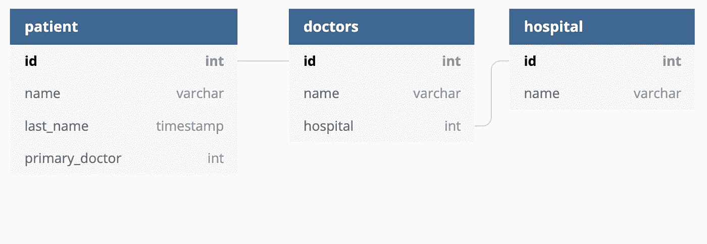
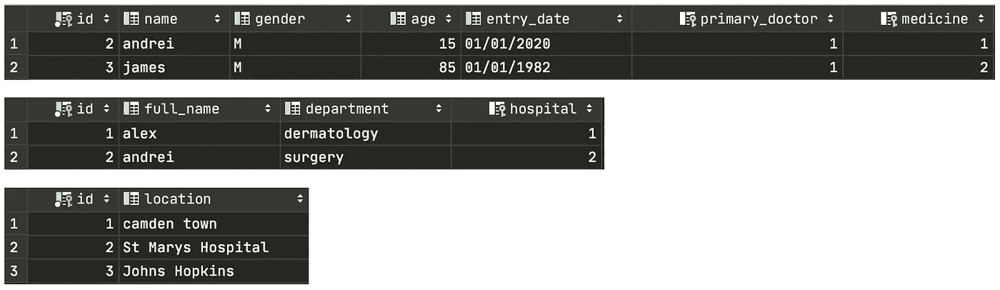

# 逐步在关系数据库中创建 SQL 表

> 原文：<https://towardsdatascience.com/step-by-step-sql-table-creation-in-a-relational-database-554926d9ce3c?source=collection_archive---------14----------------------->

## *初学者教程，学习创建带有主键和外键的关系表的艺术*


[迪米特拉·佩帕](https://unsplash.com/@dipstories?utm_source=unsplash&utm_medium=referral&utm_content=creditCopyText)在 [Unsplash](https://unsplash.com/s/photos/tables?utm_source=unsplash&utm_medium=referral&utm_content=creditCopyText) 上的照片

大量 SQL 教程向您展示了如何查询和连接数据库中的表，以提取有用的信息。这些教程基于**假设已经创建了表，并且表之间的关系已经建立…** 对于从零开始的人来说，情况并非如此！本文将展示如何从空白脚本开始。我们将建立一个非常简单的数据库，其中有三个相互关联的表:病人-医生-医院。

## 您将在本文中发现:

*   如何在 SQL 中创建表
*   如何在表中添加唯一标识符
*   如何使用主键和外键关联表
*   如何用真实数据填充表格

如果您还不是会员，请在此获得您的中级会员资格[！](https://medium.com/@alejandra.vlerick/membership)

## 需要了解的几个有用的首字母缩写词:

**什么是 RDBs:** 关系数据库( **RDB** )是由表、记录和列组成的多个数据集的集合。

**什么是 SQL:** SQL 是一种用于编程的特定领域语言，旨在管理关系数据库管理系统中的数据

**什么是表:**在关系数据库中保存数据的数据库对象

## **用户故事**

一个人走进医院，马上就会被联系到一个医生。当发现一种疾病或状况时，病人会得到一种药物并被送回家。至少这是我们今天要讨论的最好的情况。同样，每个医生在医院的特定部门工作。显然，一个医生可以为多家医院甚至多个部门工作，但是对于这个用例，我们将假设只有一个可能的值。

因此，我们可以说**病人表链接到医生表，医生表链接到医院表**。间接地，病人通过分配给他们的医生与医院有联系。

## 在开始创建表的代码和语法之前，让我们看一下最终结果。



存储在关系数据库中的表及其

## **第一步:创建表格**

在 SQL 语言中，我们使用以下语法创建一个表:

```
create table patient
 (
    name varchar,
    lastname varchar,
    hospital int,
    id serial,
    primary_doctor int
 );

 create unique index patient_id_uindex
    on patient (id);

 alter table patient
    add constraint patient_pk
       primary key (id);
```

## 让我们将代码分解成小的逻辑步骤:

该查询有三个主要部分:

1.  ***创建表格***

这将创建一个表，其中包含我们希望该表包含的所有列和存储的信息类型。首先给列一个名称，然后给它们存储一个**数据类型**。 **Integer** ， **serial** (顺序整数)，varchar(一串字/秒)。

2. ***创建唯一索引***

这表明在第一步中刚刚创建的列 ***id*** 只能取**唯一值**。这是什么意思？任何两个患者都不能有相同的标识符。将这个约束添加到病人的 id 中是有意义的，否则同名的人可能会混淆。

3. ***涂改表***

最后，我们取同一个 ***id*** 列，我们给它分配**主键**的角色。当一列中的值是唯一的并且是整数形式时，我们只能将该列指定为主键。在我们的例子中，“patient_pk”代表患者主键。

SQL 表不需要主键，但它是保持数据整洁和跟踪每个条目的有用功能。

对医院和医生表重复相同的过程。

```
create table doctor
 (
    name varchar,
    hospital varchar,
    id serial
 );

create unique index doctor_id_uindex
   on doctor (id);

alter table doctor
   add constraint doctor_pk
      primary key (id);
```

创建存储医院信息的表:

```
create table hospital
(
   name varchar,
   id serial
);

create unique index hospital_id_uindex
   on hospital (id);

alter table hospital
   add constraint hospital_pk
      primary key (id);
```

# **第二步:通过*外键*和主键**关联表

目前，我们只有三个相互独立的表，不知道其他表的存在。让我们通过添加 ***外键*** 来设置表之间的关系。

这方面的代码如下:

```
alter table patient
   add constraint patient_doctor_id_fk
      foreign key (primary_doctor) references doctor (id);
```

## 让我们把它分成三个步骤:

1. **Alter table** :由于表已经被创建，我们需要改变它的当前状态来添加一个外键。

2.**添加约束**:用于指定表格中数据的规则。这就是我们给将要做的事情命名的地方。在这种情况下，添加一个外键。

3.**外键**:这里我们指定我们取列" *primary_doctor* "并将其与 doctor 表中的" *id* "列相关联。这样，当我们向某个医生添加一个患者时，这两个表会立即链接起来，我们可以在输入患者时搜索医生信息，反之亦然。

类似地，要链接医生表和医院表:

```
alter table doctor

   add constraint doctor_hospital_id_fk

      foreign key (hospital) references hospital (id);
```

# 用真实的医院、患者和医生信息填充表格

当开始填充数据时，我们需要非常注意填充的顺序。至少对于这个初级教程来说，我建议您从填充医院表开始，然后是医生，最后是病人。



这样做的原因是因为在查看表之间的关系时，医院可以自己袖手旁观。当我们添加新医院时，不需要其他患者或医生的信息。而医生和病人之间存在依赖关系。

## 向表中添加新医院

在本例中，我们需要提供的唯一值是医院名称/位置。 *id* 列由 SQL 在后台自动填充。第一个条目将具有 id =1，并且每个新条目增加 1。

```
INSERT INTO hospital (location) VALUES ('Johns Hopkins')
```

现在我们有了一家医院，我们可以在医生表中添加一名医生。在这里，我们提供医生的姓名、工作部门和医院的 id。这是直接引用医院的表。在本例中，id = 1，因此我们引用上面创建的约翰霍普金斯医院。

```
INSERT INTO doctor (full_name, department, hospital) VALUES ('alex','dermatology', 1)
```

最后我们可以插入到患者表中。就像我们对于医生一样，第一列表示每个患者的特征值，最后我们添加与该患者相关联的医生的 id。

```
INSERT INTO patient (name, age, gender, entry_date, primary_doctor) VALUES ('james','85', 'M', '01/01/1982', 1 )
```

**就是这样！**确保在添加新患者和新医生时，只插入表中已经存在的外键值。当表中只注册了 3 名医生时，不要创建主医生 id = 7 的患者…

# 一些陷阱:

*   一个病人有多个医生会怎么样？
*   一个医生在多家医院工作会怎么样？
*   病人定期去医院会怎么样？

我们是否将它们注册到一个新行中，并因此分配一个新的惟一 id？我们是否将多个条目与同一个患者/医生相关联？但是，这如何与唯一主键约束保持一致呢？

对于更高级的 SQL 用户来说，这些都是非常好的问题。现在，我鼓励您用一些简单的例子创建自己的小表结构。

# 让你开始的想法

使用上面提供的代码尝试这些关系。这是真正测试您对 SQL 和关系数据库的理解的最佳方式。祝你好运！

*   学生—教师—教室
*   足球运动员—球队—进球
*   产品—商店—购买

# 非常感谢你的阅读！

更多类似的文章，请点击在[媒体上找到我。](https://towardsdatascience.com/medium.com/@alejandra.vlerick)

如果您有任何关于如何改进的**问题**、**建议**或**想法**，请在下面留下评论或通过 LinkedIn [这里](https://www.linkedin.com/in/alejandra-g-283595b8)取得联系。