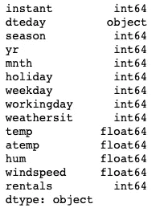
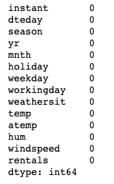
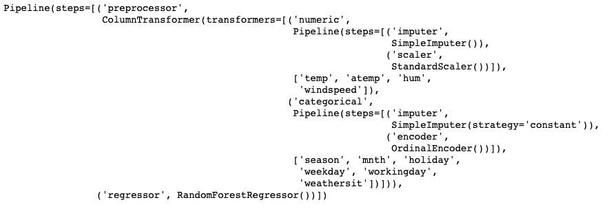

# Sci-kit 学习管道的分步教程

> 原文：<https://towardsdatascience.com/step-by-step-tutorial-of-sci-kit-learn-pipeline-62402d5629b6?source=collection_archive---------0----------------------->

## [实践教程](https://towardsdatascience.com/tagged/hands-on-tutorials)

## 立即使用管道来简化您的数据科学项目！


由[米利安·耶西耶](https://unsplash.com/@mjessier?utm_source=medium&utm_medium=referral)在 [Unsplash](https://unsplash.com?utm_source=medium&utm_medium=referral) 上拍摄的照片

大多数数据科学项目(像我一样热衷于说所有项目)都需要一定程度的数据清理和预处理，以充分利用机器学习模型。一些常见的预处理或转换包括:

a.输入缺失值

b.移除异常值

c.标准化或规范化数字特征

d.编码分类特征

Sci-kit learn 在预处理包下有一堆支持这种转换的函数，比如 StandardScaler，simple imputr…等等。

典型且简化的数据科学工作流需要

1.  获取训练数据
2.  清理/预处理/转换数据
3.  训练一个机器学习模型
4.  评估和优化模型
5.  清理/预处理/转换新数据
6.  根据新数据拟合模型以进行预测。

您可能会注意到，在工作流中，数据预处理至少要进行两次。尽管这一步既繁琐又耗时，但如果我们能自动化这一过程并将其应用于所有未来的新数据集，那该多好啊。

好消息是:是的，我们绝对可以！有了 scikit learn pipeline，我们可以轻松地将流程系统化，从而使其极具可重复性。接下来，我将带您了解使用 scikit learn pipeline 的过程，让您的生活更加轻松。

** *免责声明:这篇文章的目的是了解 scikit learn pipeline 的用法，而不是训练一个完美的机器学习模型。*

# 读入数据

我们将使用来自[微软神奇的机器学习学习材料](https://github.com/MicrosoftDocs/ml-basics)的“每日自行车共享”数据。

```
**import** pandas **as** pd
**import** numpy **as** npdata = pd.read_csv(‘[https://raw.githubusercontent.com/MicrosoftDocs/ml-basics/master/data/daily-bike-share.csv'](https://raw.githubusercontent.com/MicrosoftDocs/ml-basics/master/data/daily-bike-share.csv'))
data.dtypes
```



```
data.isnull().sum()
```



幸运的是，该数据集没有缺失值。虽然看起来所有的特征都是数字，但实际上我们需要识别一些分类特征。那些是 *['季节'，'月份'，'假日'，'工作日'，'天气']* 。为了便于说明，我仍然将它视为缺少值。我们先过滤掉一些明显没用的功能。

```
data = data[['season'
             , 'mnth'
             , 'holiday'
             , 'weekday'
             , 'workingday'
             , 'weathersit'
             , 'temp'
             , 'atemp'
             , 'hum'
             , 'windspeed'
             , 'rentals']]
```

# 拆分数据

在创建管道之前，我们需要首先将数据分成训练集和测试集。

```
**from** sklearn.model_selection **import** train_test_split
X = data.drop('rentals',axis=1)
y = data['rentals']X_train, X_test, y_train, y_test = train_test_split(X, y, test_size=0.2, random_state=123)
```

# 创建管道

我们将要处理的管道的主要参数是' **steps** 。从[文档](https://scikit-learn.org/stable/modules/generated/sklearn.pipeline.Pipeline.html)来看，它是一个链接的(名称，转换)元组(实现 fit/transform)的“*列表，按照它们被链接的顺序，最后一个对象是一个估计器。”*

简单地看一下管道应该是什么样子更容易:

```
Pipeline(steps=[('name_of_preprocessor', preprocessor),
                ('name_of_ml_model', ml_model())])
```

“预处理器”是复杂的部分，我们必须自己创建。让我们继续吧！

> **预处理器**

我们需要的包如下:

```
**from** sklearn.preprocessing **import** StandardScaler, OrdinalEncoder
**from** sklearn.impute **import** SimpleImputer
**from** sklearn.compose **import** ColumnTransformer
**from** sklearn.pipeline **import** Pipeline
```

首先，我们需要为数字和分类特征定义转换器。变换步骤由元组表示。在这个元组中，首先定义转换器的名称，然后定义想要应用的函数。元组的顺序将是管道应用转换的顺序。这里，我们首先处理缺失值，然后标准化数字特征和编码分类特征。

```
numeric_transformer = Pipeline(steps=[
       ('imputer', SimpleImputer(strategy='mean'))
      ,('scaler', StandardScaler())
])categorical_transformer = Pipeline(steps=[
       ('imputer', SimpleImputer(strategy='constant'))
      ,('encoder', OrdinalEncoder())
])
```

我们需要做的下一件事是指定哪些列是数字的，哪些是分类的，这样我们就可以相应地应用转换器。我们通过使用 ColumnTransformer 将转换器应用于特征。将转换器应用于特征是我们的预处理器。与 pipeline 类似，我们将由*(‘name’，‘transformer’，‘features’)*组成的元组列表传递给参数“ *transformers* ”。

```
numeric_features = ['temp', 'atemp', 'hum', 'windspeed']categorical_features = ['season', 'mnth', 'holiday', 'weekday', 'workingday', 'weathersit']preprocessor = ColumnTransformer(
   transformers=[
    ('numeric', numeric_transformer, numeric_features)
   ,('categorical', categorical_transformer, categorical_features)
]) 
```

有些人会根据数据类型创建数字/分类特征列表，如下所示:

```
numeric_features = data.select_dtypes(include=['int64', 'float64']).columnscategorical_features = data.select_dtypes(include=['object']).drop(['Loan_Status'], axis=1).columns
```

我个人不建议这样做，因为如果你有伪装成数值数据类型的分类特征，比如这个数据集，你将无法识别它们。仅当您 100%确定只有数字要素是数字数据类型时，才使用此方法。

> **估计器**

在组装我们的预处理器之后，我们可以添加估计器，这是您想要应用的机器学习算法，以完成我们的预处理和训练管道。因为在这种情况下，目标变量是连续的，所以我将在这里应用随机森林回归模型。

```
**from** sklearn.ensemble **import** RandomForestRegressorpipeline = Pipeline(steps = [
               ('preprocessor', preprocessor)
              ,('regressor',RandomForestRegressor())
           ])
```

为了创建模型，类似于我们过去用机器学习算法所做的，我们使用 pipeline 的‘fit’功能。

```
rf_model = pipeline.fit(X_train, y_train)
print (rf_model)
```



使用常规方法评估模型。

```
**from** sklearn.metrics **import** r2_scorepredictions = rf_model.predict(X_test)print (r2_score(y_test, predictions))
>> 0.7355156699663605
```

# 使用模型

为了最大限度地提高再现性，我们希望对新的输入数据重复使用该模型。让我们使用“joblib”包将模型保存为 pickle 文件。

```
**import** joblibjoblib.dump(rf_model, './rf_model.pkl')
```

现在我们可以调用这个管道，它包括我们需要的各种数据预处理和训练模型，只要我们需要它。

```
# In other notebooks 
rf_model = joblib.load('PATH/TO/rf_model.pkl')new_prediction = rf_model.predict(new_data)
```

# **结论**

在了解 scikit learn pipeline 之前，每当我想将同一个模型应用于不同的数据集时，我总是不得不重做整个数据预处理和转换工作。这真是一个乏味的过程。我试图编写一个函数来完成所有这些任务，但是结果并不令人满意，也没有为我节省很多工作量。

Scikit learn pipeline 确实让我的工作流程更加顺畅和灵活。例如，您可以轻松比较许多算法的性能，例如:

```
regressors = [
    regressor_1()
   ,regressor_2()
   ,regressor_3()
   ....]for regressor in regressors:
    pipeline = Pipeline(steps = [
               ('preprocessor', preprocessor)
              ,('regressor',regressor)
           ])
    model = pipeline.fit(X_train, y_train)
    predictions = model.predict(X_test)
    print (regressor)
    print (f('Model r2 score:{r2_score(predictions, y_test)}')
```

，或者调整预处理/转换方法。例如，使用“中值”来填充缺失值，对数字特征使用不同的定标器，改变为一次性编码而不是顺序编码来处理分类特征、超参数调整等。

```
numeric_transformer = Pipeline(steps=[
       ('imputer', SimpleImputer(strategy='median'))
      ,('scaler', MinMaxScaler())
])categorical_transformer = Pipeline(steps=[
       ('imputer', SimpleImputer(strategy='constant'))
      ,('encoder', OneHotEncoder())
])pipeline = Pipeline(steps = [
               ('preprocessor', preprocessor)
              ,('regressor',RandomForestRegressor(n_estimators=300
                                                 ,max_depth=10))
           ])
```

所有上述调整现在都可以简单地通过改变函数中的一个参数来完成。

我希望这能对你有所帮助，欢迎任何评论或建议！