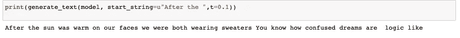
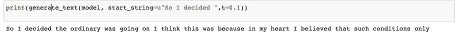

# 斯蒂芬金文本生成与人工智能(RNN)，使用 Python

> 原文：<https://towardsdatascience.com/stephen-king-text-generation-with-artificial-intelligence-rnn-using-python-e92c735851be?source=collection_archive---------12----------------------->


J. Kelly Brito 在 [Unsplash](https://unsplash.com/s/photos/stephen-king-it?utm_source=unsplash&utm_medium=referral&utm_content=creditCopyText) 上的照片

## 以下是我如何训练一个深度学习架构来编写一个类似斯蒂芬·金的文本。

**我喜欢阅读，我是斯蒂芬·金的超级粉丝。**另外，我是一名物理学家和数据科学家，目前在获得硕士学位后正在休假。在这段时间里，我决定读另一本斯蒂芬·金的书，我真的很喜欢它。

我永远不会让电脑写一本斯蒂芬·金的书，原因很简单。

> 我们还没有掌握这种技术。

如果你看一些 NLP 实验(例如 AI 写笑话[这里](https://www.iflscience.com/technology/ais-attempts-at-oneliner-jokes-are-unintentionally-hilarious/all/))你可以有把握地说我们在写作方面不如人类。

所以你可能会问“为什么在一篇解释如何用人工智能生成文本的博客文章中，你告诉我我们不能让人工智能生成文本**？**”。答案是这样的:

> 虽然我们确实不能让计算机写一整本书(就目前而言)，但人工智能仍然能够提出情节建议，获得见解，并帮助人类写作。

实际上，它在这些方面做得非常好！

因此，我决定拿一堆斯蒂芬·金的文本，用一个人工智能(**深度学习**)算法写一个小的新的。这是游戏计划:

1.  **理论**
2.  **代码**
3.  **结果**

我知道你们中的一些人可能只对结果感兴趣，或者只对理论部分感兴趣，或者只对代码感兴趣。每个部分都是前后一致的，所以请随意跳到你最喜欢的部分。

***我们潜进去吧！***

1。 **理论**

> 注意:这是人工智能结构背后所需理论的**简要概述**。如果你觉得你需要更扎实的理论背景，你应该参考不同的资料或书籍。

当我们说 AI 时，我们会说很多东西。另一方面，当谈到“文本生成”时，我们可能希望参考**深度学习**。深度学习是一种特殊的人工智能，能够通过执行**分层学习来完成任务。**让我们简单点。如果你想识别你面前的动物是不是猫，你可能会从看颜色开始，然后是形状，然后是眼睛，等等。所以你基本上从简单的概念开始，然后从简单的概念中建立更复杂的概念。出于这个原因，我们说学习是**分层的(即输入由不同的层处理)。**

**假设输入是由 N = N×N 个像素组成的图像。** 这个输入被不同的层处理，然后**如果动物是猫，结果是 1，如果不是猫，结果是 0**。很简单，对吧？

需要知道的重要一点是，这个结构**需要训练。这意味着你必须使用大量的猫和非猫的标签图片(idk，dogs？)并建立一个学习过程，让机器学习如何执行任务。**

现在，让我们谈谈生意。当我们谈论文本生成时，我们必须记住两个重要的概念:

a)将**字嵌入**

b)**递归神经网络**

**单词嵌入是机器把一个文本(一个字符串)转换成一个向量(一个数字序列)的部分。**

**递归神经网络是一种特殊的深度学习结构。**这种结构能够收集一个序列顺序(如一个句子)的所有先前输入，以预测获得某个输出的概率。特别是有一个**词汇**包含了文本的所有单词(假设有 **V 单词**)和一个 **Logit 输出。**这是一个在[0，1]范围内的 V 数序列，其和为 1。**序列的每个数字(假设是 j)告诉你输入序列后获得 j 字的概率。**

到目前为止所解释的一切都总结在下面的方案中:


来源:[https://www.tensorflow.org/text/tutorials/text_generation](https://www.tensorflow.org/text/tutorials/text_generation)

2。代码**代码**

> 注:本部分灵感来自[本来源](https://www.tensorflow.org/text/tutorials/text_generation)

**这可能会让你吃惊，但是代码部分非常简单。**

这些是您将需要的库:

我用过的所有斯蒂芬·金的文本都可以在这里找到[。
**在你得到它们之后，很容易用一些非常简单的 Python 普通代码行来使用它们:**](https://www.kaggle.com/ttalbitt/stephen-king-books)

**这些是为了使文本适应 TensorFlow 并创建字典而运行的代码行:**

**建立模型:**

**训练模型:**

**获取训练好的模型:**

**这里是生成文本功能:**

可用于实际生成以下简单行的文本(假设给定了输入字符串):

***如"后"已作为输入序列给出。***

3结果

到目前为止描述的人工智能结构原则上可以从单个输入生成无限的文本。当然，这会导致糟糕的表现，因为它最终只会一遍又一遍地重复同样的话。因此，从输入中生成一个句子是安全的。需要注意的是，有一个参数叫做 **t(温度)**，它允许你设置算法的创造性。t= 0 意味着重复数据集的相同单词，t=1 意味着发明非英语句子或单词。这两者之间的良好平衡是关键。

给你看看一些结果吧！

**第一个例子(t = 0.1，中等输入):**

```
Input: "After the"
Output: "After the sun was warm on our faces we were both wearing sweater (.) You know how confused dreams are logic like"
```



**第二个例子(t=0.1，长输入):**

```
Input: "So I decided"
Output: "So I decided the ordinary was going on. I think this was because in my heart I believed that such conditions only"
```



**第三个例子(t=0.7，短输入):**

```
Input: "I"
Output: "I fell in love to the sound of breaking glass edged it liked jagged lace. The two ved her be a fluke I r" 
```


**第四个例子(t=0.2，短输入):**

```
Input: "He"
Output: "He who spotted her. He recognized her by her red handbag spread out in front of me and it was like takin" 
```


**一些乐趣(wordcloud):**

单词越大，使用频率越高。


我用 Python 制作的图片

# 结论:

正如可能看到的，**我们无法用这种技术实现一个完全一致的斯蒂芬·金文本生成器**。尽管如此，斯蒂芬·金的粉丝可能会意识到，在生成的文本中有一些东西让他们想起了斯蒂芬·金。这并不令人惊讶，因为人工智能算法已经“看到”了由斯蒂芬·金文本组成的数据集。**另一方面，令人惊讶的是，该算法已经发明了一种新的斯蒂芬·金式(非常短)文本！**

如果你喜欢这篇文章，你想知道更多关于机器学习的知识，或者你只是想问我一些你可以问的问题:

A.在 [**Linkedin**](https://www.linkedin.com/in/pieropaialunga/) 上关注我，在那里我发布我所有的故事
B .订阅我的 [**简讯**](https://piero-paialunga.medium.com/subscribe) 。这会让你了解新的故事，并给你机会发短信给我，让我收到你所有的更正或疑问。
C .成为 [**推荐会员**](https://piero-paialunga.medium.com/membership) ，这样你就不会有任何“本月最大数量的故事”，你可以阅读我(以及成千上万其他机器学习和数据科学顶级作家)写的任何关于最新可用技术的文章。

***任何人都快乐斯蒂芬·金！***