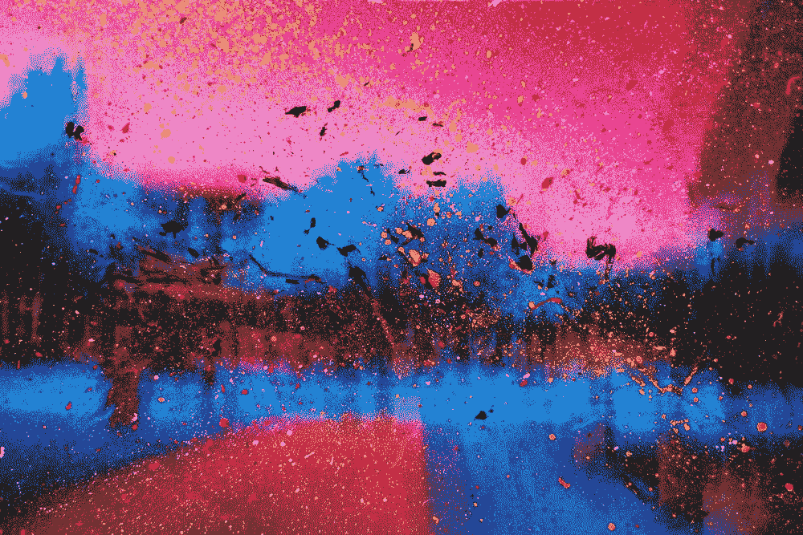
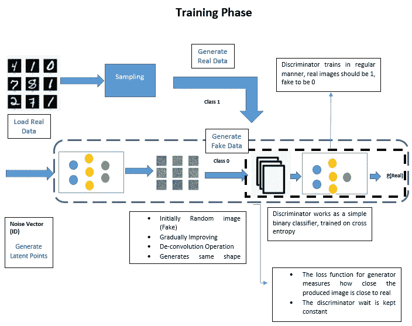
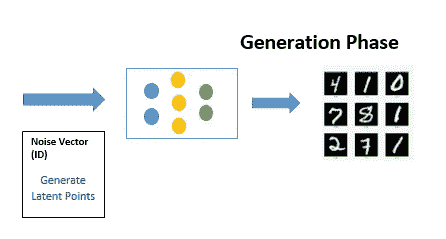
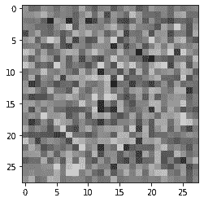
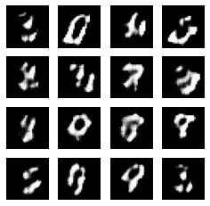

# 走进甘斯的神奇世界

> 原文：<https://towardsdatascience.com/stepping-into-the-magical-words-of-gan-f16d3e8e8fe0?source=collection_archive---------16----------------------->

## 甘的一步一步教程



[https://unsplash.com/photos/6dN9l-gopyo](https://unsplash.com/photos/6dN9l-gopyo)

一个生成模型有潜在的魔力，如果训练得当，它可以像专家一样写诗、创作音乐、绘制图像。GAN 的目标是生成非常逼真的合成样本。甘模型在对抗环境中学习技巧。有两个多层神经网络，一个作为发生器，另一个作为其对手，称为鉴别器。两者都使用常规反向传播方法训练，尽管具有不同的和冲突的损失函数(对抗性设置)。**一旦训练完成，鉴频器被移除，生成器被用于产生样本。**

下图对此进行了说明。这里的任务是能够创建像 MNIST 手写数字。



图 1a:GAN 的训练阶段(图片来源:作者)

该图有两个神经网络，第一个是生成器，第二个是鉴别器。

生成器将随机噪声向量作为输入，并生成与真实数据维数相同的图像。为什么用噪声作为输入？这确保了生成器不会产生真实数据中已有数据的副本。

鉴别器是一个进行二元分类的简单分类器。来自生成器的类“0”或假类，以及来自真实图像的类“1”，在本例中为 MNIST。

> 鉴别器使用交叉熵的常规损失函数，而生成器训练通过鉴别器，保持其权重恒定(否则收敛将像移动目标一样),并且这里损失函数测量具有 1 类概率的伪图像。这就是冲突的来源。鉴别器希望真实类被分类为真实类，假类被分类为假类，生成器希望假类被分类为真实类。

一旦训练完成，鉴别器可以丢弃，生成器可以用来产生真实的样本，如下图所示。



图 1b:氮化镓的生成阶段

现在是实现部分，编码是根据 Jason Brownlee 的博客完成的。

**步骤 1:定义生成器**

```
def define_generator(latent_dim):
	model = Sequential()
	*# foundation for 7x7 image*
	n_nodes = 128 * 7 * 7
	model.add(Dense(n_nodes, input_dim=latent_dim))
	model.add(LeakyReLU(alpha=0.2))
	model.add(Reshape((7, 7, 128)))
	*# upsample to 14x14*
	model.add(Conv2DTranspose(128, (4,4), strides=(2,2), padding='same'))
	model.add(LeakyReLU(alpha=0.2))
	*# upsample to 28x28*
	model.add(Conv2DTranspose(128, (4,4), strides=(2,2), padding='same'))
	model.add(LeakyReLU(alpha=0.2))
	model.add(Conv2D(1, (7,7), activation='sigmoid', padding='same'))
	return model
```

生成器将噪声向量作为输入，并生成 28 X 28 的图像。下面是测试生成器的代码

```
noise = tf.random.normal([1, 100])
generator = define_generator(100)
generated_image = generator(noise, training=False)
plt.imshow(generated_image[0, :, :, 0], cmap='gray')
```

生成的图像如下



图 2:产生的随机噪声(图片来源:作者)

**步骤 2:定义鉴别器模型**

这是一个简单的二元分类网络。

```
def define_discriminator(in_shape=(28,28,1)):
	model = Sequential()
	model.add(Conv2D(64, (3,3), strides=(2, 2), padding='same', input_shape=in_shape))
	model.add(LeakyReLU(alpha=0.2))
	model.add(Dropout(0.4))
	model.add(Conv2D(64, (3,3), strides=(2, 2), padding='same'))
	model.add(LeakyReLU(alpha=0.2))
	model.add(Dropout(0.4))
	model.add(Flatten())
	model.add(Dense(1, activation='sigmoid'))
	*# compile model*
	opt = Adam(lr=0.0002, beta_1=0.5)
	model.compile(loss='binary_crossentropy', optimizer=opt, metrics=['accuracy'])
	return model
```

**步骤 3:创建组合模型**

这里的目的是训练发生器模型，鉴别器权重不会改变或者不可训练。

```
def define_gan(g_model, d_model):
	*# make weights in the discriminator not trainable*
	**d_model.trainable = False**
	*# connect them*
	model = Sequential()
	*# add generator*
	model.add(g_model)
	*# add the discriminator*
	model.add(d_model)
	*# compile model*
	opt = Adam(lr=0.0002, beta_1=0.5)
	model.compile(loss='binary_crossentropy', optimizer=opt)
	return model
```

**第四步:搭建舞台。**

*   **加载真实数据:** —从 MNIST 获取数据
*   **生成真实数据:** —从真实数据集中获取一个样本，并附加类标签‘1’
*   **生成噪声数据:-** 生成随机噪声作为发生器的输入
*   **生成假日期:-** 从生成器获取一个样本，并附加类标签‘0’

```
def load_real_samples():
	*# load mnist dataset*
	(trainX, _), (_, _) = mnist.load_data()
	*# expand to 3d, e.g. add channels dimension*
	X = expand_dims(trainX, axis=-1)
	*# convert from unsigned ints to floats*
	X = X.astype('float32')
	*# scale from [0,255] to [0,1]*
	X = X / 255.0
	return Xdef generate_real_samples(dataset, n_samples):
	*# choose random instances*
	ix = randint(0, dataset.shape[0], n_samples)
	*# retrieve selected images*
	X = dataset[ix]
	*# generate 'real' class labels (1)*
	y = ones((n_samples, 1))
	return X, ydef generate_latent_points(latent_dim, n_samples):
	*# generate points in the latent space*
	x_input = randn(latent_dim * n_samples)
	*# reshape into a batch of inputs for the network*
	x_input = x_input.reshape(n_samples, latent_dim)
	return x_input def generate_fake_samples(g_model, latent_dim, n_samples):
	*# generate points in latent space*
	x_input = generate_latent_points(latent_dim, n_samples)
	*# predict outputs*
	X = g_model.predict(x_input)
	*# create 'fake' class labels (0)*
	y = zeros((n_samples, 1))
	return X, y
```

**第五步:训练方法甘**

下面的代码是重要的一部分，有两个循环，外部的一个用于 Epochs，内部的一个用于 batches。正在训练两个模型，一个是鉴别器模型，另一个是具有鉴别器权重常数的组合模型。Epoch 的数量被设置为 5，这不会给出一个好的结果，但会让你知道它是否工作。

```
def train(g_model, d_model, gan_model, dataset, latent_dim, n_epochs=5, n_batch=256):
	bat_per_epo = int(dataset.shape[0] / n_batch)
	half_batch = int(n_batch / 2)
	*# manually enumerate epochs*
	for i **in** range(n_epochs):
		*# enumerate batches over the training set*
		for j **in** range(bat_per_epo):
			*# get randomly selected 'real' samples*
			X_real, y_real = generate_real_samples(dataset, half_batch)
			*# generate 'fake' examples*
			X_fake, y_fake = generate_fake_samples(g_model, latent_dim, half_batch)
			*# create training set for the discriminator*
			X, y = vstack((X_real, X_fake)), vstack((y_real, y_fake))
			*# update discriminator model weights*
			d_loss, _ = d_model.train_on_batch(X, y)
			*# prepare points in latent space as input for the generator*
			X_gan = generate_latent_points(latent_dim, n_batch)
			*# create inverted labels for the fake samples*
			y_gan = ones((n_batch, 1))
			*# update the generator via the discriminator's error*
			g_loss = gan_model.train_on_batch(X_gan, y_gan)
			*# summarize loss on this batch*
			print('>**%d**, **%d**/**%d**, d=**%.3f**, g=**%.3f**' % (i+1, j+1, bat_per_epo, d_loss, g_loss))
```

步骤 6:使用参数运行训练方法

```
*# size of the latent space*
latent_dim = 100
*# create the discriminator*
d_model = define_discriminator()
*# create the generator*
g_model = define_generator(latent_dim)
*# create the gan*
gan_model = define_gan(g_model, d_model)
*# load image data*
dataset = load_real_samples()
*# train model*
train(g_model, d_model, gan_model, dataset, latent_dim)
```

**生成阶段:**

```
seed = tf.random.normal([num_examples_to_generate, noise_dim])
predictions = g_model(seed, training=False)

fig = plt.figure(figsize=(4, 4))
for i **in** range(predictions.shape[0]):
      plt.subplot(4, 4, i+1)
      plt.imshow(predictions[i, :, :, 0] , cmap='gray')
      plt.axis('off')
```

下面是 5 个时期后生成的图像，当然，如果我们训练更多的时期，这将给出一些有意义的东西。



图 3:生成器生成的图像(图像来源:作者)

**结论**:

GAN 是最酷的一个，具有很大的潜力和积极的发展，这个入门只是让你开始。关于鉴别器的收敛性和严格性还存在一些问题，有兴趣的读者可以进一步深入了解。

你也可以从我们的视频[讲座](https://www.youtube.com/watch?v=8iBNy0FhyDw)开始。