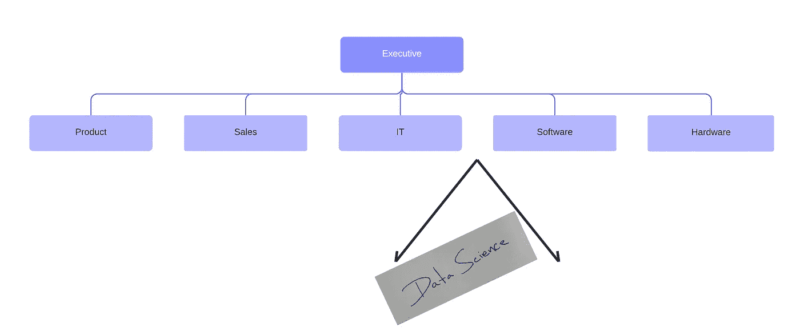
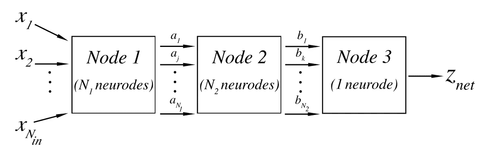

# 为了每个人的利益踩在每个人的脚趾上

> 原文：<https://towardsdatascience.com/stepping-on-everyones-toes-for-everyone-s-benefit-626a0c2664b5?source=collection_archive---------33----------------------->

## 数据科学部门在 21 世纪组织中的角色

# 介绍

(作者创作)

数据科学部门是传统公司结构的新成员。以下是如何有效地创造一个有益于你的组织，而不是一个创造不必要的内耗。

早在《哈佛商业评论》宣布数据科学是 21 世纪最性感的工作之前，数学家约翰·w·图基(John W. Tukey)就在他的论文“[数据分析的未来](https://projecteuclid.org/download/pdf_1/euclid.aoms/1177704711)”(1962)中对电子计算的到来将如何影响统计学做出了同样性感的预测。他将高度理论化和学术化的数理统计领域的不可或缺的概括应用到更实用的“数据分析”领域，其特点是在从数据中确定真理的实践中增加了一些程序，如“计划数据的收集以使其分析更容易、更精确或更准确，以及统计学的所有机制”。毕竟，这是科学最基本的准则:如何区分真理和谬误，阐明其完整的背景和适用性，以理解我们所居住和构成的宇宙？无论在哪个领域，都是通过获取数据来指导旅程。数据也可能被滥用——就像经常发生的那样——通过明确的意图、无意的偏见或简单的粗心来推动错误的叙述。图基写道，当时电子计算在数据分析方面的新生应用刚刚进入讨论，他指出，“携带计算尺比台式电脑更容易”，“计算机使完全不可行的事情变得可行”。随着计算能力的增长，数据揭示真相和谎言的能力也在增长。适用性的广度也在增长，数据科学现在几乎渗透到了研究或工业实践的每个领域。因此，出现了一个科学和工业相结合的新领域:“数据科学”，其特征是几个领域的交叉，如数学、统计学、数据分析、计算、数据库，以及大量以主题专业知识和科学探究为统一核心的艺术故事。鉴于这些组织现在面临的数据的复杂性、丰富性和重要性，数据科学填补了传统企业组织结构中出现的功能缺口。忽视这一差距的代价是根据与现实不符的叙述行事的后果。

“数据科学”在 2008 年首次被称为“数据科学”,它已经成为一个新的角色，出现在从许多其他组织合并而来并涉足许多领域的组织中。过去难以解决的问题现在可以通过这一新角色来解决，前提是它在组织中的职能得到明确定义，以补充现有的部门角色，而不是激发领土反弹。然而，要充分履行这一新角色，需要其他传统部门所具备的独特技能组合。数据科学在操作上用代码来表达，但是软件工程师通常不具备必要的数学或统计背景。此外，工程师的目标是建造为特定目的而工作的东西，而不是通过经验主义来寻求真理。受过传统训练的统计学家在数据分析的基本原则和经验主义方面有很强的基础，但通常没有受过软件和数据库设计或管理方面的训练。数据库管理员和数据工程师可以有效地管理大量数据，但不一定从事过科学研究。人工智能本身是一个子领域，位于数据科学的中心，除了编码、数据库和统计建模技能之外，还需要自己的专业知识。鉴于这一研究领域在 2020 年大约只有 10 年的历史，在其现代化身中，其领导者几乎总是在某个相关领域接受过正规教育，并在必要时移居到该领域。早期领导者的个人经历以及他们所服务的组织的需求为数据科学所扮演的角色提供了信息，随着行业普遍努力理解这一新职能角色的效用，这一角色可能会因组织而异。

作为一名实验性高能物理学家，我在学术界从事了多年的工作，研究宇宙如何利用粒子对撞机生成的数据集构成的最深刻的已知原理，并在一家飞行 wifi 提供商的数据团队中担任了几年的全栈软件工程师，在过去的几年里，我花了几年时间为 [rMark Bio](https://rmarkbio.com/) 建立数据科学项目，在那里我们致力于数据驱动的方法，以提高生命科学中的运营效率和可操作的洞察力收集。作为一家不受传统部门、产品或思想束缚的年轻公司，我们有机会定义数据科学在一个新组织中的作用，这个新组织受制于 21 世纪第二个十年的技术和经济力量。我想分享我们学到的东西。

# 数据科学部门的首要原则

我经常向数据科学家强调通过理解正在研究的问题背后的首要原则来解决问题的重要性，所以让我们以同样的方式来解决定义和建立数据科学部门的问题:数据科学部门的首要、最基本的目标是什么？我提议:

> “数据科学计划的目标是战略性地识别数据事实，理解这些事实的全部复杂性，识别由此产生的相关事实陈述，然后将这些知识应用于与数据科学计划所在组织的使命相一致的一些实际目的。数据科学表现为经验主义，专门研究用于实现这一目标的方法和技术。”

最根本的目标不是构建有用的东西，即使这样做对于可靠地处理数据是必要的；不是有效地营销叙事，即使一旦发现数据的真实叙事，这样做是数据科学的责任；而不是销售产品，即使数据驱动的洞察力可能是该产品设计的组成部分。数据科学的首要原则是通过经验主义进行科学探究；其他一切都是追求的结果。通过经验主义寻求真理是数据科学部门区别于其他部门的角色，数据科学部门必须与其他部门协同工作。正如在任何科学领域一样，表达挑战传统智慧的创造性自由，无论努力的最终结果是加强现有智慧，更好地理解它，还是完全推翻它，都是这一角色的关键，也是数据科学追求其使命所必须尊重的。

# 数据科学包括软件工程、数据架构和统计学，但不是它们

数据科学最相似的一个角色是软件，因为在编写管理和研究数据的代码的同时，组织、清理和管理数据是一种实际需要。然而，对数据进行操作的软件的目标和输出不仅仅是转换、重组或显示数据，即使所有这些都可能是过程的一部分。识别数据中的真理和见解的目标导致数据科学软件的结果更不可预测和更不明确。机器学习模型的特定输入的正确输出不能像定义良好的数据转换那样预先预测，因此显式测试脚本不能总是以软件工程师习惯的方式编写。模型从来没有明确的“正确”或“不正确”，而是占据了一个模糊的领域，在某些适用的上下文中足够好(或不够好)，而在其他上下文中不够好，通过准确性分数和其他度量来衡量，这些度量永远不可能是 100%(如果它们曾经是，这将否定建模的需要)。尽管如此，数据科学家的永恒任务是按照这些指标来改进模型。数据科学不是以数据的自动计算和转换为特征，而是对数据的自动研究，数据科学家的心态必须相应地不同于软件工程师，同时仍然掌握类似的技术技能。

如果软件工程是数据科学家实现其目标的工具集，那么统计学的经验主义就是产生创造愿景的创造性灵魂。除了一些新颖的边缘案例，“机器学习”可以被理解为用代码执行的统计建模的应用，而不是前电子计算时代统计学家所从事的笔到纸(或滑尺)的计算。如果您在由标准“x”(水平)和“y”(垂直)轴表示的二维平面中有一些数据，并且您想要找到穿过该数据的最佳拟合直线，您正在进行线性回归，这是统计建模的最简单形式之一。如果你用运行在计算机上的代码执行线性回归，你现在正在做“机器学习”。大多数传统的统计回归建模是以最能代表数据的方式将一些数学函数拟合到现有数据的实践。无论哪种数学函数适合数据集，确定最佳拟合函数的过程都遵循一个标准的高级流程:

1.  定义要解决的问题并设计研究
2.  收集、清理和组织数据集
3.  大部分数据集将用于训练模型。数据集的小的、独立的和随机的子样本被保留用于被训练的模型的“测试”和“验证”。
4.  在训练数据集上训练模型，使用测试数据集在训练过程中监视模型的质量，使用验证数据集查看模型在未明确训练的代表性数据上的表现。
5.  修改并注意模型是训练过度还是训练不足(即[偏差-方差权衡](/understanding-the-bias-variance-tradeoff-165e6942b229))。
6.  将该模型应用于最初启动其构建的任何实际目的。

关于如何有效地执行这些公认的非常高层次的步骤，整本书都可以写，而且已经写了，但是这些概述了回归问题是如何执行的。

图示了多层感知器的计算图形表示，以及它的复杂性如何取代经典回归的单一数学函数(图片摘自作者关于在寻找希格斯玻色子中使用神经网络的论文，发表于 2010 年夏天。)

假设我们现在有一个数据集，我们想在数据中的一个形状上训练一个模型，这个形状不能用任何一个特定的数学函数来表示。可以通过用数学函数网络替换拟合数据的数学函数，对刚才描述的回归过程进行调整。这是经典统计建模与我们现在所说的“人工智能”(AI)相吻合的转折点。使用数学函数网络而不是单个数学函数网络已被证明在对比单个数学函数更复杂的数据要素进行建模时非常有效。虽然现在有各种各样的机器学习和人工智能方法，但最标准的形式在很大程度上遵循上述相同的基本过程(即“监督训练”过程)。如果说经典的统计建模方法论是“统计学 1.0”，那么 AI 就是“统计学 2.0”。然而，理解和执行人工智能模型需要数学和计算方面的专业知识，这往往超出了统计学领域的严格范围。此外，在实践中，现代人工智能建模还需要一定程度的数据架构和云计算专业知识来开发企业人工智能解决方案。

一个人对数据最关键的理解之一是如何表示它的形状。在考虑任何类型的建模之前，我们需要管理和理解数据本身。有多种方法来表示数据的形状，如何针对特定数据集做出明智的决策对数据仓库架构有着至关重要的影响。例如，客户、支票账户、储蓄账户、抵押贷款等的银行模型。传统上使用“[关系数据库管理系统](https://en.wikipedia.org/wiki/Relational_database#RDBMS)”，该系统将各种形式的数据表示为相互关联的表格。一个表包含所有的客户数据。另一种方法是将所有带有引用号的支票帐户返回到 customer 表中拥有该支票帐户的客户。塑造数据的另一种方式是“[图](https://en.wikipedia.org/wiki/Graph_(abstract_data_type))，其特征是特定数据点具有潜在的复杂关系网。社交网络的用户以及每个用户与谁联系(即，与谁是“朋友”)非常适合表示为图形数据。当然，可以在图形数据库中表示银行数据，也可以在关系数据库管理系统中表示社交网络数据，但是这样做是否明智、有效和划算，需要对数据架构有良好的判断。在数据的进一步研究开始之前，数据科学的许多领域都需要做出并执行这样的判断。数据科学部门必须了解如何构建数据，并经常管理至少部分架构本身。

最后，如果我们不能将数据科学部门的发现传达给其他利益相关者，那么这些发现就毫无用处。组织中的其他领导者依靠事实来做出明智的决定。数据科学部门负责了解他们的工作如何被使用的后果，这需要所使用的数据领域中某种程度的主题专业知识。该专业知识可能与生产、营销、产品、设计或任何其他需要基于对数据的准确理解做出业务决策的职能相关。将数据和得出的结果联系起来同样重要。主题专业知识和对正在解决的业务问题的定性理解是“数据分析师”的任务，也应该在数据科学领域内考虑。

数据科学部门需要与软件应用、数据工程、IT、产品/设计、业务开发和其他部门密切合作，以确保组织作为一个整体在正确理解可用数据的基础上做出明智的决策。虽然数据科学领导者通常来自软件工程、应用统计、IT 或物理、数学和社会科学等学术领域，但为了实现数据科学部门与传统组织角色不同的愿景和功能，扩展个人原始培训之外的技能组合是必要的。

# 数据科学部门的职责

如果数据科学部门的角色需要融合各种现有的专业领域，以及一些新的特定于数据科学的领域，以完成与其他部门不同的任务，那么下一个自然问题是:数据科学部门的职责和期望是什么？

让我们从不要做什么开始。

在解决问题的过程中，有一个我经常遇到的错误，我不得不在这次对话的开始提到它——一个新手数据科学家和经验丰富的企业高管经常犯的错误:*以“我们需要使用人工智能”的结论开始，然后试图构建一个这样做的理由*。对于刚刚进入该领域的新数据科学家来说，能够说一些先进的机器学习或人工智能方法已经付诸实践，既有兴奋感，也有职业压力。在实验设置、繁琐的数据清理、数据库设计和管理方面做得非常出色，选择一种简单而经典的建模方法并不能像大型 [Word2Vec](/introduction-to-word-embedding-and-word2vec-652d0c2060fa) 或其他人工智能模型那样，传递自我并恢复建立街头信誉。同样，在许多拥有大量数据但不擅长数据管理的传统公司中，人们有被视为“投资于人工智能”未来的压力，因为这是过去十年中最大的价值驱动型流行语之一。如果不小心接近，大量的资金会很快被浪费在无效的应用上。使用数据有效解决问题需要从要解决的业务问题开始，确定可用的相关数据(或者如果不可用，可以收集哪些数据)，然后返回到最适合该问题的解决方案，而不要过早地偏向特定的方法。这听起来很抽象，但使用基于人工智能的解决方案的压力，即使是在脱离上下文的情况下，也是普遍和强烈的，因为它们是短视的。一个负责任的数据科学部门建议不要做这种蠢事。

假设这些担忧已经消除。

数据科学部门的任务是确定数据驱动的决策战略，推动其所在的大型组织的使命。首先应该确定要解决的业务问题，并获得足够的专业知识。数据科学家不能有效地执行他们的功能，他们盲目地收集数据，而没有对环境的直观理解，并启动一些建模或分析方法，这是另一个太常见的陷阱。我们需要愿意与拥有与问题相关的主题专业知识的涉众坐在一起，并理解他们流程中的痛点。我们不是来取代他们的；我们在这里帮助他们更有效地执行他们的职能。这也应该有技巧地沟通。即使在这样一门硬科学中，人际交往能力和情商也是绝对必要的。

然后需要确定相关数据，包括已经存在的数据和需要获取的数据。必须理解并记录数据的性质、上下文和形式。需要明智地设计大大小小的数据集。应该解决的无数问题中的几个是:

*   数据将如何收集，需要经过多少步转换？也就是说，设计 ETL(“提取、转换、加载”)过程。
*   数据应该如何存储？它需要在 CSV 文件、关系(SQL)数据库、JSON (NoSQL)、图形数据库、时间序列数据库等中吗？？数据的各个部分是否需要以各种形状存储？
*   如果数据本质上是表格形式的，那么它是否需要在 SQL 数据库中，或者 CSV 文件是否足够？维护云托管的 SQL 数据库比维护 blob 存储中的 CSV 文件要昂贵得多。在许多情况下，处理 CSV 文件对于建模来说也要高效得多。成本问题不容忽视。
*   数据是否包含受欧盟《一般数据保护条例》(GDPR)或《加州消费者隐私法》(CCPA)保护的“个人身份信息”(PII)？在这种情况下，必须解决管理这些数据的数据科学部门的法律责任。不这样做可能会导致足以拖垮中小型公司的巨额罚款。
*   当需要唯一标识符时，是否有数据类型没有适当的唯一标识符？(这个在 rMark Bio 很常见)
*   所有的值都被转换成正确的类型了吗？例如，如果预期为整数的值实际上是字母数字字符，则会出现意外问题。如果数据科学家不挑剔，可能会出现“1 + 2 = 12”这样的问题。
*   确定常见的数据清理问题，例如:丢失的数据、不完整的数据、以无法处理的格式到达的数据，以及某段数据是否只是被输入了错误的列？(也很常见)
*   设计数据时应该考虑候选的方法或建模解决方案。

如果输入了垃圾数据，世界上最复杂的建模或分析方法也只会产生垃圾结果。出于所有这些原因以及更多原因，数据科学部门需要拥有根据自身需求设计数据的自由。这并不意味着数据科学部门不能或不应该与外部数据工程组织协同工作；这确实意味着数据科学部门需要具备技能和资源来构建执行任务所需的数据。

有了可供使用的架构数据集，就可以开始研究数据了。数据科学家可用的分析工具集非常庞大，并且在快速增长。创造过程的混乱无人能幸免，发现数据的真相就是这样。在找到可行的解决方案之前，需要培养和尊重创造性的过程。一些解决方案可能以一次性的、孤立的研究报告的形式提交。其他时候，解决方案需要以服务的形式来维护，创造性努力的结果需要清理、记录并重组为可维护的软件。创作混乱需要纪律；技术掌握是艺术价值创造的必要伙伴。在浏览器窗口中执行脚本的 Python 笔记本是数据科学家中非常流行的工具，非常适合教学。适当的和可维护的软件，它们绝对不是。除了孤立的研究，我强烈认为数据科学的成果应该是组织良好的、可维护的、可部署的软件。数据科学部门为我们职责范围内的主题开发软件。因此，像所有软件一样，我们的软件需要用健壮的软件开发生命周期来管理。

最后，如果不能有效沟通，任何解决方案都不值得花费时间、精力和人力成本。无法交流的数据科学是无法利用的。如果数据科学家的中心任务是找到关于数据集的真实叙述，那么有效的沟通技巧，无论是书面还是口头的，都是至关重要的，没有商量的余地。

当然，数据科学部门不仅仅生产软件，数据科学部门的每个成员都没有必要掌握上面讨论的每一项技能。数据科学部门需要数据工程师和架构师、机器学习和人工智能专家的功能，这些专家可以作为强大的软件、统计学家和数学家、数据分析师、可视化专家和有效的沟通者来完成他们的工作。数据科学部门应该有这些领域的专家。

# 哪些数据科学可以实现，而其他重叠部门/角色不能实现

只是在 21 世纪，在信息时代的黎明，数据变得无处不在，以至于组织内的新职能角色变得必不可少。然而，鉴于此，这种需要挤入现有组织结构的新角色的出现是不可避免的。需要高效地管理和理解数据的数量、种类和速度(大数据的“3v”)。要做到这一点，不仅需要独特的技术组合，还需要过去许多组织可能不存在的科学心态。直觉和本能，从个人经历和对它们的主观感知中表现出来，是有缺陷的；常识没有那么普遍，也没有那么普遍错误。数据科学可以实施和执行对组织正在处理的现实的客观评估，以确保决策是正确的。这种情境化的、基于数据的对现实的感知也将随着情境及其产生的数据的变化而不断变化。在充斥着大量数据的商业和经济环境中，训练有素的科学头脑和执行这一任务的专业技术变得越来越不可或缺。