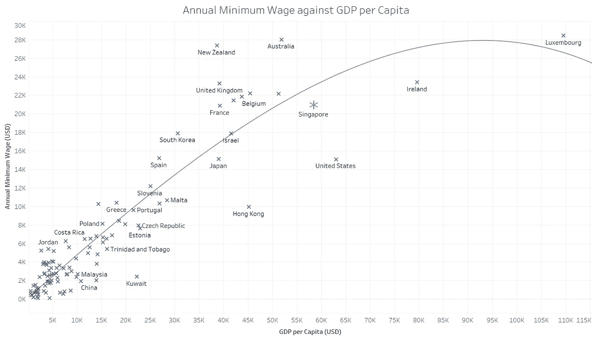
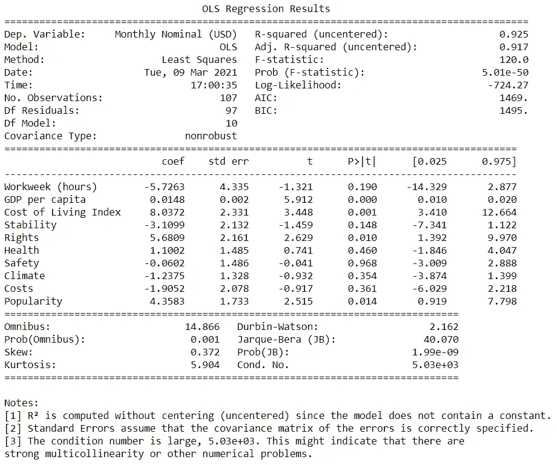
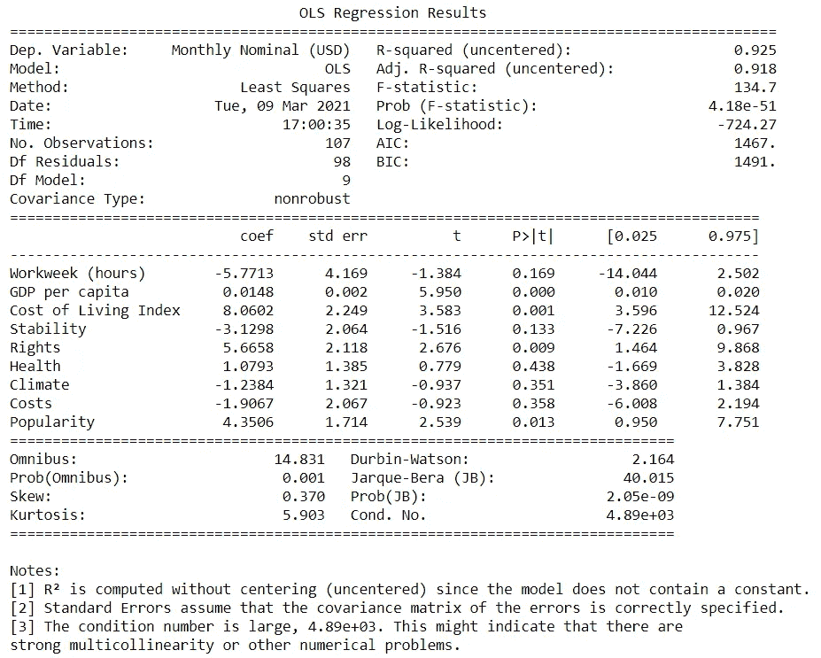
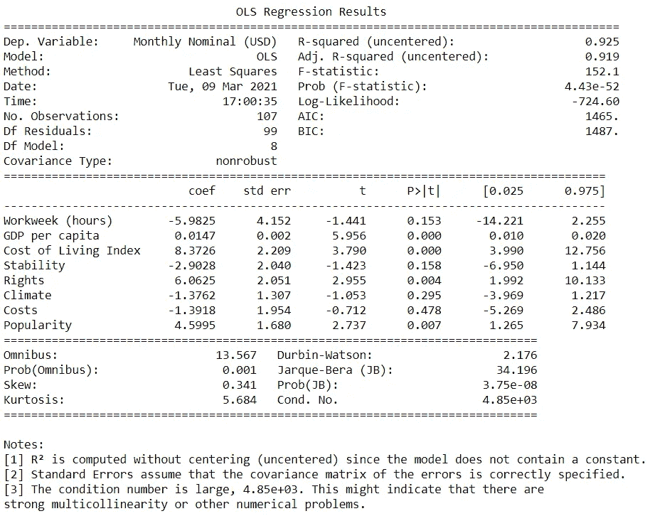
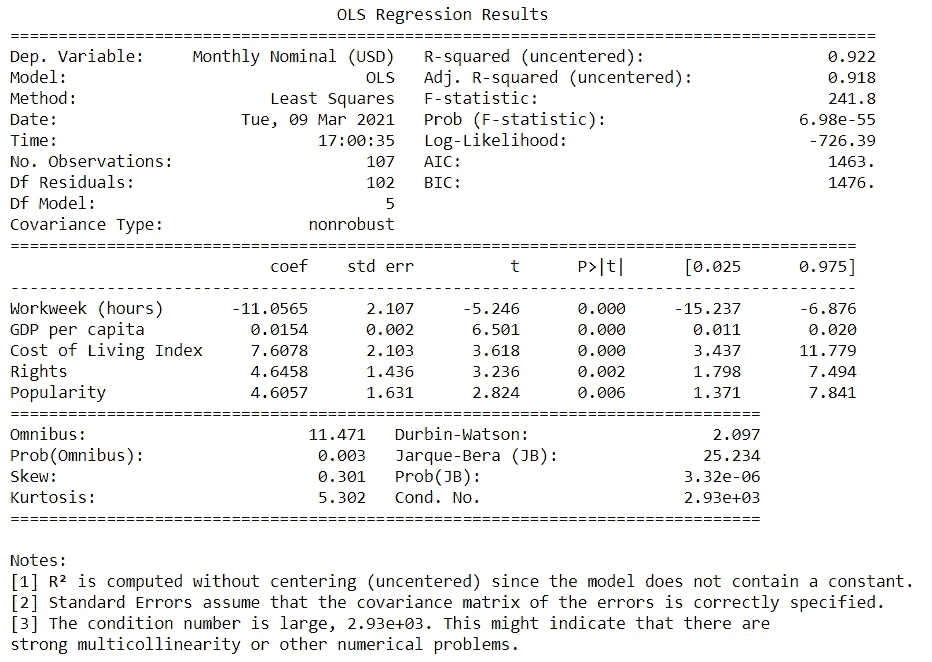
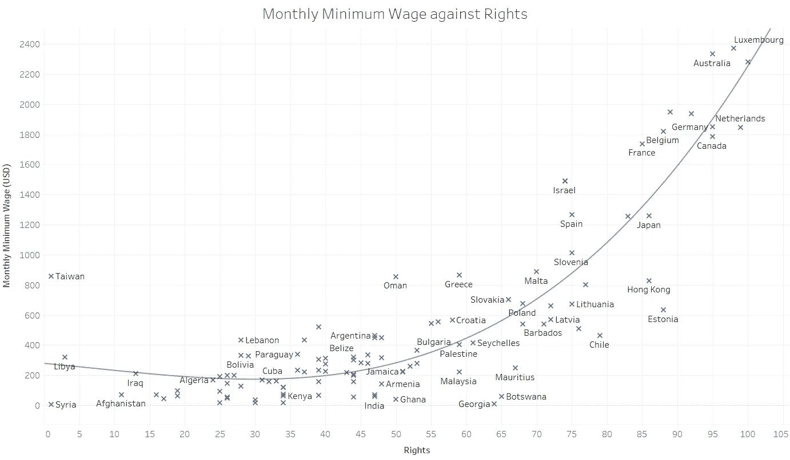
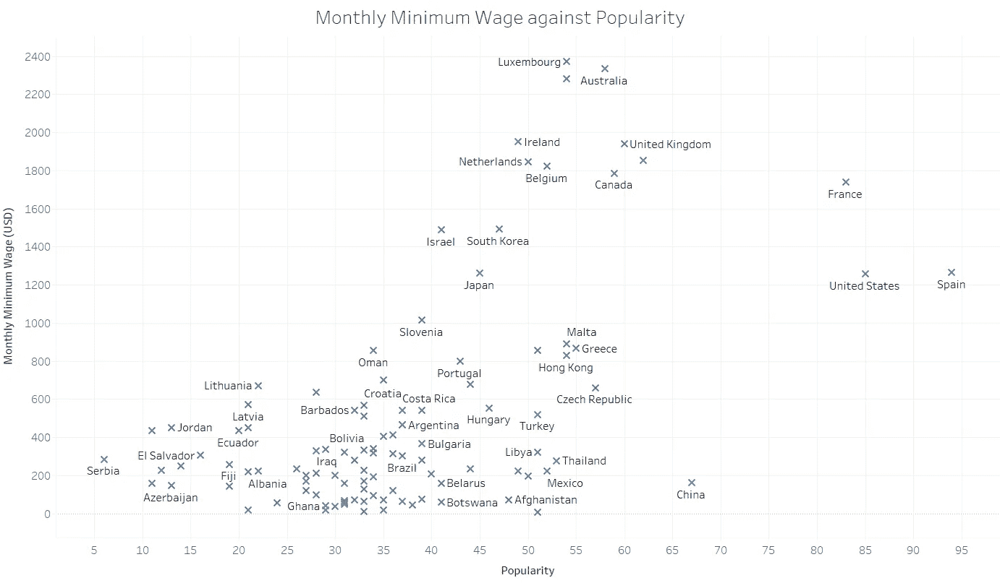

# Python 中的逐步回归教程

> 原文：<https://towardsdatascience.com/stepwise-regression-tutorial-in-python-ebf7c782c922?source=collection_archive---------2----------------------->

## 使用逐步回归发现数据中的意义


弗兰基·查马基在 [Unsplash](/s/photos/data-meaning?utm_source=unsplash&utm_medium=referral&utm_content=creditCopyText) 上拍摄的照片

你如何在数据中找到意义？在我们的迷你项目中，我和我的朋友 [@ErikaSM](https://erika-s-medina.medium.com/) 试图预测新加坡的最低工资(如果我们有最低工资的话)，并在一篇文章中记录了这个过程。如果你还没有读过，一定要看一看。

从那以后，我们收到了对我们的流程的评论和建议，以便更深入地了解我们的信息。因此，这篇后续文章概述了两个主要目标:发现数据中的意义，以及学习如何进行逐步回归。

# **上下文**

在上一篇文章中，我们讨论了关于新加坡最低工资的话题是如何频繁地成为争论的热点。这是因为新加坡采用累进工资模式，因此没有最低工资。

新加坡政府的官方立场是，有竞争力的薪酬结构将激励劳动力努力工作，这与新加坡文化中根深蒂固的精英管理价值观是一致的。无论支持或反对新加坡最低工资的观点如何，穷人都在努力购买必需品，照顾自己和家人。

我们采取了一种中立的立场，承认双方论点的有效性，而是使用不同国家的某些指标对新加坡最低工资的预测进行了比较。预测的最低工资还与某些工作的累进工资模型(PWM)中的工资下限进行了对比，以引发一些关于最贫困者是否赚得足够多的讨论。

# **方法论**

我们使用来自维基百科和世界数据的数据来收集关于最低工资、生活成本和生活质量的数据。生活质量数据集包括几个类别的分数:稳定性、权利、健康、安全、气候、成本和受欢迎程度。

所有指标和类别的分数都被输入一个线性回归模型，然后利用新加坡的统计数据作为独立变量来预测最低工资。这个线性模型是使用 sklearn 在 Python 上编码的，关于编码的更多细节可以在我们之前的文章中查看。然而，我也将在本文中简要概述建模和预测过程。

新加坡的预计年最低工资为 20，927.50 美元。下图中可以看到一个简单的对比。



新加坡的年最低工资约为 20，000 美元(图片来自作者)

我们的教授鼓励我们使用逐步回归来更好地理解我们的变量。从这个迭代中，我们结合了逐步回归来帮助我们降维，不仅产生一个更简单和更有效的模型，而且从我们的数据中获得洞察力。

# **逐步回归**

那么到底什么是逐步回归呢？在任何一种现象中，都会有某些因素在决定一个结果中发挥更大的作用。简单来说，逐步回归是一个帮助确定哪些因素重要，哪些因素不重要的过程。某些变量具有相当高的 p 值，对我们预测的准确性没有有意义的贡献。在此基础上，只保留重要的因素，以确保线性模型根据有助于产生最准确结果的因素进行预测。

在这篇文章中，我将概述逐步回归的使用，它使用向后消除的方法。这是最初包含所有变量的地方，在每一步中，最不具统计意义的变量被丢弃。换句话说，最‘没用’的变量被踢了。重复这一过程，直到剩下的所有变量都具有统计显著性。

# **编码位**

在继续分析回归模型之前，我们首先修改数据以反映月工资而不是年工资。这是因为我们认识到大多数人倾向于以月为单位而不是以全年为单位来看待他们的工资。以这种方式表达我们的数据可以让我们的受众更好地理解我们的数据。然而，还值得注意的是，这种规模的变化不会影响建模过程或结果。

查看我们之前的模型，我们生成了统计数据来测试模型的准确性。但在此之前，我们首先必须指定相关的 X 和 Y 列，并从数据文件中获取该信息。

```
## getting column names
x_columns = ["Workweek (hours)", "GDP per capita", "Cost of Living Index", "Stability", "Rights", "Health", "Safety", "Climate", "Costs", "Popularity"]
y = data["Monthly Nominal (USD)"]
```

接下来，为了收集模型统计数据，我们必须使用 statmodels.api 库。这里创建了一个函数，它从一个列表中获取感兴趣的列，然后用一个普通的最小二乘线性模型来拟合它。然后可以非常容易地打印出统计数据摘要。

```
## creating function to get model statistics
import numpy as np
import statsmodels.api as smdef get_stats():
    x = data[x_columns]
    results = sm.OLS(y, x).fit()
    print(results.summary())get_stats()
```



原始回归统计数据(图片来自作者)

这里我们关注的是列“P > |t|”。本专栏引用了来自加州大学洛杉矶分校数字研究与教育研究所的一些技术解释，给出了用于检验零假设的双尾 p 值。

> p 值小于α的系数在统计上是显著的。例如，如果您选择 alpha 为 0.05，则 p 值为 0.05 或更小的系数在统计上是显著的(即，您可以拒绝零假设，并说该系数与 0 显著不同)。”

换句话说，我们通常希望删除 p 值大于 0.05 的变量。从上面的初步总结中可以看出，统计学意义最小的变量是“安全性”, p 值为 0.968。因此，我们希望删除“安全”这一变量，如下所示。下面也显示了新的摘要。

```
x_columns.remove("Safety")
get_stats()
```



仅去除“安全”后的回归统计(图片来自作者)

这一次，新的统计意义最小的变量是“健康”。同样，我们也想去掉这个变量。

```
x_columns.remove("Health")
get_stats()
```



去除“安全”和“健康”后的回归统计(图片来自作者)

我们继续这个过程，直到所有的 p 值都低于 0.05。

```
x_columns.remove("Costs")
x_columns.remove("Climate")
x_columns.remove("Stability")
```



最后，我们发现还有 5 个变量，即工作周、人均 GDP、生活成本指数、权利和受欢迎程度。由于每个 p 值都低于 0.05，所有这些变量都被认为具有统计学意义。

我们现在可以根据这组新变量建立一个线性模型。我们也可以用这个来预测新加坡的最低工资。正如所见，预测的月最低工资约为 1774 美元。

```
## creating a linear model and prediction
x = data[x_columns]
linear_model = LinearRegression()
linear_model.fit(x, y)
sg_data = pd.read_csv('testing.csv')
x_test = sg_data[x_columns]
y_pred = linear_model.predict(x_test)
print("Prediction for Singapore is ", y_pred)>> Prediction for Singapore is  [1774.45875071]
```

# **在数据中寻找意义**

这是整个过程中最重要的部分。惠普(Hewlett-Packard)前首席执行官卡莉·菲奥莉娜(Carly Fiorina)曾经说过:“我们的目标是将数据转化为信息，将信息转化为洞察力。”这正是我们的目标。

> "我们的目标是将数据转化为信息，将信息转化为洞察力."
> ~卡莉·菲奥莉娜，惠普前首席执行官

仅从变量来看，我们就可以很容易地预测出哪些变量具有统计学意义。例如，人均国内生产总值和生活费用指数在逻辑上是一个国家最低工资的良好指标。甚至一周工作的小时数作为一个指标也是有意义的。

然而，我们注意到“权利”仍然包含在线性模型中。这促使我们首先来看看权利和最低工资之间的关系。在绘制图表时，我们发现了这种美学上令人愉悦的关系。



月最低工资侵犯权利(图片由作者提供)

最初，我们不会认为权利与最低工资相关，因为 GDP 和生活成本这两个更明显的候选因素在最低工资水平中的贡献更大。这让我们重新考虑我们如何理解最低工资，并迫使我们深入研究。

从世界数据来看，“权利”涉及公民权利，主要围绕人民参政和腐败。我们发现民权指数包括民众的民主参与和打击腐败的措施。该指数还包括公众对政府的看法，包括来自 Transparency.org 的数据。

> “此外，其他因素包括人民的民主参与和(不太强调)反腐败措施。为了不仅评估反腐败措施，而且评估民众对反腐败的看法，还考虑了基于 Transparency.org 的腐败指数。”

这迫使我们考虑民权和最低工资之间的相互关系。了解了这些信息后，我们做了进一步的研究，找到了几篇可能解释这种相关性的文章。

美国民权利益集团——民权和人权领袖会议发布了一份报告，阐述了为什么最低工资是一个民权和人权问题，以及加强最低工资政策的必要性，以减少不平等，确保在低收入工作中挣扎的个人和家庭获得公平的报酬。因此，这是有道理的，因为一个民主参与程度更高的国家也可能对最低工资表示担忧，迫使人们展开讨论，并最终随着时间的推移提高最低工资。

我们研究的下一个变量是受欢迎程度。我们首先研究了如何从世界数据中衡量这一点。

> “因此，总体移民率和外国游客数量被视为一个国家受欢迎程度的指标。较低的评级也被用来比较各自国家的难民状况。更多的外国难民导致更高的受欢迎程度，而大量逃离的难民降低了受欢迎程度。”



月最低工资对比人气(图片由作者提供)

乍一看，似乎没有任何关联。然而，如果我们将中国、法国、美国和西班牙视为异常值，大多数数据点似乎更符合指数图。这引发了两个问题。首先，为什么受欢迎程度和最低工资有关系？其次，为什么这四个国家是离群值？

老实说，这难倒了我们。我们根本看不出受欢迎程度与最低工资有什么关联。然而，有一点很重要:在预测一个国家的最低工资时，这种受欢迎程度在某种程度上具有统计学意义。虽然我们可能不是发现这种关系的人，但这让我们深入了解了我们原本意义不大的数据。

# **结论**

引用卡莉·菲奥莉娜的话很重要，“我们的目标是将数据转化为信息，将信息转化为洞察力。”作为人类，我们需要工具和方法将数据转化为信息，需要经验/知识将信息转化为洞察力。

我们首先使用 Python 作为工具，执行逐步回归来理解原始数据。这让我们不仅发现了我们预测到的信息，还发现了我们最初没有考虑到的新信息。很容易猜测工作周、GDP 和生活成本将是最低工资的有力指标。然而，只有通过回归，我们才发现民权和受欢迎程度也具有统计意义。

在这种情况下，我们发现网上有研究可以解释这些信息。这导致了新的见解，即最低工资实际上被视为一项人权，民主参与的增加可能会导致更多关于最低工资的讨论，从而提高最低工资。

然而，并不总是能够那么容易地发现数据中的意义。不幸的是，作为大学生，我们可能不是为我们的信息提供可能解释的最佳人选。这可以从我们试图解释受欢迎程度和最低工资之间的关系中看出。然而，我们有能力获取这些信息并将其传播到世界各地，让它成为一个开放的问题进行讨论。

这就是我们如何利用数据为世界增加价值。

*   与 [Erika Medina](https://erika-s-medina.medium.com/) 合作撰写