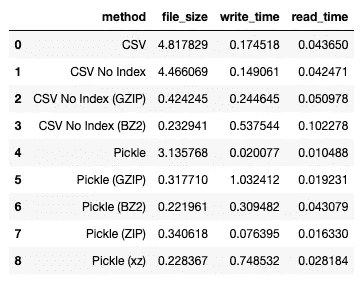

# 还在用 CSV 格式保存数据吗？尝试这些其他选项

> 原文：<https://towardsdatascience.com/still-saving-your-data-in-csv-try-these-other-options-9abe8b83db3a?source=collection_archive---------0----------------------->

## 了解如何以不同的格式(CSV、压缩、Pickle 和 Parquet)保存数据，以节省存储空间并减少读/写时间和资金


照片由[安德烈斯·卡纳维西](https://unsplash.com/@andrescanavesi?utm_source=medium&utm_medium=referral)在 [Unsplash](https://unsplash.com?utm_source=medium&utm_medium=referral) 上拍摄

保存数据帧最流行的文件格式之一是 CSV(逗号分隔值)。CSV 是众所周知的，并在各种平台上得到广泛支持。然而，尽管 CSV 无处不在，但当您处理大量数据时，它并不是一种合适的格式——其大小会变得非常大，并且从中提取数据会变得非常慢。

在本文中，我将向您介绍将数据帧保存到存储时的一些选项。特别是，我将讨论将您的数据帧保存为:

*   CSV 文件
*   应用压缩的 CSV 文件
*   使用 pickle 模块的二进制文件
*   使用 pickle 模块并应用了压缩的二进制文件
*   HDF 文件
*   镶木地板

# 我们的样本数据集

我在本文中使用的样本数据集名为 **travel insurance.csv** (来源:[https://www.kaggle.com/mhdzahier/travel-insurance](https://www.kaggle.com/mhdzahier/travel-insurance)**)**。它有 63，326 行和 11 列，混合了 object、int64 和 float64 列。让我们用熊猫作为数据帧来加载它:

```
**import pandas as pd
import os****filename = 'travel insurance'
df = pd.read_csv(filename + '.csv')****display(df)
display(df.shape)   # (63326, 11)
display(df.dtypes)** # Agency                   object
# Agency Type              object
# Distribution Channel     object
# Product Name             object
# Claim                    object
# Duration                  int64
# Destination              object
# Net Sales               float64
# Commision (in value)    float64
# Gender                   object
# Age                       int64
# dtype: object
```


为了记录每种数据格式的文件大小、写入和读取时间，我将创建一个包含四列的数据帧:

```
df_results = pd.DataFrame(columns=
    ['method', 'file_size', 'write_time', 'read_time'])
display(df_results)
```


我还将创建一个 helper 函数，向包含每个实验细节的数据帧追加一行:

```
def add_result(df_results, method, file_size, 
               write_time, read_time):
    row = {
        'method': method,
        'file_size': file_size, 
        'write_time': write_time, 
        'read_time':  read_time   
      }
    return df_results.append(pd.Series(row), ignore_index = True)
```

# 另存为 CSV 文件

我想尝试的第一种方法是将数据帧保存为 CSV 文件，然后读回它。以下代码块执行以下操作:

*   将数据帧保存为 CSV 文件
*   获取物理 CSV 文件的大小
*   再次将 CSV 文件作为数据帧加载
*   将使用的方法、文件的大小、将数据帧写入文件并再次加载回数据帧所需的平均时间写入`df_results`数据帧

```
#---saving---
result_save = %timeit -n5 -r5 -o **df.to_csv**(filename + '_csv.csv')#---get the size of file---
filesize = os.path.getsize(filename + '_csv.csv') / 1024**2#---load---
result_read = %timeit -n5 -r5 -o **pd.read_csv**(filename + '_csv.csv')#---save the result to the dataframe---
df_results = add_result(df_results,
                        'CSV',
                        filesize, 
                        result_save.average, 
                        result_read.average)
df_results
```

特别是，我使用了`**%timeit**`这个神奇的命令来记录系统执行一条语句所花费的时间。例如，下面一行记录了系统将数据帧保存到 CSV 文件所花费的时间:

```
**%timeit -n5 -r5 -o** df.to_csv(filename + '_csv.csv')
```

`%timeit`魔法命令有以下选项:

*   `**-n5**`选项意味着您希望在一个循环中运行该语句 5 次。
*   `**-r5**`表示循环运行 5 次，取最佳结果。这允许我们获得读写文件的平均操作时间。
*   **-o** 选项表示您希望返回计时结果，而不是将其打印出来。在这种情况下，结果被传递给写部分的`result_save`变量和读部分的`result_read`。
*   使用从`%timeit`命令返回的结果，您可以使用`average`属性获得执行写和读操作所需的平均时间。

有了写入和读取的结果，现在可以调用`add_result()`函数将结果添加到 dataframe 中。对于这一部分，我得到了以下结果:

```
165 ms ± 7.11 ms per loop (mean ± std. dev. of 5 runs, 5 loops each)
50.4 ms ± 9.32 ms per loop (mean ± std. dev. of 5 runs, 5 loops each)
```

`df_result`数据帧看起来像这样:


文件大小以兆字节(MB)为单位，时间以秒为单位。

## 保存不带索引的 CSV

默认情况下，将数据帧保存为 CSV 文件时，会保存其索引。然而，大多数时候没有必要将索引(它只是一系列流水号)保存到 CSV 文件中。所以这一次我们将省略它:

```
#---saving---
result_save = %timeit -n5 -r5 -o df.to_csv(filename + '_csv.csv', \
                                           **index=False**)#---get the size of file---
filesize = os.path.getsize(filename + '_csv.csv') / 1024**2#---load---
result_read = %timeit -n5 -r5 -o pd.read_csv(filename + '_csv.csv')#---save the result to the dataframe---
df_results = add_result(df_results,
                        'CSV No Index',
                        filesize, 
                        result_save.average, 
                        result_read.average)df_results
```

结果如下:


您可以看到，文件大小略有减小，写入和读取时间都缩短了。

# 对 CSV 使用压缩

当你保存数据帧到 CSV 文件时，Pandas 支持压缩。具体来说，Pandas 支持以下压缩算法:

*   gzip
*   bz2
*   活力
*   xz

让我们看看压缩将如何有助于文件大小以及写入和读取时间。

## GZIP

要在将数据帧保存为 CSV 格式时使用压缩，请将**压缩**参数设置为您想要使用的算法。同样，当您加载压缩的 CSV 文件时，将**压缩**参数设置为用于压缩文件的算法:

```
#---saving---
result_save = %timeit -n5 -r5 -o df.to_csv(filename + '.gzip', \
                                           index=False, \
                                           **compression='gzip'**)#---get the size of file---
filesize = os.path.getsize(filename + '.gzip') / 1024**2#---load---
result_read = %timeit -n5 -r5 -o pd.read_csv(filename + '.gzip', \
                                             **compression='gzip'**)#---save the result to the dataframe---
df_results = add_result(df_results,
                        'CSV No Index (GZIP)',
                        filesize, 
                        result_save.average, 
                        result_read.average)df_results
```

结果如下:


文件大小大幅减少。写入时间稍长，但读取时间与解压缩版本相当。

> 有关 GZIP 的更多信息，请参考:[https://en.wikipedia.org/wiki/Gzip](https://en.wikipedia.org/wiki/Gzip)

## BZ2

另一种流行的文件压缩算法被称为 BZ2。以下代码片段显示了如何使用 BZ2 压缩数据帧:

```
#---saving---
result_save = %timeit -n5 -r5 -o df.to_csv(filename + '.bz2', \
                                           index=False, \
                                           **compression='bz2'**)#---get the size of file---
filesize = os.path.getsize(filename + '.bz2') / 1024**2#---load---
result_read = %timeit -n5 -r5 -o pd.read_csv(filename + '.bz2', \
                                             **compression='bz2'**)#---save the result to the dataframe---
df_results = add_result(df_results,
                        'CSV No Index (BZ2)',
                        filesize, 
                        result_save.average, 
                        result_read.average)df_results
```

我得到了以下结果:


您可以观察到，与 GZIP 相比，BZ2 的压缩率更高，但是相应的读写速度更慢。

> 有关 BZ2 的更多信息，请参考:[https://en.wikipedia.org/wiki/Bzip2](https://en.wikipedia.org/wiki/Bzip2)

# 泡菜

CSV 文件是纯文本文件(压缩文件除外)，这使得它们无处不在，在所有平台和所有主流软件上都受支持。然而，CSV 的主要缺点是它的大小。您可以将数据帧保存为二进制文件，而不是将数据帧保存为纯文本文件。

在 Python 中，可以使用 **pickle** 模块将数据(包括数据帧)作为二进制文件持久化。 **pickle** 模块*将 Python 中的对象序列化*为二进制文件，然后*将二进制文件反序列化*为 Python 中的对象。

让我们尝试使用 **pickle** 保存我们的数据帧:

```
#---saving---
result_save = %timeit -n5 -r5 -o **df.to_pickle(filename + '.pkl')**#---get the size of file---
filesize = os.path.getsize(filename + '.pkl') / 1024**2#---load---
result_read = %timeit -n5 -r5 -o **pd.read_pickle(filename + '.pkl')**#---save the result to the dataframe---
df_results = add_result(df_results,
                        'Pickle',
                        filesize, 
                        result_save.average, 
                        result_read.average)df_results
```

我得到了以下结果:


文件大小小于 CSV 文件，但大于对 CSV 文件使用压缩时的大小。但是，请注意，到目前为止，写入和读取时间是最快的。

## 压缩使用泡菜

像另存为 CSV 一样，也可以用 pickle 进行压缩。首先，让我们用 **GZIP** :

```
#---saving---
result_save = %timeit -n5 -r5 -o **df.to_pickle(filename + '.pkl', \** compression='gzip'**)**#---get the size of file---
filesize = os.path.getsize(filename + '.pkl') / 1024**2#---load---
result_read = %timeit -n5 -r5 -o **pd.read_pickle(filename + '.pkl', \
                                                compression='gzip')**#---save the result to the dataframe---
df_results = add_result(df_results,
                        'Pickle (GZIP)',
                        filesize, 
                        result_save.average, 
                        result_read.average)df_results
```

我得到了以下结果:


然后，我们用 **BZ2** :

```
#---saving---
result_save = %timeit -n5 -r5 -o **df.to_pickle(filename + '.pkl', \
                                              compression='bz2')**#---get the size of file---
filesize = os.path.getsize(filename + '.pkl') / 1024**2#---load---
result_read = %timeit -n5 -r5 -o **pd.read_pickle(filename + '.pkl', \
                                                compression='bz2')**#---save the result to the dataframe---
df_results = add_result(df_results,
                        'Pickle (BZ2)',
                        filesize, 
                        result_save.average, 
                        result_read.average)df_results
```

我得到了以下结果:


接下来，我们使用 **zip** :

```
#---saving---
result_save = %timeit -n5 -r5 -o **df.to_pickle(filename + '.pkl', \
                                              compression='zip')**#---get the size of file---
filesize = os.path.getsize(filename + '.pkl') / 1024**2#---load---
result_read = %timeit -n5 -r5 -o **pd.read_pickle(filename + '.pkl', \
                                                compression='zip')**#---save the result to the dataframe---
df_results = add_result(df_results,
                        'Pickle (ZIP)',
                        filesize, 
                        result_save.average, 
                        result_read.average)df_results
```

我得到了以下结果:


> 关于 zip 的更多信息，请参考:[https://en . Wikipedia . org/wiki/ZIP _(file _ format)](https://en.wikipedia.org/wiki/ZIP_(file_format))

最后，我们使用 **xz** :

```
#---saving---
result_save = %timeit -n5 -r5 -o df.to_pickle(filename + '.pkl', \
                                              compression='xz')#---get the size of file---
filesize = os.path.getsize(filename + '.pkl') / 1024**2#---load---
result_read = %timeit -n5 -r5 -o pd.read_pickle(filename + '.pkl', \
                                                compression='xz')#---save the result to the dataframe---
df_results = add_result(df_results,
                        'Pickle (xz)',
                        filesize, 
                        result_save.average, 
                        result_read.average)df_results
```

我得到了以下结果:



> 关于 xz 的更多信息，请参考:[https://en.wikipedia.org/wiki/XZ_Utils](https://en.wikipedia.org/wiki/XZ_Utils)

从结果中可以看出，在 pickle 中使用压缩大大减小了文件的大小，而与不使用压缩相比，写入和读取时间略有增加。

# HDF

另一种可以用来保存数据帧的文件格式是 **HDF** — **分层数据格式**。HDF 是一种开源文件格式，支持大型、复杂、异构的数据。HDF 使用类似于文件目录的结构来组织文件中的数据。

> 可以把 HDF 想象成一种文件结构，它允许你在一个物理文件中存储不同的数据帧。

以下代码片段将数据帧保存为 HDF 文件:

```
#---saving---
result_save = %timeit -n5 -r5 -o **df.to_hdf(filename + '.h5', \
                                           key='key', \
                                           mode='w')**#---get the size of file---
filesize = os.path.getsize(filename + '.h5') / 1024**2#---load---
result_read = %timeit -n5 -r5 -o **pd.read_hdf(filename + '.h5', \
                                             key='key', \
                                             mode='r')**#---save the result to the dataframe---
df_results = add_result(df_results,
                        'HDF',
                        filesize, 
                        result_save.average, 
                        result_read.average)df_results
```

我得到了以下结果:


正如您所观察到的，另存为 HDF 并没有真正减少文件大小，即使写时间比原始 CSV 好。

# 镶木地板

我要讨论的最后一个文件格式是 **Parquet** 。那么什么是拼花，或者更准确的说， ***阿帕奇拼花*** ？

Apache Parquet 是一种文件格式，旨在支持复杂数据的快速数据处理。它是 Apache Hadoop 许可下的开源文件格式，与大多数 Hadoop 处理框架兼容。Parquet 是自描述的——包括模式和结构的元数据嵌入在每个文件中。

更重要的是，Parquet 将数据存储在*列*中，而不是*行*中。

## Parquet 如何存储您的数据

考虑以下具有三列的数据帧:


作者图片

当您将数据帧保存为 CSV 文件时，它使用*基于行的存储*。将 CSV 文件加载到数据帧中时，每行一次加载一行，每行包含三种不同的数据类型:


作者图片

另一方面，Parquet 使用基于列的存储方式来存储数据。每列数据都被组织为一个特定数据类型的列:


作者图片

简而言之，当您在基于列的存储中组织数据时，您的文件将更加轻量级，因为所有相似的数据类型都被分组在一起，并且您可以对每一列应用压缩。更重要的是，使用基于列的存储使得提取特定列变得非常有效，这是数据分析项目中经常要做的事情。

要使用拼花地板，您需要安装**快速拼花地板**模块:

```
**!pip install fastparquet**
```

以下代码片段将 dataframe 保存到一个 parquet 文件中，然后将其加载回来:

```
# !parq Building_Permits.parquet --head 10#---saving---
result_save = %timeit -n5 -r5 -o **df.to_parquet(filename + \
                                               '.parquet', \
                                               engine='fastparquet')**#---get the size of file---
filesize = os.path.getsize(filename + '.parquet') / 1024**2#---load---
result_read = %timeit -n5 -r5 -o **pd.read_parquet(filename + \
                                                 '.parquet')**#---save the result to the dataframe---
df_results = add_result(df_results,
                        'Parquet',
                        filesize, 
                        result_save.average, 
                        result_read.average)df_results
```

我得到以下结果:


从结果中，您可以看到文件大小显著减小(虽然没有在 CSV 或 pickle 上使用压缩那么大，但这种减小仍然是显著的)，并且写入和读取时间是最快的。

那么拼花地板为什么有用，为什么要用呢？为什么应该使用拼花地板而不是 CSV 存储数据，有几个令人信服的理由:

*   云服务(如 AWS 和谷歌)根据你的数据大小收费。拼花文件比 CSV 文件小得多，这意味着您为云存储支付的费用更少。
*   云服务也根据每次查询扫描的数据收费。在上面的结果中，你可以看到读写时间比 CSV 文件快。更短的扫描时间意味着更低的云电荷。

为了查看 parquet 在加载特定列时与 CSV 文件相比的性能，让我们尝试以下实验，我们将从三个 CSV 文件(一个未压缩，一个用 BZ2 压缩，一个用 GZIP 压缩)和一个 Parquet 文件中加载两列(**代理类型**和**产品名称**):

```
%timeit -n5 -r5 -o **pd.read_csv(filename + '_csv.csv', \
                             usecols=['Agency Type','Product Name'])**%timeit -n5 -r5 -o **pd.read_csv(filename + '.bz2', \
                           usecols=['Agency Type','Product Name'], \
                           compression='bz2')**%timeit -n5 -r5 -o **pd.read_csv(filename + '.gzip', \
                           usecols=['Agency Type','Product Name'], \
                           compression='gzip')**%timeit -n5 -r5 -o **pd.read_parquet(filename + '.parquet', \
                           columns=['Agency Type','Product Name'])**
```

上述语句返回以下结果:

```
27.4 ms ± 6.23 ms per loop (mean ± std. dev. of 5 runs, 5 loops each)77.4 ms ± 3.26 ms per loop (mean ± std. dev. of 5 runs, 5 loops each)35 ms ± 2.15 ms per loop (mean ± std. dev. of 5 runs, 5 loops each)**4.72 ms ± 1.73 ms per loop (mean ± std. dev. of 5 runs, 5 loops each)**
```

最后的结果(使用拼花地板)轻而易举地击败了其他人。使用 Parquet 检索这两列平均需要 4.72 毫秒，而 CSV 文件需要 27 到 77 毫秒。

# 为每项任务寻找最佳方法

现在我们已经有了各种方法的统计数据，我们可以很容易地找出哪种方法对于每项任务来说是最理想的。

如果你想最小化读取时间，使用 **pickle** 保存是最好的解决方案:

```
df_results.sort_values(by='read_time')
```


注意，就读取时间而言，Parquet 紧随其后。此外，它还大大减少了文件大小。如前一节所述，在云服务上存储数据时，最大限度地减少读取时间和存储对于降低成本至关重要。

如果您想最大限度地减少写入时间，似乎使用 pickle 也是保存数据帧的最佳方式:

```
df_results.sort_values(by='write_time')
```


如果您想要最小化数据帧的文件大小，请将 pickle 与 bz2 压缩算法结合使用:

```
df_results.sort_values(by='file_size')
```


# 摘要

本文讨论了一些可以用来保存数据帧的文件格式。这绝不是一个详尽的测试，但它让您对每种文件格式的性能有一个总体的感觉。值得注意的是，我在本文中获得的结果是特定于我的数据集的。不同的数据集可能会有不同的结果，这取决于您拥有的数据类型。如果数据集有很多对象(文本)列，压缩会非常有效。重要的是，使用本文中描述的各种方法测试数据集，并得出自己的结论。特别是，比较最常执行的操作的统计数据，并决定哪种方法更适合您的数据。

[](https://weimenglee.medium.com/membership) [## 加入媒介与我的介绍链接-李伟孟

### 作为一个媒体会员，你的会员费的一部分会给你阅读的作家，你可以完全接触到每一个故事…

weimenglee.medium.com](https://weimenglee.medium.com/membership)