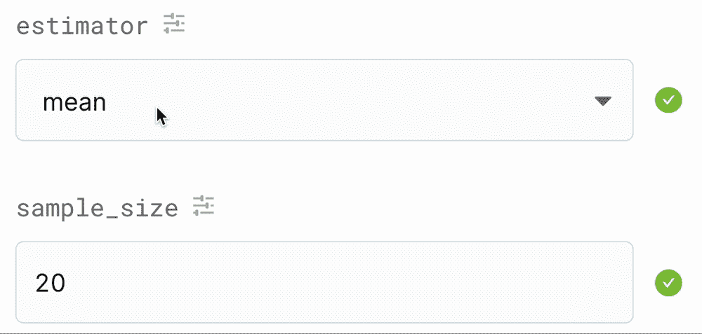

# 还在用平均值？

> 原文：<https://towardsdatascience.com/still-using-the-average-24e759a78026?source=collection_archive---------29----------------------->

## 不要这么刻薄。

对算术平均值说“不”的描述😉(图片由作者提供)

在社会科学以及许多其他领域中，传统的推断统计学经常用于比较群体和测量关联。不幸的是，基于均值和标准差的方法，如 T-和 F-检验、相关性以及统计学入门教材中的许多其他检验，都不够稳健。实际上，这意味着它们会导致假阳性率的增加和统计能力的缺乏。呸！

在这篇文章中，我将把几种集中趋势的测量方法放在一起，以证明平均值不是一个稳健的估计量。但是不用担心！有很多稳健的估计量(和[假设检验](https://joss.theoj.org/papers/10.21105/joss.02241))可供选择。

我正在使用 [Deepnote](https://deepnote.com/) 进行这一分析，你可以在一个现成的笔记本[这里](http://notebook)找到所有代码，你需要的一切来揭露卑鄙，嗯，如此卑鄙…😉！

# 如何衡量稳健性

评估稳健性的最直接方法之一是比较各种估计量的所谓标准误差(SE)。SE 是对总体中随机样本的估计量变化程度的度量。如果我们的估计量在不同的样本之间变化很大，那么它就有很高的标准误差。另一方面，如果样本之间相似，则标准误差相对较小。我们希望选择一个相对于我们可能做出的另一个选择具有最小可能标准误差的估计量。

在本文中，我们将比较均值、中值、一步估计量和 20%修整均值的 SE。如果你想了解更多关于这些评估者和他们发展的起源，看看这本书。

在我们讨论代码、图表和模拟之前，让我们快速地看一下 SE 是如何推导出来的，这样您就可以看到计算没什么大不了的。

## 估计标准误差的步骤

使用计算机和您选择的编程语言可以很容易地估算出标准误差。以下是测量估计量的标准误差的步骤:

1.  从已知的分布中随机抽取一个大小为 N 的样本
2.  计算您选择的估计值(例如，平均值)
3.  重复第 1 步和第 2 步 *B* 次(假设 *B* =5000，但任何以千为单位的都足够了)
4.  最后，计算得到的 *B* 估计值的标准偏差，瞧，这就是那个估计值的标准误差！

# 设计人口

在[共享笔记本](https://deepnote.com/@allan-campopiano/standarderror-TBgBG4MJQ6yU4NcTa_AH5w)和下面的 GIF 中，你会看到我正在定义一个理论人口的特征。在现实生活中，我们永远不会真正知道被研究人群的形状，但这不是现实生活，这是一个模拟！这很重要，因为产生异常值的分布会影响 SE。我们想知道我们的估计量在各种潜在条件下的 SE 表现如何。

既然我们已经选择了总体形状及其异常值(即污染)的比例，我们可以构建相应的概率分布函数并绘制图表。

污染χ分布的 PDF(我们的理论总体)

# 选择评估者

甜食👌！这将是一个很好的人群样本，以估计 SE。现在，让我们选择一个估计量和样本大小。我们快到了！

如果上面的 GIF，我选择了可信的(或者不那么可信！)表示 *N* 为 20(即本次模拟的样本量)。一旦我做出了选择，我就可以通过运行下面的代码行来开始模拟。如果你已经忘记了模拟所采取的步骤，请参考上面称为估计标准误差的*步骤部分。*

基于所选χ分布的平均值的抽样分布

经过多次随机抽样后，我们最终得到了一组基于给定总体的结果平均值，如上所示。平均值的这种分布被称为平均值的抽样分布。

最后，为了得出平均值的标准差，我们只需取上述抽样分布的标准差。结果是 **~0.64** (基于前面定义的χ分布)。

# 让评估人员面对面

现在，问题是:**与均值相比，其他估计量的表现如何？**记住，我们希望一个估计量相对于我们可能选择的其他估计量具有较低的 SE。

没问题，让笔记本中的代码来完成工作，并将 SE 作为人口形状和估计量的函数绘制成图表，如下所示:

SE、总体形状和估计量(N=12)。缩放/污染值可在笔记本中找到。

如您所见，使用笔记本中定义的参数，有几个外卖结果:

1.  相对于其他估计量，均值在许多情况下的标准差表现不佳
2.  均值在完全正态下表现最好，但差不了多少
3.  许多人都熟悉的中位数，在正常情况下并不像人们想象的那样表现良好
4.  污染分布(具有重尾的分布)会增加估计量的 se(尤其是均值)
5.  20%的修整平均值在各种情况下表现都很好

# 感谢阅读！

关于稳健性的研究已经有半个多世纪了。传统推断假设检验的问题已经被很好地记录下来，替代方法，如基于 20%修整均值的方法[已经被开发出来](https://www.springer.com/gp/book/9781441955241)，并在许多统计软件包中可用。带着它们转一圈，享受更低的误报率和更高的功率💪！

如果你想了解更多，我肯定会推荐兰德的以下书籍。r .威尔科克斯:

[稳健估计和假设检验简介](https://www.sciencedirect.com/book/9780123869838/introduction-to-robust-estimation-and-hypothesis-testing)

[现代统计方法的基础:大幅提高功效和准确性](https://www.springer.com/gp/book/9781441955241)