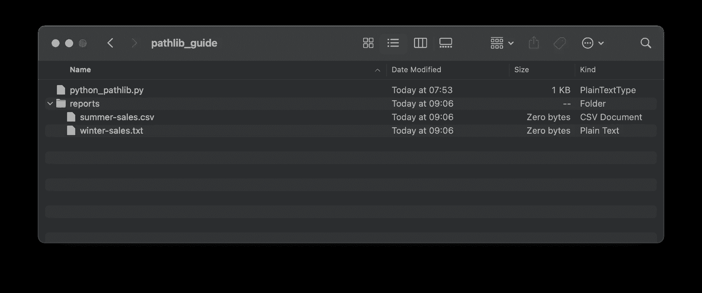

# 还在用 Python 里的 OS 模块？这个选择明显更好

> 原文：<https://towardsdatascience.com/still-using-the-os-module-in-python-this-alternative-is-remarkably-better-7d728ce22fb7?source=collection_archive---------7----------------------->

## Python 的 OS 模块是管理文件和文件夹的噩梦。你应该试试 Pathlib。


照片由 [Pontus Wellgraf](https://unsplash.com/@wellgraf?utm_source=unsplash&utm_medium=referral&utm_content=creditCopyText) 在 [Unsplash](https://unsplash.com/?utm_source=unsplash&utm_medium=referral&utm_content=creditCopyText) 上拍摄

用 Python 的`os`模块管理文件和文件夹简直是一场噩梦。然而，它是每个数据科学工作流程的重要组成部分。保存报告、读取配置文件，凡是你能想到的，都不在话下。

想象一下——你花了几周的时间围绕你的模型构建一个 API，它完美地工作，至少在你的机器上。一旦部署，这是一个完全不同的故事。您的 API 会在意想不到的地方失败，甚至无法运行，因为您硬编码的绝对路径根本不存在。

有一个简单的解决方案。Python 3.4 及更高版本默认提供了`pathlib`库。这是目前为止在你的应用程序中处理文件、文件夹及其连接最人性化的方式。最棒的是——今天你将了解这一切。我并不是说`os`模块毫无用处，只是说`pathlib`在文件和文件夹管理方面更胜一筹。

首先，创建一个新的 Python 文件并导入`pathlib`库:

```
import pathlib
```

你需要在一个`.py`文件中才能使用一些功能。例如，您将无法访问 Jupyter 笔记本中的`__file__`属性。其他一切都应该运行良好。

以下是你今天将学到的内容:

```
**·** [**Get a path to the current Python file**](#bfc5) **·** [**Get a path to the current working directory**](#c12b) **·** [**Get a first parent folder path**](#73ec) **·** [**Get an Nth parent folder path**](#fa39) **·** [**Join paths**](#a452) **·** [**Create a directory if it doesn’t exist**](#a315) **·** [**Create files**](#bcba) **·** [**Check if the path is a folder**](#cf03) **·** [**Check if the path is a file**](#b03e) **·** [**Get the name of the file**](#70e5) **·** [**Get the file extension**](#2501) **·** [**Iterate over files in a folder**](#26f8)
```

# 获取当前 Python 文件的路径

有时，您需要包含 Python 文件名的工作目录的绝对路径。用`pathlib`可以快速获得。记住，这个命令**不会**在 Jupyter 笔记本中工作，因为你不能访问那里的`__file__`属性。如果您是笔记本用户，请跳过这一部分。

总之，下面是如何获得 Python 脚本的绝对路径+文件名:

```
curr_file = pathlib.Path(__file__)
print(curr_file)
```

这是它在我的机器上的样子:

```
>>> /Users/dradecic/Desktop/pathlib_guide/python_pathlib.py
```

*简单，对吧？*对。

如果不需要文件名，有一个更简单的解决方案。

# 获取当前工作目录的路径

这相当于在 Unix shell 中执行`pwd`。它将返回您当前所在目录的路径，或者正在运行的脚本所在的位置。

下面是它的使用方法:

```
cwd = pathlib.Path.cwd()
print(cwd)
```

这是它在我的机器上打印的内容:

```
>>> /Users/dradecic/Desktop/pathlib_guide
```

如你所见，没有文件名。

但是如果你需要访问父文件夹中的文件呢？对我来说，那就是。让我们接下来讨论这个问题。

# 获取第一父文件夹路径

这个很简单。你只需要访问当前工作目录的`parent`属性。这是如何做到的:

```
one_above = pathlib.Path.cwd().parent 
print(one_above)
```

这是它在我的机器上打印的内容:

```
>>> /Users/dradecic/Desktop
```

太好了！但是如果一个父文件夹不够呢？让我们看看你有什么选择。

# 获取第 n 个父文件夹路径

你有选择。第一个是像疯子一样多次呼叫进入`parent`房产。这里有一个例子:

```
mul_above = pathlib.Path.cwd().parent.parent.parent
```

更简单的方法是访问`parents`属性数组并对其进行索引。例如，下面是获取第二个父文件夹路径的方法:

```
mul_above = pathlib.Path.cwd().parents[1]
print(mul_above)
```

结果如下:

```
>>> /Users/dradecic
```

数组索引从 0 开始，所以访问`parents[1]`会进入第二个父文件夹。

你现在有足够的知识开始加入路径。接下来看看如何。

# 加入路径

假设一个包含销售报告的文件夹位于您当前位置的两个目录之上，该报告称为`summer-sales.csv`。有办法用绝对路径访问吗？

当然有。

您已经知道如何访问第 n 个父文件夹路径。您将通过调用`joinpath()`并提供报告名称作为参数来扩展该功能:

```
tgt_path = pathlib.Path.cwd().parents[1]
tgt_fname = 'summer-sales.csv'
print(tgt_path.joinpath(tgt_fname))
```

这是它在我的机器上打印的内容:

```
>>> /Users/dradecic/summer-sales.csv
```

`joinpath()`函数可能是我用的最多的一个。超级有用。

# 如果目录不存在，则创建一个目录

如果每次因为我忘记创建目录而导致生产失败时，我都会得到一美元…这是一个非常常见的错误，而`pathlib`可以让你没有太多麻烦地解决它。

假设您想要将销售报告存储在当前工作目录下的`reports`文件夹中。您必须先创建该文件夹，然后才能在其中存储文件。只有当它不存在时，您才应该创建它。

简而言之——使用`mkdir()`创建一个文件夹，使用`exists()`检查文件夹是否已经存在。

以下是完整的代码片段:

```
tgt_path = pathlib.Path.cwd().joinpath('reports')

if not tgt_path.exists():
    tgt_path.mkdir()
```

执行上述代码将会创建一个`reports`文件夹，您已经猜到了:


图 1 —使用 Pathlib 创建文件夹(作者图片)

干净利落。接下来让我们看看如何在该文件夹中创建文件。

# 创建文件

您通常会通过一些第三方库保存报告。然而，您也可以使用`pathlib`创建任何类型的空文件。

以下是如何在`reports`文件夹中创建 CSV 和 TXT 文件:

```
tgt_path = pathlib.Path.cwd().joinpath('reports')

tgt_path.joinpath('summer-sales.csv').touch(exist_ok=True)
tgt_path.joinpath('winter-sales.txt').touch(exist_ok=True)
```

`exist_ok=True`参数告诉 Python 覆盖一个已经存在的文件。

让我们看看文件是否已创建:



图 2 —使用 Pathlib 创建文件(作者图片)

很管用。

# 检查路径是否是文件夹

如果你想检查一个给定的路径是否是一个文件夹，只需看看`is_dir()`函数。它返回一个布尔值。

以下示例对文件夹和文件都使用了上述函数:

```
tgt_path = pathlib.Path.cwd().joinpath('reports')

print(tgt_path.is_dir())
print(tgt_path.joinpath('summer-sales.csv').is_dir())
```

以下是您应该看到的打印内容:

```
>>> True
>>> False
```

这就是全部了！

# 检查路径是否是文件

与前面的例子类似，您可以使用`is_file()`函数来检查给定的路径是否会产生一个文件。

下面的示例在文件夹和文件中都使用了它:

```
tgt_path = pathlib.Path.cwd().joinpath('reports')

print(tgt_path.is_dir())
print(tgt_path.joinpath('summer-sales.csv').is_dir())
```

正如你所想象的，这次你会得到完全相反的结果:

```
>>> False
>>> True
```

在今天结束之前，让我们探索几个更有用的功能。

# 获取文件的名称

如果需要从绝对路径中提取文件名，可以访问`name`属性。

这里有一个简单但不太有用的例子。它打印我们的`summer-sales.csv`文件的文件名:

```
tgt_path = pathlib.Path.cwd().joinpath('reports/summer-sales.csv')
print(tgt_path.name)
```

下面是您应该在控制台中看到的内容:

```
>>> summer-sales.csv
```

没什么。

# 获取文件扩展名

有时候你需要的只是一个文件扩展名。可能你想对不同的文件类型做不同的处理，对文件名不太在意。`suffix`物业有你罩着。

以下是如何从同一个`summer-sales.csv`文件中获取文件扩展名的方法:

```
tgt_path = pathlib.Path.cwd().joinpath('reports/summer-sales.csv')
print(tgt_path.suffix)
```

下面是您应该看到打印出来的内容:

```
>>> .csv
```

最后，让我们来看看迭代。

# 遍历文件夹中的文件

假设您在单个目录中有一堆 CSV 报告，并且想要逐个处理它们。你只需要`iterdir()`功能。

整个过程再简单不过了:

```
tgt_path = pathlib.Path.cwd().joinpath('reports')

for file in tgt_path.iterdir():
    print(file)
```

这是它在我的机器上打印的内容:

```
>>> /Users/dradecic/Desktop/pathlib_guide/reports/summer-sales.csv
    /Users/dradecic/Desktop/pathlib_guide/reports/winter-sales.txt
```

今天到此为止。你现在已经拥有了一切，再也不会犯愚蠢的生产错误了。

*你对* `*pathlib*` *有什么想法？它是你最喜欢的文件和文件夹管理库，还是你对其他东西感兴趣？请在下面的评论区告诉我。*

*喜欢这篇文章吗？成为* [*中等会员*](https://medium.com/@radecicdario/membership) *继续无限制学习。如果你使用下面的链接，我会收到你的一部分会员费，不需要你额外付费。*

<https://medium.com/@radecicdario/membership>  

# 保持联系

*   在 [Medium](https://medium.com/@radecicdario) 上关注我，了解更多类似的故事
*   注册我的[简讯](https://mailchi.mp/46a3d2989d9b/bdssubscribe)
*   在 [LinkedIn](https://www.linkedin.com/in/darioradecic/) 上连接