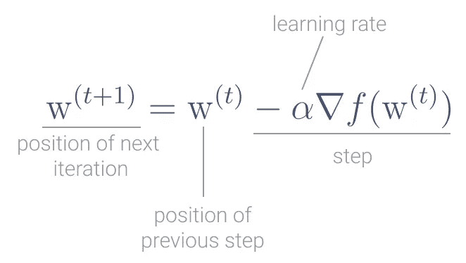

# 现实生活中解释的随机梯度下降

> 原文：<https://towardsdatascience.com/stochastic-gradient-descent-explained-in-real-life-predicting-your-pizzas-cooking-time-b7639d5e6a32?source=collection_archive---------2----------------------->

## 预测你的披萨的烹饪时间


作者图片

**梯度下降**是挑选最适合训练数据的模型的最流行方法之一。通常，这是最小化损失函数的模型，例如，最小化线性回归中的[残差平方和](https://en.wikipedia.org/wiki/Residual_sum_of_squares)。

**随机梯度下降**是一种随机梯度下降自旋。它改进了梯度下降法的局限性，在大规模数据集上表现得更好。这就是为什么它被广泛用作像[深度学习](https://en.wikipedia.org/wiki/Deep_learning)这样的大规模、在线机器学习方法中的优化算法。

但是为了更好地理解随机梯度下降，你需要从梯度下降部分开始。

# 柯西的遗产:梯度下降

**梯度下降**和优化算法的历史并不是从现代机器学习开始的，它可以一直追溯到 19 世纪的法国。

法国数学家、工程师和物理学家奥古斯丁·柯西是复分析和抽象代数领域的先驱。他的影响永远印在数学和物理学中，有几个定理和概念以他的名字命名，如[柯西分布](https://en.wikipedia.org/wiki/Cauchy_distribution)、[柯西定理](https://en.wikipedia.org/wiki/Cauchy%27s_integral_theorem)或[柯西弹性材料](https://en.wikipedia.org/wiki/Cauchy_elastic_material)。


法国数学家奥古斯丁-卢伊斯·柯西([学分](https://en.wikipedia.org/wiki/File:Augustin-Louis_Cauchy_1901.jpg))

在柯西的众多关键贡献中，据说他还发明了[梯度下降](https://en.wikipedia.org/wiki/Gradient_descent)。

柯西的动机是他想不用解微分方程来计算天体的轨道，而是解代表天体运动的代数方程[1]。

# 梯度下降，最陡的下降

**梯度下降**也叫最速下降。该算法背后的思想是找到一种达到函数最小值的有效方法。

这正是你在机器学习模型中想要做的！

模型的损失函数，通常被称为**成本函数**，告诉你模型拟合训练数据的好坏。成本函数越小，模型拟合得越好。

梯度下降的特别之处在于，要找到一个函数的最小值，这个函数本身需要是一个[可微的](https://en.wikipedia.org/wiki/Differentiable_function) [凸函数](https://en.wikipedia.org/wiki/Convex_function)。这些名字听起来很复杂，但是有一种直觉。


*凸函数和非凸函数、可微函数和不可微函数的例子。*

# 凸函数

当你听到凸函数时，想象一个形状像碗的函数。

最简单的凸函数是抛物线。


抛物线的例子。

# 可微分函数

一个[可微的](https://en.wikipedia.org/wiki/Differentiable_function)函数是任何给定的函数，它对它的每个点都有导数。

函数在 *x* 的导数是该函数在点(x，f(x))的图形的斜率。

我们来解开**导数**的概念。

线性函数的**斜率是它上升或下降的速率**，你可以认为它已经描述了那个函数的方向。但是这种直觉只对线性函数有效。

对于非线性函数，不同点的斜率可能不同。要找到非线性函数在特定点 *p* 的斜率，你需要找到 **切线在 *p*** 点的斜率**。**

> 函数在点 *p* 的切线是最接近该点函数的直线。

正切是一个近似值，因此，寻找特定点的斜率正切，就像目测该点的函数斜率[2]。


点 *p* (x，f(x))处的切线示例。

为了增加切线斜率的精确度，你需要找到点 *p.* 处割线的**斜率**

> 割线是逼近切线的一种更精确的方法。

割线仍然是一个近似值，但它更精确，因为它使用了两个点，切点和第二个点。


割线的斜率。

当选择的第二个点越接近切点时，近似效果就越好。

因此，为了找到函数 *f* 在切点 *p* = (x，f(x))处的*精确斜率，当 x 的变化极限趋于零时，你就找到了**割线。***


如果极限存在，那就是函数 f 在点(x，f(x)) 的**导数。**


函数 *f* 在点 *p* 的导数。

但是你可能想知道，所有这些和梯度下降有什么关系？

# 到底什么是梯度？

函数的**梯度是组织成向量【3】的所有偏导数的集合，用一个倒三角形表示，称为 [nabla](https://en.wikipedia.org/wiki/Nabla_symbol) 。**

在机器学习模型中，您可以将梯度视为偏导数的集合，每个偏导数都与模型的一个特征相关。


**函数的梯度总是指向函数中增加最大的方向**。如果你的函数是一座山，梯度总是想要到达顶峰。

要了解梯度如何总是朝着最大增加的方向发展，您可以用 Python 编写一个简单的测试。

定义一个二次函数，然后计算几次梯度。

```
def gradient_loop(runs=3):
    *""" Repeatedly computes the gradient of a function
        Computes the gradient given the starting points and then uses the result of the gradient to feed the next iteration, with new points.
        Prints out the result of the function at each iteration
        :param: runs: number of iterations to compute
    """* # starting points
    x = np.array([1, 2, 3])

    # quadratic function, a parabola
    y = x**2

    for run in range(0, runs):
        print("Iter " + str(run) + ": Y=" + str(y)) # compute first derivative
        x = np.gradient(y, 1) # update the function output
        y = x ** 2 gradient_loop()
```

在这种情况下，函数 *gradient_loop* 取一条抛物线 *y = x，*和一些由 *x* 表示的点。然后，它计算函数在这些点上的梯度，并将结果作为下一次迭代的点集。

由于梯度*总是想要到达山的顶峰*，你可以看到函数值在每次迭代中增加。


梯度环路测试的输出。

如果你正在寻找一个函数的最大值，这将是完美的，但是在梯度下降中你想要找到最小值，你想要到达山的*底部。*

所以，在梯度下降中，你需要让梯度往反方向走[4]。

# 梯度下降算法

在非常高的层次上，或者在伪代码中，梯度下降遵循以下步骤:

1.  在函数中选择一个随机点 *w* ，这是起点
2.  当梯度没有收敛时:

2a。计算在 *w* 处的负梯度，梯度向相反方向。

2b。用 2a 的结果更新点 *w* ，并返回步骤 1。

3.成功，你已经找到了最小值。


梯度下降沿函数向下爬升，直到达到绝对最小值。

**1。在功能**中选择一个随机点

在初始步骤中，你只需要在函数中选取一个随机点，用行向量 *w* 表示。


**2。而梯度还没有收敛**

这是算法的迭代部分，想法是继续下去，直到你达到最小值。

但是你不会知道什么时候停下来。你运行这个算法的全部原因是为了找到最小值。

为了减轻这种情况，您设置了一个**收敛阈值**。

如果与前一次迭代相比，点 *w* 的新梯度变化没有超过您定义的收敛阈值，则算法已经收敛。你宣布你已经找到了这个函数的最小值。

因此，虽然梯度没有收敛，但在每次迭代中，你会收敛

1.  **计算 *w* 处的负梯度。**
2.  **用 2a 的结果更新点 *w* ，并返回步骤 1。**

从数学上来说，在每次迭代中，你运行一个**更新规则**，在这里你定义你要下降的下一个点，一个在函数中*更靠下的点。*



*步骤 t+1 的梯度下降更新规则。*

这就是为什么函数是凸的至关重要。如果函数不是凸的，你可能认为你已经找到了绝对最小值，但是你实际上是在一个局部最小值。


梯度下降出错的例子。在非凸函数中，梯度下降可能会找到*局部最小值*而不是函数的绝对最小值。

查看更新规则，有当前点 *w* ，梯度，然后有学习率α。

# 这个学习率α是多少？

学习率α是梯度下降在达到全局最小值之前一直采用的步长，它直接影响算法的性能。

## 学习率太大

当学习速度太快时，你就迈出了大步。你可以跨过最小值几次，然后来回几次。在大步长的情况下，梯度下降甚至可能永远不会达到最小值和收敛。

发现 alpha 太大的一个方法是当梯度不是在每一步都减小的时候。

## 学习率太小

当学习速度太慢时，你每次只能迈出很小的一步。算法最终会收敛，但这可能需要很长时间。


# 梯度下降的局限性

梯度下降是一个强大的算法。但是在数据集不断增长的现实世界中，它有两个主要限制:

*   计算整个数据集的导数是耗时的，
*   所需的内存与数据集的大小成正比。

梯度下降的更新规则应用于数据集中的所有数据点，这一切都在一个步骤中完成。随着数据集的增加，这种计算会变得更慢，因此收敛时间会增加。

这些计算通常在内存中完成，因此数据集越大，内存需求就越大[5]。

这就是随机梯度下降的用武之地！

# 随机梯度下降

考虑到梯度下降的局限性，[随机梯度下降](https://en.wikipedia.org/wiki/Stochastic_gradient_descent)成为解决性能问题和加速大型数据集收敛的一种方法。

随机梯度下降是梯度下降的概率近似。这是一个近似值，因为在每一步中，算法都会计算随机选取的一个观察值的梯度，而不是计算整个数据集的梯度。


*步骤 t+1 的随机梯度下降更新规则。*

当数据集包含数百万个观察值时，这代表了显著的性能改进。

随机梯度下降的唯一条件是随机选取的观测值的期望值是函数在点 *w* 的[次梯度](https://en.wikipedia.org/wiki/Subderivative)。

与梯度下降法相比，随机梯度下降法速度更快，更适合大规模数据集。

但由于梯度不是针对整个数据集计算的，而是针对每次迭代中的一个随机点计算的，因此更新的方差更大。与梯度下降相比，这使得成本函数在每次迭代中波动更大，使得算法更难收敛。

随机梯度下降的新变化已被开发来解决这些问题。例如*小批量*随机梯度下降，通过在每次迭代中从数据集中选取一个 *n* 个观察值的样本而不是一个【5】来解决方差问题。

让我们看看随机梯度下降的作用！

# 预测比萨饼的烹饪时间

谈到完美的自制披萨，你和你的好朋友有不同的偏好。

最近，在你们的一次群聊中，有人开始了关于如何制作完美披萨的讨论，并暗示他们已经找到了自己最喜欢的食谱。

他们甚至可以根据不同的配料组合来确定烹饪时间，每次都能得到可预测的结果。

一段时间以来，你也一直试图完善你的食谱。但是，你可以用精确的烹饪时间制作你个人最喜欢的披萨，这个想法很有趣。

那么，为什么不利用你的数据科学技能来解决这个问题呢？

操作第一顺序，开始实验，记笔记！尽管你还不知道正确的比例，但有四样东西可以做出完美的披萨:

*   烤箱温度，
*   奶酪，
*   酱，
*   额外的配料。


制作完美自制披萨的要素。

回顾您详细的烹饪领域笔记，您的数据集如下所示:


你最近做的一些自制披萨实验。

你还假设烹饪时间和制作完美披萨的*特征*之间存在线性关系。因此，为了预测您的完美自制披萨的烹饪时间，您决定使用[线性回归](https://en.wikipedia.org/wiki/Linear_regression)模型，并使用随机梯度下降来最小化成本函数[普通最小二乘法](https://en.wikipedia.org/wiki/Ordinary_least_squares)。

ScikitLearn 有非常全面的关于随机梯度下降和不同可用函数的[文档。还有足够的空间来调整不同的参数。](https://scikit-learn.org/stable/modules/sgd.html)

您将使用整个数据集来训练模型，然后预测披萨的烹饪时间，该披萨具有:

*   烤箱温度:510 华氏度，
*   50 克奶酪，
*   35g 酱，
*   10 克你喜欢的配料。

在模型适合数据集之前，您需要使用[标准缩放器](https://scikit-learn.org/stable/modules/generated/sklearn.preprocessing.StandardScaler.html)缩放您的要素。因为我们的目标是逐步达到函数的最小值，所以让所有的特征都处于相同的尺度有助于这个过程。它使得每个步骤在所有特征上具有相同的*尺寸*。

使用[管线](https://scikit-learn.org/stable/modules/generated/sklearn.pipeline.make_pipeline.html)，保证在使用模型之前缩放所有特征。[Python 中的管道](https://scikit-learn.org/stable/modules/generated/sklearn.pipeline.Pipeline.html#sklearn.pipeline.Pipeline)用于链接应用于估计器的变换，在这种情况下是随机梯度下降。

```
import time
import numpy as np
from sklearn.linear_model import SGDRegressor
from sklearn.pipeline import make_pipeline
from sklearn.preprocessing import StandardScalerdef stochastic_gradient_descent(feature_array, target_array, to_predict, learn_rate_type="invscaling"):
    *""" Computes Ordinary Least SquaresLinear Regression with Stochastic Gradient Descent as the optimization algorithm.
        :param feature_array: array with all feature vectors used to train the model
        :param target_array: array with all target vectors used to train the model
        :param to_predict: feature vector that is not contained in the training set. Used to make a new prediction
        :param learn_rate_type: algorithm used to set the learning rate at each iteration.
        :return: Predicted cooking time for the vector to_predict and the R-squared of the model.
"""* # Pipeline of transformations to apply to an estimator. First applies Standard Scaling to the feature array.
    # Then, when the model is fitting the data it runs Stochastic Gradient Descent as the optimization algorithm.
    # The estimator is always the last element.

    start_time = time.time()
    linear_regression_pipeline = make_pipeline(StandardScaler(), SGDRegressor(learning_rate=learn_rate_type))

     linear_regression_pipeline.fit(feature_array, target_array)
     stop_time = time.time()

     print("Total runtime: %.6fs" % (stop_time - start_time))
     print("Algorithm used to set the learning rate: " + learn_rate_type)
     print("Model Coeffiecients: " + str(linear_regression_pipeline[1].coef_))
     print("Number of iterations: " + str(linear_regression_pipeline[1].n_iter_)) # Make a prediction for a feature vector not in the training set
    prediction = np.round(linear_regression_pipeline.predict(to_predict), 0)[0]
    print("Predicted cooking time: " + str(prediction) + " minutes") r_squared = np.round(linear_regression_pipeline.score(feature_array, target_array).reshape(-1, 1)[0][0], 2)
    print("R-squared: " + str(r_squared))feature_array = [[500, 80, 30, 10],
                 [550, 75, 25, 0],
                 [475, 90, 35, 20],
                 [450, 80, 20,25],
                 [465, 75, 30, 0],
                 [525, 65, 40, 15],
                 [400, 85, 33, 0],
                 [500, 60, 30, 30],
                 [435, 45, 25, 0]]target_array = [17, 11, 21, 23, 22, 15, 25, 18, 16]
to_predict = [[510, 50, 35, 10]]stochastic_gradient_descent(feature_array, target_array, to_predict)
```

你的披萨需要 13 分钟才能做好，算法需要 249 次迭代才能找到最小值！


带有随机梯度下降的线性回归的输出，使用*逆缩放*选择学习率。

在回归的[随机梯度下降的 Python 实现中，选择学习率的默认算法是*逆缩放。*](https://scikit-learn.org/stable/modules/generated/sklearn.linear_model.SGDRegressor.html)

但是有许多选择学习率的方法，这直接影响算法的执行。

# 如何选择学习速度

根据问题和手头的数据集，可以使用不同的算法来选择学习率。

最简单的*算法*是**选择一个常数**，一个足够小的数，比如 10^-3.你开始使用它，并逐渐增加或减少它取决于如何快速或缓慢梯度下降找到最小值。

但是，理想情况下，你会希望有一个自动的方法来选择学习率。而不是基于常数并通过反复试验来调整。

例如，你可以使用一个**自适应算法**，它根据之前迭代的梯度来选择学习速率。例如，Adam[6] Adadelta[7]使用过去梯度的衰减平均值。

重新运行上面的代码，现在有了一个*自适应的*学习速率，只需要改变 *learn_rate_type* 参数。

```
stochastic_gradient_descent(feature_array, target_array, to_predict, learn_rate_type="adaptive")
```

你的披萨还是要 13 分钟才能做好，但是随机梯度下降找到最小值只需要 98 次迭代！


使用*自适应*算法选择学习率的随机梯度下降线性回归的输出。

预测的烹饪时间仍然相同，但有几处改进:

*   r 平方较高，意味着模型更适合该数据集。
*   总运行时间低于使用*反向缩放*时的运行时间。
*   该模型收敛速度更快，只需要减少 60%的迭代次数。

在这个小数据集中，运行时间和迭代次数的差异是很小的，实际上可以忽略不计。

但是你可以想象在一个拥有数千个特征和数百万个观测值的数据集中改变学习率算法的影响！

你刚刚用随机梯度下降法模拟了你最喜欢的披萨食谱的烹饪时间！

这是一个简单的例子，但我希望你喜欢它！现在，您对梯度下降的威力以及随机梯度下降如何更好地解决现实世界的大规模问题有了更好的理解。

*感谢阅读！*

# 参考

[1]莱马里查尔，C. (2012 年)。 [*柯西与梯度法*](https://www.math.uni-bielefeld.de/documenta/vol-ismp/40_lemarechal-claude.pdf) 。Doc Math Extra:251–254

[2] Larson，R. & Edwards B. (2006) *微积分:一种应用方法*(第 7 版。)霍顿·米夫林

，可汗书院

[4]沙莱夫-施瓦茨和本-戴维(2014 年)。*理解机器学习:从理论到算法*。剑桥:剑桥大学出版社。

[5]鲁德，S. (2017)。[梯度下降优化算法概述](https://arxiv.org/abs/1609.04747)。arXiv 预印本 arXiv:1609.04747

[6] Diederik P. Kingma 和 Jimmy Ba (2017) [亚当:随机优化的一种方法](https://arxiv.org/abs/1412.6980) arXiv 预印本 arXiv:1412.6980

[7]泽勒，马修·d .(2012)[阿达德尔塔:一种自适应学习率方法](https://arxiv.org/abs/1212.5701)。arXiv 预印本 arXiv:1212.5701。

Rie Johnson 和张彤。2013.使用预测方差缩减加速随机梯度下降。第 26 届神经信息处理系统国际会议论文集第 1 卷(NIPS'13)。

*图片由作者提供，除非另有说明。*