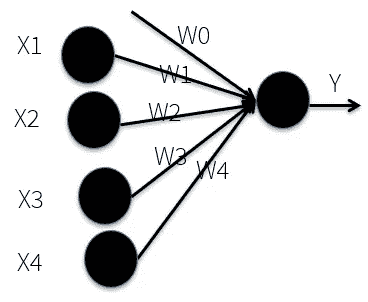
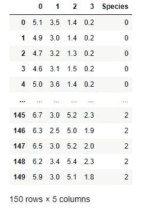
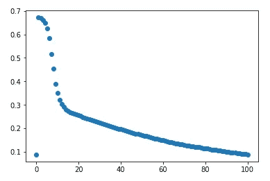
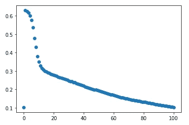

# 随机梯度下降:从头开始的解释和完整实现

> 原文：<https://towardsdatascience.com/stochastic-gradient-descent-explanation-and-complete-implementation-from-scratch-a2c6a02f28bd?source=collection_archive---------16----------------------->


照片由 [Unsplash](https://unsplash.com?utm_source=medium&utm_medium=referral) 上的 [Allef Vinicius](https://unsplash.com/@seteph?utm_source=medium&utm_medium=referral) 拍摄

## 使用单个感知器

随机梯度下降是机器学习和深度学习中广泛使用的方法。这篇文章解释了随机梯度下降使用一个单一的感知器，使用著名的虹膜数据集。我假设你已经知道梯度下降的基本知识。如果你需要复习，请查看这个线性回归教程，它用一个简单的机器学习问题解释了梯度下降。

</basic-linear-regression-algorithm-in-python-for-beginners-c519a808b5f8>  

## 什么是随机梯度下降？

在深入研究随机梯度下降之前，让我们先了解一下规则梯度下降。梯度下降是一种迭代算法。我们来举个简单的例子。正如我提到的，我将使用一个单一的感知器:



下面是简单的线性公式:

Y = WX+ W0

这里 W0 是偏置项。如果有多个特征:

Y = W1X1 + W2X2 + … WnXn + W0

使用此公式，让我们一步一步地检查如何执行梯度下降算法:

1.首先，随机初始化 Ws。

2.使用这个随机 Ws 计算预测输出 Y_hat。

3.取 Y 和 Y_hat 的均方根误差。

4.使用以下公式计算更新后的 Ws:W = W—步长*均方根的导数，其中需要选择步长。

5.不断重复步骤 2 到 4，直到收敛。

在这个过程中，我们在每次迭代中使用整个数据集。如果你只有一百个数据点，那就可以了。但是，如果你有 10，000 或 100，000 个数据点，你必须运行 200 次迭代来收敛，计算变得缓慢和昂贵。为了解决这个问题，可以为每次迭代选择一个随机数据点，而不是使用所有 100，000 个数据。计算将变得非常快速和简单。**这叫做随机梯度下降。**

> 除了选择一个数据点，我们还可以选择一个小批量的数据点，如 10/15 或 20 个数据点。我稍后将展示的例子将在每次迭代中使用 12 个数据点。

## 数据准备

首先从 sklearn 库中加载 iris 数据集:

```
from sklearn.datasets import load_iris
iris = load_iris()
```

这个虹膜数据集是字典格式的。特征在键“数据”中，目标在键“目标”中。这是所有的钥匙:

```
list(iris.keys())
```

输出:

```
['data',
 'target',
 'frame',
 'target_names',
 'DESCR',
 'feature_names',
 'filename']
```

我们需要前两个键:数据和目标。我喜欢使用数据框架。因此，我将把数据转换成数据帧:

```
import pandas as pd
ir = pd.DataFrame(iris['data'])
ir['Species'] = pd.DataFrame(iris['target'])
ir
```

输出:



在物种栏里，只有数字。但是这些数字代表了鸢尾花的种类。iris 数据集中的 Target_names 键显示了它们。

```
ir['Species'] = ir['Species'].replace({0: "setosa", 1: "versicolor", 2: 'virginica'})
```

我只是把物种栏里的数字换成了真正的物种名称。有三种不同的物种。

我的目标是演示随机梯度下降。所以，我想做一个简单的二元分类。因此，我将“setosa”作为阳性类，其余的物种作为阴性类。这意味着。这个分类器会告诉我们一朵花是不是“setosa”。这里，我们需要将“setosa”更改为 1，将其余的物种更改为 0。

```
**for** i **in** range(len(ir['Species'])):
    **if** ir['Species'][i] == 'setosa':
        ir['Species'][i] = 1
    **else**:
        ir['Species'][i] = 0
ir['Species']
```

输出:

```
0      1
1      1
2      1
3      1
4      1
      ..
145    0
146    0
147    0
148    0
149    0
Name: Species, Length: 150, dtype: object
```

数据集准备好了！现在好戏开始了。

## 使用随机梯度下降方法开发分类器

首先，我们将使用 sklearn 库中的 train_test_split 函数将数据集分离为训练集和测试集。在此之前，需要将特征和目标分开。

```
from sklearn.model_selection import train_test_splitir_features = ir.drop(columns = 'Species')
ir_label = ir['Species']x_train, x_test, y_train, y_test = train_test_split(
    ir_features, ir_label, 
    test_size = 0.2,
    random_state = 10
)
```

现在，我们分别设置了培训和测试。正如我之前解释的，我们将为每次迭代随机选择一些数据点。我将组合 x_train 和 y_train，因为我们也需要 y_train 进行训练，

```
x_train['Species'] = y_train
df = x_train
```

下面是为每次迭代从训练集中随机选择 12 个数据点的函数。在原始的 iris 数据集中，有 50 个‘setosa’和 100 个其他物种。这意味着有 50 个正类和 100 个负类数据。样品应该符合那个比例。所以，我们从正类中取 4 个数据，从负类中取 8 个数据。

```
def stratified_spl(df):
    df1 = df[df['Species'] == 1]
    df0 = df[df['Species'] == 0]
    df1_spl = df1.sample(n=4)
    df0_spl = df0.sample(n=8)
    return pd.concat([df1_spl, df0_spl])
```

我将在这里使用 sigmoid 激活函数:

```
def hypothesis(X, w):
    z = np.dot(w, X.T)
    return 1/(1+np.exp(-(z)))
```

下一个函数将为训练目的再次分离 12 个数据的小型训练集的特征和目标。

正如你在上面的线性公式中看到的，我们需要一个偏差 W0。1 的额外特性是作为偏置项添加的。我们将在每次迭代中改进偏置项:

```
def xy(df):
    df_features = df.drop(columns = 'Species')
    df_label = df['Species']
    df_features['00'] = [1]*12
    return df_features, df_label
```

让我们定义误差函数来计算均方误差(MSE)。该函数将首先计算预测目标，然后计算 MSE:

```
def error(X, y, w):
    n = len(X)
    yp = hypothesis(X, w)
    return np.sum((yp-y)**2)/n
```

所有功能都准备好了。现在梯度下降函数。在每次迭代中，

1.  它将使用之前定义的 layered _ spl 函数对 12 个数据点进行采样。
2.  然后将特征和目标分割为 X 和 y。
3.  使用 Ws 和 Xs 计算预测的 y。
4.  使用梯度下降公式更新 Ws。

> 在分类问题中，通常使用对数来正则化误差项。但是我这里用 MSE。因为我猜更多的人熟悉 MSE。这个数据集很容易使用，我们为这个项目设计了 MSE。

请随意尝试用日志记录错误术语。这里有一个例子:

</a-complete-logistic-regression-algorithm-from-scratch-in-python-step-by-step-ce33eae7d703>  

我们将收集每次迭代和 Ws 中的错误。

```
def grad_des(df, w, alpha, epoch):
    j = []
    w1 = []
    w1.append(w)
    for i in range(epoch):
        d = stratified_spl(df)
        X, y = xy(d)
        n= len(X)
        yp = hypothesis(X, w)

        for i in range(4):
            w[i] -= (alpha/n) * np.sum(-2*X[i]*(y-yp))
        w[4] -= (alpha/n) *np.sum(-2*(y-yp))
        w1.append(list(w))
        j.append(error(X, y, w))
    return j, w1
```

分类器完成了！现在，它需要被测试。

## 测试分类器

我会随机初始化 Ws。包括偏差在内共有五个特征。所以，对于每个特征或 X，我需要初始化一个 W，就像你在开始看到的线性公式一样。

```
import numpy as np
w = np.random.rand(5)
w
```

输出:

```
array([0.05837806, 0.91017305, 0.71097702, 0.91990355, 0.71139191])
```

现在，使用梯度下降函数，步长(alpha)为 0.01，迭代 100 次:

```
j, w1 = grad_des(x_train, w, 0.01, 100)
```

对于 100 次迭代，这将为我们提供 100 个 w1。使用这 100 个 w1，我们可以计算 100 个 MSE，以观察每次迭代中 MSE 的变化。我需要一个函数，应该计算每个 w1 的预测 y，然后误差。

```
def err_test(X, y, w):
    er = []
    for i in range(len(w1)):
        er.append(error(X, y, w[i]))
    return er
```

在每次迭代中看到 MSE 图是很好的。

下面是绘图函数:

```
def plot(X, y, w):
    error = err_test(X, y, w)
    return plt.scatter(range(len(error)), error)
```

记得我们在 x_train 中添加了目标。因此，将目标从 x_train 中分离出来，并添加偏差项:

```
X = x_train.drop(columns = 'Species')
X['00'] = [1]*len(X)
```

现在，绘制训练集的 MSE:

```
import matplotlib.pyplot as plt
plot(X, y_train, w1)
```



让我们在测试集中添加一个偏差项。

```
X_t['00'] = [1]*len(x_test)
```

现在，绘制测试数据的 MSE:

```
plot(X_t, y_test, w1)
```



这个数据中发生的一个不寻常的事情是第一个 MSE 太低。那通常不会发生。通常情况下，第一个 MSE 太高，在第一个 MSE 之后，它会逐渐下降，如图所示。我找不到原因。

不看准确性，绩效评估是不完整的。让我们为精确度定义一个函数:

```
def accuracy(X, y, w):
    yp = hypothesis(X, w)
    for i in range(len(yp)):
        if yp[i] >=0.5:
            yp[i] = 1
        else:
            yp[i] = 0
    return sum(yp == y)/len(y)
```

现在，我们想看看精确度如何随着每次迭代而变化:

```
def accuracy_series(X, y, w1):
    acc = []
    for i in range(len(w1)):
        acc.append(accuracy(X, y, w1[i]))  
    return acc
```

使用此函数查看训练集的精确度系列:

```
np.array(accuracy_series(X, y_train, w1))
```

输出:

```
array([0.975, 0.34166667, 0.34166667, 0.34166667, 0.34166667,
       0.34166667, 0.34166667, 0.34166667, 0.33333333, 0.23333333,
       0.34166667, 0.5       , 0.6       , 0.63333333, 0.64166667,
       0.65833333, 0.65833333, 0.65833333, 0.65833333, 0.65833333,
       0.65833333, 0.65833333, 0.65833333, 0.65833333, 0.65833333,
       0.65833333, 0.65833333, 0.65833333, 0.65833333, 0.65833333,
       0.65833333, 0.65833333, 0.65833333, 0.65833333, 0.65833333,
       0.66666667, 0.66666667, 0.66666667, 0.66666667, 0.66666667,
       0.66666667, 0.675     , 0.69166667, 0.69166667, 0.69166667,
       0.69166667, 0.71666667, 0.74166667, 0.75      , 0.76666667,
       0.76666667, 0.78333333, 0.78333333, 0.83333333, 0.83333333,
       0.83333333, 0.83333333, 0.85833333, 0.86666667, 0.83333333,
       0.85      , 0.88333333, 0.88333333, 0.88333333, 0.90833333,
       0.90833333, 0.90833333, 0.91666667, 0.925     , 0.925     ,
       0.925     , 0.925     , 0.925     , 0.94166667, 0.94166667,
       0.94166667, 0.95833333, 0.95833333, 0.96666667, 0.98333333,
       0.98333333, 0.98333333, 0.98333333, 0.98333333, 0.98333333,
       0.98333333, 0.99166667, 0.99166667, 0.99166667, 0.99166667,
       0.99166667, 0.99166667, 0.99166667, 0.99166667, 0.99166667,
       0.99166667, 0.99166667, 0.99166667, 0.99166667, 0.99166667,
       0.99166667])
```

又来了。用第一个 w 获得 99%的准确性是不寻常的，因为第一个 w 是随机启动的 w，这在现实生活的项目中不会发生。

现在，测试集的精度系列:

```
np.array(accuracy_series(X_t, y_test, w1))
```

输出:

```
array([.93333333        , 0.3       , 0.3       , 0.3       , 0.3       ,
       0.3       , 0.3       , 0.3       , 0.3       , 0.16666667,
       0.33333333, 0.53333333, 0.6       , 0.63333333, 0.63333333,
       0.7       , 0.7       , 0.7       , 0.7       , 0.7       ,
       0.7       , 0.7       , 0.7       , 0.7       , 0.7       ,
       0.7       , 0.7       , 0.7       , 0.7       , 0.7       ,
       0.7       , 0.7       , 0.7       , 0.7       , 0.7       ,
       0.7       , 0.7       , 0.7       , 0.7       , 0.7       ,
       0.7       , 0.7       , 0.7       , 0.7       , 0.7       ,
       0.7       , 0.73333333, 0.73333333, 0.73333333, 0.83333333,
       0.83333333, 0.83333333, 0.83333333, 0.83333333, 0.86666667,
       0.86666667, 0.86666667, 0.86666667, 0.86666667, 0.86666667,
       0.86666667, 0.86666667, 0.86666667, 0.86666667, 0.9       ,
       0.9       , 0.9       , 0.9       , 0.93333333, 0.93333333,
       0.93333333, 0.96666667, 0.96666667, 0.96666667, 0.96666667,
       0.96666667, 0.96666667, 0.96666667, 0.96666667, 0.96666667,
       0.96666667, 0.96666667, 0.96666667, 0.96666667, 0.96666667,
       0.96666667, 0.96666667, 0.96666667, 0.96666667, 0.96666667,
       0.96666667, 1\.        , 1\.        , 1\.        , 1\.        ,
       1\.        , 1\.        , 1\.        , 1\.        , 1\.        ,
       1\.        ])
```

你可以看到最后准确率变成了 100%。

## 结论

我的目标是演示随机梯度下降的实现。我希望那是成功的。如果你很难理解，我的建议是自己运行代码。会更清晰。你可以看到，为什么随机梯度下降如此受欢迎。因为我在每次迭代中使用了 12 个数据，而不是使用数据集的所有 150 个数据。当数据集中有 100，000 个数据点时，可以使用相同的技术。这将节省大量的时间和计算成本。

欢迎在推特上关注我，喜欢我的 T2 脸书页面。

## 更多阅读

</a-complete-anomaly-detection-algorithm-from-scratch-in-python-step-by-step-guide-e1daf870336e>  </a-complete-k-mean-clustering-algorithm-from-scratch-in-python-step-by-step-guide-1eb05cdcd461>  </a-complete-recommender-system-from-scratch-in-python-step-by-step-6fc17a4da054>  </univariate-and-multivariate-gaussian-distribution-clear-understanding-with-visuals-5b85e53ea76>  </exploratory-data-analysis-of-text-data-including-visualization-and-sentiment-analysis-e46dda3dd260> 