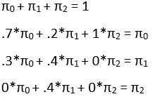

# 用随机过程看未来

> 原文：<https://towardsdatascience.com/stochastic-processes-a-beginners-guide-3f42fa9941b5?source=collection_archive---------23----------------------->

## 包含 R 代码的入门指南


图片来自[皮克斯巴伊](https://pixabay.com/?utm_source=link-attribution&utm_medium=referral&utm_campaign=image&utm_content=380037)的[约坎特](https://pixabay.com/users/joakant-313743/?utm_source=link-attribution&utm_medium=referral&utm_campaign=image&utm_content=380037)

你们中的许多人可能以前没有听说过随机过程，想知道它们与你们有什么关系。首先，统计学家可能会发现随机过程是建模概率事件的好方法。此外，那些对强化学习感兴趣的人可能会发现，这些信息巩固了他们对马尔可夫链等强化学习概念的理解。最后，本文简短易懂，所以如果你对随机过程本身感兴趣，那么这是一个很好的介绍。

以下教程的读者应该知道矩阵运算，如乘法，以及线性代数的基本知识。为了简洁起见，许多线性代数概念在本教程中没有解释。本文为感兴趣的人提供了 R 代码，但是没有必要在阅读本文时遵循这些代码。

## 基础和定义

你们中的许多人可能会有的第一个问题是随机过程的确切性质。“随机”一词的字面意思是“随机的”，尽管随机过程不一定是随机的:事实上，它们可以是完全确定的。简单地说，随机过程是可以用一族随机变量建模的任何数学过程。抛硬币是一个很好的例子，因为它很简单。我们从硬币平视开始，然后恰好翻转一次。硬币正面着地的概率是 0.5，反面着地的概率是 0.5。如果硬币正面朝上，世界的“状态”不变，而如果硬币正面朝下，世界的“状态”就变了。这可以用下面的矩阵来建模:


简单的转移矩阵。

或者，更直观的方法:


同一个矩阵，这次是一个有向图。

行代表状态，转换到其他状态的概率在列中。如果你处于状态 0(正面)并掷硬币，你最终处于状态反面(状态 1)的机会可以在上面矩阵的(0，1)项中看到(. 5)。

再举一个例子，假设您在一个库中有两台打印机。当两台打印机都工作时，每天有 30%的几率其中一台坏掉，而两台都坏掉的几率为 0%。如果一台打印机坏了，那么有 20%的几率会有修理工在那天来修理，有 40%的几率第二台打印机会坏。当两个都坏了的时候，有百分之百的可能会有修理工来修理两台打印机。代表该流程的矩阵如下所示:


转换矩阵。请注意，索引从 0 开始。

请注意，因为(0，1) = .3 和(0，2) = 0，所以(0，0) = .7。每一行的总和必须为 1，因为它们是由离散的概率分布填充的。这同样适用于 entry (1，1)。注意，最后一行确定性地从状态 2 变为状态 0。为了确保您理解，请回答以下问题:

1.(0，1)处的条目代表什么？

2.如果修理工用 P = .7 修好了两台打印机，但有时当两台打印机都用 P = .1 坏了时，他只有时间去修一台打印机，那么新矩阵会是什么样子？

## 马尔可夫性质

现在我们已经看到了两个简单的例子，让我们来谈谈许多随机过程的标志性性质:马尔可夫性质。当知道过程的当前状态就像知道整个历史一样好时，一个系统或变量被称为马尔可夫的。在前面的例子中，如果我们将随机变量 X 定义为在过程的第 n 步运行的打印机的当前数量(小写 X 表示某一步的实际值)，那么知道 X 就足以给出 Xn+1 的分布。简单来说:


从数学上讲，这个等式说明 Xn+1 只取决于 Xn 的值。

直觉上，知道两台打印机都在工作，就足以知道所有未来状态的概率。在前一个状态或前一个状态中有多少台打印机坏了并不重要。抛硬币是另一个例子:抛硬币正面朝上的几率与之前任何一次抛硬币的结果完全无关。马尔可夫过程被称为“无记忆的”,因为它们状态的历史是不相关的。只有当前状态才重要(虽然，不一定。在掷硬币的例子中，你甚至不需要知道当前的状态是 P(正面)= .5，P(反面)= .5。在强化学习的例子中，想法是指定一个具有某种概率分布的最优移动，许多棋盘游戏可以被认为是马尔可夫的。国际象棋就是这样一种游戏，因为选择最佳走法不受当前状态之前的准确走法顺序的影响。虽然也有一些例外，比如顺带规则和是否有任何一方失败，但这些都可以编码到当前状态中，这就形成了马尔可夫链。

## 预测未来🔮

现在我们已经讨论了 Markov 属性，让我们回到打印机的例子。请注意，计算 P(Xn = 1 | Xn-1 = 0)(假定链当前处于状态 0，链变为 1 的概率)是很简单的，因为它是矩阵中的(0，1)项。但是如果我们想提前两步计算机会呢？要做到这一点，我们需要对从 0 开始并导致 1 的所有可能的两步跃迁求和:


为什么会这样呢？这个概率是每一个可能导致状态的步骤的概率总和。从状态 n-2 开始，有三种方式前进到 n-1(矩阵的行 0 中的每个值)。在 n-1 的所有可能值中，第 1 行包含导致 1 的转移概率。

您可能已经注意到，这实际上相当于第一行和第二列的点积。事实上正是如此！事实上，如果我们对每个条目都这样做，那么我们可以得到所有 P(i，j)的两步超前概率。

让我们用 R 来求矩阵的平方:

```
matrixpower <- function(mat,k) {
  if (k == 0) return (diag(dim(mat)[1])) 
  if (k == 1) return(mat)
  if (k > 1) return( mat %*% matrixpower(mat, k-1))
} # matrix power function from Introduction to Stochastic Processes with R by Robert Dobrowprinters <- matrix(c(.7, .2, 1, .3, .4, 0, 0, .4, 0), nrow = 3, ncol = 3) # make the matrixprinters [,0] [,1] [,2]
[0,]  0.7  0.3  0.0
[1,]  0.2  0.4  0.4
[2,]  1.0  0.0  0.0matrixpower(printers, 2) [,0] [,1] [,2]
[0,] 0.55 0.33 0.12
[1,] 0.62 0.22 0.16
[2,] 0.70 0.30 0.00# Note that I've manually changed the indexing to start from 0, as that's the typical way of indexing matrices for stochastic processes. R indexing, however, starts from 1\. I did this for the sake of consistency. You only need to keep this in mind should you explore this in you own R Notebook
```

为了得到三步概率，我们再做一次:

```
matrixpower(printers, 3) [,0]  [,1]  [,2]
[0,] 0.571 0.297 0.132
[1,] 0.638 0.274 0.088
[2,] 0.550 0.330 0.120
```

它适用于任何提前 n 步的概率:

```
matrixpower(printers, 6)
         [,0]     [,1]     [,2]
[0,] 0.588127 0.294525 0.117348
[1,] 0.587510 0.293602 0.118888
[2,] 0.590590 0.293370 0.116040
```

因此，假设我们从 0 台损坏的打印机开始，在链中的 6 个步骤之后，我们有 2 台损坏的打印机的概率是 M6(0，2) = .117。

使用这种方法，我们可以计算出一种叫做不变量或平稳分布的东西。不变分布描述了处于任何状态的长期概率，以及处于该状态的时间比例。既然这个概率是‘长期’的，那么起始状态就无关紧要了。因此，长期概率分布的列应该都具有相同的值。用π表示的这种分布的矩阵对于 3×3 矩阵采取以下形式，这可以推广到 n×n:


不变概率分布。

你可以通过将一个转移矩阵提升到一个非常大的幂来很容易地找到这一点。更正式地说:


```
matrixpower(printers, 100)
     [,0]      [,1]      [,2]
[0,] 0.5882353 0.2941176 0.1176471
[1,] 0.5882353 0.2941176 0.1176471
[2,] 0.5882353 0.2941176 0.1176471
```

或者你可以用一个方程组来求解。该系统可以仅使用 2 个事实来构建:首先，行必须加和为 1(这在直觉上必须是真实的，给定π值的实际解释)；其次，πn 必须等于其他长期概率乘以它们的转移概率，从而得出πn。在打印机示例中:



请随意使用计算出的不变分布来验证这些方程是否成立。

## 沟通很重要💬

然而，重要的是要注意，在某些情况下，极限概率分布并不以所描述的形式存在。为了理解这种情况，我们必须定义马尔可夫过程的可约性。可归约性与马尔可夫链的状态连接方式有关-当且仅当 A 可从 B and B 到达且 A 可从 A 到达时，状态 A 和 B 才能通信。通信类由一组相互通信的状态组成(见下图)。


具有两个通信类的马尔可夫链。


我们说，如果马尔可夫链由单个通信类组成，那么它就是不可约的。如果不是这样，那么我们说链是可约的，π不存在上面的形式。然而，仍然有一个有限的分布。

```
reducible <-  matrix(c(0, 0, 0, 0, 0, .4, .9, .7, 0, 0, 0, .1, .3, 0, 0, .6, 0, 0, .5, .5, 0, 0, 0, .5, .5), nrow = 5, ncol = 5)reducible [,0] [,1] [,2] [,3] [,4]
[0,]    0  0.4  0.0  0.6  0.0
[1,]    0  0.9  0.1  0.0  0.0
[2,]    0  0.7  0.3  0.0  0.0
[3,]    0  0.0  0.0  0.5  0.5
[4,]    0  0.0  0.0  0.5  0.5
```

在上面的场景中，状态 0 转到不与其他类通信的 2 个循环中的 1 个。因此，假设我们从 start 0 开始，我们将导航到状态 1 或 3，然后在这两个状态之间永久转换。在这种情况下，极限分布是什么样的？

```
matrixpower(reducible, 100)
      [,0]  [,1]  [,2] [,3] [,4]
[0,]    0 0.350 0.050  0.3  0.3
[1,]    0 0.875 0.125  0.0  0.0
[2,]    0 0.875 0.125  0.0  0.0
[3,]    0 0.000 0.000  0.5  0.5
[4,]    0 0.000 0.000  0.5  0.5
```

我们看到矩阵中的两个方块看起来像极限概率分布。事实上，他们是。尝试验证这些单独的分布是否正确。状态 0 很有趣，因为它将被恰好访问一次，然后就没有返回的路了。有人可能会认为这意味着π0 = 0，这正是我们所看到的。这表明处于状态 0 的长期概率为 0，也就是说状态是**瞬态**。瞬态也可以被定义为具有有限数量的预期访问的状态，而**循环**状态则相反，具有无限数量的预期访问。

还要注意，第 0 行中的概率与单个循环中的长期分布不匹配。在前面的例子中，各个列中的所有概率都是相同的，因为开始状态与长期行为无关(因为任何状态最终都可以从任何其他状态到达)。然而，现在开始状态是相关的，因为链现在有 3 个通信类。如果我们从状态 2 开始，那么就不可能到达状态 4。然而，如果我们从状态 0 开始，那么任何状态都可以达到，但是状态 3 和 4 总体上更有可能，因为有 0.6 的一次性机会永远进入该链，而从状态 1 达到状态 1 和 2 的机会只有 0.4。(当从状态 0 开始时，对所有其他状态的预期访问次数仍然是无穷大，因为任何分数乘以无穷大仍然是无穷大)。

## 随机漫步


图片来自 [Pixabay](https://pixabay.com/?utm_source=link-attribution&utm_medium=referral&utm_campaign=image&utm_content=279013) 的[贝拉巴拉](https://pixabay.com/users/babelphotography-155772/?utm_source=link-attribution&utm_medium=referral&utm_campaign=image&utm_content=279013)。

了解了瞬态在长期未来的表现后，我们可以参观一个经典的随机过程:随机漫步。

在这个例子中，一个喝醉的人正试图回家。4 号州是他家。如果他回到家，他就睡觉，不离开。状态 0 是海洋。如果他碰巧在海洋中跌倒，他也不会离开(可怜的家伙)。因为他有点不在状态，当他处于两个状态之间时，他以 0.5 的概率向两个方向移动。下面是显示他运动的矩阵:

```
random_walk <- matrix(c(1, .5, 0, 0, 0, 0, 0, .5, 0, 0, 0, .5, 0, .5, 0, 0, 0, .5, 0, 0, 0, 0, 0, .5, 1), nrow = 5, ncol = 5)random_walk [,0] [,1] [,2] [,3] [,4]
[0,]  1.0  0.0  0.0  0.0  0.0
[1,]  0.5  0.0  0.5  0.0  0.0
[2,]  0.0  0.5  0.0  0.5  0.0
[3,]  0.0  0.0  0.5  0.0  0.5
[4,]  0.0  0.0  0.0  0.0  1.0
```

上面的矩阵是具有吸收边界的随机游走。状态 1 和状态 4 被认为是吸引人的，因为它们只与自己交流，因此一旦到达它们，你就永远不会离开。应该清楚的是，边界是循环的，而中间状态是短暂的。

如果我们将矩阵提升到 100 次方，我们会得到以下结果:

```
matrixpower(random_walk, 100)
     [,0]         [,1]         [,2]         [,3] [,4]
[0,] 1.00 0.000000e+00 0.000000e+00 0.000000e+00 0.00
[1,] 0.75 4.440892e-16 0.000000e+00 4.440892e-16 0.25
[2,] 0.50 0.000000e+00 8.881784e-16 0.000000e+00 0.50
[3,] 0.25 4.440892e-16 0.000000e+00 4.440892e-16 0.75
[4,] 0.00 0.000000e+00 0.000000e+00 0.000000e+00 1.00
```

注意中间的所有状态都有 P ~ 0(短暂的标志)。我们还看到长期概率根据矩阵的行而变化。同样，这是因为起始状态很重要，只是现在有多个起始状态。我们看到，从状态 1 或状态 4 开始，只会分别导致状态 1 和状态 4。从状态 1 开始，有 75%的机会掉进海里，有 25%的机会回家。正如我们可能预期的，中间状态，状态 2，以相等的概率导致任一吸收状态。

如果醉汉稍微清醒了一点，现在有 0.75 的机会走向他的家，有 0.25 的机会走向大海，会怎么样？

```
random_walk_2 <- matrix(c(1, .25, 0, 0, 0, 0, 0, .25, 0, 0, 0, .75, 0, .25, 0, 0, 0, .75, 0, 0, 0, 0, 0, .75, 1), nrow = 5, ncol = 5)random_walk_2 [,0] [,1] [,2] [,3] [,4]
[0,] 1.00 0.00 0.00 0.00 0.00
[1,] 0.25 0.00 0.75 0.00 0.00
[2,] 0.00 0.25 0.00 0.75 0.00
[3,] 0.00 0.00 0.25 0.00 0.75
[4,] 0.00 0.00 0.00 0.00 1.00matrixpower(random_walk_2, 100) [,1]         [,2]         [,3]         [,4]  [,5]
[1,] 1.000 0.000000e+00 0.000000e+00 0.000000e+00 0.000
[2,] 0.325 2.514973e-22 0.000000e+00 7.544920e-22 0.675
[3,] 0.100 0.000000e+00 5.029947e-22 0.000000e+00 0.900
[4,] 0.025 8.383245e-23 0.000000e+00 2.514973e-22 0.975
[5,] 0.000 0.000000e+00 0.000000e+00 0.000000e+00 1.000
```

正如我们所料，成功回家的几率大大增加。

感谢您阅读这篇文章。有任何问题请联系我。当然，还有更多的内容需要介绍，但是对于任何想要快速了解概念并通过一些简单的例子来巩固知识的人来说，这是一个良好的开端。如果你喜欢读这篇文章，那么我鼓励你看看我关于这个主题的第二篇文章:[马尔可夫链的魔术](https://medium.com/cantors-paradise/magic-tricks-with-markov-chains-96a4465c20a)。

延伸阅读:

随机过程导论。一

带 R 的随机过程导论。2 和 3

萨顿和巴尔托的《强化学习导论》。2 和 3