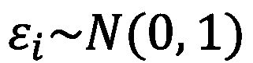
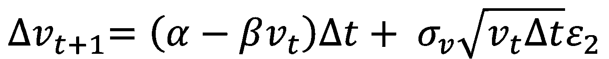
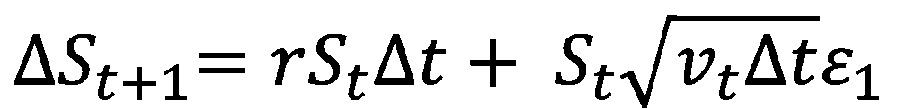

# Python 中的随机波动率定价

> 原文：<https://towardsdatascience.com/stochastic-volatility-pricing-in-python-931f4b03d793?source=collection_archive---------13----------------------->

## 蒙特卡罗模拟高级证券定价


瑟奎拉在 [Unsplash](https://unsplash.com/s/photos/space?utm_source=unsplash&utm_medium=referral&utm_content=creditCopyText) 上拍摄的[照片](https://unsplash.com/@shotbycerqueira?utm_source=unsplash&utm_medium=referral&utm_content=creditCopyText)

# 证券定价

证券定价有多种方法。我认为这个话题既是一门科学，也是一门艺术。本文讨论了使用模拟(主要以随机输入的形式)为金融工具定价的优势。如果你对证券定价不熟悉，我建议你阅读以下文章……

[鞅和马尔可夫过程](https://medium.com/swlh/martingales-and-markov-processes-724de97dab1c)

*   随机过程的简明介绍

[几何布朗运动](/geometric-brownian-motion-559e25382a55)

*   Black-Scholes 模型中使用的主要随机过程

[随机积分](https://medium.com/swlh/stochastic-integrals-fe46b3753871)

*   推导 Black-Scholes 模型的随机积分的计算

[推导布莱克-斯科尔斯模型](https://medium.com/swlh/deriving-the-black-scholes-model-5e518c65d0bc)

*   逐步推导出臭名昭著的欧式期权定价模型

这些文章将为使用封闭式解决方案对特定证券进行定价提供坚实的基础。之后，为了掌握基本的模拟定价，请查看以下文章…

[Python 中的蒙特卡洛定价](/monte-carlo-pricing-in-python-eafc29e3b6c9)

*   模拟资产价格路径为金融工具定价

[为外来物种定价的 Python](https://medium.com/swlh/python-for-pricing-exotics-3a2bfab5ff66)

*   专门针对特殊工具的高级模拟定价

对这些不同定价方法的深刻理解将反映出这门科学的上述*艺术*方面。每种定价方法都是不同的——从最初的假设到得出证券价格的实际方法(数值或分析)。这并不意味着任何特定的方法更正确或不正确；这就是为什么理解每种价格是如何得出的如此重要。了解布莱克-斯科尔斯价格(对数正态分布的股票价格和无交易成本，仅举两个例子)与蒙特卡洛价格(可能包括交易成本)的假设将有助于指导您的定价需求。理论解析解和数值解(往往会收敛到一些理论解)都有美。事实上，我以前的一些研究着眼于修正布莱克-斯科尔斯模型，以更好地反映一般市场条件…

  

我现在假设你有很好的证券定价知识基础。事不宜迟，让我们看看为什么模拟定价通过允许模型输入的变化而如此强大。

# 随机波动过程

经验观察到的股票价格的异方差在几何布朗运动中并不保留，因为波动率保持不变。[赫斯顿(1993)](http://citeseerx.ist.psu.edu/viewdoc/download?doi=10.1.1.139.3204&rep=rep1&type=pdf) 找到了一个类似于 Black-Scholes 坚持随机波动率概念的准封闭解。然而，他的解的推导要比 Black-Scholes 模型的推导复杂得多，超出了本文的范围。然而，他用来推导模型的基本过程可以很容易地应用到定价模拟中，从本质上讲，捕捉到了相同的结果:随机波动性。

**基本上有两个过程:**

**I.** *用于生成新方差值的随机过程*

**二。** *用于生成新股票价格值的随机过程*

首先，让我们先了解一下我们正在使用的参数…

*   **S** —初始股票价格
*   **r** —无风险利率
*   **v_t** —瞬时方差
*   **α，β** —平均回复参数
*   **σ_v** —方差的波动率
*   **ε**—生成错误
*   **ρ** —误差相关性
*   **δt**—随时间变化

现在让我们来看看流程本身…



误差分布



产生方差的随机过程



产生股票价格的随机过程

从根本上说，这些过程没有什么特别令人惊讶的。每个过程本质上都可以分解为第一项中的期望和第二项中对该期望的冲击。

特别敏锐的读者会注意到，通过为波动性创建一个独立的随机过程，我们再次修正了波动性。也就是说，我们修正了方差的波动性。这可能成为一个循环论证。方差的波动性是否应该有一个独立的随机过程，它现在是一个独立的随机过程？这方面有研究，值得注意，但为了这篇文章，我跑题了。

现在让我们看看 Python 如何实现这些过程来给证券定价。

# Python 中的随机方差定价

首先，让我们导入 numpy 并定义随机方差过程的参数，以及一些为标准欧式期权定价的参数…

接下来，我们需要创建负责运行模拟 *n* 次的外部循环…

在此循环中设置了一些参数，这些参数将在下一个循环中变得更加清晰。首先，在系列仿真中的每个新仿真开始时，我们需要重置基本参数: *St* 、 *inst_var_now* 、 *prev_inst_var* 和 *step* 。这些与本文第一部分中定义的输入参数同义。请注意，瞬时方差被分解为两个变量，这是为了让我们在生成新方差的随机过程中，对每一步使用适当的误差。让我们创建一个内循环来遍历一条具有随机方差的股票价格路径…

在这个 while 循环的每一次迭代之后，我们将得到最终的股票价格值。这个最终的股票价格值可以在外循环中再次使用，以根据我们正在定价的证券产生收益。在这个例子中，我正在为一个欧式期权定价，所以根据这些参数，我计算出适当的收益…

请注意，当将*收益*附加到*收益*列表时，收益会按照时间 t 内的无风险利率进行贴现。如果货币的时间价值是一个外来概念，请参见 Python 中的[量化金融](/quantitative-finance-in-python-e8d48e6b9c23)。

为了计算这种欧式期权的模拟价格，我们简单地将附加到*收益列表*中的值进行平均…

```
14.648492872411381
```

我们做到了！我们通过一个随机方差过程得出了模拟价格。

# 结论

本文展示了如何使用随机方差过程来模拟证券的价格。同样，与其他定价方法相比，不要认为这个价格或多或少是正确的。相反，要理解最终价格差异的原因。这个概念可以扩展到影响金融工具的每个参数，使它们都成为随机过程。

**随机方差模拟定价脚本:**